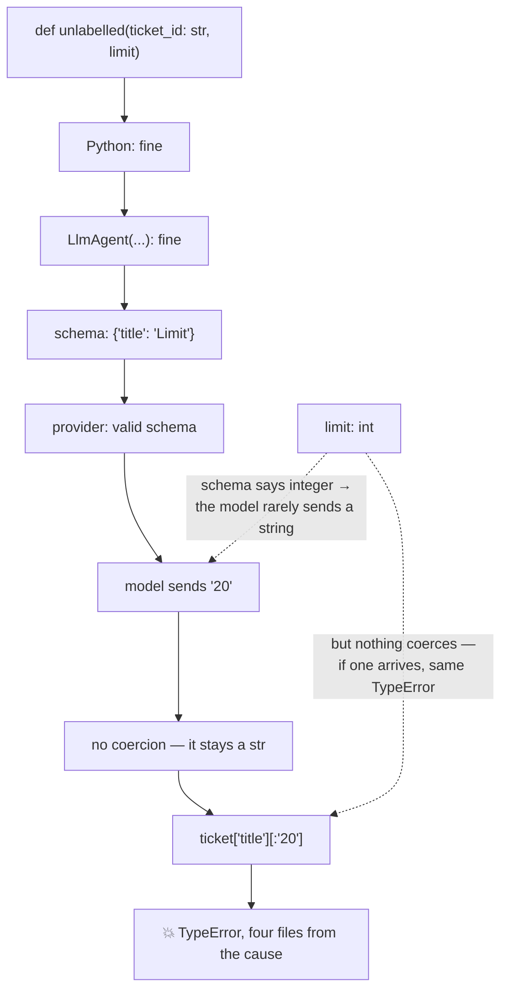

# 6.1 — 💥 The jar with no label

## One-line answer

Today's deliberate failure is one missing type hint: the parameter reaches the model as `{}` — no
type, no constraint — and every layer accepts whatever comes back, so the failure surfaces inside
your function as a `TypeError` with nothing pointing at the cause.

---

## The story

🎬 **The scene.** A kitchen shelf of identical jars. Most have a strip of masking tape with something
written on it. One does not.

Somebody making tea reaches for the unlabelled one, because it is in roughly the right place and the
contents are roughly the right colour.

😬 **The naive fix.** Taste it. And they do, and it is sugar, and everything is fine, and the jar
stays unlabelled for another year because the system worked.

💥 **Why it fails.** It works until the day somebody refills the jars and puts salt in that one — or
until a guest, who does not know the shelf, uses it. The jar was never wrong. It was **unspecified**,
and unspecified survives indefinitely on a shelf where everybody already knows.

The failure, when it comes, does not happen at the jar. It happens at the cup, several minutes later,
in front of somebody who was not there when the jar was filled. **The place the mistake is discovered
is nowhere near the place it was made.**

💡 **The insight.** The label costs nothing and is not for you. It is for the person who does not
know, and — since you will one day be that person — it is for you too, later.

A parameter with no type hint is that jar.

---

## The idea in plain language

The plan's §17.7 asks every day to carry a part whose subject is a deliberate failure. Today's is
[1.3](../01-the-form-fills-itself/1.3-type-hints-are-the-schema.md)'s last row:

```text
--- unannotated
    ticket_id : {}
```

An empty object. Required, named, and with **no type at all**.

What makes it a failure lab rather than a warning is how many layers accept it, and how far the
consequence travels from the cause:

| Layer | What it does with an untyped parameter |
| --- | --- |
| Python | nothing — annotations are optional |
| `LlmAgent(...)` | builds; nothing is inspected ([1.4](../01-the-form-fills-itself/1.4-the-wrapper-that-arrives-late.md)) |
| `canonical_tools()` | generates a schema with `{}` for that property |
| the provider | accepts the schema; it is valid JSON Schema |
| the model | supplies **something** — usually a string |
| the runtime | passes it to your function |
| **your function** | receives a `str` where you expected an `int` |

Six layers, none of which is wrong, and the seventh is where it breaks — with a traceback pointing at
a line inside your tool rather than at the missing annotation four files away.

**And most of the time it works.** That is the jar. Annotate `ticket_id` as nothing, and the model
sends `"4521"`, and `TICKETS.get("4521")` works perfectly, because the model guessed the type from
the parameter's *name* and from your docstring. It will keep working until a parameter's name is less
suggestive, or the docstring changes, or the model changes — Day 9 established that changing the model
is a behaviour change — and then it will not.

**The class of bug is worth naming**, because you will meet it again: **the constraint that was
carried by convention rather than by declaration.** It works while everybody knows. It fails when the
knowing runs out, which is exactly when nobody is looking.

---

## Why Sutra needs it

**Today**, immediately: `sutra/desk/tools.py` from
[5.1](../05-wiring-sutra/5.1-two-tools-ported.md) has two functions and three parameters, and one
missing annotation would be invisible in review.

**Day 12** is structured output, where the same generator runs on the way *out*. An untyped field in
an output schema is the same jar facing the other direction.

**Day 21** is trap #4, and this is where a `TypeError` inside a tool becomes an argument about whether
to catch it — which [2.3](../02-what-a-tool-returns/2.3-a-failed-tool-is-still-a-result.md) has
already answered.

**Day 31** is the quality gate. The check from
[1.4](../01-the-form-fills-itself/1.4-the-wrapper-that-arrives-late.md) is exactly the kind of thing
that belongs in `./m check`, alongside Day 9's `:free` lint — free, fast, and catching a class of bug
rather than an instance.

And this is the part of today that **can go RED** (Principle 11) at zero cost, because the whole
failure happens before any model call.

---

## The mechanism

Break it on purpose, watch every layer accept it, and see where it finally lands. **No model call, no
cost:**

```python
# lab/no_label.py - one missing annotation, six layers, one late TypeError.
import asyncio
import json

from google.adk.agents import LlmAgent
from google.adk.tools import FunctionTool

TICKETS = {"4521": {"title": "Keeps getting logged out"}}


def labelled(ticket_id: str, limit: int) -> dict:
    """Fetch a ticket and cap the body length.

    Args:
        ticket_id: The ticket's id, e.g. '4521'.
        limit: How many characters of the body to return.
    """
    ticket = TICKETS.get(ticket_id)
    return {"status": "ok", "title": ticket["title"][:limit]} if ticket else {"status": "not_found"}


def unlabelled(ticket_id: str, limit) -> dict:
    """Fetch a ticket and cap the body length.

    Args:
        ticket_id: The ticket's id, e.g. '4521'.
        limit: How many characters of the body to return.
    """
    ticket = TICKETS.get(ticket_id)
    return {"status": "ok", "title": ticket["title"][:limit]} if ticket else {"status": "not_found"}


async def main() -> None:
    for function in (labelled, unlabelled):
        agent = LlmAgent(name="a", model="gemini-3.7-flash", instruction="x", tools=[function])
        schema = (await agent.canonical_tools())[0]._get_declaration().parameters_json_schema
        print(f"--- {function.__name__}")
        print("    schema for 'limit':", json.dumps(schema["properties"]["limit"]))

        # What the model sends when the schema says nothing: a string.
        tool = FunctionTool(function)
        try:
            result = await tool.run_async(
                args={"ticket_id": "4521", "limit": "20"}, tool_context=None
            )
            print("    called with '20' :", result)
        except Exception as exc:
            print(f"    called with '20' : {type(exc).__name__}: {exc}")


asyncio.run(main())
```

**Line by line:**

- **Two functions with identical bodies** and identical docstrings, differing in one annotation —
  `limit: int` against `limit`. Every difference in the output is that one word.
- `limit` chosen rather than `ticket_id` as the unannotated one, deliberately: a parameter called
  `ticket_id` will get a string from the model and a string is what the function wants, so the bug
  would hide. `limit` **wants an integer**, and that is where an unspecified type has somewhere to go
  wrong.
- The docstring's `Args:` line describing `limit` **fully** — *"How many characters of the body to
  return"* — because the point is that a good description does **not** substitute for a type. The
  model is told what the parameter means and not what shape it is.
- `args={"ticket_id": "4521", "limit": "20"}` — `"20"` as a **string**, standing in for what a model
  sends when the schema does not say. Not an unreasonable value: it is the right number in the wrong
  type, which is precisely the realistic case.
- `tool_context=None` — legal, because neither function asks for one.
- `try` around `run_async` — because one of these two raises and the other does not, and the script
  has to survive printing both.
- `ticket["title"][:limit]` — slicing by a variable, the ordinary Python that breaks. Chosen because
  it is the shape of real tool code rather than a contrived `int(limit)`.

The output:

```text
--- labelled
    schema for 'limit': {"title": "Limit", "type": "integer"}
    called with '20' : TypeError: slice indices must be integers or None or have an __index__ method
--- unlabelled
    schema for 'limit': {"title": "Limit"}
    called with '20' : TypeError: slice indices must be integers or None or have an __index__ method
```

**Both raised.** That is the finding, and it is not the one you would have guessed.

The schemas differ — one says `"type": "integer"` and one says nothing — and the *runtime behaviour is
identical*, because **ADK does not coerce scalar arguments.** Reading `function_tool.py` shows what it
does convert: values destined for Pydantic model parameters, and unions of those. An `int` parameter
handed a string is passed straight through to your function.

So the annotation buys exactly one thing, and it is worth being precise about which:

- **It constrains the model.** `"type": "integer"` is in the declaration, the provider enforces the
  schema when generating arguments, and a model that is told a parameter is an integer overwhelmingly
  sends one. The annotated version is far less likely to be called with `"20"` in the first place.
- **It does not protect you.** Nothing between the model and your function checks the type. If a
  string arrives anyway — a provider that enforces schemas loosely, a hand-written test, Day 11's
  context, a retry after a malformed call — your function receives it.

That is [Day 4, part 4.1](../../../day-04-tools-by-hand/parts/04-the-limits/4.1-validated-is-not-correct.md)'s
rule, sharpened: **a schema is a request the model was asked to honour, not a guarantee the runtime
enforces.** The annotation dramatically improves the odds and changes nothing about the guard inside
your function.

And read where the traceback points, in both cases: at `ticket["title"][:limit]` — a line that is
completely correct — rather than at the signature four lines above the docstring.



---

## When it breaks

This part is the break, so here are the two things that are **not** the fix.

**💥 Not a better docstring.** The `Args:` line already says *"How many characters of the body to
return"*, in both versions. It is a good description and it does not put a type in the schema —
[1.2](../01-the-form-fills-itself/1.2-the-docstring-is-the-description.md) showed that parameter
descriptions do not become schema fields at all on this version. **Prose does not constrain.**

**💥 Not a defensive cast *instead of* the annotation.**

```python
limit = int(limit)
```

On its own this makes the symptom go away and leaves the schema empty, so the model is still guessing
and you have moved the failure from a `TypeError` to whatever `int("about twenty")` does.

But note what the output above forces you to admit: since **nothing coerces**, a guard is not
redundant either. The honest position is *both* — annotate so the model sends the right thing, and
validate at the top of any tool where a wrong type would be worse than an error. What is wrong is
using the cast **as a substitute** for the declaration.

The actual fix is one word, and the actual **defence** is the check from
[1.4](../01-the-form-fills-itself/1.4-the-wrapper-that-arrives-late.md), which belongs in the test
suite:

```python
# tests/test_tools.py - every tool parameter must reach the model with a type (Day 10, 6.1).
import asyncio

from sutra.desk.agent import root_agent


def test_every_tool_parameter_has_a_type() -> None:
    """6.1: an untyped parameter reaches the model as {} and fails inside the tool."""

    async def check() -> list[str]:
        problems = []
        for tool in await root_agent.canonical_tools():
            schema = tool._get_declaration().parameters_json_schema or {}
            for name, spec in schema.get("properties", {}).items():
                if "type" not in spec:
                    problems.append(f"{tool.name}({name})")
        return problems

    assert asyncio.run(check()) == []
```

**Line by line:**

- Pointed at `root_agent` rather than at a list of functions — so it covers whatever is registered,
  including tools added later by somebody who never read this part. **A check that only covers what it
  was written for is a check that decays.**
- `asyncio.run(check())` inside a synchronous test — the wrapper pattern from
  [Day 8's §5](../../../day-08-sessions-and-services/LESSON.md), avoiding a dependency for one line.
- `parameters_json_schema or {}` — the guard from
  [1.4](../01-the-form-fills-itself/1.4-the-wrapper-that-arrives-late.md); a tool with no parameters
  has `None` there.
- `assert asyncio.run(check()) == []` rather than `assert not problems` — because a failing assertion
  then **prints the offending tool and parameter** instead of `assert [] == True`.
- `_get_declaration()` is private, and this is a test. The rule from
  [Day 6, part 3.1](../../../day-06-instructions-and-personas/parts/03-the-instruction-fields/3.1-where-your-instruction-lands.md)
  holds: lab and tests may reach for a private name, `sutra/` may not — and if a patch release renames
  it, a failing test is the right way to find out.

**Watch it go RED**, which is Principle 11 and costs nothing:

```bash
# 1 - green
uv run python -m pytest tests/test_tools.py -q -m "not live"

# 2 - break it: remove one annotation in sutra/desk/tools.py
#     (change `ticket_id: str` to `ticket_id`)
uv run python -m pytest tests/test_tools.py -q -m "not live"

# 3 - put it back
git checkout sutra/desk/tools.py
uv run python -m pytest tests/test_tools.py -q -m "not live"
```

**Line by line:**

- Step 1 first, so step 2 is a change rather than a discovery.
- The break is made in **`sutra/desk/tools.py`**, the real file, not in the lab — because the test
  reads `root_agent`, and breaking it anywhere else would not be caught, which is itself worth
  observing.
- `git checkout` to revert, which works because the file is committed. Check `git diff` afterwards if
  it is not.

---

## In production

**What a professional writes instead of the teaching version** is that test, plus a type checker.
`mypy` or `pyright` would flag an unannotated parameter in a module that is otherwise annotated, which
catches it before the test does. This project has not adopted one — `CLAUDE.md` carries a `TODO`
saying the decision belongs to Day 31's quality gate — and this part is a concrete argument for the
"yes" side of that decision.

**What degrades at scale** is the reliance on parameter names. `ticket_id` gets a string because the
name says so; `limit` gets whatever the model felt like. As tools multiply, so does the proportion of
parameters whose names are not self-describing — `scope`, `mode`, `target`, `value` — and every one of
those is a jar. The failure rate rises without anything changing.

**The failure that only shows with real traffic** is the model that used to guess right. An untyped
parameter works because the model infers a type from the name and the description, and Day 9
established that a prompt is qualified against a model rather than in the abstract — so **changing
provider can change what an untyped parameter receives.** The tool worked for six months, the routing
sent one request to a fallback lane, and a `TypeError` appeared in a tool nobody had touched.

**The review comment a senior engineer leaves:** *"`limit` has no annotation, so the model gets a
parameter with no type and we're relying on it guessing an integer. It'll guess right most of the
time and the failure lands as a `TypeError` inside the tool, four files from the cause. Annotate it,
and let's put the schema check in `./m check` — it's free."*

**The interview question:** *"what's the smallest change that has caused you a disproportionate
amount of debugging?"* This is a good honest answer with a mechanism: "A missing type annotation on a
tool parameter. The framework generates the JSON schema from the signature, so an unannotated
parameter reaches the model as an empty object — no type, no constraint — and every layer accepts it
because it's valid. The model then guesses, usually correctly, from the parameter name, so it works.
When it doesn't, the failure is a `TypeError` inside the tool on a line that's perfectly correct, with
nothing pointing at the annotation four files away. The part that surprised me was checking what the
annotation actually buys: it constrains the model, so the wrong type mostly stops arriving — but the
framework doesn't coerce scalars, so if one does arrive you get the same `TypeError` either way. A
schema is a request the model was asked to honour, not something the runtime enforces. So it's both:
annotate everything, and still guard where a wrong type would be worse than a crash. It's now a test —
every registered tool's parameters must have a type."

---

## Check yourself

```bash
uv run python days/day-10-function-tools/lab/no_label.py
uv run python -m pytest tests/test_tools.py -q -m "not live"
```

Then remove one annotation from `sutra/desk/tools.py`, watch the test go red, and put it back.

**Answer out loud, without scrolling up:**

> Name the six layers that accept an untyped parameter and say where the failure finally appears.
> Then say the one thing an annotation buys you and the one thing it does **not**, and why a good
> docstring substitutes for neither.

---

**Next:** [7.1 — What a schema still cannot say](../07-limits/7.1-what-a-schema-still-cannot-say.md)
