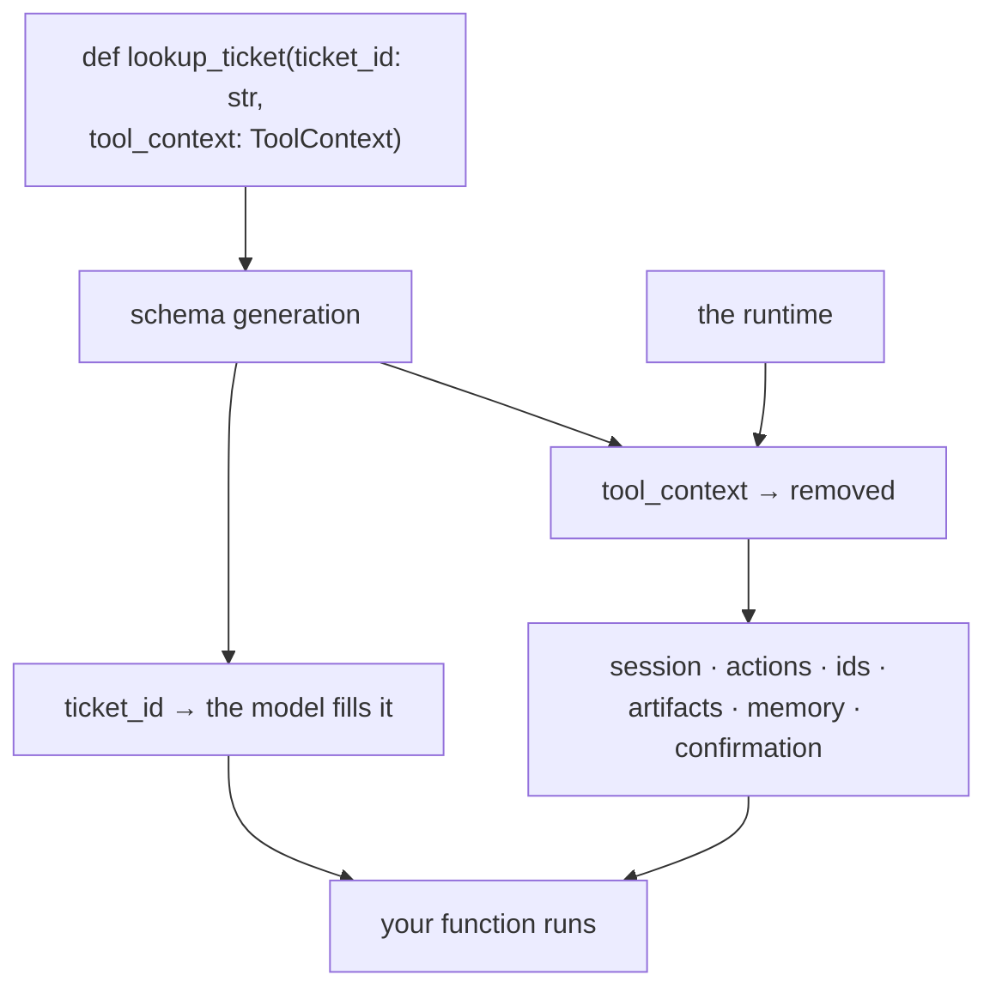

# 1.1 — The parameter the model never sees

## One-line answer

Add a parameter annotated `ToolContext` to a tool and ADK **removes it from the schema** the model
sees while filling it in at call time — so the tool gains access to the session, the run and the
event's actions without the model knowing it exists.

---

## The story

An exam hall. You are handed an answer sheet and there is a box in the top corner marked **Seat No.**

You do not fill it in. The invigilator does, walking down the row with a list, writing the number
that corresponds to where you are sitting.

Think about why it is done that way, because it is not laziness on anybody's part.

**You do not know it.** You know your name and your roll number. The seat number is a fact about the
room, assigned this morning, and there is no way for you to produce it from what you brought.

**And the sheet needs it.** Without it, an answer sheet cannot be matched to a seating chart, which
is how the hall proves who sat where. It is not optional and it is not yours to supply.

So the form has two kinds of box: the ones you fill in because only you know the answer, and the ones
the invigilator fills in because only the hall knows. **And the ones the invigilator fills in are not
printed in the instructions you were given.** Nobody tells a candidate "leave the seat number blank"
— it simply is not part of what a candidate does.

A `ToolContext` parameter is that box.

---

## The idea in plain language

[Day 10](../../../day-10-function-tools/parts/01-the-form-fills-itself/1.3-type-hints-are-the-schema.md)
established that ADK generates a tool's parameter schema from its type hints — every annotated
parameter becomes something the model must supply.

There is one exception, and it is the whole of ADK-12:

```text
def lookup_ticket(ticket_id: str, tool_context: ToolContext) -> dict: ...
```

The generated schema contains **only `ticket_id`.** `tool_context` is removed, and ADK passes it in
itself when the tool runs. adk.dev is explicit that the parameter *"sits alongside regular tool
arguments but remains invisible to the model's function calling mechanism"*.

Which is exactly the exam sheet: the model fills in what only the model knows (which ticket the user
meant), and the runtime fills in what only the runtime knows (which conversation this is).

**What that box contains** is the reason it matters. `ToolContext` is the tool's window onto
everything outside its own arguments:

| Through the context | What it is | Where you met it |
| --- | --- | --- |
| `.state` | the session's state dictionary, writable | [Day 8, 1.3](../../../day-08-sessions-and-services/parts/01-the-session/1.3-the-register-and-the-key-board.md) |
| `.actions` | the `EventActions` for this step | [Day 7, 1.4](../../../day-07-events-and-streaming/parts/01-the-event-object/1.4-the-half-that-is-not-text.md) |
| `.invocation_id`, `.agent_name`, `.user_id` | which run, which agent, whose conversation | [Day 7, 1.5](../../../day-07-events-and-streaming/parts/01-the-event-object/1.5-which-run-which-agent-which-branch.md) |
| `.function_call_id` | which call this is, for linking a later answer to it | [Day 4, 6.1](../../../day-04-tools-by-hand/parts/06-failure-lab/6.1-the-call-id-you-did-not-echo.md) |
| `.save_artifact` / `.load_artifact` | files that outlive a turn | [Day 8, 3.4](../../../day-08-sessions-and-services/parts/03-the-services/3.4-the-cloakroom-and-the-one-you-were-not-given.md) |
| `.search_memory` | across-session recall | [Day 8, 3.3](../../../day-08-sessions-and-services/parts/03-the-services/3.3-ctrl-f-is-not-understanding.md) |
| `.request_confirmation` | pause for a human | [Day 10, 4.2](../../../day-10-function-tools/parts/04-tool-shapes/4.2-are-you-sure.md) |

**Every row is something you have already met and could not reach from inside a tool.** That is the
shape of today: no new subsystems, one new door into the ones you have.

And the door matters most for a question Day 10 left open on purpose.
[Day 10, part 7.1](../../../day-10-function-tools/parts/07-limits/7.1-what-a-schema-still-cannot-say.md)
listed four things a schema cannot say, and the third was *"whether this caller should be allowed"* —
noting that the session knows whose conversation it is and the tool could not see the session.
**`tool_context.user_id` is that gap closing**, and [4.2](../04-blast-radius/4.2-the-identity-a-tool-needs.md)
is where it is used.

One thing worth stating before you reach for it: **taking a context is a decision, not a default.**
A tool that does not need one should not take one — it is harder to test
([6.1](../06-in-production/6.1-a-tool-without-a-model.md)), and a tool that touches the session is a
tool whose behaviour depends on more than its arguments.

---

## Why Sutra needs it

**[2.1](../02-state-from-a-tool/2.1-writing-on-the-carbon-copy.md)** has `lookup_ticket` record which
ticket the conversation is about, so the rest of the turn — and the next turn — does not have to
re-derive it from the transcript.

**Day 13** adds callbacks, which receive a `CallbackContext` — the same object under a different alias
([1.2](1.2-detected-by-type-not-by-name.md) explains why they are the same).

**Day 17** is the state deep dive, and every mechanism it teaches is reached through this parameter.

**Day 46 onwards** is memory, where `search_memory` is how a tool asks *"has anything like this
happened before?"*

**Day 64** is human-in-the-loop approval, built on `request_confirmation`.

---

## The mechanism

The parameter, and its absence from the schema. **No model call, no cost:**

```python
# lab/invisible.py - the parameter ADK fills in and the model never sees.
import asyncio
import json

from google.adk.agents import LlmAgent
from google.adk.tools import ToolContext


def lookup_ticket(ticket_id: str) -> dict:
    """Fetch one ticket by id.

    Args:
        ticket_id: The ticket's id, e.g. '4521'.
    """
    return {"status": "ok"}


def lookup_ticket_with_context(ticket_id: str, tool_context: ToolContext) -> dict:
    """Fetch one ticket by id and remember which one.

    Args:
        ticket_id: The ticket's id, e.g. '4521'.
    """
    tool_context.state["ticket_id"] = ticket_id
    return {"status": "ok"}


async def main() -> None:
    for function in (lookup_ticket, lookup_ticket_with_context):
        agent = LlmAgent(name="a", model="gemini-3.7-flash", instruction="x", tools=[function])
        tool = (await agent.canonical_tools())[0]
        schema = tool._get_declaration().parameters_json_schema
        print(f"--- {function.__name__}")
        print("    python parameters:", list(function.__annotations__)[:-1])
        print("    schema properties:", list(schema["properties"]))
        print("    required         :", schema["required"])
        print("    filled in by ADK :", tool._context_param_name)


asyncio.run(main())
```

**Line by line:**

- Two versions of one function differing in **one parameter** — so any difference in the output is
  that parameter and nothing else.
- `tool_context: ToolContext` as the **last** parameter — a convention rather than a requirement, and
  worth following: a reader scanning a signature should see the model-supplied arguments first.
- The docstring's `Args:` block deliberately **does not mention `tool_context`**. It is not something
  the model supplies, so documenting it to the model would be describing a box the candidate does not
  fill. (And [Day 10, 1.2](../../../day-10-function-tools/parts/01-the-form-fills-itself/1.2-the-docstring-is-the-description.md)
  established that the whole docstring goes to the model, so a line about it would be pure noise in
  the prompt.)
- `function.__annotations__` sliced with `[:-1]` to drop the return annotation — printing Python's
  view of the signature beside ADK's view of the schema is the comparison this script exists for.
- `tool._context_param_name` — a **private** attribute, and this is the lab. It is how ADK records
  which parameter it will fill in, and printing it makes the mechanism visible rather than magical.
  [1.2](1.2-detected-by-type-not-by-name.md) is about how that name is chosen.
- No `tool_context=` anywhere in the call — because there is no call. This script inspects; running
  the tool needs a real context, which is [1.4](1.4-the-folded-paper-under-the-chair.md)'s subject.

The output:

```text
--- lookup_ticket
    python parameters: ['ticket_id']
    schema properties: ['ticket_id']
    required         : ['ticket_id']
    filled in by ADK : tool_context
--- lookup_ticket_with_context
    python parameters: ['ticket_id', 'tool_context']
    schema properties: ['ticket_id']
    required         : ['ticket_id']
    filled in by ADK : tool_context
```

Two Python parameters, one schema property. The model is offered exactly the same tool in both cases,
and one of them can read and write the session.

Note the last line of the **first** block: `filled in by ADK : tool_context` even though that function
has no such parameter. That is ADK's default name, recorded whether or not anything matches it — and
it is the fallback [1.2](1.2-detected-by-type-not-by-name.md) is about.



---

## When it breaks

**💥 The context documented to the model.**

```text
Args:
    ticket_id: The ticket's id.
    tool_context: The ADK tool context.
```

No error. The schema still excludes the parameter — but the whole docstring is the description
([Day 10, 1.2](../../../day-10-function-tools/parts/01-the-form-fills-itself/1.2-the-docstring-is-the-description.md)),
so the model is now told about an argument it cannot supply and will not see. At best it is wasted
tokens on every turn. At worst a model tries to supply it, and you get an argument you did not want.

**💥 The context taken by a tool that does not need it.**

Not an error either, and it is the more common mistake. A tool with a `ToolContext` parameter can no
longer be called in a test with two lines
([6.1](../06-in-production/6.1-a-tool-without-a-model.md)), and its behaviour now depends on session
state that a reader of the function cannot see. **Take a context when you need one thing from it, and
name that thing in a comment.**

**💥 Two context parameters.**

```python
def tool(ticket_id: str, ctx: ToolContext, tool_context: ToolContext) -> dict: ...
```

ADK takes the **first** parameter whose annotation is a context type, so `ctx` is filled and
`tool_context` is left as an ordinary parameter — which means it appears in the schema, and the model
is asked to supply a `ToolContext`. There is no error and the shape of the failure is bizarre.
[1.2](1.2-detected-by-type-not-by-name.md) explains the rule that produces it.

---

## In production

**What a professional writes instead of the teaching version** is a tool module where the tools that
take a context are visibly a minority, and each says in a comment what it needs the context *for* —
`# needs the context: records ticket_id for the rest of the turn`. That single line is what lets a
reviewer decide whether the dependency is earned, and it is what makes the tool's tests legible.

**What degrades at scale** is testability. A tool with no context is a pure function: give it
arguments, assert on the return. A tool with a context needs one constructed, which means either a
real run or a stand-in, and the temptation is to stop testing it. The tools that touch state are
exactly the ones whose behaviour is hardest to reason about, so **the tools most worth testing become
the hardest to test** unless you keep the context dependency thin.

**The failure that only shows with real traffic** is a tool whose behaviour depends on state that is
usually there. It reads `tool_context.state["ticket_id"]`, which the previous tool call set, and it
works — until a user asks something that skips the first tool, and the key is absent. In development
the happy path is the only path you exercise. **A tool that reads state must handle the state not
being there**, and `state.get(key, default)` is the whole fix.

**The review comment a senior engineer leaves:** *"This takes a `ToolContext` and only uses it to read
`user_id` — fine, but say so in a comment, and use `.get()` on that state read below: nothing
guarantees the previous tool ran."*

**The interview question:** *"how does a tool get access to the conversation it is running in?"* The
answer that shows you have written one: "Through an extra parameter the framework fills in — you
annotate it with the context type and the framework strips it out of the JSON schema the model sees,
so the model never knows it exists. That's the whole trick, and it's a good design: the model supplies
what only the model knows, and the runtime supplies what only the runtime knows. What it gives you is
the session state, the event actions, the run and user identifiers, artifacts, memory search and the
confirmation hook. The thing I'd push back on in review is taking one by default — a tool without a
context is a pure function you can test in two lines, and a tool with one has behaviour that depends
on state a reader can't see, so it should be earned rather than habitual."

---

## Check yourself

```bash
uv run python days/day-11-tool-context/lab/invisible.py
```

**Answer out loud, without scrolling up:**

> Say what happens to a `ToolContext` parameter when the schema is generated, and who fills it in.
> Then name three things it gives a tool access to that its arguments cannot, and say why taking one
> should be a decision rather than a habit.

---

**Next:** [1.2 — Detected by type, not by name](1.2-detected-by-type-not-by-name.md)
