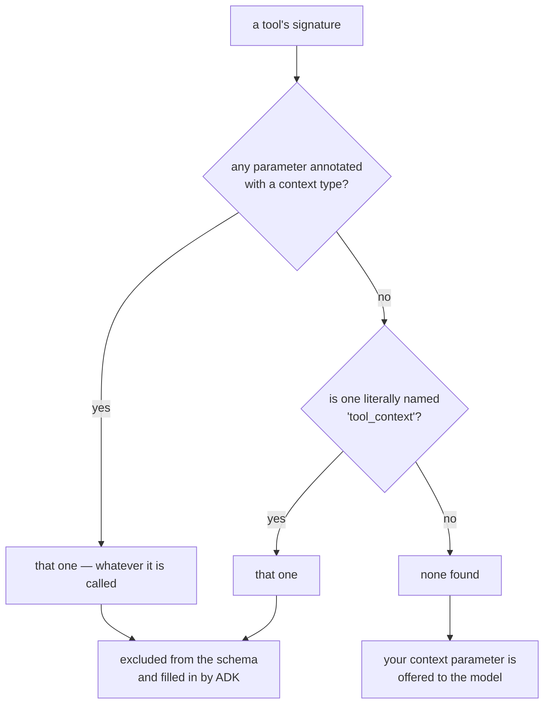

# 1.2 — Detected by type, not by name

## One-line answer

ADK finds the context parameter by looking for the **first parameter annotated with a context type**,
whatever it is called — falling back to the literal name `tool_context` when nothing is annotated —
so a parameter that is neither annotated nor named `tool_context` is silently offered to the model.

---

## The story

Somebody comes to fix the water heater.

You did not ask his name and he did not give one. What you looked at was the shirt with the company's
logo, the ID card clipped to it, and the bag of tools. Those three things told you what he was here
to do, and you let him in.

Now the two versions of this that go wrong, and they are not symmetrical.

**A man arrives with no uniform and says "I'm Rakesh, from the company."** You might let him in
anyway, because you were expecting somebody and the name sounds plausible. It usually works out. It
is a weaker check than the uniform, and everybody knows it.

**A man arrives with no uniform and no explanation, and you assume he is a customer.** You point him
at the queue. He is, in fact, the electrician, and now he is standing in a queue for an hour because
nothing about him said otherwise.

The second failure is the interesting one. Nobody made a mistake. The **absence of a signal** was
read as a different signal, and the person who could have corrected it — him — did not know he was
being misread.

That is what happens to a context parameter with no annotation and a name nobody recognises.

---

## The idea in plain language

[1.1](1.1-the-parameter-the-model-never-sees.md) showed the parameter disappearing from the schema.
This part is about **how ADK decides which parameter that is**, because the rule is not the one most
people assume.

The rule, from ADK's own `find_context_parameter`, whose docstring says it returns *"the name of the
first parameter that is annotated with Context or a type alias of Context (e.g., ToolContext,
CallbackContext)"*:

1. **Look for an annotation.** The first parameter whose type is a context type wins, **whatever it is
   called**.
2. **If none is found, fall back to the literal name `tool_context`.**

So there are three cases, and the third is a trap:

| Signature | What happens |
| --- | --- |
| `ctx: ToolContext` | detected by **type**; excluded from the schema |
| `tool_context` (no annotation) | detected by the **name fallback**; excluded from the schema |
| `ctx` (neither) | **not detected** — appears in the schema as a parameter the model must fill |

### And `ToolContext` is not what you think

Worth knowing, because it explains why the annotation is about a *family* rather than a class:

```text
ToolContext is Context   →   True
```

`ToolContext` is an **alias** for `Context`, not a subclass. So is `CallbackContext`, which Day 13's
callbacks receive. One object, three names, chosen so that a signature reads correctly for its
situation — a tool takes a `ToolContext`, a callback takes a `CallbackContext`, and they are the same
thing.

Two things follow.

**The names are documentation.** Annotating a tool's parameter `CallbackContext` would work perfectly
and would mislead every reader. Use the alias that matches where the function is used.

**Detection is by identity, not by name.** `_is_context_type` compares against the context type, and
the aliases all resolve to it — which is exactly why an *unannotated* `tool_context` needs a separate
name-based fallback to be found at all.

### Which one to write

**Annotate it, and call it `tool_context`.** Both signals, agreeing.

That is not superstition. Relying on the annotation alone works and makes the parameter's role
invisible at a glance in a long signature. Relying on the name alone works and breaks the moment
somebody renames it while tidying up — and the failure is the third row of that table, which produces
no error.

---

## Why Sutra needs it

**[5.1](../05-failure-lab/5.1-the-previous-patients-file.md)** is today's failure lab, and its
setup depends on knowing which parameter ADK is filling in.

**Day 13** introduces callbacks taking a `CallbackContext`, and the fact that it is the same object
under a different name is what stops that day being a second subsystem to learn.

**Day 15** wraps third-party tools, where signatures come from somewhere else and may or may not
follow the convention.

**Day 31** is the quality gate, and a lint that a tool's context parameter is both named and annotated
is three lines and catches a failure with no error message.

---

## The mechanism

Three signatures, three outcomes. **No model call, no cost:**

```python
# lab/detection.py - how ADK picks the parameter it fills in.
import asyncio

from google.adk.agents import LlmAgent
from google.adk.agents.context import Context
from google.adk.tools import ToolContext

print("ToolContext is Context:", ToolContext is Context)
print()


def annotated_odd_name(ticket_id: str, ctx: ToolContext) -> dict:
    """Annotated with the type, named something else.

    Args:
        ticket_id: id.
    """
    return {"status": "ok"}


def named_not_annotated(ticket_id: str, tool_context) -> dict:
    """Named tool_context, with no annotation.

    Args:
        ticket_id: id.
    """
    return {"status": "ok"}


def neither(ticket_id: str, ctx) -> dict:
    """Neither annotated nor named tool_context.

    Args:
        ticket_id: id.
    """
    return {"status": "ok"}


async def main() -> None:
    for function in (annotated_odd_name, named_not_annotated, neither):
        agent = LlmAgent(name="a", model="gemini-3.7-flash", instruction="x", tools=[function])
        tool = (await agent.canonical_tools())[0]
        schema = tool._get_declaration().parameters_json_schema
        print(
            f"{function.__name__:<22} fills in {tool._context_param_name!r:<16} "
            f"model sees {list(schema['properties'])}"
        )


asyncio.run(main())
```

**Line by line:**

- `ToolContext is Context` printed **first**, on its own — because it is the fact that makes the rest
  of the output make sense, and because `is` rather than `==` is the check that distinguishes an alias
  from an equal-but-different class.
- `from google.adk.agents.context import Context` — the underlying class, imported only to prove the
  identity. Product code should import `ToolContext` from `google.adk.tools` and never this.
- Three functions with **identical bodies and identical docstrings**, differing only in the second
  parameter's name and annotation.
- `annotated_odd_name` deliberately uses `ctx` — a name ADK does not look for — to isolate detection
  by type from detection by name.
- `named_not_annotated` deliberately drops the annotation, isolating the fallback.
- `neither` combines both omissions, which is the realistic version: somebody wrote `ctx` because it
  is shorter and did not annotate it because Python does not require it.
- `tool._context_param_name` printed beside `schema['properties']` — the two halves of the finding on
  one line, so the third row's extra property lands next to the name ADK was looking for and did not
  find.

The output:

```text
ToolContext is Context: True

annotated_odd_name     fills in 'ctx'            model sees ['ticket_id']
named_not_annotated    fills in 'tool_context'   model sees ['ticket_id']
neither                fills in 'tool_context'   model sees ['ticket_id', 'ctx']
```

Rows one and two are two different mechanisms producing the same correct result.

Row three is the failure, and read it carefully: ADK still reports `'tool_context'` as the parameter
it *would* fill — the default, unmatched — while `ctx` has become a parameter **the model is asked to
supply**. The model will send something, probably a string, and your function will receive a string
where you expected a context.



---

## When it breaks

**💥 The context the model was asked for.**

```text
model sees ['ticket_id', 'ctx']
```

That is the whole failure and it is not an error. What follows is a schema-perfect call with a `ctx`
argument the model invented, and then — inside your tool — a `str` where you expected a context:

```text
AttributeError: 'str' object has no attribute 'state'
```

Same shape as [1.4](1.4-the-folded-paper-under-the-chair.md)'s `NoneType` version, with a different cause,
and the traceback points at the same line.

**💥 The rename during a tidy-up.**

```python
def lookup_ticket(ticket_id: str, tool_context) -> dict:   # works, by the fallback
def lookup_ticket(ticket_id: str, ctx) -> dict:            # broken, silently
```

A perfectly reasonable rename in a diff about something else. Nothing in review says a parameter name
is load-bearing, because usually it is not. **Annotating removes this entirely**, which is the
argument for doing both.

**💥 The wrong alias.**

```python
def my_tool(x: str, tool_context: CallbackContext) -> dict: ...
```

Works — `CallbackContext` is the same type — and tells every reader this function is a callback. No
error, no symptom, and a small permanent confusion in a file somebody else will maintain.

---

## In production

**What a professional writes instead of the teaching version** is one convention, written down once:
*context parameters are named `tool_context`, annotated `ToolContext`, and come last.* Three
properties, none of which is required, and together they make the parameter recognisable at a glance
and immune to both failure modes above.

**What degrades at scale** is signature drift across authors. One tool uses `ctx: ToolContext`, another
`tool_context` unannotated, a third has it in the middle of the parameter list. All three work, and a
reviewer reading the fourth cannot tell whether its second parameter is model-supplied without
checking the annotation. Conventions of this kind pay for themselves precisely when the code is being
skimmed rather than studied.

**The failure that only shows with real traffic** is the third row reaching a model that *cooperates*.
Given a required parameter called `ctx` with no type, a model will send something — often an empty
string or a plausible-looking object. If your tool only touches the context on an uncommon branch,
everything works until that branch runs, at which point the `AttributeError` arrives from a code path
nobody has exercised. This is
[Day 10, part 6.1](../../../day-10-function-tools/parts/06-failure-lab/6.1-the-jar-with-no-label.md)'s
untyped-parameter failure with a nastier tail.

**The review comment a senior engineer leaves:** *"Annotate the context parameter as well as naming it
— right now this relies on the name fallback, and the next person to shorten it to `ctx` gets a
parameter the model has to fill and an `AttributeError` on a branch we don't test."*

**The interview question:** *"how does the framework know which parameter to inject?"* The answer that
shows you have read it: "By type, primarily — it takes the first parameter annotated with the context
type, whatever it's called, and only falls back to a literal parameter name if nothing is annotated.
The consequence that catches people is the case where neither holds: a parameter that's called
something else and isn't annotated isn't detected, so it stays in the schema and the model is asked to
supply a context. There's no error — you get a string where you expected an object, on whichever
branch first touches it. So the convention worth enforcing is both signals at once: name it the
conventional name *and* annotate it. It also helps to know that the tool context and the callback
context are aliases for the same class, so the annotation you choose is documentation for the reader
rather than a different capability."

---

## Check yourself

```bash
uv run python days/day-11-tool-context/lab/detection.py
```

**Answer out loud, without scrolling up:**

> Give the two ways ADK finds the context parameter, in order. Then describe the signature that
> produces neither, and say what the model is asked for as a result.

---

**Next:** [1.3 — One card, several doors](1.3-one-card-several-doors.md)
