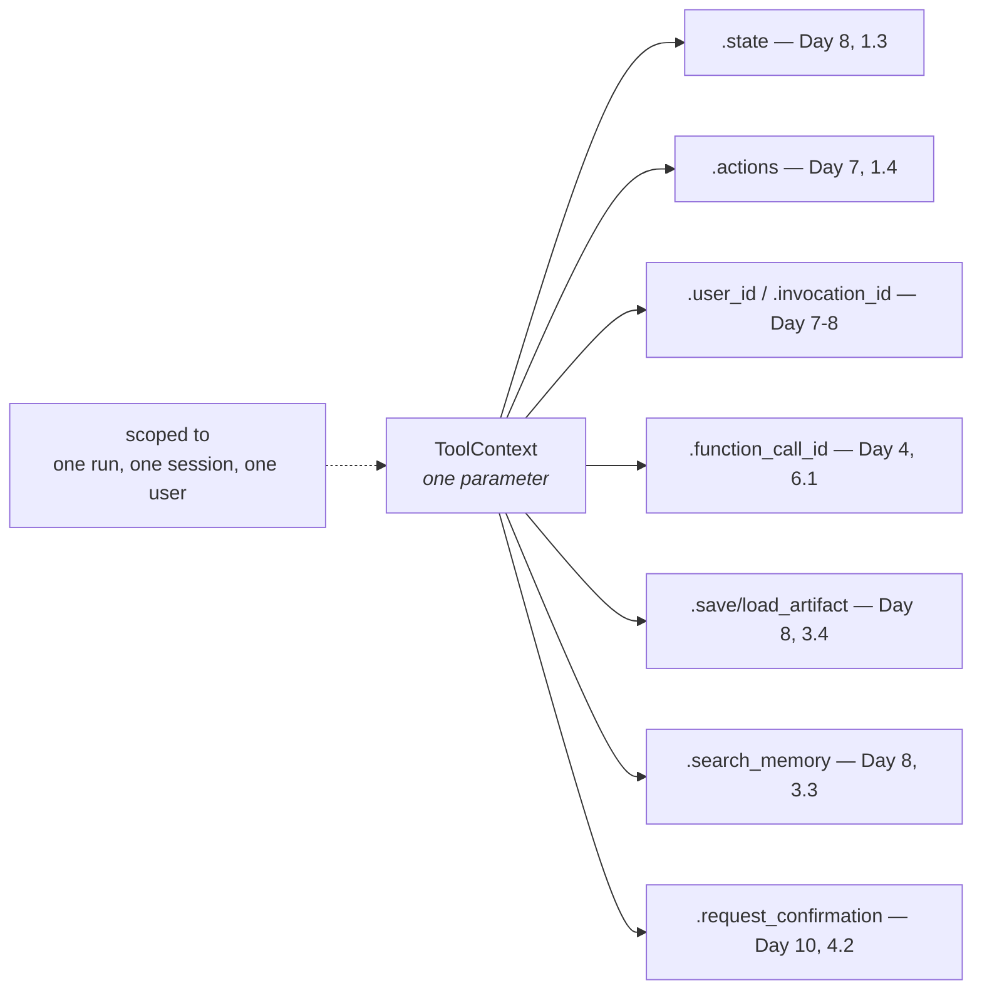

# 1.3 — One card, several doors

## One-line answer

One parameter opens six doors — session state, the event's actions, the run and user identifiers,
artifacts, memory search and the confirmation hook — and every one of them is a subsystem you have
already met and could not previously reach from inside a tool.

---

## The story

You check into a hotel and they hand you a card.

It opens your room, obviously. It also opens the door from the car park after ten at night, and the
gym, and it works in the lift for the floor you are on and no other. At breakfast, somebody looks at
it and knows your room number without asking.

Nobody explained any of that at the desk. They said "room 412" and gave you the card.

Over two days you discover the rest, one door at a time, and each discovery is small and useful. The
card did not gain capabilities; you gained knowledge of the ones it already had.

And there is one more thing worth noticing about it. **The card is not a key in the old sense.** A
metal key is a shape that fits a lock, and that is the whole of its relationship with the building.
The card is an *identity* — every door asks the building who this is and what they are allowed, which
is why the same card opens different doors for different guests, and why it stops working on the day
you check out.

`ToolContext` is that card, and this part is the walk round the building.

---

## The idea in plain language

[1.1](1.1-the-parameter-the-model-never-sees.md) listed the doors. This part opens each one far
enough to know what is behind it and which day it belongs to — because the honest position today is
that **you are learning where things are, not learning six new subsystems.**

### The six doors

**`.state` — the session's state dictionary, writable.**
The dictionary from
[Day 8, part 1.3](../../../day-08-sessions-and-services/parts/01-the-session/1.3-the-register-and-the-key-board.md).
Reading it is ordinary; writing to it is the subject of
[section 2](../02-state-from-a-tool/2.1-writing-on-the-carbon-copy.md), and the mechanism is not what
it looks like.

**`.actions` — the `EventActions` for this step.**
The half of an event that is not text, from
[Day 7, part 1.4](../../../day-07-events-and-streaming/parts/01-the-event-object/1.4-the-half-that-is-not-text.md).
The one a tool touches directly is `skip_summarization`: set it and the tool's result is shown as-is
rather than being handed back to the model to write up — which is one of the two shortcuts that make
`is_final_response()` return `True`
([Day 7, part 1.3](../../../day-07-events-and-streaming/parts/01-the-event-object/1.3-is-final-response-is-not-the-last-one.md)).

**`.invocation_id`, `.agent_name`, `.user_id` — who and where.**
The identifiers from
[Day 7, part 1.5](../../../day-07-events-and-streaming/parts/01-the-event-object/1.5-which-run-which-agent-which-branch.md)
and the session address from
[Day 8, part 1.2](../../../day-08-sessions-and-services/parts/01-the-session/1.2-three-parts-to-one-key.md).
`user_id` is the one that matters most, and it is
[4.2](../04-blast-radius/4.2-the-identity-a-tool-needs.md)'s whole subject.

**`.function_call_id` — which call this is.**
The id you had to echo by hand on
[Day 4, part 6.1](../../../day-04-tools-by-hand/parts/06-failure-lab/6.1-the-call-id-you-did-not-echo.md).
adk.dev calls it *"crucial for linking authentication requests or responses back correctly"* — which
is the long-running and confirmation cases from
[Day 10, section 4](../../../day-10-function-tools/parts/04-tool-shapes/4.1-the-tailors-receipt.md),
where an answer arrives later and has to be matched to the call that asked.

**`.save_artifact` / `.load_artifact` / `.list_artifacts` — files.**
The cloakroom from
[Day 8, part 3.4](../../../day-08-sessions-and-services/parts/03-the-services/3.4-the-cloakroom-and-the-one-you-were-not-given.md).
A tool that produces something large puts the bytes here and returns the **name**, which is
[2.3](../02-state-from-a-tool/2.3-what-not-to-put-on-the-noticeboard.md)'s rule.

**`.search_memory` — across-session recall.**
The keyword-matching service from
[Day 8, part 3.3](../../../day-08-sessions-and-services/parts/03-the-services/3.3-ctrl-f-is-not-understanding.md).
This is how a tool asks *"has anything like this happened before?"*, and Phase 7 makes it worth
asking.

**`.request_confirmation` — pause for a human.**
[Day 10, part 4.2](../../../day-10-function-tools/parts/04-tool-shapes/4.2-are-you-sure.md)'s gate,
reachable from inside a tool as well as declared on it.

### The thing worth noticing about the list

Six doors, and **not one of them is new machinery.** Every single one is a subsystem from Days 7, 8 or
10 that a tool previously had no way to reach.

That is the honest description of ADK-12: not a feature, a **connection**. Before today a tool was a
pure function of its arguments — which was pleasant and made it useless for anything that needed to
know where it was. Today it can know, and the cost is that it can now be wrong about where it is,
which is [section 5](../05-failure-lab/5.1-the-previous-patients-file.md).

And one property of the card that carries over exactly: **it is scoped.** The context belongs to one
invocation, in one session, for one user. It is not a global handle to the system. A tool holding a
context can reach that conversation's state and no other, which is a guarantee worth knowing you
have — and, as [4.2](../04-blast-radius/4.2-the-identity-a-tool-needs.md) shows, not a guarantee
about the *arguments* the model supplied.

---

## Why Sutra needs it

**[2.1](../02-state-from-a-tool/2.1-writing-on-the-carbon-copy.md)** uses `.state` today, and it is
the only door Sutra walks through this week.

**Day 13** hands the same object to callbacks, where `.actions` becomes the main door rather than a
mentioned one.

**Day 17** is the state deep dive; **Day 18** is artifacts; **Day 46 onwards** is memory. Each of
those days is one door opened properly.

**Day 64** is human-in-the-loop, built on `.request_confirmation` and `.function_call_id` together.

---

## The mechanism

The card, and every door it opens, listed from the object itself. **No model call, no cost:**

```python
# lab/doors.py - what a ToolContext exposes, read off the class.
from google.adk.agents.context import Context
from google.adk.tools import ToolContext

DOORS = {
    "state": "the session's state dictionary - Day 8, 1.3",
    "actions": "the EventActions for this step - Day 7, 1.4",
    "invocation_id": "which run - Day 7, 1.5",
    "agent_name": "which agent - Day 7, 1.5",
    "user_id": "whose conversation - Day 8, 1.2",
    "function_call_id": "which call, for linking a later answer - Day 4, 6.1",
    "save_artifact": "files that outlive a turn - Day 8, 3.4",
    "load_artifact": "reading them back - Day 8, 3.4",
    "list_artifacts": "what this session has - Day 8, 3.4",
    "search_memory": "across-session recall - Day 8, 3.3",
    "request_confirmation": "pause for a human - Day 10, 4.2",
}

print("ToolContext is Context :", ToolContext is Context)
print()
for name, what in DOORS.items():
    present = hasattr(ToolContext, name)
    print(f"  {name:<22} {'yes' if present else 'MISSING':<8} {what}")

print()
extra = sorted(n for n in dir(ToolContext) if not n.startswith("_") and n not in DOORS)
print("other public members ADK exposes, not covered today:")
print("   ", ", ".join(extra))
```

**Line by line:**

- `DOORS` as a dictionary of **name → where you met it**, rather than a bare list — because the point
  of this part is the map, and a list of attribute names without their days would be a reference
  card rather than a lesson.
- `hasattr(ToolContext, name)` on the **class**, not an instance — no context needs to exist, so the
  script costs nothing and works before any run.
- `'MISSING'` in capitals for anything absent — so a version change shows up as a word you notice
  rather than a `False` you skim past. If your ADK prints `MISSING` on any row, that row is out of
  date and your terminal wins.
- The `extra` list at the bottom — everything public that this day does **not** cover. Printing what
  you are not teaching is more honest than implying the eleven rows are the whole object, and it
  gives a reader something concrete to be curious about.
- `sorted(...)` and `", ".join(...)` — one readable line rather than thirty, because this block is
  context rather than content.

The output:

```text
ToolContext is Context : True

  state                  yes      the session's state dictionary - Day 8, 1.3
  actions                yes      the EventActions for this step - Day 7, 1.4
  invocation_id          yes      which run - Day 7, 1.5
  agent_name             yes      which agent - Day 7, 1.5
  user_id                yes      whose conversation - Day 8, 1.2
  function_call_id       yes      which call, for linking a later answer - Day 4, 6.1
  save_artifact          yes      files that outlive a turn - Day 8, 3.4
  load_artifact          yes      reading them back - Day 8, 3.4
  list_artifacts         yes      what this session has - Day 8, 3.4
  search_memory          yes      across-session recall - Day 8, 3.3
  request_confirmation   yes      pause for a human - Day 10, 4.2
```

Eleven doors present, and the `other public members` line below them is longer than you expect —
credential handling, node paths, run configuration, UI widgets, memory writes. Most of it belongs to
days you have not reached, and **a few of it belongs to the graph runtime**, which is Phase 8. Knowing
that the object is bigger than today's eleven rows is the point of printing it.



---

## When it breaks

**💥 The door that is not there yet.**

```text
AttributeError: 'Context' object has no attribute 'search_memory'
```

Not on 2.7.1 — every row above is present — and this is the shape of the failure if you write a tool
against a version that differs. The check is the script above, run against **your** installed package,
which is [Day 7, part 1.2](../../../day-07-events-and-streaming/parts/01-the-event-object/1.2-the-fields-that-were-renamed.md)'s
rule pointed at a different object.

**💥 The service that is not configured.**

`search_memory` exists on the context whether or not a memory service was given to the runner. Ask a
runner built without one, and what you get is not an `AttributeError` — it is a failure from inside,
about a missing service, at the moment a user asked a question that needed it.
[Day 8, part 3.5](../../../day-08-sessions-and-services/parts/03-the-services/3.5-the-furnished-flat.md)'s
`InMemoryRunner` fills three services and leaves the credential one empty, and a tool reaching for the
empty one finds out at runtime.

**💥 The context used as a global.**

```python
LAST_CONTEXT = None


def my_tool(x: str, tool_context: ToolContext) -> dict:
    global LAST_CONTEXT
    LAST_CONTEXT = tool_context  # never do this
    ...
```

No error, and it destroys the one guarantee this object gives you. The context is scoped to one run,
one session and one user; stashing it in a module variable makes it reachable from a different run —
and in a server handling two conversations, the stash belongs to whoever wrote last. Use it and let
it go.

---

## In production

**What a professional writes instead of the teaching version** is a tool that names, in a comment,
which door it opens: `# needs the context: user_id, to check ownership`. Not because the comment is
clever, but because the six doors have very different weights — reading `user_id` is cheap and
`save_artifact` writes to a store — and a reviewer should not have to read the body to know which
kind of tool this is.

**What degrades at scale** is the temptation to use the context as a general-purpose bag. It is
reachable, it has everything, and so a tool that started needing `user_id` gradually acquires state
reads, an artifact write and a memory search. Each addition is reasonable; the result is a function
whose behaviour depends on five subsystems and which cannot be tested without all of them. **The
cheapest tool is one that takes no context; the second cheapest takes one and uses one thing.**

**The failure that only shows with real traffic** is concurrency around a stashed context. One
process, one conversation at a time, and the global above works perfectly — which is exactly why it
survives review. Two conversations in flight in one event loop and the tool for conversation A reads
conversation B's session, silently, for one call in however many. This is
[Day 8, part 4.2](../../../day-08-sessions-and-services/parts/04-what-in-memory-means/4.2-two-counters-two-notebooks.md)'s
split brain with the halves swapped, and it is the most dangerous thing in this part.

**The review comment a senior engineer leaves:** *"This tool takes a context and uses four different
things from it — state, an artifact write, a memory search and the user id. That's four dependencies
in one function and none of them is in the signature. Split it, or at minimum say at the top which
ones it needs and why."*

**The interview question:** *"what does a tool get from the framework beyond its arguments?"* The
answer that shows you have used it: "A context object, injected by the framework and hidden from the
model, that carries the session state, the event actions for this step, the run and user identifiers,
the id of this particular call, artifact storage, memory search and a confirmation hook. The useful
framing is that none of it is new machinery — it's the subsystems the runtime already had, reachable
from inside a tool for the first time. Two things I'd watch. It's scoped to one run and one user,
which is a real guarantee, and stashing it in a module-level variable destroys that guarantee in a way
that only shows up under concurrency. And a tool that uses four things from it has four dependencies
that aren't in its signature — the cheapest tool takes no context at all."

---

## Check yourself

```bash
uv run python days/day-11-tool-context/lab/doors.py
```

Read the `other public members` line and pick one you cannot explain. Find which day owes you it.

**Answer out loud, without scrolling up:**

> Name six things a `ToolContext` gives a tool, and say which day each one belongs to. Then say what
> the context is scoped to, and what stashing it in a global destroys.

---

**Next:** [1.4 — The folded paper under the chair leg](1.4-the-folded-paper-under-the-chair.md)
