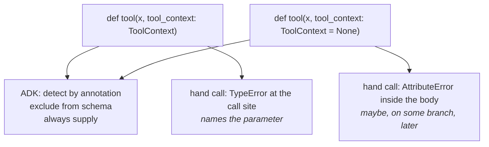

# 1.4 — The folded paper under the chair leg

## One-line answer

Giving the context parameter a `= None` default changes nothing about how ADK calls your tool and
everything about how it fails when something else does — it converts a loud `TypeError` at the call
into a quiet `AttributeError` several lines into the body.

---

## The story

There is a chair in the office that wobbles.

Somebody folds a bus ticket into a small wad and pushes it under the short leg. The wobble stops.
Everyone agrees this is fine and nobody thinks about it again.

Six weeks later a large man sits down on it heavily to reach for something on the far side of the
table, the wad squirts out sideways, and the chair goes over. He is fine, mostly. The interesting
part is what the paper actually did.

It did not fix the leg. **It moved the failure.** Before the paper, the chair announced its problem
to every single person who sat on it, gently, every time — an annoying, harmless, perfectly
informative signal. After the paper, it announced nothing to anybody until the one occasion the
signal would have been most useful.

That trade — a small constant complaint exchanged for one large silent failure — is what
`tool_context: ToolContext = None` does to your tool.

---

## The idea in plain language

Here is the temptation, and it is a reasonable one.

You write a tool that takes a context. Then you try to call it in a test:

```python
result = lookup_ticket("T-1")
```

**Line by line:**

- One positional argument, because in a test you know the ticket id and that is the only thing you
  thought you were supplying. There is no second argument because there is no context to give — the
  framework has not been involved.

and Python says the function is missing a required argument. Annoying. So you give the parameter a
default:

```python
def lookup_ticket(ticket_id: str, tool_context: ToolContext = None) -> dict:
```

**Line by line:**

- `= None` and nothing else changed. Five characters, added for no reason except to make the call
  above stop raising.
- The annotation still says `ToolContext`. The default now contradicts it, and nothing in Python
  objects — see *When it breaks*.

Now the test call works. **And that is the entire benefit.**

### What the default does not change

ADK's behaviour is identical either way, and the reason is
[1.2](1.2-detected-by-type-not-by-name.md)'s rule: detection is by **annotation**, and a default does
not remove an annotation. So the parameter is still found, still excluded from the schema, still
filled in on every real call. Verified below: same `_context_param_name`, same properties, same
`required` list.

**The framework never uses the default.** It cannot: it always has a context to pass. The default
exists purely for callers who are not the framework — which is you, in a test, at the exact moment
you are least likely to notice that the object is missing.

### What the default does change

The failure. Before:

```text
TypeError: lookup_ticket() missing 1 required positional argument: 'tool_context'
```

That is Python complaining at the **call site**, naming the function and the parameter, before a
single line of the body runs. It is the wobble.

After:

```text
AttributeError: 'NoneType' object has no attribute 'state'
```

That is your body failing somewhere in the middle, and the traceback points at your code rather than
at the call that was wrong. Worse: if the context is only touched on one branch — an error path, a
cache miss, a rarely-taken `if` — the test passes and the failure waits.

### So what do you do about the test?

You give it a real context. That is [6.1](../06-in-production/6.1-a-tool-without-a-model.md)'s
subject and it is about six lines. The right response to *"I can't call this in a test"* is to build
the thing the test needs, not to make the function pretend it does not need it.

**The rule, plainly: a context parameter has no default.** If your tool needs a context, say so in the
signature, and let anybody who cannot supply one find out immediately.

### The one honest exception

A tool where the context is genuinely optional — where the function does something useful with no
context and something extra with one — is a real shape, and there the default is not papering over
anything. It is rare. And it needs the check written out, so the intent is visible:

```python
def lookup_ticket(ticket_id: str, tool_context: ToolContext | None = None) -> dict:
    """Fetch a ticket; remember it if we have somewhere to remember it."""
    record = TICKETS.get(ticket_id)
    if tool_context is not None:
        tool_context.state["last_ticket"] = ticket_id
    return {"status": "ok", "ticket": record}
```

**Line by line:**

- `ToolContext | None` rather than `ToolContext` — the annotation now tells the truth about what the
  parameter can hold, which is the difference between an exception and a lie. A reader who sees
  `ToolContext = None` has been told two contradictory things.
- `if tool_context is not None:` written out rather than a `try`/`except AttributeError` — the
  condition is a design decision and should read like one. Catching the `AttributeError` would also
  swallow a genuine bug inside `state`.
- The state write is the *only* thing inside the guard. Everything the tool exists to do happens
  outside it, which is the test for whether the context is really optional: if the useful work is
  inside the `if`, it is not optional, it is required and unenforced.

And note the annotation still gets the parameter detected — `ToolContext | None` contains a context
type, so ADK finds it exactly as before. You lose nothing by being accurate.

---

## Why Sutra needs it

**[2.1](../02-state-from-a-tool/2.1-writing-on-the-carbon-copy.md)** is the first Sutra tool that
takes a context, and it takes it without a default.

**[6.1](../06-in-production/6.1-a-tool-without-a-model.md)** builds the context a test needs, which
is the alternative this part is arguing for.

**Day 23** is testing agents properly, and the habit of building a real context rather than passing
`None` is the difference between a test that proves something and a test that proves the happy path.

**Day 31** is the quality gate. *"No context parameter has a default unless its annotation includes
`None`"* is a handful of lines over the AST and catches this permanently.

---

## The mechanism

Two signatures, identical to ADK, different to everybody else. **No model call, no cost:**

```python
# lab/no_default.py - what a default on the context parameter costs.
import asyncio
import traceback

from google.adk.agents import LlmAgent
from google.adk.tools import ToolContext

TICKETS = {"T-1": "Cannot log in"}


def strict(ticket_id: str, tool_context: ToolContext) -> dict:
    """Fetch a ticket and remember it.

    Args:
        ticket_id: the id.
    """
    tool_context.state["last_ticket"] = ticket_id
    return {"status": "ok", "subject": TICKETS[ticket_id]}


def defaulted(ticket_id: str, tool_context: ToolContext = None) -> dict:
    """Fetch a ticket and remember it.

    Args:
        ticket_id: the id.
    """
    tool_context.state["last_ticket"] = ticket_id
    return {"status": "ok", "subject": TICKETS[ticket_id]}


for function in (strict, defaulted):
    print(f"--- calling {function.__name__}('T-1') by hand ---")
    try:
        function("T-1")
    except Exception:
        traceback.print_exc()
    print()


async def main() -> None:
    for function in (strict, defaulted):
        agent = LlmAgent(name="a", model="gemini-3.7-flash", instruction="x", tools=[function])
        tool = (await agent.canonical_tools())[0]
        schema = tool._get_declaration().parameters_json_schema
        print(
            f"{function.__name__:<10} ADK fills {tool._context_param_name!r:<15} "
            f"model sees {list(schema['properties'])} required {schema.get('required')}"
        )


asyncio.run(main())
```

**Line by line:**

- Two functions with **identical bodies** — the same state write, the same lookup — differing only in
  ` = None`. Anything different in the output is caused by five characters.
- `tool_context.state[...]` as the **first** statement in both bodies, so the `defaulted` traceback
  points at line one and the failure is as early as it can possibly be. A real tool would do the
  lookup first, and then the `AttributeError` arrives after some work has already happened, which is
  the version that is genuinely hard to read.
- `traceback.print_exc()` rather than `print(e)` — because the *shape* of the traceback is the
  finding. One points at the call, the other points inside the function, and a one-line message
  hides that.
- The loop calls each function **the way a test would**, positionally and with the context omitted.
- The second half asks ADK the same two questions asked in
  [1.2](1.2-detected-by-type-not-by-name.md) — which parameter it fills and what the model sees — so
  that "the default changes nothing for ADK" is an observation rather than a claim.
- `schema.get('required')` added here — because the natural worry is that a Python default becomes a
  *schema* optional, and it is worth seeing that `ticket_id` is required in both.

The output:

```text
--- calling strict('T-1') by hand ---
Traceback (most recent call last):
  File "days/day-11-tool-context/lab/no_default.py", line 34, in <module>
    function("T-1")
TypeError: strict() missing 1 required positional argument: 'tool_context'

--- calling defaulted('T-1') by hand ---
Traceback (most recent call last):
  File "days/day-11-tool-context/lab/no_default.py", line 34, in <module>
    function("T-1")
  File "days/day-11-tool-context/lab/no_default.py", line 27, in defaulted
    tool_context.state["last_ticket"] = ticket_id
    ^^^^^^^^^^^^^^^^^^
AttributeError: 'NoneType' object has no attribute 'state'

strict     ADK fills 'tool_context'  model sees ['ticket_id'] required ['ticket_id']
defaulted  ADK fills 'tool_context'  model sees ['ticket_id'] required ['ticket_id']
```

Read the two tracebacks side by side. `strict` fails in **one frame**, at the call, naming the
missing parameter. `defaulted` fails in **two**, and the second frame is inside code that is not
wrong — `tool_context.state` is exactly what that line should say.

Then read the last two lines: identical. The default bought nothing at all from the framework.



---

## When it breaks

**💥 The branch that was never taken.**

```python
def lookup_ticket(ticket_id: str, tool_context: ToolContext = None) -> dict:
    record = TICKETS.get(ticket_id)
    if record is None:
        tool_context.state["misses"] = tool_context.state.get("misses", 0) + 1
        return {"status": "not_found", "ticket_id": ticket_id}
    return {"status": "ok", "ticket": record}
```

Every test uses an id that exists. Every test passes. The `AttributeError` lives on the miss path —
[Day 10, part 2.3](../../../day-10-function-tools/parts/02-what-a-tool-returns/2.3-a-failed-tool-is-still-a-result.md)'s
honest not-found branch — and the first thing to exercise it is a real user asking about a ticket
that is not there. **The default did not hide a bug; it hid the bug on the path that handles bugs.**

**💥 The `None` that reaches a helper.**

```text
AttributeError: 'NoneType' object has no attribute 'state'
  File ".../sutra/desk/notes.py", line 14, in record_note
```

The tool passed `tool_context` down to a helper and the helper failed. Now the traceback names a file
that never declared a context parameter at all, and finding the cause means walking back up. The
`TypeError` version could not have got this far.

**💥 The annotation that lies.**

```python
tool_context: ToolContext = None
```

There is no error and there never will be, and this is the thing worth being irritated by: the
annotation says the parameter holds a `ToolContext`, and the default puts a `None` in it. Nothing in
Python objects. A type checker would — which is one small argument for the decision parked at
[Day 31's quality gate](../../../day-10-function-tools/parts/01-the-form-fills-itself/1.4-the-wrapper-that-arrives-late.md).
Writing `ToolContext | None` costs seven characters and makes the statement true.

---

## In production

**What a professional writes instead of the teaching version** is a signature with no default and a
test fixture that builds a context. The fixture is written once per repository, lives in
`tests/conftest.py`, and every tool test uses it. That is the whole fix, and the reason it does not
happen is that the default is available in the moment of irritation and the fixture is a small piece
of work for later.

**What degrades at scale** is defaults spreading by copy. Somebody adds ` = None` to one tool for a
test. The next tool is written by copying that one. Six months later, half the tools in the file
have a context parameter that claims to be optional, none of them checks it, and nobody can tell by
reading which ones genuinely tolerate a missing context. **The signature has stopped carrying
information** — which is a bigger loss than any individual crash, because it is the thing you were
reading the signature for.

**The failure that only shows with real traffic** is the rare branch, above, and it has a specific
shape worth recognising: an `AttributeError` on `NoneType` in a code path that only runs when
something else has already gone wrong. Your error handling fails while handling an error. The
original problem — the missing ticket — is now invisible, replaced by a traceback about `None`, and
the incident takes twice as long because the first thing anybody sees is the wrong failure.
Principle 10 says errors surface honestly; a context that is `None` on the error path is a machine
for making them surface dishonestly.

**The review comment a senior engineer leaves:** *"Drop the `= None` on the context. It doesn't change
anything for the framework — the parameter is detected by its annotation and always supplied — so all
it's doing is turning a `TypeError` at the call into an `AttributeError` inside the body, on whichever
branch happens to touch state first. If it's here so the tests can call the function, add a context
fixture instead. If the context is genuinely optional, annotate it `ToolContext | None` and write the
`is not None` check so I can see that's deliberate."*

**The interview question:** *"is there any harm in defaulting an injected parameter to `None`?"* The
answer that shows you have debugged one: "It doesn't help and it costs you the error message. The
framework detects the parameter by its annotation, so a default doesn't change detection, exclusion
from the schema, or the fact that a real call always supplies it — the default is only ever used by
callers that aren't the framework, which in practice means tests. What it changes is the failure: a
missing required argument is a `TypeError` at the call site naming the parameter, and with the default
it becomes an `AttributeError` on `NoneType` somewhere inside the body, possibly on a branch the tests
never take. The worst version is when that branch is the error path, so your error handling breaks
while handling an error and the real problem disappears. If a test can't supply a context, the fix is
a fixture that builds one — six lines — not a default. And if the context really is optional, say so
in the annotation and check it explicitly."

---

## Check yourself

```bash
uv run python days/day-11-tool-context/lab/no_default.py
```

Then move the state write in `defaulted` to *after* the dictionary lookup and run it again, so you
have seen the traceback arrive late as well as early.

**Answer out loud, without scrolling up:**

> Say what `= None` on a context parameter changes for ADK, and what it changes for everybody else.
> Then say what the worst branch to hide this on is, and why.

---

**Next:** [2.1 — Writing on the carbon copy](../02-state-from-a-tool/2.1-writing-on-the-carbon-copy.md)
