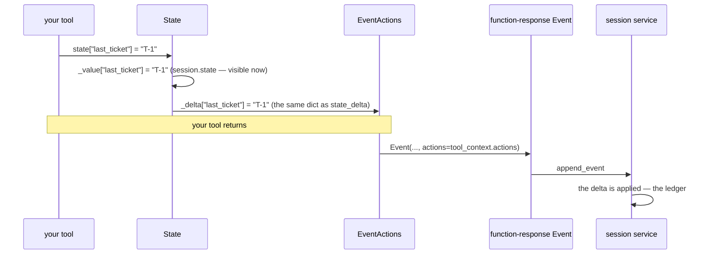

# 2.1 — Writing on the carbon copy

## One-line answer

`tool_context.state["k"] = v` is not a helper that saves something later — the write goes into the
session's dictionary **and** into `tool_context.actions.state_delta` in the same act, and that delta
is literally the `state_delta` on the event ADK emits for your tool's result.

---

## The story

A shop still using a duplicate receipt book.

The man writes your order on the top sheet with a ballpoint pen. Underneath the sheet is a piece of
carbon paper and a second sheet, yellow, and every stroke he makes on the white one appears on the
yellow one at the same instant. He is not writing twice. He is not copying it afterwards. **One act,
two records**, and the mechanism is that the pen presses through.

He tears off the white sheet and hands it to you. The yellow one stays in the book, and at the end of
the day the book goes to the back office and the yellow sheets become the day's sales.

Two things about this are worth holding on to.

**The copy is free and automatic.** He could not have made the white sheet without making the yellow
one. There is no step where he decides to record the sale.

**The yellow sheet is not the accounts.** It is a record that is *going to become* the accounts, when
the book gets to the back office. Between the sale and that moment, the sale exists on paper and not
in the ledger.

That is exactly the arrangement between a tool's state write, the event ADK emits, and the session
service.

---

## The idea in plain language

You write one line:

```python
tool_context.state["last_ticket"] = ticket_id
```

**Line by line:**

- `tool_context.state` is not a plain dictionary — it is a `State` object wrapping two of them, which
  is why one assignment can have three consequences.
- `["last_ticket"]` is a **top-level** key. That matters: only an assignment to a top-level key runs
  the code below, which is *When it breaks*'s nested-mutation trap.
- `= ticket_id` — an ordinary Python assignment, calling `State.__setitem__`. Nothing here is
  awaited, queued or scheduled.

Three things are now true, and none of them is "it will be saved later by some background process".

**One — the session's dictionary changed, immediately.**
`ToolContext.state` is a `State` object wrapping two dictionaries: `_value`, which **is** the very
dict from
[Day 8, part 1.3](../../../day-08-sessions-and-services/parts/01-the-session/1.3-the-register-and-the-key-board.md),
and `_delta`. Its `__setitem__` writes to both. Anything holding that session object sees the new
value at once, before any event exists. That is a **dirty read** — the thing
[Day 7, part 2.4](../../../day-07-events-and-streaming/parts/02-the-stream/2.4-nothing-is-credited-until-the-receipt.md)
warned about — and it is the carbon copy's first property: the record is made by the same stroke as
the act.

**Two — `tool_context.actions.state_delta` now has your key in it.**
Not a copy of it. The same object. `Context.__init__` builds
`State(value=session.state, delta=self._event_actions.state_delta)`, so `state._delta` **is**
`actions.state_delta`:

```text
ctx.state._delta is actions.state_delta: True
```

You met `EventActions` on
[Day 7, part 1.4](../../../day-07-events-and-streaming/parts/01-the-event-object/1.4-the-half-that-is-not-text.md)
as the half of an event that is not text, with `state_delta` as its most important field and nothing
that filled it in. **This is what fills it in.**

**Three — the event ADK emits for your tool's result carries those actions.**
ADK builds the function-response event as:

> `Event(invocation_id=..., author=..., content=content, actions=tool_context.actions, branch=...)`

Same object again. Your write is on the event before the event is yielded, and the runtime's own
comment in `functions.py` says what happens next, verbatim:

> *"Note: State deltas are not applied here — they are collected in `tool_context.actions.state_delta`
> and applied later when the session service processes the events"*

That is the book going to the back office.

### Why this matters more than it looks

The naive reading of `tool_context.state[k] = v` is *"a convenience for saving something"*. The
accurate reading is: **you are writing a line on the ledger the run is already keeping.** Which means:

- **It is recorded whether or not anybody reads it.** The delta rides out on an event, and events are
  the run's history. You cannot write state secretly.
- **It arrives with the tool's result, not before and not after.** One event carries both the
  function response and the state change, so anything replaying the run sees them together, in order.
- **A tool that never returns still wrote.** If your tool raises after the state write, the write is
  in `_value` and in the delta, and what happens to it depends on whether an event gets emitted.
  Interesting, uncomfortable, and [5.1](../05-failure-lab/5.1-the-previous-patients-file.md)'s
  territory.

### The one-liner to remember

**A state write is an event edit.** Everything else about state on Day 17 is detail on top of that
sentence.

---

## Why Sutra needs it

**Sutra's desk needs memory between turns.** A triage tool that finds a ticket should record which
ticket, so that "escalate it" in the next turn has an antecedent. That is one line in
[2.2](2.2-reading-what-you-did-not-fetch.md)'s tool and it is the first thing the desk remembers.

**Day 13** hands the same `actions` object to callbacks, which can edit state before and after a
tool runs. The mechanism is identical; only the moment differs.

**Day 17** is the state deep dive — the `app:`, `user:` and `temp:` prefixes, and what each one
survives.

**Day 22** is persistence, where the back office stops being in memory and the difference between
`_value` and `_delta` becomes the difference between what you can see and what will still be there
tomorrow.

---

## The mechanism

One write, watched from three angles. **No model call, no cost:**

```python
# lab/carbon.py - what one state write actually touches.
import asyncio

from google.adk.agents import LlmAgent
from google.adk.agents.invocation_context import InvocationContext
from google.adk.events import EventActions
from google.adk.sessions import InMemorySessionService
from google.adk.tools import ToolContext


async def main() -> None:
    service = InMemorySessionService()
    session = await service.create_session(app_name="sutra", user_id="u", state={"greeting": "hi"})
    agent = LlmAgent(name="sutra_desk", model="gemini-3.7-flash", instruction="x")
    invocation = InvocationContext(
        session_service=service,
        invocation_id="inv-1",
        agent=agent,
        session=session,
    )

    actions = EventActions()
    tool_context = ToolContext(invocation, event_actions=actions, function_call_id="fc-1")

    print("before  state :", tool_context.state.to_dict())
    print("before  delta :", actions.state_delta)

    tool_context.state["last_ticket"] = "T-1"  # the one line

    print("after   state :", tool_context.state.to_dict())
    print("after   delta :", actions.state_delta)
    print("session.state :", session.state)
    print()
    print("state._delta is actions.state_delta:", tool_context.state._delta is actions.state_delta)


asyncio.run(main())
```

**Line by line:**

- `InMemorySessionService()` and `create_session(..., state={"greeting": "hi"})` — a session with one
  key already in it, so the output distinguishes *what was there* from *what the write added*.
- `InvocationContext(...)` built by hand with four fields — the runtime builds this for you on every
  run, and constructing one directly is what makes a tool testable without a model. That is
  [6.1](../06-in-production/6.1-a-tool-without-a-model.md)'s subject; here it is scaffolding.
- `EventActions()` created **separately** and kept in a local variable — the whole point. If it were
  only reachable through the context, you could not watch it independently, and "the delta is the same
  object" would be an assertion rather than an observation.
- `ToolContext(invocation, event_actions=actions, ...)` — the context is handed the actions object.
  This is exactly what ADK does before calling your tool.
- `function_call_id="fc-1"` — not used by this script, and required for the confirmation and
  credential paths, so it is here as a reminder that a real context always has one.
- `tool_context.state.to_dict()` rather than `dict(tool_context.state)` — `State` is not a `dict` and
  has no iteration protocol, so `dict(...)` raises. See *When it breaks*.
- The write itself is **one line with a comment on it**, sitting between two identical pairs of prints,
  so the diff in the output is unambiguous.
- `session.state` printed as well as `state.to_dict()` — proving the write reached the session's own
  dictionary, not some staging area.
- `state._delta is actions.state_delta` — `is`, not `==`. Two empty dictionaries are equal; only `is`
  shows they are the same object. The underscore says this is ADK's internal, read here to explain a
  mechanism and never in product code.

The output:

```text
before  state : {'greeting': 'hi'}
before  delta : {}
after   state : {'greeting': 'hi', 'last_ticket': 'T-1'}
after   delta : {'last_ticket': 'T-1'}
session.state : {'greeting': 'hi', 'last_ticket': 'T-1'}

state._delta is actions.state_delta: True
```

Read the two `after` lines together. **The state is everything; the delta is only what changed.** That
is the white sheet and the yellow sheet, and it is why an event's `state_delta` is small even when a
session's state is large — an event records the stroke, not the page.

And `session.state` already shows `last_ticket` while no event has been created at all. The sale is on
paper. It is not yet in the ledger.



---

## When it breaks

**💥 `dict(state)` on a `State`.**

```text
Traceback (most recent call last):
  File "days/day-11-tool-context/lab/carbon.py", line 25, in main
    print("before  state :", dict(tool_context.state))
                             ^^^^^^^^^^^^^^^^^^^^^^^^
  File ".../google/adk/sessions/state.py", line 89, in __getitem__
    return self._value[key]
           ~~~~~~~~~~~^^^^^
KeyError: 0
```

An error message that tells you almost nothing about the real problem, so it is worth decoding.
`State` defines `__getitem__` and `__contains__` but **not** `__iter__` or `keys()`. Given an object
with `__getitem__` and no `__iter__`, Python falls back to the old sequence protocol: ask for index
`0`, then `1`, and so on. So it asks the state dictionary for the key `0`, which is not there. The
`KeyError: 0` is Python trying to treat your dictionary as a list. Use `.to_dict()`.

**💥 The write that was never going to persist.**

No error at all. A tool writes state, the run works, the process exits, and tomorrow the state is
gone — because `InMemorySessionService` is
[Day 8, part 4.1](../../../day-08-sessions-and-services/parts/04-what-in-memory-means/4.1-the-tab-you-did-not-save.md)'s
unsaved tab. Nothing about `tool_context.state` promises durability. **Durability is a property of the
service, not of the write**, and that is a sentence worth being annoyed by until it is obvious.

**💥 The mutation that left no delta.**

```python
tool_context.state["counts"]["escalations"] += 1  # nothing is recorded
```

The read returns the inner dictionary, and mutating it in place never calls `__setitem__` on the
`State`, so `state_delta` stays empty. In memory it appears to work, because `_value` is the session's
own dict. On a persistent service the change vanishes at the next load. **Assign to the top-level key,
always:**

```python
counts = dict(tool_context.state.get("counts", {}))
counts["escalations"] = counts.get("escalations", 0) + 1
tool_context.state["counts"] = counts
```

**Line by line:**

- `dict(tool_context.state.get("counts", {}))` — `.get` with a default so a first run works, and
  `dict(...)` to **copy** rather than alias. Without the copy you would mutate the stored object and
  then assign it back, which happens to work today and hides the bug from the next reader.
- The `+ 1` on a plain local dictionary — ordinary Python, no framework involved.
- `tool_context.state["counts"] = counts` — the assignment is the whole point. This is the line that
  writes the carbon copy.

---

## In production

**What a professional writes instead of the teaching version** is state keys that are named like
columns rather than variables: `last_ticket_id`, not `last`. State is read by other tools, by
callbacks on Day 13, by the templated instruction from
[Day 6, part 3.1](../../../day-06-instructions-and-personas/parts/03-the-instruction-fields/3.1-where-your-instruction-lands.md),
and eventually by a person looking at a stored session trying to work out what happened. It is a
shared surface, and it deserves the naming discipline of one.

**What degrades at scale** is state size. Every write puts the value in a delta, the delta rides on an
event, and events are stored. A tool that writes the full text of a knowledge-base article into state
has just added that text to the run's permanent history, once per call. Sessions grow, the model's
context grows if state is templated into the instruction, and storage grows. The rule that follows —
**write handles, not payloads** — is [2.3](2.3-what-not-to-put-on-the-noticeboard.md)'s subject and it
comes from this mechanism rather than from taste.

**The failure that only shows with real traffic** is the in-place mutation above. It works perfectly
on `InMemorySessionService`, because `_value` is the live session dictionary and nothing needs a delta
to make the change visible. Day 22 swaps in a database, the same code runs, and now a counter silently
stops incrementing between processes — with no error, no diff, and a test suite that still passes
because the test suite uses the in-memory service. **The dirty read is what makes the bug invisible in
development**, which is the most expensive kind.

**The review comment a senior engineer leaves:** *"`state["counts"]["x"] += 1` mutates in place, so
nothing lands in `state_delta` and this will stop working the moment we're not on the in-memory
session service. Read it, modify a copy, assign the top-level key back. And while you're here — the
whole KB article is going into state, which means it's going into an event and into storage on every
call. Store the article id."*

**The interview question:** *"how does a tool change the conversation's state?"* The answer that shows
you have read the source: "It writes to a dictionary on the context, but the useful thing to know is
what that write actually is. The state object wraps the session's dictionary and a delta dictionary,
and the delta is the same object as `state_delta` on the event actions the framework passes in — so
one assignment both updates the live session and stages the change on the event that will carry the
tool's result. The framework's own comment says deltas aren't applied at the tool; they're collected
and applied when the session service processes the events. Two consequences I'd watch. The live
session updates immediately, so anything reading the session before the event is committed gets a
dirty read. And mutating a nested value in place never triggers the assignment, so nothing lands in
the delta — which is invisible on an in-memory service and breaks the day you move to a real one."

---

## Check yourself

```bash
uv run python days/day-11-tool-context/lab/carbon.py
```

Then change the write to a nested mutation — `tool_context.state["greeting"]` is a string, so add a
`{"counts": {"x": 0}}` key to the initial state and try `+= 1` on it — and watch `after delta` stay
empty.

**Answer out loud, without scrolling up:**

> Say the two dictionaries a state write touches, and what the second one becomes. Then say why a
> nested in-place mutation is a bug you will not see until Day 22.

---

**Next:** [2.2 — Reading what you did not fetch](2.2-reading-what-you-did-not-fetch.md)
