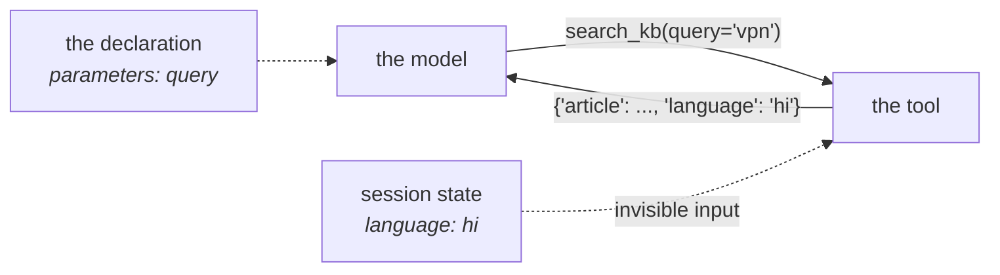

# 2.2 — Reading what you did not fetch

## One-line answer

A tool can read any key in session state, which means its result depends on inputs the model never
supplied and the schema never mentioned — the same call, twice, can honestly return two different
answers.

---

## The story

The tea stall outside your office.

You say "one tea" and you get one tea, without sugar, because you have been going there for two years
and the man behind the counter knows. You have not said "no sugar" since about the third week. Two
words go across the counter and a fairly specific cup comes back.

Now a colleague comes with you for the first time and says exactly the same two words. She gets sugar,
obviously, because there is no standing order for her yet. Same words, different cup, and nobody has
made a mistake.

Then one morning the usual man is off and his cousin is at the counter. You say "one tea" out of pure
habit. You get sugar. You are mildly irritated, and if you think about it for two seconds you know
exactly why — but for those two seconds the world was confusing, because **the input you actually
relied on was never in the sentence you said.**

That is a tool reading session state.

---

## The idea in plain language

[2.1](2.1-writing-on-the-carbon-copy.md) was writing. Reading is the same object and a much quieter
set of consequences.

### The three ways to read

```python
language = tool_context.state.get("language", "en")  # safe: a default
if "language" in tool_context.state:
    ...  # membership
everything = tool_context.state.to_dict()  # the whole thing, as a real dict
```

**Line by line:**

- `.get("language", "en")` — the second argument is the point. A missing key is the *normal* state of
  affairs on the first turn of every conversation, so the default is the behaviour rather than a
  fallback.
- `"language" in tool_context.state` — `State` defines `__contains__`, so membership works and checks
  both the pending delta and the stored value.
- `.to_dict()` returns a **new** plain dictionary with the delta merged over the value. Mutating what
  it hands you changes nothing; assign back through `state[...]` if you meant to write.

And one way that bites: `tool_context.state["language"]` raises `KeyError` if the key is absent, which
in a tool means a traceback rather than a result. Prefer `.get` with an explicit default, because a
tool nearly always has a sensible fallback and *"no preference recorded"* is a normal state, not an
error. This is the same argument as
[Day 10, part 2.3](../../../day-10-function-tools/parts/02-what-a-tool-returns/2.3-a-failed-tool-is-still-a-result.md):
the ordinary absence of something is not an exception.

Note also what is **not** available. `State` is not a `dict` — it has `__getitem__`, `__contains__`,
`get`, `setdefault`, `update` and `to_dict`, and no `keys()`, no `items()` and no iteration. If you
want to loop over state, call `.to_dict()` first. The failure otherwise is
[2.1](2.1-writing-on-the-carbon-copy.md)'s baffling `KeyError: 0`.

### Reads check the delta first

`State.__getitem__` looks in `_delta` before `_value`:

```python
if key in self._delta:
    return self._delta[key]
return self._value[key]
```

**Line by line:**

- `if key in self._delta:` — the pending, uncommitted change wins over the stored value. Your tool
  reads back what it wrote a line ago, which is what you would expect and worth confirming rather than
  assuming.
- `return self._value[key]` — no `.get`, no default. This is the line that raises `KeyError` on a
  missing key.

Today you cannot construct a case where the two dictionaries disagree, because `__setitem__` writes to
both. But ADK's own source carries a `TODO` next to it:

> *"make new change only store in delta, so that `self._value` is only updated at the storage commit
> time"*

If that lands, `_value` becomes the committed state and `_delta` the pending edits, the two genuinely
diverge, and delta-first is what keeps your tool reading its own work. Reading the ordering now costs
nothing and stops it being a surprise later.

### The part that actually matters

A tool's declaration — the thing on
[Day 10, part 1.1](../../../day-10-function-tools/parts/01-the-form-fills-itself/1.1-the-declaration-you-no-longer-write.md)
— lists its parameters. Session state is not in it. So a tool that reads state has **inputs that are
invisible to the model, invisible to the schema, and invisible to anybody reading the call in a
transcript.**

Concretely: the model sends `search_kb(query="vpn")`. The result comes back in Hindi. Nothing in the
call says Hindi. Nothing in the declaration mentions language. The reason is a key somebody wrote into
state four turns ago, and the only place it is visible is a `state_delta` on an event from earlier in
the run.

This is not a flaw — it is the whole point, and it is how a desk remembers a caller's language, their
tier, their last ticket. But it changes what a tool *is*. A tool with no context is a pure function:
same arguments, same answer, forever. A tool that reads state is a function of its arguments **and the
conversation so far**, and only half of that is written down.

The discipline that follows is small and worth adopting today:

- **Say so in the docstring.** *"Uses `state['language']` if set, otherwise English."* The docstring is
  the description the model reads
  ([Day 10, part 1.2](../../../day-10-function-tools/parts/01-the-form-fills-itself/1.2-the-docstring-is-the-description.md)),
  so this sentence is also the model's only chance to know the behaviour exists.
- **Echo the resolved value in the result.** If the answer depended on `language`, put `language` in
  the returned dictionary. Then the transcript explains itself, and the model can say *"in Hindi, as
  you asked earlier"* instead of silently switching.
- **Always have a default.** A tool that only works once state has been populated is a tool that fails
  on the first turn of every conversation.

---

## Why Sutra needs it

**Sutra's `search_kb`** will grow exactly this behaviour: the caller's language and their tier decide
which article and which tone. Day 10's version took only a query, and it is about to stop being a pure
function.

**[4.1](../04-blast-radius/4.1-the-line-between-read-and-write.md)** is the containment story — reads
are cheap and writes are not, and knowing which of the two a tool does is the first question about its
blast radius.

**Day 17** is the state deep dive, where the prefixes decide *whose* preference a key is.

**Day 25** is evaluation. A tool whose answer depends on hidden state is a tool whose test needs that
state set up explicitly — and evaluation is where undeclared inputs stop being a style question.

---

## The mechanism

The same call, twice, with two different answers. **No model call, no cost:**

```python
# lab/reading.py - what a tool can read that nobody passed it.
import asyncio

from google.adk.agents import LlmAgent
from google.adk.agents.invocation_context import InvocationContext
from google.adk.events import EventActions
from google.adk.sessions import InMemorySessionService
from google.adk.tools import ToolContext

KB = {"vpn": "Reinstall the VPN client.", "vpn-hi": "VPN client dobara install karein."}


def search_kb(query: str, tool_context: ToolContext) -> dict:
    """Search the knowledge base in the caller's preferred language.

    Args:
        query: what to look for.
    """
    language = tool_context.state.get("language", "en")
    key = query if language == "en" else f"{query}-{language}"
    article = KB.get(key)
    if article is None:
        return {"status": "not_found", "query": query, "language": language}
    return {"status": "ok", "article": article, "language": language}


async def context_for(state: dict) -> ToolContext:
    """Build a ToolContext over a session holding `state`."""
    service = InMemorySessionService()
    session = await service.create_session(app_name="sutra", user_id="u", state=state)
    agent = LlmAgent(name="sutra_desk", model="gemini-3.7-flash", instruction="x")
    invocation = InvocationContext(
        session_service=service, invocation_id="inv-1", agent=agent, session=session
    )
    return ToolContext(invocation, event_actions=EventActions(), function_call_id="fc-1")


async def main() -> None:
    for state in ({}, {"language": "hi"}):
        tool_context = await context_for(state)
        print(f"state {str(state):<20} -> {search_kb('vpn', tool_context)}")

    print()
    tool_context = await context_for({"language": "hi"})
    print("'language' in state :", "language" in tool_context.state)
    print("state.get('tone')   :", tool_context.state.get("tone", "<default>"))
    print("state.to_dict()     :", tool_context.state.to_dict())
    try:
        tool_context.state["tone"]
    except KeyError as error:
        print("state['tone']       : KeyError", error)


asyncio.run(main())
```

**Line by line:**

- `KB` with two keys, `"vpn"` and `"vpn-hi"` — the smallest thing that can behave differently. A real
  knowledge base would be a lookup by language column; the point is the branch, not the storage.
- `tool_context.state.get("language", "en")` — `.get` **with** a default, which is the whole rule of
  this part in one call. On the first turn of every conversation this key is absent, and that is not an
  error.
- `key = query if language == "en" else f"{query}-{language}"` — deliberately crude, so that nothing in
  the mechanism distracts from the finding.
- `return {"status": ..., "language": language}` in **both** branches — the resolved language echoed
  back, so the result explains itself. This is the second discipline above, applied.
- `context_for(state)` factored out as a helper returning a `ToolContext` — it is
  [2.1](2.1-writing-on-the-carbon-copy.md)'s scaffolding with the initial state as a parameter, which
  is what lets the same tool be called twice under different conditions.
- A **fresh** `InMemorySessionService` per call rather than one service with two sessions — so the two
  runs cannot influence each other at all, and the only difference is the state passed in.
- `search_kb('vpn', tool_context)` with the **identical** first argument both times. If the query
  varied, the different answers would prove nothing.
- The second block reads state four ways in a row — membership, `.get` with a default, `.to_dict()`,
  and a bare subscript inside `try` — so the four behaviours sit next to each other and can be
  compared.
- `except KeyError as error` printing the error rather than a traceback, because here the exception is
  the expected result and a traceback would read as a failure.

The output:

```text
state {}                   -> {'status': 'ok', 'article': 'Reinstall the VPN client.', 'language': 'en'}
state {'language': 'hi'}   -> {'status': 'ok', 'article': 'VPN client dobara install karein.', 'language': 'hi'}

'language' in state : True
state.get('tone')   : <default>
state.to_dict()     : {'language': 'hi'}
state['tone']       : KeyError 'tone'
```

Two calls, one argument, two articles. **A model watching this would have no way to explain the
difference** — except that the last field of the result says `language`, which is the entire reason to
put it there.



The dotted lines are the two things the model cannot see: the state that went in, and the fact that the
declaration never mentioned it. The echoed `language` field in the result is the one thread back.

---

## When it breaks

**💥 `KeyError` inside a tool.**

```text
KeyError: 'language'
```

A one-word error from inside your tool, and ADK turns an exception into a failed tool call rather than
a crash — so what the model sees is an error where it expected an answer, and what you see in the logs
is a `KeyError` with no indication that the real problem is *this is the first turn*. Use `.get` with a
default.

**💥 The tool that only works on turn two.**

No error. The tool reads `state["tier"]`, defaults sensibly to `"standard"`, and works. Then somebody
writes it as `state.get("tier")` with no default, gets `None`, and compares `None` to `"gold"`, which
is `False`, so every first-turn caller is silently treated as standard. **A default of `None` is not a
default**; it is a `None` travelling further into your code than it should.

**💥 The reproduction that will not reproduce.**

A user reports a wrong answer. You call the tool with the arguments from the transcript and get the
right answer. Nothing is wrong with your machine — the call in the transcript was never the whole
input, and the missing half is a state key written several turns earlier. The fix is not a debugging
technique, it is the discipline above: **echo what you resolved.** A result carrying `"language": "hi"`
turns an unreproducible bug into a two-second reading.

**💥 The loop over state.**

```text
KeyError: 0
```

`for key in tool_context.state:` — `State` has no `__iter__`, so Python falls back to integer indexing
and asks for key `0`. Decoded at length in
[2.1](2.1-writing-on-the-carbon-copy.md). Call `.to_dict()` first.

---

## In production

**What a professional writes instead of the teaching version** is a tool that reads state in exactly
one place, at the top, into named local variables — never `tool_context.state[...]` scattered through
the body. Two reasons, and the second is the real one: it makes the tool's hidden inputs a short list
at the top of the function that a reviewer can read in one glance, and it makes the tool trivially
testable by turning those reads into a small dictionary the test supplies.

**What degrades at scale** is the number of keys a tool depends on. One is a preference. Five is a
configuration surface with no schema, no validation and no documentation, assembled by whichever
callbacks and tools happened to run first. The symptom is a tool nobody will change, because nobody can
enumerate what affects it. **If a tool reads more than two or three keys, the keys want to be a typed
object** — which is where Day 17's `state_schema` earns its place.

**The failure that only shows with real traffic** is state written by a *different* agent. In a
multi-agent system — Phase 4 — several agents share one session, and a key called `language` set by the
routing agent is read by a knowledge-base tool that was written by somebody else, six weeks earlier,
with a slightly different idea of what the values are. `"hi"` versus `"hindi"` versus `"hi-IN"`. There
is no error; there is a knowledge-base miss rate that is quietly higher for one class of user. Shared
state is an interface, and interfaces without a written contract drift.

**The review comment a senior engineer leaves:** *"This reads `state['language']` and its answer depends
on it, but the docstring doesn't mention it and the result doesn't echo it — so when someone reports a
wrong article we can't tell from the transcript what language it resolved to. Add the sentence to the
docstring, put `language` in the returned dict, and give the read an explicit default so turn one
works."*

**The interview question:** *"what changes about a tool once it can read session state?"* The answer
that shows you have maintained one: "It stops being a pure function. Its declaration lists its
parameters, and state isn't one of them, so the model, the schema and anyone reading the transcript all
see a call that doesn't contain everything the call depended on. The same arguments can legitimately
return two different answers. That's exactly what you want — it's how the system remembers a caller's
language or tier — but it costs you reproducibility unless you pay it back deliberately: document the
keys in the docstring, give every read an explicit default so the first turn works, and echo the
resolved values in the result so the transcript explains itself. The version that bites in production
is shared state in a multi-agent system, where one agent writes a key and another agent's tool reads it
with a different idea of the allowed values — no error, just a quietly worse answer for some users."

---

## Check yourself

```bash
uv run python days/day-11-tool-context/lab/reading.py
```

Then remove the `"en"` default from the `.get` and run it again, so you have seen the first-turn
failure the default was preventing.

**Answer out loud, without scrolling up:**

> Say what a tool's declaration tells the model about the state it reads. Then give the two disciplines
> that make a state-reading tool debuggable from a transcript.

---

**Next:** [2.3 — What not to put on the noticeboard](2.3-what-not-to-put-on-the-noticeboard.md)
