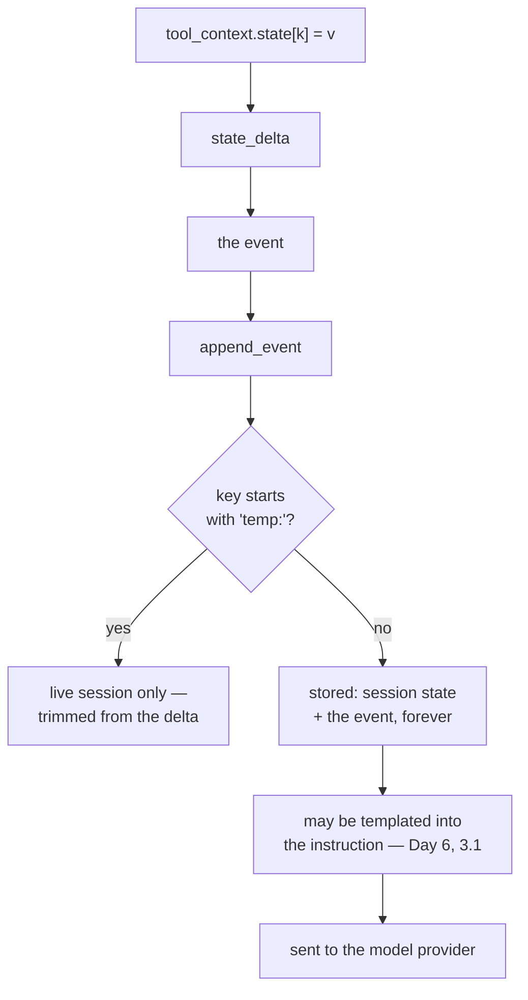

# 2.3 — What not to put on the noticeboard

## One-line answer

Everything a tool writes to state goes into an event, and events are the run's permanent record — so
state takes **handles, not payloads**, never a secret, and anything genuinely temporary goes under the
`temp:` prefix, which ADK strips from the event before it is stored.

---

## The story

The noticeboard by the lift in an apartment building.

It starts sensibly. The plumber's number. A notice about the water tank being cleaned on Sunday. Then
somebody pins up the whole society meeting agenda, four pages, stapled. Then somebody pins up the
defaulters list, with flat numbers and amounts, because they are annoyed. Then a lost-and-found note,
a tuition advertisement, a second copy of the tank notice.

Three things happen, and every one of them is worth understanding.

**Nothing comes down.** There is no rule about taking things down, so the board is now a record of
everything anybody has ever wanted said, in no order.

**Everyone walking past reads it, including people you did not have in mind.** The defaulters list was
aimed at four people and was read by two hundred, plus the delivery boys, plus a visitor who
photographed it.

**Finding the plumber's number now takes a minute.** The useful thing did not get worse; it got
buried.

Session state is that board, with one difference that makes it more serious: **every note is also
photocopied into a file that is kept forever**, because a state write is an event, and events are
history.

---

## The idea in plain language

[2.1](2.1-writing-on-the-carbon-copy.md) established the mechanism: a state write goes into
`state_delta`, the delta rides on the event carrying your tool's result, and the session service
applies it. Three consequences follow, and this part is those three consequences turned into rules.

### Rule 1 — handles, not payloads

Every byte you put in state is a byte in an event, and events are stored. Write the knowledge-base
article and you have stored the article — once per call, forever, in the run's history, *in addition*
to it already existing in the knowledge base. Write the article's id and you have stored eleven
characters that can fetch it.

Measured below: the same information as a payload is **1615 bytes** of delta and as a handle is **27**.
Sixty times, on one write, on a small article.

The rule generalises past size. A handle is a reference to something that has its own lifetime and its
own place to live; a payload is a copy that will drift out of date and that nothing will ever clean up.
For actual bytes — a PDF, an image, a generated report — the right place is an **artifact**
([Day 8, part 3.4](../../../day-08-sessions-and-services/parts/03-the-services/3.4-the-cloakroom-and-the-one-you-were-not-given.md)),
and the handle you keep in state is its filename.

### Rule 2 — nothing secret, ever

A secret in state is a secret in an event, in storage, in whatever exports the session for
debugging, and — from Day 14 — in the trace you show somebody to explain a bug. That is Principle 9,
which so far has been about `.env` and `.gitignore`, arriving at runtime.

And there is a second path most people miss. Instructions are templated against state:
[Day 6, part 3.1](../../../day-06-instructions-and-personas/parts/03-the-instruction-fields/3.1-where-your-instruction-lands.md)
showed `{key}` in an instruction being replaced with the state value. **So a state key can end up in the
prompt**, which means it is sent to the model provider. A tool that caches an API token in
`state["token"]` has, with no further mistakes by anybody, created a path from your secret store to a
third party's logs.

What to write instead: nothing. If a later step needs a credential, it fetches it the same way the
first step did. If that is expensive, the cache belongs in a process-local variable, not in the
conversation's history.

### Rule 3 — `temp:` for scratch, and know what it does

ADK reserves three prefixes on state keys. Day 17 covers them properly; one of them matters today.

A key beginning `temp:` is **applied to the live session for the current invocation and then removed
from the event's delta before the event is stored.** ADK's own docstrings say so:

> *"Temp state is ephemeral: it lives in the session's in-memory state for the duration of the current
> invocation but is NOT persisted to storage (the event delta is trimmed separately by
> `_trim_temp_delta_state`)."*

That is exactly the note you write on the back of your hand rather than pinning to the board. Two
tools in one turn need to agree on something; nobody needs it tomorrow; it should not be in the
history. Verified below: `temp:scratch` appears in the live session state and is **absent from the
stored state and from the stored event's delta.**

Be precise about the limit, though. `temp:` controls **persistence**, not **visibility**. The key is in
the live session for the whole invocation, so anything reading state during that invocation — another
tool, a callback, a templated instruction — can see it. It is not a secret-safe compartment. Rule 2
still applies to `temp:` keys.

### The rule the three share

**State is a shared, permanent, readable surface.** Before writing a key, ask the question that applies
to a noticeboard: *does this need to be seen, by others, later?* Three yeses is a state key. One no is
a local variable.

---

## Why Sutra needs it

**Sutra's `search_kb`** is about to want to remember which article it returned so a follow-up question
has an antecedent. It will store `article_id`, not the article, and this part is why.

**Day 14** is observability, where sessions get exported and read by a person. Everything this part
tells you not to write is something that would then be on a screen in a shared meeting.

**Day 17** is the state deep dive: `app:`, `user:`, `temp:` and what each one survives.

**Day 22** is persistence, where "stored forever" stops being a figure of speech.

**Phase 14** makes the repository public. Habits formed now are the ones in the git history then.

---

## The mechanism

The same fact stored three ways, measured. **No model call, no cost:**

```python
# lab/noticeboard.py - what a state write costs, and the one prefix that opts out.
import asyncio
import json

from google.adk.agents import LlmAgent
from google.adk.agents.invocation_context import InvocationContext
from google.adk.events import Event, EventActions
from google.adk.sessions import InMemorySessionService
from google.adk.tools import ToolContext

ARTICLE = "Reinstall the VPN client, then restart. " * 40


async def run(writes: dict) -> None:
    """Apply `writes` from inside a tool, emit the event, and report what was stored."""
    service = InMemorySessionService()
    session = await service.create_session(app_name="sutra", user_id="u", state={})
    agent = LlmAgent(name="sutra_desk", model="gemini-3.7-flash", instruction="x")
    invocation = InvocationContext(
        session_service=service, invocation_id="inv-1", agent=agent, session=session
    )
    actions = EventActions()
    tool_context = ToolContext(invocation, event_actions=actions, function_call_id="fc-1")

    for key, value in writes.items():
        tool_context.state[key] = value

    before = json.dumps(actions.state_delta)
    event = Event(invocation_id="inv-1", author="sutra_desk", actions=actions)
    await service.append_event(session=session, event=event)
    stored = await service.get_session(app_name="sutra", user_id="u", session_id=session.id)

    print("  wrote        :", list(writes))
    print("  delta bytes  :", len(before), "before append")
    print("  delta after  :", json.dumps(event.actions.state_delta)[:60])
    print("  live state   :", sorted(session.state))
    print("  stored state :", sorted(stored.state))


async def main() -> None:
    print("payload in state:")
    await run({"article": ARTICLE})
    print()
    print("handle in state:")
    await run({"article_id": "kb-vpn-01"})
    print()
    print("scratch under temp::")
    await run({"article_id": "kb-vpn-01", "temp:scratch": "working note"})


asyncio.run(main())
```

**Line by line:**

- `ARTICLE = "..." * 40` — a deliberately *small* article, about 1.5 KB. Real knowledge-base articles
  are larger, and the point lands better when the example is modest than when it is chosen to shock.
- `run(writes: dict)` taking the writes as a parameter — three scenarios through one code path, so the
  only variable is what was written.
- A fresh service and session **per scenario**, so nothing leaks between them.
- `for key, value in writes.items(): tool_context.state[key] = value` — the writes go through the
  `State` object exactly as they would inside a tool, not directly into `session.state`. That is what
  makes the delta real.
- `before = json.dumps(actions.state_delta)` captured **before** `append_event` — because the append is
  what trims, and measuring afterwards would hide the cost of a payload that was already sent.
- `len(before)` as the size measure: bytes of JSON, which is roughly what a store holds and what a
  network hop carries. Not exact, and the ratio is the finding, not the absolute number.
- `Event(invocation_id=..., author=..., actions=actions)` built by hand with no content — ADK builds
  this for you from `tool_context.actions`
  ([2.1](2.1-writing-on-the-carbon-copy.md)). Here it is constructed directly so the append can be
  watched.
- `append_event` then `get_session` — the round trip. `get_session` returns what the service would give
  the next turn, which is the only honest definition of "stored".
- `sorted(session.state)` and `sorted(stored.state)` printed **side by side** — the two lines whose
  difference is the entire `temp:` mechanism. Sorted so the comparison is positional rather than
  lucky.
- `[:60]` on the delta — enough to identify it, not enough to fill the terminal with the article.

The output:

```text
payload in state:
  wrote        : ['article']
  delta bytes  : 1615 before append
  delta after  : {"article": "Reinstall the VPN client, then restart. Reinsta
  live state   : ['article']
  stored state : ['article']

handle in state:
  wrote        : ['article_id']
  delta bytes  : 27 before append
  delta after  : {"article_id": "kb-vpn-01"}
  live state   : ['article_id']
  stored state : ['article_id']

scratch under temp::
  wrote        : ['article_id', 'temp:scratch']
  delta bytes  : 59 before append
  delta after  : {"article_id": "kb-vpn-01"}
  live state   : ['article_id', 'temp:scratch']
  stored state : ['article_id']
```

**1615 against 27.** Same information available to the next turn, sixty times the storage, on one write.

And the third block is the one to read twice. `temp:scratch` is in `live state` — a tool later in this
same turn can read it — and it is in neither `stored state` nor the appended event's delta. It existed
exactly as long as it was useful.



That bottom path is Rule 2 drawn out: state → instruction → provider, with no further mistake required.

---

## When it breaks

**💥 The secret that reached the provider.**

There is no error and there never will be. A tool writes `state["api_token"] = token`; an instruction
somewhere contains `{api_token}` — or, more realistically, a later day adds a debugging instruction
that dumps state; the token is now in a prompt. The way you find out is a provider's data-retention
policy or somebody's screen share. **Rotate it and remove the write**, and note that removing the write
does not remove it from the events already stored.

**💥 The session that grew until it was slow.**

```text
google.api_core.exceptions.InvalidArgument: 400 Request payload size exceeds the limit
```

A tool that writes a payload into state on every call, in a long conversation, on a service that loads
the whole session. The failure arrives late, far from the write, and looks like a model problem.

**💥 `temp:` mistaken for private.**

No error. `temp:scratch` holds something you did not want the model to see, an instruction templates
part of state, and it goes into the prompt — because `temp:` is applied to the live session for the
whole invocation, exactly as the output above shows. `temp:` opts out of **storage**, not out of
**visibility**.

**💥 The key nobody owns.**

```python
tool_context.state["result"] = ...
```

Not an error, and it is the noticeboard problem in one word. Two tools both write `result`; the second
overwrites the first; the bug is a wrong answer several steps later. Namespace shared state by what
wrote it and what it means — `kb_article_id`, not `result` — which is
[2.2](2.2-reading-what-you-did-not-fetch.md)'s naming point arriving from the writing side.

---

## In production

**What a professional writes instead of the teaching version** is a short list of state keys, written
down in the module that owns them, with a one-line comment each. Not a schema yet — Day 17 has that —
just a list, because the failure mode this prevents is nobody knowing what is on the board. A team
that cannot enumerate its state keys has a shared mutable global with no declaration, which is the
thing every other part of the codebase would refuse to ship.

**What degrades at scale** is retention. Every stored session holds every state delta ever applied to
it. That is wonderful for debugging and it is a liability the moment any of it is personal: a ticket
description, an email address, a phone number written into state "for convenience" is now personal
data with an unbounded lifetime and no deletion path. The engineering question — *can we delete a
user's data?* — becomes very hard to answer yes to if the answer requires rewriting event history.
**Handles help here too**: deleting a knowledge-base row is easy, deleting every copy of its text
scattered through a year of events is not.

**The failure that only shows with real traffic** is the growth curve. In development a session is five
turns and a payload write costs nothing measurable. In production a support conversation runs for
weeks, with dozens of turns, and each one appends. Nothing is wrong on any individual turn — which is
why this is never caught in review — and the graph that eventually shows it is storage cost or
latency, not correctness.

**The review comment a senior engineer leaves:** *"We're putting the whole article into state, so it's
in the event delta and in storage on every single call, and the article already exists in the KB. Store
`article_id`. The scratch value on line 40 doesn't need to outlive the turn — put it under `temp:` so
it doesn't get persisted. And nothing with a token in the name goes into state at all; state gets
templated into instructions, so that's a straight line from our secret store to a provider's logs."*

**The interview question:** *"what shouldn't go into agent state?"* The answer that shows you have
cleaned one up: "Three things. Payloads — anything large or already stored elsewhere — because every
state write becomes an event delta and events are permanent history, so you're storing a second copy
with no lifecycle. Store the id, or for actual bytes use the artifact service and store the filename.
Secrets, absolutely never, and the path people miss is that instructions get templated against state,
so a token in state can end up in a prompt and therefore at the provider. And anything that doesn't
need to outlive the turn — that's what the `temp:` prefix is for: the framework applies it to the live
session and trims it out of the event delta before storage. The one caveat is that `temp:` is about
persistence, not privacy — it's still readable by everything else running in that invocation. The test
I use is the noticeboard test: does this need to be seen, by others, later? If any of those three is
no, it's a local variable."

---

## Check yourself

```bash
uv run python days/day-11-tool-context/lab/noticeboard.py
```

Then add a fourth scenario writing `{"temp:article": ARTICLE}` and confirm the delta bytes are large
before the append and the stored state is empty after it — the cost is paid on the way in either way.

**Answer out loud, without scrolling up:**

> Give the three rules and the one question that generates all of them. Then say the two things `temp:`
> protects you from and the one thing it does not.

---

**Next:** [3.1 — One tool, one job](../03-designing-a-tool/3.1-one-tool-one-job.md)
