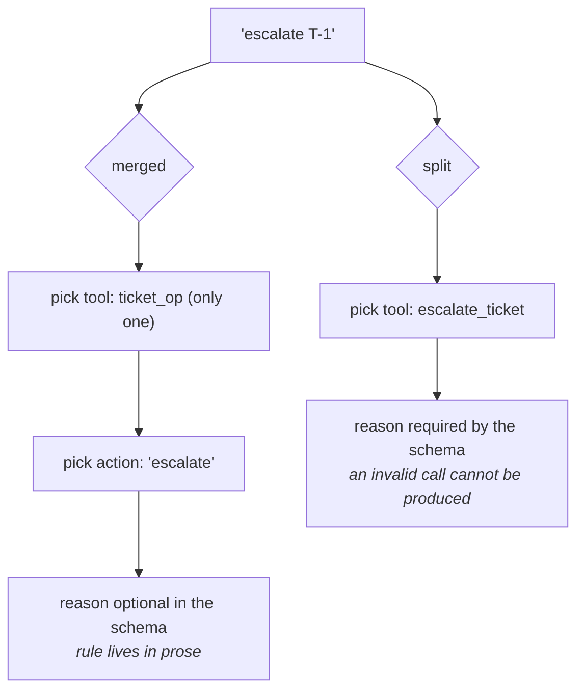

# 3.1 — One tool, one job

## One-line answer

A tool that takes an `action` or `mode` parameter has smuggled a second decision into the model's
turn, and worse, it has thrown away the schema's ability to say what is required — split it, and the
declarations barely cost more.

---

## The story

A friend's kitchen has one of those all-in-one machines.

It grinds, it blends, it juices, it kneads dough. There are three jars, two blades, a plastic pusher,
and a dial with numbers on it that mean different things depending on which jar is fitted. The manual
is a folded sheet with a table on it.

You want to grind some coffee. You have to work out which jar, which blade, and which number on the
dial — and the number is the interesting one, because the same setting that grinds coffee correctly
turns a jar of tomatoes into a fine mist. Nothing on the machine stops you. The dial does not know
which jar is fitted.

Downstairs, the same friend has a coffee grinder. One jar, no blades to choose, one button. It has
never once produced tomato mist.

The all-in-one is not badly made. It is a machine that requires the operator to hold a rule the machine
itself cannot enforce, and that rule lives on a folded sheet of paper in a drawer.

That is a tool with a `mode` parameter, and the folded sheet is your docstring.

---

## The idea in plain language

The temptation is real and it comes from ordinary good instincts. You have `lookup_ticket` and
`escalate_ticket`, and they are both about tickets, and there will be a `close_ticket` soon, so why not:

```python
def ticket_op(action: Literal["lookup", "escalate"], ticket_id: str, reason: str = "") -> dict:
```

**Line by line:**

- `action: Literal[...]` — the closed set of modes, which becomes an `enum` in the schema. This is the
  *strongest* form of the merged tool, not a weak one.
- `ticket_id: str` — needed by both modes, so it can be required. Fine either way.
- `reason: str = ""` — needed by **one** mode, so it cannot be required, so it gets a default it does
  not deserve. That default is the whole subject of this part.

One tool, one place to change, less repetition. In a library used by programmers this would be a
matter of taste. Here it is not, for three specific reasons.

### One — you added a decision the model has to get right

Before: the model picks one of two tools. That choice is made against two names and two descriptions,
and the framework offers exactly the tools that exist.

After: the model picks the tool — trivial, there is only one — and then picks a *value*, from a
description it has to read carefully. The choice did not go away; it moved from a place the schema
describes well to a place it describes badly.

### Two — the schema can no longer say what is required

This is the sharp one, and it is visible in the output below.

`escalate` needs a reason. `lookup` does not. In one merged tool, `reason` **cannot** be required — a
`lookup` call would be invalid — so it gets a default, and the schema says:

```text
"required": ["action", "ticket_id"]
```

`reason` is optional. Always. The rule *"required for escalate"* now exists only as an English sentence
inside the description, enforced by nobody.

Split into two tools, `escalate_ticket` says:

```text
"required": ["ticket_id", "reason"]
```

and the model **cannot** produce a valid escalate call without a reason. That is not a documentation
improvement, it is a validity improvement:
[Day 4, part 1.1](../../../day-04-tools-by-hand/parts/01-the-schema/1.1-the-form-that-rejects-itself.md)'s
form that rejects itself, working again.

### Three — the description is now a table of exceptions

Look at what the merged docstring has to say:

> *"reason: why it is being escalated. Required for 'escalate', ignored for 'lookup'."*

That sentence is doing the job the schema used to do, in prose, in a blob the model reads once per
turn. And it is worse than it looks, because in ADK 2.7.1 **per-parameter descriptions are dropped
from the JSON schema entirely** — the properties carry only `title` and `type`
([Day 10, part 1.2](../../../day-10-function-tools/parts/01-the-form-fills-itself/1.2-the-docstring-is-the-description.md)).
So that clause survives only as part of the long description string. It is a note on a folded sheet in
a drawer.

### But doesn't one tool cost fewer tokens?

That is the usual defence and it is worth measuring rather than arguing. Measured below: the merged
tool is **791 characters** of declaration; the two split tools are **887**. Twelve per cent, not double
— because the merged tool has to spend in prose exactly what the split ones get from structure.

There is a real tension here and it deserves naming honestly. **Too many tools is also a problem**: every
declaration is sent on every turn, and a model choosing between thirty similarly-named tools chooses
badly. So "one tool, one job" is not "one tool per function you happen to have". The unit is a **job a
user would name**, and a desk that ends up with forty of them wants a different structure — sub-agents
with their own tools (Phase 4), or a toolset (Day 15) — not one tool with a dial on it.

### The test

**Write the docstring's one-line summary. If it needs "or", you have two tools.**

*"Look up a ticket, or escalate it"* fails. *"Read one support ticket"* passes.

---

## Why Sutra needs it

**Sutra's desk is about to grow verbs.** Day 10 gave it `lookup_ticket` and `search_kb`. Escalating,
closing, assigning and replying are all coming, and every one of them is a chance to add a dial instead
of a button.

**[3.4](3.4-two-tools-that-overlap.md)** is the opposite failure — tools split so finely that the model
cannot tell them apart. The two parts are a pair and neither rule survives alone.

**Day 25** is evaluation, and a tool with a mode needs a test per mode plus tests for the illegal
combinations. The split version needs neither.

**Day 64** is human-in-the-loop, where `escalate_ticket` gets a confirmation gate
([Day 10, part 4.2](../../../day-10-function-tools/parts/04-tool-shapes/4.2-are-you-sure.md)) and
`lookup_ticket` does not. **You cannot gate half a tool** — which is the argument that ends this
discussion in most teams.

---

## The mechanism

The same two capabilities, declared both ways. **No model call, no cost:**

```python
# lab/one_job.py - one tool with a mode, against two tools with one job each.
import asyncio
import json
from typing import Literal

from google.adk.agents import LlmAgent


def ticket_op(action: Literal["lookup", "escalate"], ticket_id: str, reason: str = "") -> dict:
    """Look up a ticket, or escalate it.

    Args:
        action: 'lookup' to read the ticket, 'escalate' to raise its priority.
        ticket_id: the ticket id, e.g. 'T-1'.
        reason: why it is being escalated. Required for 'escalate', ignored for 'lookup'.
    """
    return {"status": "ok"}


def lookup_ticket(ticket_id: str) -> dict:
    """Read one support ticket.

    Args:
        ticket_id: the ticket id, e.g. 'T-1'.
    """
    return {"status": "ok"}


def escalate_ticket(ticket_id: str, reason: str) -> dict:
    """Raise a support ticket's priority to urgent.

    Args:
        ticket_id: the ticket id, e.g. 'T-1'.
        reason: why it is urgent, in one sentence.
    """
    return {"status": "ok"}


async def declarations(*functions) -> None:
    agent = LlmAgent(name="a", model="gemini-3.7-flash", instruction="x", tools=list(functions))
    total = 0
    for tool in await agent.canonical_tools():
        declaration = tool._get_declaration()
        text = json.dumps(
            {
                "name": declaration.name,
                "description": declaration.description,
                "parameters": declaration.parameters_json_schema,
            },
            indent=2,
        )
        total += len(text)
        print(text)
        print()
    print(f"--- {len(functions)} tool(s), {total} chars of declaration ---")
    print()


async def main() -> None:
    await declarations(ticket_op)
    await declarations(lookup_ticket, escalate_ticket)


asyncio.run(main())
```

**Line by line:**

- `Literal["lookup", "escalate"]` — the best possible version of the merged tool. It becomes an `enum`
  in the schema, so the model cannot invent a third action. Arguing against the *weak* version would
  prove nothing; this is the strong one and it still loses.
- `reason: str = ""` — the default is **forced**, not lazy. A merged tool cannot make `reason` required
  without breaking `lookup`, and that is the entire finding.
- Three docstrings written to the same standard — the merged one is longer because it has more to say,
  not because it was written worse.
- `declarations(*functions)` taking a varargs list so the same code path prints one tool or two, and
  the character totals are comparable.
- `json.dumps(..., indent=2)` over name, description and schema together — the three things actually
  sent to the provider, and nothing else. Printing the whole `FunctionDeclaration` object would bury
  the finding in repr noise.
- `len(text)` accumulated into `total` — characters, not tokens. Tokens are model-specific and would
  need a tokenizer; characters are a fair proxy for a ratio, and the ratio is the point.
- `return {"status": "ok"}` in all three bodies — [Day 10, part 2.1](../../../day-10-function-tools/parts/02-what-a-tool-returns/2.1-return-a-dict-with-a-status.md)'s
  shape, and deliberately trivial: nothing here executes, this script is about declarations.

The output, trimmed to the two lines that matter:

```text
--- 1 tool(s), 791 chars of declaration ---
--- 2 tool(s), 887 chars of declaration ---
```

and, inside them, the pair worth reading side by side:

```text
ticket_op        "required": ["action", "ticket_id"]
escalate_ticket  "required": ["ticket_id", "reason"]
```

The merged tool **cannot** require a reason. The split tool does, and the model's own output format now
enforces the business rule that used to be a sentence.

Note also what the merged tool's properties look like:

```text
"reason": { "default": "", "title": "Reason", "type": "string" }
```

No description. In this ADK version per-parameter descriptions do not reach the schema, so *"required
for 'escalate'"* exists only in the long description blob — which is exactly the folded sheet in the
drawer.



---

## When it breaks

**💥 The escalation with no reason.**

```text
{"action": "escalate", "ticket_id": "T-1"}
```

A schema-valid call. Every validator passes it. Your function receives `reason=""` and now has to
decide: fail, or escalate a ticket with no reason recorded. Both answers are bad, and the reason both
answers are bad is that the check should have happened one layer earlier —
[Day 4, part 4.1](../../../day-04-tools-by-hand/parts/04-the-limits/4.1-validated-is-not-correct.md),
arriving from the direction of your own design rather than the model's.

**💥 The mode that ignores half its arguments.**

```python
def ticket_op(action, ticket_id, reason="", assignee="", close_code=""):
```

Four modes in, and every call carries three empty strings. The model now has five parameters to reason
about on every call, of which two matter. Accuracy on the ones that matter drops, and there is no error
to point at — just a tool that gets it wrong more often than the split version would.

**💥 The gate you cannot attach.**

```python
tools = [ticket_op]  # and escalation needs human approval
```

`require_confirmation` is a property of a **tool**
([Day 10, part 4.2](../../../day-10-function-tools/parts/04-tool-shapes/4.2-are-you-sure.md)). There is
no *"confirm only when `action == 'escalate'`"*. So you either gate reads as well — irritating everyone
— or you write the confirmation by hand inside the function, which means your containment story is now
custom code rather than a framework guarantee. **Blast radius is per tool** (Principle 13), and merging
tools merges their blast radii.

---

## In production

**What a professional writes instead of the teaching version** is one tool per thing a user would ask
for, named as the user would say it, and — where several of them genuinely share machinery — one plain
private function underneath that all of them call. The repetition people are trying to avoid by merging
is real, and the place to remove it is the implementation, not the interface. `lookup_ticket` and
`escalate_ticket` can both be four lines over a shared `_fetch(ticket_id)`.

**What degrades at scale** is the enum. A merged tool starts with two actions and reaches nine, because
adding a value to a `Literal` is a one-line diff and adding a tool feels like a decision. By then the
description is a specification, half the parameters are conditional, the return shape is a union of
nine dictionaries, and the tests are a matrix. **The merge is cheap at every individual step and
expensive in aggregate**, which is the signature of an anti-pattern rather than a trade-off.

**The failure that only shows with real traffic** is mode confusion on ambiguous phrasing. In testing
you say "escalate T-1" and it escalates. In production somebody says *"can you look at T-1, it's
getting urgent"* — and the model picks `lookup` or `escalate` depending on the day. With two tools that
is still a hard call, but the two descriptions are competing on their own merits and the model is
choosing between two well-described things. With one tool the choice is made inside a parameter whose
description was truncated into a blob, and the failure is silent: a ticket that was supposed to be
escalated was merely read, and nobody finds out until the customer calls again.

**The review comment a senior engineer leaves:** *"Split `ticket_op`. Right now `reason` can't be
required in the schema because `lookup` doesn't need it, so 'escalation needs a reason' is a sentence in
a docstring instead of a constraint the model can't violate. Two tools also let us put a confirmation
gate on escalation without gating reads. If the bodies overlap, share a private helper — that's the
duplication you're actually worried about."*

**The interview question:** *"how do you decide where one tool ends and the next begins?"* The answer
that shows you have maintained a toolset: "One job per tool, where a job is something a user would name
— and the test I use is whether the one-line summary needs the word 'or'. The reason it matters more
here than in a normal library is the schema. A tool with an `action` parameter can't mark the arguments
that only some actions need as required, so a business rule like 'escalation needs a reason' degrades
from something the model literally can't violate into a sentence in a description — and in ADK today
per-parameter descriptions don't even reach the schema, so it's in one long blob. You also lose
per-tool controls: confirmation gates and permissions attach to a tool, not to a branch inside one. The
counter-pressure is real, though — declarations cost tokens on every turn and a model choosing between
thirty tools chooses badly — so past a certain number the answer isn't a mode parameter, it's sub-agents
or a toolset."

---

## Check yourself

```bash
uv run python days/day-11-tool-context/lab/one_job.py
```

Then add a third action, `"close"`, with a `close_code: str = ""`, and watch what happens to the
description and to `required`.

**Answer out loud, without scrolling up:**

> Say the one-word test for whether a tool is doing two jobs. Then give the schema-level reason a mode
> parameter is worse than two tools, and one thing you cannot attach to half a tool.

---

**Next:** [3.2 — Name it for the model](3.2-name-it-for-the-model.md)
