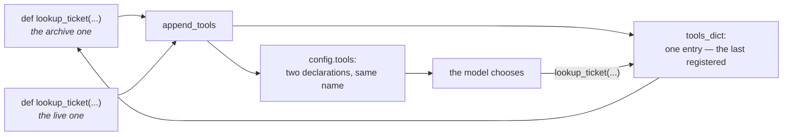

# 3.2 — Name it for the model

## One-line answer

The Python function's `__name__` is sent to the model verbatim as the tool's name, ADK validates
nothing about it — not spaces, not duplicates — and two tools sharing a name means both declarations
are advertised while only the last one can ever be called.

---

## The story

The switchboard by the front door of most flats.

Six switches in a row, no labels. You have lived here two years, so you know the second one is the
fan and the fourth is the porch, and you find the others by trying. A guest asking to turn on the
kitchen light will get the bathroom exhaust first, every time, and then apologise.

At some point somebody in the building started writing on them with a marker. Little words above each
switch: *fan*, *porch*, *stairs*, *kitchen*. The switches did not change. The wiring did not change.
What changed is that a person who has never been in the room before now gets it right on the first
try.

And you can watch the labelling go wrong in a specific way, too, in offices where somebody did the job
half-heartedly: *Light 1*, *Light 2*, *Light 3*. Labelled, technically. Completely useless, because the
labels describe the switchboard rather than the room.

A model reading your tool names is the guest at the switchboard. It has never been in this room.

---

## The idea in plain language

Three facts, and the third one is the surprise.

### One — the name is the function's name

You never write the tool name anywhere. ADK takes `func.__name__` and sends it. Which means:

**A rename is a prompt change.** Renaming `lookup_ticket` to `fetch_ticket_record` in a tidy-up diff
alters what the model reads, alongside
[Day 10, part 1.2](../../../day-10-function-tools/parts/01-the-form-fills-itself/1.2-the-docstring-is-the-description.md)'s
finding that the docstring is the description. Two of the three things the model uses to choose a tool
are things a refactoring tool will happily change without comment.

### Two — the name is the model's first filter

The model sees a list of names and a paragraph each. It reads the names first and cheaply, and the
description second and more expensively. A precise name means the description is confirming a decision
rather than making it.

The rules are boring and they all come from one idea — **name it in the caller's vocabulary, not the
system's**:

| Instead of | Write | Why |
| --- | --- | --- |
| `get_data`, `process`, `run_query` | `lookup_ticket` | says nothing about *what*; there are twenty of these in every codebase |
| `tkt_lkp`, `esc_tkt` | `lookup_ticket`, `escalate_ticket` | abbreviations are a cost paid by the reader, and the reader is a model that has never seen your team's shorthand |
| `zendesk_ticket_by_id` | `lookup_ticket` | names the vendor, not the job; the model does not care which system it is and the name changes when the vendor does |
| `ticket_v2` | `lookup_ticket` | version numbers are an implementation detail leaking into the prompt |
| `handle_escalation_workflow` | `escalate_ticket` | "handle" and "workflow" carry no information; three words where two are clearer |

**Verb then noun, in the words a user would say.** A support agent says "look up the ticket" and
"escalate it", so `lookup_ticket` and `escalate_ticket`. Nobody at a support desk says "process the
ticket entity".

### Three — nothing validates any of this

This is the part worth being slightly alarmed by. ADK accepts, without a word:

```text
python name 'get data'         -> declared as 'get data'
python name 'lookup-ticket'    -> declared as 'lookup-ticket'
python name '1lookup'          -> declared as '1lookup'
```

A space. A hyphen. A leading digit. Whether a provider accepts those is the provider's business, and
you find out at request time — after the network hop, at the cost of a request.

**And duplicates are not an error either.** Two tools with the same name: ADK logs a warning and
carries on, both declarations go to the model, and only the last one registered can ever be dispatched
to. Its own warning says it plainly:

```text
WARNING Duplicate tool name 'lookup_ticket': the previously registered tool is shadowed and can no
longer be called.
```

A warning is better than silence — earlier versions had less — and it is still a `logging.warning` in
a run that is otherwise producing output, which is to say it is a line most people will not see.

---

## Why Sutra needs it

**Sutra's tool names are its public interface to every model it ever uses.** Day 9 established that the
provider can change with one string
([Day 9, part 1.1](../../../day-09-four-free-providers/parts/01-one-model-field/1.1-a-name-is-a-lookup.md));
names good enough for a strong model and names good enough for a small free-tier one are not always the
same list, and precision costs nothing.

**Day 15** brings toolsets and third-party tools whose names you did not choose, and MCP servers on
Day 33 bring names chosen by somebody else entirely. Knowing that a name is a prompt is what makes
renaming them at the boundary an obvious move rather than a strange one.

**Day 31** is the quality gate. A lint over `agent.tools` asserting names are unique and match
`^[a-z][a-z0-9_]{0,63}$` is a few lines and turns a request-time failure into an import-time one.

---

## The mechanism

Names ADK will happily send, and what a duplicate does. **No model call, no cost:**

```python
# lab/names.py - the function name is the tool name, and nothing checks it.
import asyncio
import logging

from google.adk.models.llm_request import LlmRequest
from google.adk.tools import FunctionTool

logging.basicConfig(format="%(levelname)s %(message)s")


def make(name: str, summary: str):
    """Build a one-argument tool carrying `name` and `summary`."""

    def tool(ticket_id: str) -> dict:
        return {"status": "ok"}

    tool.__name__ = name
    tool.__doc__ = f"{summary}\n\nArgs:\n    ticket_id: the ticket id.\n"
    return FunctionTool(tool)


print("--- the name ADK sends is the function's __name__ ---")
for name in ("lookup_ticket", "get data", "lookup-ticket", "1lookup"):
    print(f"  python name {name!r:<18} -> declared as {make(name, 'x').name!r}")

print()
print("--- two tools, one name ---")
request = LlmRequest()
request.append_tools(
    [
        make("lookup_ticket", "Read one support ticket."),
        make("lookup_ticket", "Read one archived ticket."),
    ]
)
advertised = [d.name for d in request.config.tools[0].function_declarations]
print("  declarations sent to the model:", advertised)
print("  names ADK can dispatch to     :", list(request.tools_dict))
survivor = request.tools_dict["lookup_ticket"]
print("  the one that wins             :", survivor.description)
```

**Line by line:**

- `logging.basicConfig(format=...)` at the top — without it, ADK's duplicate warning goes to the root
  logger with no handler and prints in a form that is easy to mistake for noise. Configuring logging is
  how you make the framework's warnings visible, which is a habit worth having before Day 14.
- `make(name, summary)` building the function **inside** and then setting `__name__` and `__doc__` —
  the only way to generate several differently-named tools without writing several near-identical
  functions. In product code you would never assign `__name__`; here it isolates the variable.
- `tool.__doc__` built with a real `Args:` block, because
  [Day 10, part 1.3](../../../day-10-function-tools/parts/01-the-form-fills-itself/1.3-type-hints-are-the-schema.md)
  showed the docstring is parsed, and a tool with a malformed one would be a different experiment.
- `FunctionTool(tool)` directly rather than through an `LlmAgent` — this part is about the name, and
  `FunctionTool` is where the name is read. Fewer moving parts, same answer.
- The four names chosen to break four different rules: a space, a hyphen, a leading digit, and one
  correct one as a control.
- `LlmRequest()` and `request.append_tools([...])` — the exact call ADK makes when assembling a request.
  This is the real code path, not a simulation of it: `append_tools` is what fills both
  `config.tools` and `tools_dict`.
- `request.config.tools[0].function_declarations` versus `request.tools_dict` — **the two lists that
  disagree.** One is what the model is told exists; the other is what ADK can actually call. Printing
  them adjacently is the whole point of the second half.
- `survivor.description` printed — so "the last one wins" is demonstrated by reading its text rather
  than asserted.

The output:

```text
--- the name ADK sends is the function's __name__ ---
  python name 'lookup_ticket'    -> declared as 'lookup_ticket'
  python name 'get data'         -> declared as 'get data'
  python name 'lookup-ticket'    -> declared as 'lookup-ticket'
  python name '1lookup'          -> declared as '1lookup'

--- two tools, one name ---
WARNING Duplicate tool name 'lookup_ticket': the previously registered tool is shadowed and can no longer be called.
  declarations sent to the model: ['lookup_ticket', 'lookup_ticket']
  names ADK can dispatch to     : ['lookup_ticket']
  the one that wins             : Read one archived ticket.

Args:
    ticket_id: the ticket id.
```

Read the two middle lines together. **Two declarations advertised, one name dispatchable.** The model is
told, twice, that a tool called `lookup_ticket` exists — with two different descriptions — and whichever
one it thinks it is choosing, it gets the archived-ticket implementation.



---

## When it breaks

**💥 The duplicate that only warns.**

```text
WARNING Duplicate tool name 'lookup_ticket': the previously registered tool is shadowed and can no
longer be called.
```

The realistic way this happens is not two functions with the same name in one file — that is a Python
error. It is two *modules*, each exporting a `search`, both added to `tools`. Or a toolset from Day 15
whose fetched names collide with yours. The symptom is a tool that "stopped being called", and the
cause is a warning line in a log nobody tails.

**💥 The name the provider rejects.**

ADK sends `get data` cheerfully. What the provider does with it is the provider's business and it
happens after the network hop. Look it up rather than trusting a memory of the rule:

```text
TODO(me): confirm the function-name constraint your provider enforces, then add a row to docs/PACKAGES.md.
  Command: uv run python -c "import webbrowser; webbrowser.open('https://ai.google.dev/gemini-api/docs/function-calling')"
  Then run one real call with a deliberately bad name and paste the verbatim error here.
```

Until that is filled in, the safe rule is the intersection everybody agrees on: lower case, letters,
digits and underscores, starting with a letter.

**💥 The rename that changed behaviour.**

No error, and no diff that looks like a prompt change:

```python
-def lookup_ticket(ticket_id: str) -> dict:
+def fetch_ticket_record(ticket_id: str) -> dict:
```

A perfectly ordinary refactor. The model's tool list changed, and if `fetch_ticket_record` is a worse
name than `lookup_ticket` — it is: "record" is a database word, "fetch" is a programmer's word — then
tool-selection accuracy drops slightly for reasons no reviewer will connect to this diff. **Treat tool
names like public API names**, because they are.

---

## In production

**What a professional writes instead of the teaching version** is a naming convention chosen once and
applied by lint: `verb_noun`, lower snake case, no vendor names, no versions, no abbreviations outside
a short agreed list. The convention matters less than its existence — the value is that all thirty
tools read as one vocabulary rather than thirty authors' habits, which is what lets a model tell them
apart.

**What degrades at scale** is name similarity. Two tools are easy. At twenty, you have `search_kb`,
`search_tickets`, `search_archive` and `find_article`, and the model has to distinguish them from names
that share a prefix and a paragraph that shares a shape. Selection accuracy falls, and the fix is not a
better description — it is fewer tools in front of the model at once, which is what sub-agents (Phase
4) and toolsets (Day 15) are for. [3.4](3.4-two-tools-that-overlap.md) is this failure at close range.

**The failure that only shows with real traffic** is the shadowed duplicate on a rarely used path. Both
tools are registered at import, the warning fires once at startup into a log with a hundred other lines,
and everything works — because in testing the two implementations do nearly the same thing. Then one
of them is changed. Now the model asks for a live ticket, gets the archive implementation, and returns
a stale answer with complete confidence. There is no error anywhere in the trace, because from ADK's
point of view the correct tool for that name ran.

**The review comment a senior engineer leaves:** *"`get_ticket_data` doesn't say what it does — it's
'get' plus a noun plus 'data', which is three words carrying one word of meaning. Call it
`lookup_ticket`. And we now have two modules each exporting `search`; ADK logs a warning and silently
keeps the last one, so add the uniqueness check to the startup assertion rather than relying on
someone reading the log."*

**The interview question:** *"how much does a tool's name matter?"* The answer that shows you have
shipped one: "It's a prompt, not an identifier. The framework sends the Python function's name straight
to the model, so it's the first thing the model filters on — before the description, which is more
expensive to read. That means renames in a refactor are prompt changes, and names should be in the
user's vocabulary rather than the database's: `lookup_ticket`, not `get_ticket_data` or
`zendesk_ticket_by_id`. The thing that surprised me is how little is validated — ADK will happily
declare a tool called `get data` with a space in it and let the provider reject it at request time, and
two tools with the same name only produce a log warning: both declarations are advertised to the model
and only the last-registered one can actually be dispatched to. So I'd put a uniqueness and format
check in the test suite, because both failures are free to catch at import and expensive to catch in
production."

---

## Check yourself

```bash
uv run python days/day-11-tool-context/lab/names.py
```

Then swap the order of the two duplicates and confirm the *other* description wins.

**Answer out loud, without scrolling up:**

> Say where a tool's name comes from and what a rename changes. Then say what happens when two tools
> share a name — both halves of it.

---

**Next:** [3.3 — Arguments the model can supply](3.3-arguments-the-model-can-supply.md)
