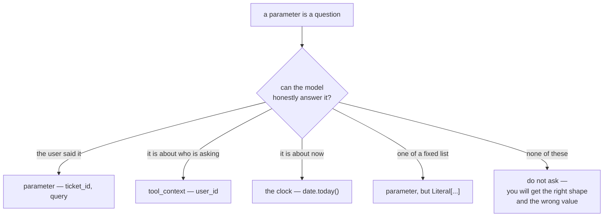

# 3.3 — Arguments the model can supply

## One-line answer

A parameter is a question you are asking the model, so only ask for things the conversation actually
contains — identity comes from the context, "now" comes from the clock, and closed sets come from a
`Literal`, because a required field with no available answer gets filled in anyway.

---

## The story

A school gives an eight-year-old a form to take home and bring back.

Most of it she can do. Name. Class. Section. Favourite subject. She writes those in careful capitals
and is quite pleased with herself.

Then there is a box that says *"Parent's employee code"*. She has no idea. The form does not say the
box is optional, her teacher said *fill in the form*, and there is a box, so she writes `123456`,
because six digits look like the right shape for a code and the box was there.

Nobody taught her to do that. It is what a cooperative person does with a required field and no
information: **produce something the right shape.** The alternative — leaving it blank and handing in an
incomplete form — feels like failing the task she was given.

A language model does exactly this, for exactly this reason, and it is very good at producing the right
shape.

---

## The idea in plain language

Every parameter in your tool's schema is a **question the model must answer** before it can call you.
So the design question is not *"what does my function need?"* — your function's needs are your problem —
it is **"can the model honestly answer this?"**

There are four kinds of answer, and only the first is a parameter.

### 1 — Things the user said. These are parameters.

`ticket_id="T-1"` because the user typed T-1. `query="vpn"` because they asked about the VPN. This is
the whole legitimate category: **information that exists in the conversation.**

### 2 — Things about who is asking. These come from the context.

`user_id`, the session, the tenant, the caller's permissions. The model does not know these, and a
model that appears to know them has read them off an earlier message, which is worse than not knowing.
They live on the context —
[1.3](../01-the-extra-parameter/1.3-one-card-several-doors.md) —
and taking them from there is [4.2](../04-blast-radius/4.2-the-identity-a-tool-needs.md)'s subject and
the single most important instance of this rule.

### 3 — Things about now. These come from the machine.

A date, a timestamp, "the last 7 days". A model has no clock. Ask for `since: str` and you get a date
that is plausible, correctly formatted, and drawn from a prior about what "now" probably is. It will be
wrong in a way nothing detects, because the schema says `string` and it is a string.

Take a **relative** parameter — `days_back: int = 7` — and compute the date yourself. The user says
"this week", the model says `7`, and your code says `date.today() - timedelta(days=7)`. Everybody is
doing the part they can actually do.

### 4 — Things from a fixed list. These are parameters, but constrained.

`priority` is one of three values. Written as `str`, the schema says `"type": "string"` and the model
may send `"URGENT"`, `"P1"`, or `"very high"` — all reasonable, none of them yours. Written as
`Literal["normal", "high", "urgent"]`, the schema carries an `enum` and the choice is closed.

This is the cheapest quality improvement in tool design and it is one import:
[Day 10, part 1.3](../../../day-10-function-tools/parts/01-the-form-fills-itself/1.3-type-hints-are-the-schema.md)
established that the annotation is the schema; this is the annotation that does the most work.

### And then: ask for fewer

Every required parameter is a chance to be wrong. The measured version below goes from four required
parameters to two, and the two that left did not become optional — they **stopped being questions**.
One is answered by the context, one by the clock.

The habit: **a defaulted parameter is a question the model may skip.** If a sensible default exists, give
it one. `days_back: int = 7` means a user who did not mention a period costs the model no decision at
all.

---

## Why Sutra needs it

**Sutra's tools are about to take identity.** Day 10's `lookup_ticket` reads a public dictionary; a real
one must know whose ticket it is, and the difference between asking the model and reading the context
is the difference between a bug and a security bug —
[4.2](../04-blast-radius/4.2-the-identity-a-tool-needs.md).

**[3.4](3.4-two-tools-that-overlap.md)** is the neighbouring failure: the model choosing between two
tools rather than filling one badly.

**Day 25** is evaluation, where a tool with four free-text parameters needs a far larger test set than
one with two constrained ones — the space you have to check is the product of what each parameter can
be.

**Day 49** is retrieval, where `days_back` and its friends become real filters over real data and a
hallucinated date silently narrows a search to nothing.

---

## The mechanism

The same escalation tool, asked badly and asked well. **No model call, no cost:**

```python
# lab/arguments.py - which parameters a model can honestly fill in.
import asyncio
import datetime
import json
from typing import Literal

from google.adk.agents import LlmAgent
from google.adk.tools import ToolContext


def before(ticket_id: str, user_id: str, since: str, priority: str) -> dict:
    """Escalate a ticket.

    Args:
        ticket_id: the ticket id.
        user_id: the id of the user making the request.
        since: only consider activity after this date.
        priority: the new priority.
    """
    return {"status": "ok"}


def after(
    ticket_id: str,
    priority: Literal["normal", "high", "urgent"],
    days_back: int = 7,
    *,
    tool_context: ToolContext,
) -> dict:
    """Escalate a ticket.

    Args:
        ticket_id: the ticket id, e.g. 'T-1'.
        priority: the new priority.
        days_back: how far back to look at activity, in days.
    """
    since = datetime.date.today() - datetime.timedelta(days=days_back)
    return {"status": "ok", "user_id": tool_context.user_id, "since": str(since)}


async def show(function) -> None:
    agent = LlmAgent(name="a", model="gemini-3.7-flash", instruction="x", tools=[function])
    tool = (await agent.canonical_tools())[0]
    schema = tool._get_declaration().parameters_json_schema
    print(f"{function.__name__}:")
    print(json.dumps(schema["properties"], indent=2))
    print("  required:", schema.get("required"))
    print()


async def main() -> None:
    await show(before)
    await show(after)


asyncio.run(main())
```

**Line by line:**

- `before` and `after` implement the **same capability**, so the comparison is about what is asked for
  rather than about what the tool does.
- `before`'s four parameters are the natural first draft. Nothing about it is a straw man: every one of
  those four is something the function genuinely needs.
- `Literal["normal", "high", "urgent"]` — the closed set. Compare the `priority` property in the two
  outputs.
- `days_back: int = 7` replacing `since: str` — a **relative** number the model can reason about,
  instead of an absolute date it would have to invent. The default means it can also decline to answer.
- `*,` before `tool_context` — keyword-only, which is a small extra guarantee on top of
  [1.2](../01-the-extra-parameter/1.2-detected-by-type-not-by-name.md)'s convention: nothing can pass a
  context positionally by accident, and it can never be confused with a model-supplied argument.
- `tool_context: ToolContext` annotated and conventionally named, so both detection paths agree.
- **`user_id` is absent from `after`'s docstring** because it is absent from its parameters. The
  docstring documents what the model must supply, and `tool_context.user_id` is not that.
- `datetime.date.today()` inside the function — the clock, consulted by the only participant that has
  one.
- `show(function)` printing `properties` and `required` and nothing else — the two things that decide
  what the model is asked.

The output:

```text
before:
{
  "ticket_id": {
    "title": "Ticket Id",
    "type": "string"
  },
  "user_id": {
    "title": "User Id",
    "type": "string"
  },
  "since": {
    "title": "Since",
    "type": "string"
  },
  "priority": {
    "title": "Priority",
    "type": "string"
  }
}
  required: ['ticket_id', 'user_id', 'since', 'priority']

after:
{
  "ticket_id": {
    "title": "Ticket Id",
    "type": "string"
  },
  "priority": {
    "enum": [
      "normal",
      "high",
      "urgent"
    ],
    "title": "Priority",
    "type": "string"
  },
  "days_back": {
    "default": 7,
    "title": "Days Back",
    "type": "integer"
  }
}
  required: ['ticket_id', 'priority']
```

Four questions became two, and both survivors got easier.

Look hard at `before`'s `since`:

```text
"since": { "title": "Since", "type": "string" }
```

That is the employee-code box. `type: string`, no format, no pattern, no examples — and remember from
[3.1](3.1-one-tool-one-job.md) that the per-parameter description *"only consider activity after this
date"* does not reach the schema in this ADK version at all. The model is being asked for a date with
no clock and no format, and it will produce six digits of the right shape.



---

## When it breaks

**💥 The date from nowhere.**

No error, ever. The tool receives `since="2024-01-15"`, filters correctly, and returns fewer rows than
it should — or none. The agent reports honestly that it found nothing. The user believes it. This is
[Day 4, part 4.1](../../../day-04-tools-by-hand/parts/04-the-limits/4.1-validated-is-not-correct.md)'s
*validated is not correct* in its purest form: every layer did its job and the answer is wrong.

**💥 The priority that is not a priority.**

```text
KeyError: 'P1'
```

`priority="P1"` reaches your dictionary of allowed levels and raises. Loud, at least — and entirely
avoidable, because `Literal` would have made `"P1"` an invalid call the model could not produce.
Without the `Literal`, you are back to hand-validating, which is
[Day 4, part 5.2](../../../day-04-tools-by-hand/parts/05-containment/5.2-the-argument-a-schema-cannot-check.md)'s
territory and more code than an import.

**💥 The user id the model was helpful about.**

```text
{"ticket_id": "T-9", "user_id": "u-4471"}
```

Asked for a `user_id`, a model finds one — often correctly, from something earlier in the conversation,
which is what makes this so hard to spot in testing. Sometimes it is a different user's id, mentioned
in passing three turns ago, and now your tool has been asked to act as them. That is not a wrong
argument, it is an authorisation bypass with a friendly interface, and it is
[4.2](../04-blast-radius/4.2-the-identity-a-tool-needs.md).

**💥 The parameter the model omits because it cannot answer.**

```text
{"ticket_id": "T-1"}
```

The other half of the same coin. Faced with a required parameter it genuinely cannot answer, a model
sometimes declines rather than inventing — and then ADK hands your function a call missing a required
argument. Which is better! It is also a failed tool call the user experiences as the agent not working.

---

## In production

**What a professional writes instead of the teaching version** is a parameter list that reads like the
sentence a user would say. *"Escalate T-1 to urgent"* → `escalate_ticket(ticket_id, priority)`. If your
signature contains a word the user would never say — `tenant_id`, `cursor`, `include_deleted` — that
word came from your implementation, and implementations get their arguments from the environment, not
from the conversation.

**What degrades at scale** is free-text parameters meeting real data. `since: str` is harmless against a
dictionary of three tickets and quietly catastrophic against a real archive, where a slightly wrong
date is the difference between the right answer and a confident nothing. The general shape: **a
parameter the model invents is a filter you did not know you applied.** As the data grows, filters
matter more, so the same bug gets worse without anybody changing the code.

**The failure that only shows with real traffic** is the plausible identifier. In development every id
is `T-1` or `u-1` and a hallucinated one fails immediately, loudly, with a not-found. In production ids
are dense — most six-digit numbers are somebody's ticket — so an invented id **resolves**, to the wrong
record, and the tool returns a perfectly good answer about somebody else's problem. The density of your
identifier space decides whether hallucinated arguments fail loudly or silently, and nobody's test
fixture is dense.

**The review comment a senior engineer leaves:** *"Three of these four parameters aren't things the model
can know. `user_id` comes from `tool_context.user_id` — asking the model for it means whatever it says
becomes the identity we act on. `since` is a date and the model doesn't have a clock, so take
`days_back: int = 7` and compute it. And make `priority` a `Literal` so 'P1' can't be produced in the
first place rather than raising a `KeyError` in our code."*

**The interview question:** *"how do you choose a tool's parameters?"* The answer that shows you have
debugged one: "Every parameter is a question you're asking the model, so the test is whether the model
can honestly answer it. Things the user actually said are parameters. Identity isn't — that comes from
the invocation context, and asking the model for a user id means whatever it produces becomes the
identity you act on. Anything about the current time isn't either, because the model has no clock; take
a relative number with a default and compute the date yourself. And for closed sets use a `Literal` so
the enum reaches the schema and an invalid value can't be produced. The reason it matters more than it
looks is that a model given a required field it can't answer doesn't leave it blank — it produces
something the right shape. In development that fails fast because your test ids are sparse. In
production identifier spaces are dense, so an invented id resolves to the wrong record and you get a
confident, correct-looking answer about somebody else's data."

---

## Check yourself

```bash
uv run python days/day-11-tool-context/lab/arguments.py
```

Then change `priority` in `after` back to `str` and watch the `enum` disappear — one annotation, the
whole constraint.

**Answer out loud, without scrolling up:**

> Give the four kinds of thing a parameter could be, and say which one is a parameter. Then say why a
> hallucinated ticket id is more dangerous in production than in your tests.

---

**Next:** [3.4 — Two tools that overlap](3.4-two-tools-that-overlap.md)
