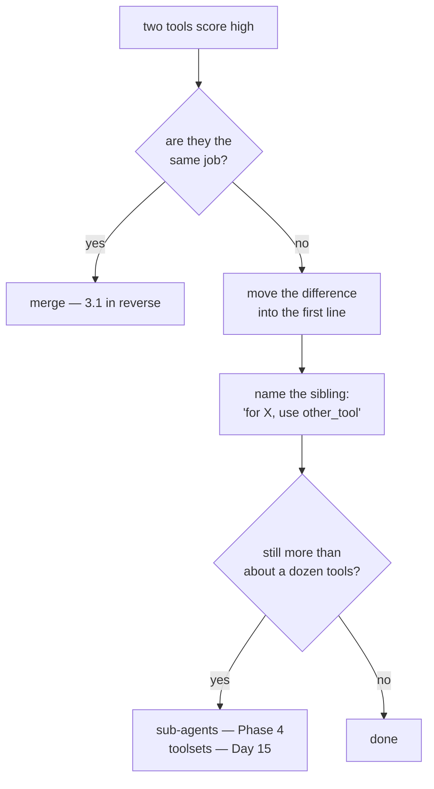

# 3.4 — Two tools that overlap

## One-line answer

[3.1](3.1-one-tool-one-job.md)'s rule pushed apart; this is the failure at the other end — two tools
whose descriptions could each be the other's, where the fix is not a longer description but a
**contrastive** one that names its sibling and says when *not* to use it.

---

## The story

Two small dropper bottles in the bathroom cabinet.

Same size, same white plastic, same little nozzle. One is for eyes and one is for ears. The printing on
both says the same six words in the same tiny font, and the only difference is one word about a third
of the way down, which you cannot read without your glasses, which are off, because you are about to
put drops in your eyes.

Somebody eventually solves this. Not by printing more information on the bottles — there is already
plenty — but by putting a strip of tape on one of them with **EYES** written on it in marker, and a
strip on the other saying **EARS — NOT EYES**.

That second label is the interesting one. It is not describing the bottle. It is describing the
**mistake**, and it works because the mistake is the actual problem. Nobody was confused about what ear
drops are.

Two tools with similar descriptions are those bottles, and a model is a person without their glasses on
every single time.

---

## The idea in plain language

[3.1](3.1-one-tool-one-job.md) said: split tools that do two jobs. Follow that rule mechanically and you
arrive here — twelve tools, several of which are nearly the same sentence, and a model that picks the
wrong one about a fifth of the time.

Both failures are real. **The rule is not "many tools" or "few tools", it is: every tool must be
distinguishable from every other tool, at the level of the name and the first line.**

### How to tell you have the problem

Not by intuition. Two cheap signals:

**The swap test.** Take two tools' descriptions and swap them. If both still read as plausibly correct,
the model has nothing to go on either. *"Search the support knowledge base for an article about a
problem"* and *"Search the knowledge base and return a support article for a problem"* pass the swap
test, which is to say they fail.

**A word-overlap number.** Crude, deterministic, free, and it runs in a test. Measured below: the two
sentences above share **0.69** of their words. Anything over about half is worth looking at by hand.

### The three fixes, in order of preference

**1. Merge them.** If two tools score high because they *are* the same job, the answer is
[3.1](3.1-one-tool-one-job.md) in reverse. `search_kb` and `find_article` are one tool. Delete one.

**2. Make the boundary the first line.** If they are genuinely different, the difference belongs in the
**summary line**, not in paragraph three. Not *"Search the knowledge base (retired products)"* but
*"Articles for withdrawn products only."* The first thing said is the thing that distinguishes.

**3. Name the sibling, and say when not to use this one.**

> *"Never use this for something still on sale; use `search_current_kb` instead."*

This is the strip of tape. It is under-used and it is the single most effective change, because it
addresses the confusion directly rather than hoping a better description prevents it. A tool
description may absolutely refer to another tool by name — the model has both in front of it.

### The measurement trap

Here is where it gets interesting, and the output below shows it.

Rewrite the pair properly, cross-referencing each other, and the **whole-description** overlap barely
moves: 0.78 down to 0.74. Because you deliberately put the other tool's name and subject in each
description, the naive metric counts your fix as more similarity.

Measure the **summary line only** and it drops from 0.69 to 0.38.

The lesson generalises past this script. **A metric that punishes the fix is measuring the wrong thing.**
The model's first-pass discrimination happens on names and opening lines; the body is where you put the
disambiguation. So the check belongs on the first line, and the body is allowed — encouraged — to look
similar.

### The ceiling

Past a certain number, no amount of writing helps. Twenty tools with genuinely distinct jobs still means
twenty declarations in every request and twenty candidates to rank. The structural answers are
**sub-agents**, each with a small toolset (Phase 4), and **toolsets** that expose different tools in
different situations (Day 15). Writing is the fix up to about a dozen; past that, architecture is.

---

## Why Sutra needs it

**Sutra will accumulate search-shaped tools.** Tickets, knowledge base, past conversations, and from
Day 49 a retriever. Four tools whose one-line summaries all begin *"Search…"* is a completely realistic
place to end up by accident.

**Day 15** brings third-party tools with descriptions you did not write, which is where the overlap
check earns its place — you cannot fix what you cannot notice.

**Day 25** is evaluation, where "the model picked the wrong tool" becomes a number instead of an
impression.

**Day 31** is the quality gate: the summary-line overlap check below is about fifteen lines, needs no
network, and turns a vague worry into a red test.

---

## The mechanism

Two overlapping tools, and the same pair rewritten. **No model call, no cost:**

```python
# lab/overlap.py - a cheap, deterministic check for tools the model cannot tell apart.
import asyncio
import itertools
import re

from google.adk.agents import LlmAgent


def search_kb(query: str) -> dict:
    """Search the support knowledge base for an article about a problem.

    Args:
        query: what to look for.
    """
    return {"status": "ok"}


def find_article(query: str) -> dict:
    """Search the knowledge base and return a support article for a problem.

    Args:
        query: what to look for.
    """
    return {"status": "ok"}


def search_current_kb(query: str) -> dict:
    """Articles for products still on sale.

    Use this first. For withdrawn products, use search_retired_kb instead.

    Args:
        query: what to look for.
    """
    return {"status": "ok"}


def search_retired_kb(query: str) -> dict:
    """Articles for withdrawn products only.

    Never use this for something still on sale; use search_current_kb instead.

    Args:
        query: what to look for.
    """
    return {"status": "ok"}


def words(text: str) -> set:
    """The distinct lower-case words in `text`, ignoring punctuation."""
    return set(re.findall(r"[a-z]+", text.lower()))


def jaccard(a: set, b: set) -> float:
    """The fraction of the two word sets that is shared."""
    return len(a & b) / len(a | b)


async def overlaps(*functions) -> None:
    agent = LlmAgent(name="a", model="gemini-3.7-flash", instruction="x", tools=list(functions))
    tools = await agent.canonical_tools()
    for first, second in itertools.combinations(tools, 2):
        whole = jaccard(words(first.description), words(second.description))
        summary = jaccard(
            words(first.description.splitlines()[0]),
            words(second.description.splitlines()[0]),
        )
        flag = "  <-- too close" if summary > 0.5 else ""
        print(
            f"  {first.name:<20} vs {second.name:<20} "
            f"summary {summary:.2f}   whole {whole:.2f}{flag}"
        )
    print()


async def main() -> None:
    print("as first written:")
    await overlaps(search_kb, find_article)
    print("rewritten to contrast:")
    await overlaps(search_current_kb, search_retired_kb)


asyncio.run(main())
```

**Line by line:**

- `search_kb` and `find_article` written as two people would naturally write them, on different days,
  meaning the same thing. Neither is badly written on its own, which is the point: the problem only
  exists in the pair.
- `search_current_kb` / `search_retired_kb` — the rewrite. The distinguishing fact is the **whole first
  line** in both, and the second line names the sibling and forbids the confusion.
- `"Use this first."` in one and `"Never use this for..."` in the other — deliberately asymmetric. One
  tool is the default and the other is the exception, and saying so removes a decision entirely.
- `words(text)` using `re.findall(r"[a-z]+", ...)` after lower-casing — a deliberately dumb tokeniser.
  Stemming, stop words and embeddings would all be better and all need dependencies or a model; this
  needs neither and is good enough to rank pairs.
- `jaccard(a, b)` as `len(a & b) / len(a | b)` — the shared fraction of the combined vocabulary. Not the
  only similarity measure, and the reason to name the function rather than inline it is that swapping in
  a better one later becomes a one-line change.
- `itertools.combinations(tools, 2)` — every unordered pair exactly once. With `n` tools this is
  `n(n-1)/2` comparisons, which is fine at ten tools and worth remembering at a hundred.
- **Both** `whole` and `summary` computed and printed. Printing only the good number would be a nicer
  demo and a dishonest one, and the gap between them is the most useful thing in the output.
- `description.splitlines()[0]` — the summary line, which for a Google-style docstring is the one-line
  summary. It is what the model reads first.
- `summary > 0.5` as the threshold, chosen by eye and stated as such. A number invented for a check
  should be admitted to be a number invented for a check.

The output:

```text
as first written:
  search_kb            vs find_article         summary 0.69   whole 0.78  <-- too close

rewritten to contrast:
  search_current_kb    vs search_retired_kb    summary 0.38   whole 0.74
```

The summary overlap nearly halves. The whole-description overlap **barely moves** — 0.78 to 0.74 —
because the rewrite deliberately mentions the other tool by name and repeats its subject.

That is worth sitting with. Had the check measured whole descriptions, it would have reported the fixed
pair as almost as bad as the broken one, and a team acting on that number would delete the
cross-references that were doing the work.



---

## When it breaks

**💥 The tool that is never chosen.**

No error. One of the pair simply never gets called, and it looks like the model "doesn't know about"
that tool. People respond by making its description longer and more emphatic, which raises the word
overlap and makes it worse. The diagnostic is the swap test, and the fix is contrast, not volume.

**💥 The retired article delivered as current.**

```text
{"status": "ok", "article": "Reset the Model 3 hub via the side button."}
```

A perfectly successful tool call returning a perfectly real article about a product withdrawn two years
ago. Nothing in the trace is red. The customer follows instructions for a device they do not own. This
is the failure the tape prevents, and it is the reason the disambiguation is worth writing carefully
rather than dutifully.

**💥 The check that fires on a legitimate family.**

```text
  search_tickets       vs search_kb            summary 0.55   <-- too close
```

Two genuinely different tools, flagged because both summaries begin "Search…". The threshold is a
heuristic and it will be wrong sometimes. Treat a flag as *"a human should look at this pair"*, never as
a failing build on its own — a lint that cries wolf gets switched off, and then it catches nothing at
all.

---

## In production

**What a professional writes instead of the teaching version** is a description with a *"use this when"*
line and a *"do not use this for"* line, in that order, on any tool that has a near neighbour. It reads
oddly at first — documentation does not usually talk about other documentation — and it is the correct
shape here, because the reader is choosing between them right now with both in front of it.

**What degrades at scale** is pairwise distance. Two tools are easy to keep distinct. Twelve tools have
sixty-six pairs, and nobody checks sixty-six pairs by hand, so the descriptions drift together one
well-intentioned edit at a time — somebody clarifies tool seven by adding a sentence that happens to be
tool three's sentence. This is why the check wants to be mechanical: not because the metric is good, but
because a mediocre metric applied to all sixty-six pairs beats a good judgement applied to none.

**The failure that only shows with real traffic** is distribution. In testing you use each tool
deliberately, so each gets chosen because you set up a case for it. In production the model chooses, and
overlapping tools produce a **skew**: one gets picked 90% of the time and its sibling almost never,
regardless of which was right. The number to watch is per-tool call counts over a day
([Day 7, part 6.1](../../../day-07-events-and-streaming/parts/06-reading-a-run/6.1-the-camera-you-already-installed.md)
is where the events to count come from, and Day 14 is where they become a dashboard). A tool with near-zero calls is either dead code or the losing
half of a pair, and both are worth knowing.

**The review comment a senior engineer leaves:** *"`search_kb` and `find_article` are the same sentence
twice — swap the descriptions and neither reads wrong. If they're the same job, delete one. If they
aren't, put the difference in the first line and have each one name the other: 'for withdrawn products,
use search_retired_kb'. Also, when you add the overlap check, measure summary lines rather than whole
descriptions, or it'll score the cross-references as a regression."*

**The interview question:** *"the model keeps calling the wrong tool — what do you look at?"* The answer
that shows you have fixed it: "First whether the two tools are actually distinguishable. The test I use
is the swap test: exchange their descriptions and see whether both still read as correct — if they do,
the model has nothing to discriminate on either. Then I'd decide whether they're really one job, in
which case merge, or two, in which case the difference has to move into the name and the opening line,
and each description should name its sibling and say when *not* to use this one. That negative
instruction is the thing people skip and it's the most effective part, because it addresses the actual
confusion instead of describing the tool better. It's worth automating as a word-overlap check across
all pairs — but on summary lines, not whole descriptions, because a good fix cross-references the other
tool and a naive whole-text metric scores that as *more* similar. And past a dozen or so tools, writing
stops being the answer and you want sub-agents with smaller toolsets."

---

## Check yourself

```bash
uv run python days/day-11-tool-context/lab/overlap.py
```

Then add `search_kb` and `search_current_kb` to the same call and see what a three-way comparison
reports.

**Answer out loud, without scrolling up:**

> Give the swap test, and the three fixes in order. Then say why measuring whole descriptions would
> punish the correct fix.

---

**Next:** [4.1 — The line between read and write](../04-blast-radius/4.1-the-line-between-read-and-write.md)
