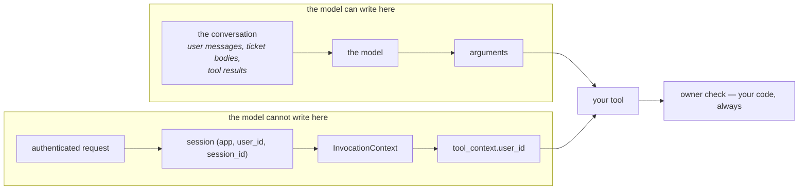

# 4.2 — The identity a tool needs

## One-line answer

Identity is the one input a tool must never accept as an argument: take it from
`tool_context.user_id`, which came from the session your application opened after authenticating a
person — because a `user_id` in the schema is an authorisation decision handed to a text generator.

---

## The story

A shop that sells SIM cards, and a request for a duplicate.

The honest version takes four minutes. You give the number, and then you give a photo ID, and the man
looks at the photo and looks at you, and types something, and eventually a new SIM comes out of a
drawer and the old one stops working.

The dishonest version is much faster. Somebody walks in, says a number that is not theirs, says the
name confidently, says they have lost their wallet, and a bored person behind the counter — who has
done this two hundred times and has a queue — skips the photo. Four minutes later the old SIM is dead
and somebody else's phone number is in a stranger's phone.

What happens next is the part worth understanding. The number is where the bank sends the
one-time code. So the failure was not "a SIM was issued to the wrong person" — it was every account
that trusted the number, all at once. **A single accepted assertion propagated into every system
downstream that had assumed the check had already been done.**

The man behind the counter did not do anything violent. He accepted a claim instead of checking a
register.

`user_id` as a tool parameter is that counter.

---

## The idea in plain language

[3.3](../03-designing-a-tool/3.3-arguments-the-model-can-supply.md) put identity in the category of
things a parameter must never ask for. This part is why it is not just *"the model might get it
wrong"*.

### A parameter is a request the model fills in

If your tool declares `user_id: str`, then the tool's identity is whatever text arrives in that field.
The model produces it. The model produced it by reading the conversation — which contains the user's
messages, and also ticket bodies, and also earlier tool results, which is to say **text written by
other people**. So the question *"whose data may this tool return?"* is being answered by a token
predictor reading attacker-influenceable input.

That is not a hypothetical failure mode. It is the ordinary operation of the mechanism, correctly
implemented, doing what it was told.

### The context already knows

`tool_context.user_id` is the `user_id` of the session — the middle third of
[Day 8's three-part address](../../../day-08-sessions-and-services/parts/01-the-session/1.2-three-parts-to-one-key.md),
`(app_name, user_id, session_id)`. And crucially, **your application set it**, before any model was
involved, when it decided which session this request belonged to. In a real deployment that value came
from a validated token or a session cookie.

So there is a chain of custody:

> authenticated request → the session your server opened → `InvocationContext.session` →
> `tool_context.user_id` → your ownership check

and the model appears nowhere in it. That is the entire point. Measured below: with identity taken from
the context, the wrong-owner request returns `not_found` and the parameter is not even in the schema for
the model to try.

### Two things this does not give you

**It is not authorisation.** The context tells your tool *who*; deciding *whether* is still your code.
`if record["owner"] != tool_context.user_id: return not_found` is one line and nothing writes it for
you. The framework gives identity, never permission.

**It is only as good as what set it.** `tool_context.user_id` is trustworthy because your server
authenticated somebody and opened a session for them. A server that reads `?user_id=` from a query
string and passes it to `create_session` has produced a context that is exactly as forgeable as the
parameter you removed. **The context is a pipe, not a source.** Day 62 is identity properly; the habit
today is to know which end of the pipe you are looking at.

### Why `not_found` and not "forbidden"

Note what the corrected tool returns for somebody else's ticket:

```text
{'status': 'not_found', 'ticket_id': 'T-2'}
```

Not *"you are not allowed to see T-2"*. The distinction matters, because a `forbidden` reply confirms
that T-2 exists — and an agent will helpfully relay that to the person who asked. Returning the same
answer for *does not exist* and *is not yours* is standard practice and costs nothing here; it is
[Day 10, part 2.3](../../../day-10-function-tools/parts/02-what-a-tool-returns/2.3-a-failed-tool-is-still-a-result.md)'s
honest-failure shape with one extra thought applied to it.

### This closes an open question

[Day 10, part 7.1](../../../day-10-function-tools/parts/07-limits/7.1-what-a-schema-still-cannot-say.md)
asked what a schema still cannot express, and its third question was *"is this caller allowed to ask
for this?"*. The answer is: it cannot, ever, and it should not try. **Authorisation is not a schema
problem.** The schema constrains shape; identity comes from a channel the model cannot write to; the
decision is your code. Three different layers, and the bug is always somebody collapsing two of them.

---

## Why Sutra needs it

**Sutra's tickets belong to people.** Day 10's `lookup_ticket` reads a public dictionary because there
was no notion of a user yet. Day 8 gave it one. This part is the first time those two facts have to be
reconciled, and it is the reason `USER_ID` in
[Day 8's `sessions.py`](../../../day-08-sessions-and-services/parts/03-the-services/3.1-the-tap-and-the-pipe.md)
was a constant rather than a parameter — a single-user placeholder, deliberately obvious.

**Day 30** is prompt injection, where the attacker-influenceable text in the context stops being a
footnote.

**Day 62** is identity and trust properly: where the `user_id` comes from, what signs it, and what
happens across an A2A boundary when the other side asserts one.

**Phase 12** is the security review, and "no tool takes an identity as an argument" is the kind of
invariant that is trivial to check and embarrassing to discover you violated.

---

## The mechanism

The same tool, identity from two different places. **No model call, no cost:**

```python
# lab/identity.py - identity from the model, against identity from the context.
import asyncio

from google.adk.agents import LlmAgent
from google.adk.agents.invocation_context import InvocationContext
from google.adk.events import EventActions
from google.adk.sessions import InMemorySessionService
from google.adk.tools import ToolContext

TICKETS = {
    "T-1": {"owner": "u-101", "subject": "Cannot log in"},
    "T-2": {"owner": "u-202", "subject": "Refund not received"},
}


def asked(ticket_id: str, user_id: str) -> dict:
    """Read one of your support tickets.

    Args:
        ticket_id: the ticket id.
        user_id: the id of the user making the request.
    """
    record = TICKETS.get(ticket_id)
    if record is None or record["owner"] != user_id:
        return {"status": "not_found", "ticket_id": ticket_id}
    return {"status": "ok", "subject": record["subject"]}


def taken(ticket_id: str, tool_context: ToolContext) -> dict:
    """Read one of your support tickets.

    Args:
        ticket_id: the ticket id.
    """
    record = TICKETS.get(ticket_id)
    if record is None or record["owner"] != tool_context.user_id:
        return {"status": "not_found", "ticket_id": ticket_id}
    return {"status": "ok", "subject": record["subject"]}


async def context_for(user_id: str) -> ToolContext:
    """A ToolContext for a session that the application opened for `user_id`."""
    service = InMemorySessionService()
    session = await service.create_session(app_name="sutra", user_id=user_id, state={})
    agent = LlmAgent(name="sutra_desk", model="gemini-3.7-flash", instruction="x")
    invocation = InvocationContext(
        session_service=service, invocation_id="inv-1", agent=agent, session=session
    )
    return ToolContext(invocation, event_actions=EventActions(), function_call_id="fc-1")


async def main() -> None:
    signed_in = await context_for("u-101")

    print("signed in as u-101, asking for their own ticket T-1:")
    print("  asked(user_id from the model) :", asked("T-1", user_id="u-101"))
    print("  taken(user_id from context)   :", taken("T-1", signed_in))
    print()
    print("signed in as u-101, asking for someone else's ticket T-2:")
    print("  asked(user_id from the model) :", asked("T-2", user_id="u-202"))
    print("  taken(user_id from context)   :", taken("T-2", signed_in))
    print()
    print("the schema each one shows the model:")
    for function in (asked, taken):
        agent = LlmAgent(name="a", model="gemini-3.7-flash", instruction="x", tools=[function])
        tool = (await agent.canonical_tools())[0]
        schema = tool._get_declaration().parameters_json_schema
        print(f"  {function.__name__:<8} {list(schema['properties'])}")


asyncio.run(main())
```

**Line by line:**

- `TICKETS` with an `owner` on every record — the smallest possible model of data that belongs to
  somebody. Day 10's version had no owner because there was no user; this is the change that makes the
  problem exist.
- `asked` and `taken` are **the same six lines** apart from where the identity comes from. Everything
  else — the ownership check, the `not_found` shape, the docstring's first line — is identical, so the
  output isolates one decision.
- `asked`'s docstring documents `user_id` because it is a parameter and
  [Day 10, part 1.3](../../../day-10-function-tools/parts/01-the-form-fills-itself/1.3-type-hints-are-the-schema.md)
  requires every parameter to be documented. Writing that line honestly is itself uncomfortable: *"the id
  of the user making the request"* is a sentence asking the model to assert who somebody is.
- `taken`'s docstring has **one** argument, because the model supplies one argument. The docstring
  shrinking is the visible half of the fix.
- `record is None or record["owner"] != ...` — the two failures collapsed into one branch and one
  answer, deliberately, so *does not exist* and *is not yours* are indistinguishable from outside.
- `context_for(user_id)` naming its parameter `user_id` and passing it to `create_session` — this is the
  line that stands in for your web server's authentication. In a real deployment it is the only place a
  user id enters the system.
- `signed_in = await context_for("u-101")` created **once**, before both calls, so the second call
  genuinely reuses one session rather than quietly getting a fresh one.
- `asked("T-2", user_id="u-202")` — the malicious call, written with a keyword argument so it is
  unmissable. This is what a model produces when the conversation happens to contain another id.
- The final loop printing `list(schema['properties'])` — the containment shown structurally rather than
  behaviourally. The best defence is not that the wrong call fails; it is that the wrong call cannot be
  expressed.

The output:

```text
signed in as u-101, asking for their own ticket T-1:
  asked(user_id from the model) : {'status': 'ok', 'subject': 'Cannot log in'}
  taken(user_id from context)   : {'status': 'ok', 'subject': 'Cannot log in'}

signed in as u-101, asking for someone else's ticket T-2:
  asked(user_id from the model) : {'status': 'ok', 'subject': 'Refund not received'}
  taken(user_id from context)   : {'status': 'not_found', 'ticket_id': 'T-2'}

the schema each one shows the model:
  asked    ['ticket_id', 'user_id']
  taken    ['ticket_id']
```

Read the second block. **`asked` returned another person's ticket, correctly.** It did exactly what it
was written to do: it checked ownership against the `user_id` it was given, and the `user_id` it was
given was `u-202`. There is no bug in that function. The bug is that the function was allowed to be
told.

And read the last two lines. `taken` does not merely refuse the bad call — the model has no field in
which to make it.



---

## When it breaks

**💥 The id the model found lying around.**

```text
{"ticket_id": "T-2", "user_id": "u-202"}
```

No error. A schema-valid call, a successful tool, another person's data in the answer. And the way it
usually happens is not an attack — it is a support agent's earlier message quoting a colleague's ticket,
three turns back, and a model being helpful about which id goes in the box.

**💥 The forbidden that confirmed the record exists.**

```text
{"status": "forbidden", "ticket_id": "T-2", "owner": "u-202"}
```

Worse than `not_found` in two ways: it confirms T-2 exists, and it leaks the owner's id — which is then
in the conversation, where the model can put it in the next tool call. **An error message is an output
channel.**

**💥 The context that was never authenticated.**

```python
session = await service.create_session(app_name="sutra", user_id=request.args["user_id"])
```

No error and the tool is now exactly as forgeable as before, with the added disadvantage that everybody
reviewing the tool sees `tool_context.user_id` and believes the problem is solved. **Removing the
parameter moved the trust boundary; it did not remove it.** The question to ask of any deployment is
where `create_session` gets its `user_id`, and the answer must be a verified credential.

**💥 The missing check.**

```python
def taken(ticket_id: str, tool_context: ToolContext) -> dict:
    return {"status": "ok", "ticket": TICKETS[ticket_id]}  # no owner check at all
```

The context is right there and unused. This is the most common version of the bug in real code, because
`tool_context.user_id` looks like a security measure and reading it is not one. **Identity without a
check is decoration.**

---

## In production

**What a professional writes instead of the teaching version** is one helper — `_owned_by(record,
tool_context)` — used by every tool that touches user data, so the check is one call and its absence is
visible. Scattered inline comparisons are individually fine and collectively unauditable; a named
function can be grepped, and "which tools call `_owned_by`?" is a question with an answer.

**What degrades at scale** is the number of places identity is decided. One tool is easy. Twelve tools
across four modules, two of which were written during an incident, is where an unowned read appears. The
structural answer is to push the check **below** the tools: a data-access layer that takes the user id
and cannot be called without it, so a tool physically cannot query the store without saying who is
asking. Then the tool layer can be careless and the system is still correct.

**The failure that only shows with real traffic** is multi-tenancy. In development there is one user, so
every tool passes every test whether or not it checks ownership — the only id available is the right one.
The failure needs two users in the same conversation's reach, which happens the first time a support
agent uses the desk on behalf of a customer, or the first time a ticket body quotes another ticket. **A
single-user test environment cannot catch a single-user bug**, and that is worth writing into the test
plan rather than discovering.

**The review comment a senior engineer leaves:** *"`user_id` can't be a parameter — that's an
authorisation decision we're asking the model to make, and the model reads ticket bodies written by
strangers. Take it from `tool_context.user_id` and keep the ownership check. Also make the not-yours case
return the same `not_found` as does-not-exist; a `forbidden` tells the caller the ticket is real. And
separately: where does our `create_session` call get its user id? If that's not from a verified token,
none of this helps."*

**The interview question:** *"where does an agent tool get the current user?"* The answer that shows you
have thought about the threat: "From the invocation context, never from a parameter. If `user_id` is in
the schema then the model is filling it in, and the model is reading a conversation that contains text
other people wrote — so an authorisation decision is being made by a token predictor over
attacker-influenceable input. Taking it from `tool_context.user_id` means it came from the session the
application opened after authenticating someone, and the model has no field to write it in. Two caveats
I'd state explicitly. Identity isn't authorisation — the ownership check is still my code, and reading
`user_id` without comparing it to anything is decoration. And the context is only as trustworthy as
whatever set the session's user id, so if the server takes it from a query string, removing the
parameter just moved the hole. The thing I'd change in the test setup is having two users, because a
single-user environment passes tools that never check ownership."

---

## Check yourself

```bash
uv run python days/day-11-tool-context/lab/identity.py
```

Then delete the owner check from `taken` and run it again — the context is still there, still correct,
and the tool returns T-2 anyway.

**Answer out loud, without scrolling up:**

> Say why `user_id` must not be a parameter, in terms of who writes the text the model reads. Then give
> the two things `tool_context.user_id` does not give you.

---

**Next:** [5.1 — 💥 The previous patient's file](../05-failure-lab/5.1-the-previous-patients-file.md)
