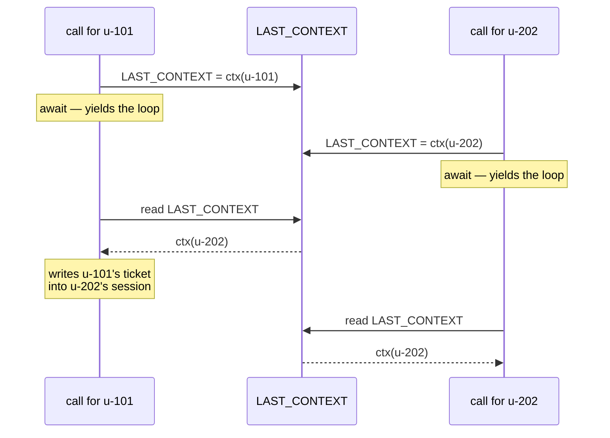

# 5.1 — 💥 The previous patient's file

## One-line answer

Today's deliberate failure: a `ToolContext` stashed in a module-level variable, which works perfectly
in every test and, the moment two conversations are in flight in one process, writes one person's
notes into another person's record.

---

## The story

🎬 **The scene.** A busy clinic. The doctor has a stack of files and one open on the desk. A patient
comes in, sits down, describes a cough. The doctor listens, asks two questions, and writes three lines
in the file that is open — because the file that is open is obviously this patient's file.

Except the previous patient left ninety seconds ago and the nurse has not swapped the files yet.

Nothing dramatic happens in the room. Nobody notices. The notes are correct medicine, written
carefully, in the wrong file. Both patients now have a record that is subtly wrong, and neither will
find out today.

😬 **The naive fix.** Keep the current file in a fixed place on the desk. "The open file is the current
patient" is a rule, and rules are cheap, and it works all morning.

💥 **Why it fails.** The rule holds only if exactly one patient is being dealt with at a time. The
instant a nurse walks in with a question about the *previous* patient while this one is mid-sentence,
"the open file" refers to two different things and there is no way to tell which. The rule was never
about files; it was an assumption about how many things were happening at once.

💡 **The insight.** The file must travel with the patient. It arrives when they arrive and leaves when
they leave, and it is never *found* — it is *handed over*.

That is why a `ToolContext` is a parameter.

---

## The idea in plain language

[1.3](../01-the-extra-parameter/1.3-one-card-several-doors.md) said the context is scoped to one run,
one session, one user, and called that a real guarantee. This part is what happens when you throw the
guarantee away, and it is one line of code:

```python
LAST_CONTEXT = tool_context
```

**Line by line:**

- `LAST_CONTEXT` is a **module-level** name, so there is exactly one of it per process, shared by
  every conversation that process is handling.
- `tool_context` is a **per-invocation** object, so the assignment binds something scoped to one run
  into something scoped to the whole program. That mismatch is the bug, and it is fully visible in
  this one line.

The temptations are all reasonable. A helper function three calls deep needs the user id and you do not
want to thread the parameter through. A logging function wants the invocation id. A caching layer wants
the session. In every case a module-level variable is the shortest path, and in every case it works —
until two conversations overlap.

### Why it works right up until it does not

Python's `async` is cooperative. Your tool runs, uninterrupted, until it hits an `await`. So a tool with
**no** `await` genuinely cannot be interleaved, and the global is genuinely safe, which is how the
pattern gets established.

Then somebody adds a database call. Now the function has an `await` in the middle, the event loop is
free to run another task at that point, and the two halves of your tool are no longer adjacent in time.
Everything between the stash and the use belongs to whoever ran in the gap.

**The diff that introduces the bug does not contain the bug.** It adds an `await` to a function that
already had a global, in a change about something else entirely.

### What makes it hard to catch

- **Tests pass.** One conversation at a time, and the global is always right.
- **Development passes.** One person clicking through a UI is one conversation at a time.
- **Load testing passes**, if the load is one user repeated — the ids are all the same, so a crossed
  context is indistinguishable from a correct one.
- It needs **two different users, concurrently, in one process**, which is the definition of production
  and nothing else.

### The fix

Use the parameter. That is the whole fix.

If a helper needs the user id, give the helper a `user_id` parameter. If it needs the state, pass the
state. Threading a parameter through three functions is mildly annoying, and the annoyance is the
signal: **it is telling you those functions have a dependency, which is true, and a global does not
remove the dependency — it hides it.**

For the case where threading really is unreasonable — a logging layer twenty calls deep —
`contextvars.ContextVar` exists and is async-task-local rather than module-global. It is the correct
tool and it is still worth avoiding in a tool body, because a tool is one function with the object
already in its hand.

---

## Why Sutra needs it

**Sutra becomes a server.** Right now it is a script, one conversation at a time, and every one of these
globals would be safe. Phase 5 puts it behind an API and Phase 11 gives it multiple users; the habits
formed while it is a script are the ones that ship.

**[6.1](../06-in-production/6.1-a-tool-without-a-model.md)** builds a context for a test, which is the
supported way to get one when you do not have one — as opposed to keeping a copy of somebody else's.

**Day 22** is persistence, where crossed state stops being an in-memory anomaly and becomes a wrong row.

**Day 62** is identity, where this failure has a security name rather than a correctness one:
[4.2](../04-blast-radius/4.2-the-identity-a-tool-needs.md) removed identity from the model's reach, and a
stashed context puts it back within reach of an unrelated request.

---

## The mechanism

Two conversations, one process, one global. **No model call, no cost:**

```python
# lab/crossed.py - a context stashed in a global, and two conversations in one process.
import asyncio

from google.adk.agents import LlmAgent
from google.adk.agents.invocation_context import InvocationContext
from google.adk.events import EventActions
from google.adk.sessions import InMemorySessionService
from google.adk.tools import ToolContext

LAST_CONTEXT: ToolContext | None = None


async def stashed(ticket_id: str, tool_context: ToolContext) -> dict:
    """Record the ticket the caller is asking about. Never write this."""
    global LAST_CONTEXT
    LAST_CONTEXT = tool_context
    await asyncio.sleep(0)  # any await at all: a database, an HTTP call
    LAST_CONTEXT.state["last_ticket"] = ticket_id
    return {"status": "ok", "wrote_for": LAST_CONTEXT.user_id, "ticket": ticket_id}


async def direct(ticket_id: str, tool_context: ToolContext) -> dict:
    """Record the ticket the caller is asking about."""
    await asyncio.sleep(0)
    tool_context.state["last_ticket"] = ticket_id
    return {"status": "ok", "wrote_for": tool_context.user_id, "ticket": ticket_id}


async def context_for(service: InMemorySessionService, user_id: str) -> ToolContext:
    """A ToolContext for a session the application opened for `user_id`."""
    session = await service.create_session(app_name="sutra", user_id=user_id, state={})
    agent = LlmAgent(name="sutra_desk", model="gemini-3.7-flash", instruction="x")
    invocation = InvocationContext(
        session_service=service, invocation_id=f"inv-{user_id}", agent=agent, session=session
    )
    return ToolContext(invocation, event_actions=EventActions(), function_call_id="fc-1")


async def both(tool) -> None:
    service = InMemorySessionService()
    first = await context_for(service, "u-101")
    second = await context_for(service, "u-202")

    results = await asyncio.gather(
        tool("T-1", first),
        tool("T-2", second),
    )
    for result in results:
        print("  ", result)
    print("   u-101 session state:", first.state.to_dict())
    print("   u-202 session state:", second.state.to_dict())
    print()


async def main() -> None:
    print("with the context stashed in a module global:")
    await both(stashed)
    print("with the context used as the parameter it is:")
    await both(direct)


asyncio.run(main())
```

**Line by line:**

- `LAST_CONTEXT: ToolContext | None = None` at module level — the bug, annotated properly and looking
  entirely respectable. Bugs in review look like this, not like something obviously wrong.
- `async def stashed(...)` — the tool is `async`, which ADK supports and which real tools are, because
  real tools call databases and HTTP APIs.
- `global LAST_CONTEXT` then the assignment — written out rather than hidden inside a helper, so the
  single line responsible is unmissable.
- `await asyncio.sleep(0)` with the comment naming what it stands for. `sleep(0)` yields to the event
  loop without waiting, which makes the interleaving **deterministic** rather than a race you might not
  reproduce. A real `await` on a database gives the same opportunity with unpredictable timing, which is
  worse to debug and identical in kind.
- `LAST_CONTEXT.state[...]` and `LAST_CONTEXT.user_id` **after** the await — using the global on the far
  side of the yield point. If both uses were before the `await`, there would be no bug, which is exactly
  why the pattern survives so long.
- `"wrote_for": LAST_CONTEXT.user_id` in the returned dictionary — the tool reporting whose session it
  believes it wrote to. Without this the failure would be visible only in the state dumps, and the point
  is that the tool itself is confidently wrong.
- `direct` is `stashed` **with two lines deleted**. No new machinery, no helper, no `contextvars` — the
  fix for this class of bug is subtraction.
- One `InMemorySessionService` shared by both sessions in `both()`, because two users of one application
  share a service. Two services would be a different, easier situation.
- `asyncio.gather(tool(...), tool(...))` — two conversations genuinely in flight in one process. This is
  the condition the failure needs and the condition a test suite never creates.
- `both(tool)` taking the function as a parameter so the broken and fixed versions run through identical
  scaffolding.

The output:

```text
with the context stashed in a module global:
   {'status': 'ok', 'wrote_for': 'u-202', 'ticket': 'T-1'}
   {'status': 'ok', 'wrote_for': 'u-202', 'ticket': 'T-2'}
   u-101 session state: {}
   u-202 session state: {'last_ticket': 'T-2'}

with the context used as the parameter it is:
   {'status': 'ok', 'wrote_for': 'u-101', 'ticket': 'T-1'}
   {'status': 'ok', 'wrote_for': 'u-202', 'ticket': 'T-2'}
   u-101 session state: {'last_ticket': 'T-1'}
   u-202 session state: {'last_ticket': 'T-2'}
```

Read the first block slowly, because there is no error anywhere in it.

- The call about **T-1** — u-101's ticket — reports `wrote_for: 'u-202'`. It wrote into the wrong
  person's session and returned `status: ok`.
- **u-101's session is empty.** The thing that was supposed to be remembered for them was not.
- **u-202's session says `T-1`... briefly**, and then their own call overwrites it with `T-2`, which is
  the only reason the final state looks plausible. Change the ordering and you get a session belonging
  to one user holding another user's ticket id, permanently.

Every function did what it was written to do. `status` is `ok` twice. Principle 10 says errors must
surface — and this one has no error to surface, which is precisely what makes it worth a failure lab.



---

## When it breaks

**💥 The version with no output at all.**

The lab prints `wrote_for` because it was written to catch this. A real tool returns
`{"status": "ok"}` and the crossing is invisible in the transcript, in the logs and in the events. What
you eventually see is a support conversation where the agent refers to a ticket the user never
mentioned.

**💥 The `AttributeError` that is the lucky version.**

```text
AttributeError: 'NoneType' object has no attribute 'state'
```

`LAST_CONTEXT` read before anything set it — the first request after a restart, or a code path that
reads without writing. This is the **good** outcome: it is loud, it happens immediately, and it points
at the global. The silent version above is the same bug on a luckier day.

**💥 The `contextvars` fix applied to the wrong layer.**

```python
CURRENT = contextvars.ContextVar("tool_context")
```

Correct, task-local, and a genuine fix for a deep logging layer. Used inside a tool body it is a
sophisticated way of not passing a parameter you were already given, and the next reader has to work out
which of the two situations they are in. **Reach for it when threading is genuinely impossible, and not
before.**

**💥 The same bug wearing a different hat.**

```python
CACHE = {}


def search_kb(query: str, tool_context: ToolContext) -> dict:
    CACHE[query] = fetch(query)  # keyed by query, shared by everyone
```

Not a stashed context, and the same class of mistake: process-global mutable state in a
per-conversation code path. If the cached value depends on who is asking — and knowledge-base results
usually do, once tiers and languages exist — then the cache is a leak. **Key process-wide caches by
everything that affects the answer, or do not make them process-wide.**

---

## In production

**What a professional writes instead of the teaching version** is nothing at all — the fix is deleting
two lines. The habit worth adopting is the review reflex: a module-level name that is assigned from
inside a request-handling function is guilty until proven innocent, and the proof is either "it is
immutable" or "it is keyed by something that identifies the request".

**What degrades at scale** is the number of `await` points. A tool with one await has one gap; a tool
that calls a database, an HTTP API and a cache has several, and the window in which the global is wrong
grows with each. The failure rate is roughly the fraction of the tool's runtime spent suspended
multiplied by the chance another conversation is active — which is why it is invisible at low traffic
and abruptly noticeable at high traffic. **A bug whose frequency scales with success** is the worst kind
to be surprised by.

**The failure that only shows with real traffic** is this whole part, which is why it is the failure lab.
But there is a second-order version worth naming: **the fix that is deployed and does not fix it.**
Somebody finds the crossed sessions, removes the global from the obvious tool, and misses the same
pattern in a helper module written a year earlier. The reports continue at a lower rate, everybody
believes the fix failed, and the investigation restarts from the wrong assumption. When you find one of
these, grep for the pattern rather than fixing the instance.

**The review comment a senior engineer leaves:** *"This assigns a `ToolContext` to a module-level
variable and then reads it after an `await`. Between those two lines any other conversation in this
process can run, so we'll write one user's data into another user's session — with `status: ok` and
nothing in the logs. Use the parameter; it's already in the signature. And check whether anything else in
this package holds request-scoped objects at module level."*

**The interview question:** *"tell me about a concurrency bug you've seen in a request-handling
service."* The answer that shows you have debugged one: "The one I keep seeing in agent code is caching a
request-scoped object — a tool context, a session, a user — in a module-level variable because a helper
deeper down needs it. It's safe while the function has no `await` in it, which is how it gets past
review, and it becomes a data-crossing bug the day someone adds a database call, in a diff that has
nothing to do with the global. Two conversations interleave at the await and you write one user's data
into another user's session, with a successful status and no error anywhere. It doesn't reproduce in
tests, in development, or in single-user load tests, because all of those are one conversation at a
time. The fix is to pass the parameter — the annoyance of threading it through is the dependency being
honest — and if it's genuinely a deep logging layer, `contextvars` is task-local and correct. The part I'd
emphasise is that when you find one you grep for the pattern instead of fixing the instance, because
there's usually a second one and a partial fix looks like a failed fix."

---

## Check yourself

```bash
uv run python days/day-11-tool-context/lab/crossed.py
```

Then delete the `await asyncio.sleep(0)` from `stashed` and run it again. The global is still there, the
code is still wrong, and the output is now correct — which is the whole lesson in one edit.

**Answer out loud, without scrolling up:**

> Say what makes a stashed context safe and what makes it unsafe, and name the diff that turns one into
> the other. Then say which environments cannot reproduce it, and why.

---

**Next:** [6.1 — A tool without a model](../06-in-production/6.1-a-tool-without-a-model.md)
