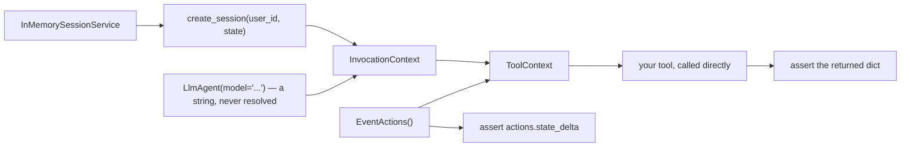

# 6.1 — A tool without a model

## One-line answer

Build a `ToolContext` by hand — a session service, a session, an invocation context and an
`EventActions` — call your tool directly, and assert on both what it returned and what landed in
`actions.state_delta`; no model, no key, no network, no quota.

---

## The story

Trying on one shoe in the shop.

You do not buy the pair, walk home, wear them to work for a day and then decide. You sit on the little
stool, put one on, stand up, take four steps on the carpet, and you know. The whole question — does
this fit — is answered in about ten seconds, for free, before anything is committed.

And notice what the shop provides to make that possible. A stool at the right height. A shoehorn. A
strip of carpet that is not the pavement. None of that is the shoe and none of it is the walk to work;
it is the smallest arrangement in which the real question can be asked honestly.

You still eventually walk to work in them. The ten seconds does not replace that. It just means you
never waste a day on a shoe that was obviously wrong while you were still sitting down.

---

## The idea in plain language

[1.4](../01-the-extra-parameter/1.4-the-folded-paper-under-the-chair.md) refused the `= None` default and
promised the alternative was about six lines. Here they are.

A `ToolContext` needs four things, all cheap, none of them a model:

1. **A session service.** `InMemorySessionService()` — no configuration, no storage
   ([Day 8, part 3.2](../../../day-08-sessions-and-services/parts/03-the-services/3.2-three-drawers-deep.md)).
2. **A session.** `create_session(app_name, user_id, state)` — and `user_id` and `state` are your test's
   two knobs. They are what makes a test for
   [4.2](../04-blast-radius/4.2-the-identity-a-tool-needs.md)'s ownership check possible at all.
3. **An `InvocationContext`.** Four fields: the service, an invocation id, an agent, the session. The
   agent needs a name and a model *string* — no provider is contacted, because
   [Day 9, part 1.2](../../../day-09-four-free-providers/parts/01-one-model-field/1.2-the-spare-tyre-you-never-checked.md)
   established that the string is not resolved until something asks for `canonical_model`, and nothing
   here does.
4. **An `EventActions`.** Create it yourself and **keep the reference**, because it is the only way to
   see what your tool wrote — [2.1](../02-state-from-a-tool/2.1-writing-on-the-carbon-copy.md)'s
   finding that `state._delta is actions.state_delta` is what makes this work.

That last point is the one worth having on purpose. Returning `(tool_context, actions)` from the fixture
looks redundant — the context has the actions on it — and it is the difference between testing what your
tool *returned* and testing what it *did*.

### The three assertions worth making

**What it returned.** The dictionary, whole, compared with `==`. Not `["status"] == "ok"` — the whole
thing, so a stray extra key is a test failure rather than a surprise later.

**What it wrote.** `actions.state_delta == {"last_ticket": "T-1"}`. This is the assertion that ordinary
tool tests miss, and it catches the whole class of mistakes from
[2.1](../02-state-from-a-tool/2.1-writing-on-the-carbon-copy.md): the nested in-place mutation that never
produces a delta, the key written under the wrong name, the write that happens on a branch it should
not.

**What it did not write.** `actions.state_delta == {}` on the refused path. A tool that correctly returns
`not_found` and *also* records something about the attempt is a small leak, and an empty-delta assertion
is the cheapest possible way to notice.

### What this does not test

Everything the model does. Whether the model picks this tool, fills the arguments sensibly, or handles
`not_found` gracefully in its reply — none of that is here, and none of it can be, because there is no
model.

That is not a weakness of the technique; it is the division of labour. **Tool logic is deterministic and
belongs in fast free tests. Model behaviour is not deterministic and belongs in evaluation** — Day 25,
which is a different discipline with a different cost profile. Confusing the two produces either slow
flaky unit tests or an untested tool.

---

## Why Sutra needs it

**Sutra's tools now take a context**, which means the test suite from Day 10 no longer covers them. This
part is how the coverage comes back, and the fixture written here is the one every later day reuses.

**Day 23** is testing agents properly, and this is its foundation: the fast layer underneath.

**Day 25** is evaluation — the other half, where the model is in the loop and the tests cost quota.

**Day 31** is the quality gate, where these run in `./m check`. They need no key, so they run in CI, on a
laptop with no `.env`, and on a fresh clone.

---

## The mechanism

A fixture and three tests. **No model call, no cost:**

```python
# lab/without_a_model.py - testing a context-taking tool with no model, no key, no network.
import asyncio

from google.adk.agents import LlmAgent
from google.adk.agents.invocation_context import InvocationContext
from google.adk.events import EventActions
from google.adk.sessions import InMemorySessionService
from google.adk.tools import ToolContext

TICKETS = {"T-1": {"owner": "u-101", "subject": "Cannot log in"}}


def lookup_ticket(ticket_id: str, tool_context: ToolContext) -> dict:
    """Read one of your support tickets, and remember which one.

    Args:
        ticket_id: the ticket id, e.g. 'T-1'.
    """
    record = TICKETS.get(ticket_id)
    if record is None or record["owner"] != tool_context.user_id:
        return {"status": "not_found", "ticket_id": ticket_id}
    tool_context.state["last_ticket"] = ticket_id
    return {"status": "ok", "subject": record["subject"]}


async def make_context(user_id: str = "u-101", **state) -> tuple[ToolContext, EventActions]:
    """A ToolContext over a fresh session, plus the actions its writes land on."""
    service = InMemorySessionService()
    session = await service.create_session(app_name="sutra", user_id=user_id, state=dict(state))
    agent = LlmAgent(name="sutra_desk", model="gemini-3.7-flash", instruction="x")
    invocation = InvocationContext(
        session_service=service, invocation_id="inv-test", agent=agent, session=session
    )
    actions = EventActions()
    return ToolContext(invocation, event_actions=actions, function_call_id="fc-1"), actions


async def test_returns_the_ticket_for_its_owner() -> None:
    tool_context, _ = await make_context(user_id="u-101")
    assert lookup_ticket("T-1", tool_context) == {
        "status": "ok",
        "subject": "Cannot log in",
    }


async def test_records_the_ticket_in_the_state_delta() -> None:
    tool_context, actions = await make_context(user_id="u-101")
    lookup_ticket("T-1", tool_context)
    assert actions.state_delta == {"last_ticket": "T-1"}


async def test_hides_someone_elses_ticket_and_writes_nothing() -> None:
    tool_context, actions = await make_context(user_id="u-202")
    assert lookup_ticket("T-1", tool_context)["status"] == "not_found"
    assert actions.state_delta == {}


async def main() -> None:
    for test in (
        test_returns_the_ticket_for_its_owner,
        test_records_the_ticket_in_the_state_delta,
        test_hides_someone_elses_ticket_and_writes_nothing,
    ):
        await test()
        print(f"  PASS  {test.__name__}")


asyncio.run(main())
```

**Line by line:**

- `lookup_ticket` is the day's accumulated tool: the context taken as a parameter with no default
  ([1.4](../01-the-extra-parameter/1.4-the-folded-paper-under-the-chair.md)), identity from the context
  ([4.2](../04-blast-radius/4.2-the-identity-a-tool-needs.md)), a state write
  ([2.1](../02-state-from-a-tool/2.1-writing-on-the-carbon-copy.md)), and an honest `not_found`
  ([Day 10, part 2.3](../../../day-10-function-tools/parts/02-what-a-tool-returns/2.3-a-failed-tool-is-still-a-result.md)).
- `make_context(user_id="u-101", **state)` — `user_id` has a default so the common case is short, and
  `**state` lets a test seed session state in one call: `make_context(language="hi")`.
- `state=dict(state)` — a **new** dictionary per context. Passing the kwargs dict straight through would
  hand the same object to two contexts if the fixture were ever called with a shared mapping, and
  fixtures that share mutable state between tests fail in an order-dependent way.
- `model="gemini-3.7-flash"` — a string, never resolved. Worth stating plainly: **this file will run with
  no `GOOGLE_API_KEY` set at all.**
- `invocation_id="inv-test"` — a fixed, obviously-fake id. Anything that logs it makes clear where it
  came from.
- `actions = EventActions()` on its own line and **returned alongside** the context. The tuple return is
  the design decision of this fixture.
- `-> tuple[ToolContext, EventActions]` — the annotation earns its place here, because a bare
  `return ctx, actions` gives the reader no reason to expect two things.
- Three tests named as sentences, so a failure message reads as a statement about the tool rather than
  as `test_3 failed`.
- The **third** test asserts twice: the refusal *and* the empty delta. One assertion per test is a good
  default and this pair is genuinely one claim — *refusing leaves no trace* — which is not testable in
  halves.
- `main()` looping over the three and printing `PASS` — a stand-in for a test runner. **`pytest-asyncio`
  is still an open `TODO(me)`** from
  [Day 8, part 2.1](../../../day-08-sessions-and-services/parts/02-the-run/2.1-one-dish-from-one-recipe.md);
  until that decision is made, `asyncio.run` in a plain script proves the same thing and adds no
  dependency.

The output:

```text
  PASS  test_returns_the_ticket_for_its_owner
  PASS  test_records_the_ticket_in_the_state_delta
  PASS  test_hides_someone_elses_ticket_and_writes_nothing
```

Three assertions about a tool that takes a context, in a script that touches no network and spends no
quota.



---

## When it breaks

**💥 The fixture that is not async.**

```text
RuntimeWarning: coroutine 'make_context' was never awaited
```

`create_session` is a coroutine, so the fixture must be one, so every test must be one. That is the whole
reason `pytest-asyncio` shows up in this conversation, and it is a real decision rather than a formality.

**💥 The assertion that passes for the wrong reason.**

```python
assert actions.state_delta  # truthy — passes on ANY write
```

A non-empty delta is not the right delta. Compare it whole, with `==`, or a tool that writes
`{"last": "T-1"}` instead of `{"last_ticket": "T-1"}` sails through.

**💥 The test that shares a session.**

Build the context once in a module-level variable and reuse it across tests and you have built
[5.1](../05-failure-lab/5.1-the-previous-patients-file.md) in your test suite: one test's writes are
another test's starting state, and the failure depends on the order pytest happens to choose. **One
context per test, always.** It costs a dictionary.

**💥 The tool that needs a service you did not give it.**

```text
ValueError: Artifact service is not initialized.
```

`InvocationContext` was constructed with `session_service` and nothing else, so a tool calling
`save_artifact` fails here. That is correct behaviour and it is a real limit of the minimal fixture: a
tool that uses artifacts needs `artifact_service=InMemoryArtifactService()` added, and a tool that
searches memory needs a memory service. Build the smallest context the tool actually needs, and let the
error tell you what is missing.

---

## In production

**What a professional writes instead of the teaching version** is this fixture in `tests/conftest.py`,
once, as a pytest fixture, so every tool test is three lines. The version in this lab returns a tuple
because a script cannot have fixtures; the real one yields the context and exposes the actions as an
attribute or a second fixture. The important properties survive either way: **fresh per test, seedable
with `user_id` and `state`, and the actions reachable.**

**What degrades at scale** is fixture drift. Six months in, there are four functions that build a
context, each written for one test file, each slightly different — one seeds an artifact service, one
uses a different app name, one shares a service between contexts. The tests all pass and they no longer
test the same thing. One fixture, in one place, changed deliberately.

**The failure that only shows with real traffic** is what this technique cannot see, and it is worth
being honest about rather than reassured. These tests prove the tool is correct **given the arguments**.
They say nothing about whether the model supplies those arguments, picks this tool over its neighbour,
or handles `not_found` gracefully in its reply — all of which fail in production and none of which fail
here. **A green tool suite is a necessary condition and a weak one**, and the day the desk misbehaves
with all tool tests passing is the day Day 25's evaluation earns its keep.

**The review comment a senior engineer leaves:** *"Good that this asserts the return value; also assert
`actions.state_delta`, because right now a tool that writes the wrong key or writes on the not-found
branch passes. And build the context inside each test rather than at module level — a shared one makes
these order-dependent, which is the same bug we just fixed in the tool."*

**The interview question:** *"how do you test a tool that depends on framework context?"* The answer that
shows you have written them: "You construct the context. It needs a session service, a session, an
invocation context and an event-actions object, all of which are in-memory and none of which involves a
model — the agent's model field is just a string and nothing resolves it, so the tests run with no API
key. The detail that matters is keeping your own reference to the event actions, because a tool's state
writes land in `state_delta` on that object, so you can assert on what the tool *did* and not only on
what it returned — including asserting the delta is empty on paths that should write nothing. What I'd
be explicit about is the boundary: this proves the tool is correct given its arguments, and says nothing
about whether the model chooses it or fills it in sensibly. That's evaluation, it's non-deterministic and
it costs quota, and mixing the two gives you slow flaky unit tests."

---

## Check yourself

```bash
uv run python days/day-11-tool-context/lab/without_a_model.py
```

Then change the state key in `lookup_ticket` to `"last"` and confirm the second test goes red — you have
now seen the delta assertion do its job.

**Answer out loud, without scrolling up:**

> Name the four things a hand-built `ToolContext` needs. Then say why the fixture returns the actions
> object separately, and what these tests cannot tell you.

---

**Next:** [6.2 — 🅿️ Artifacts and memory from a tool](6.2-artifacts-and-memory-from-a-tool.md)
