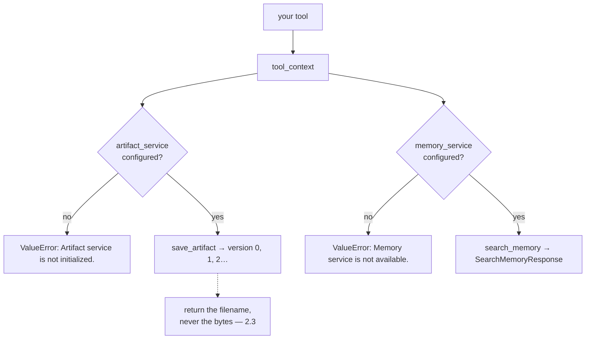

# 6.2 — 🅿️ Artifacts and memory from a tool

## One-line answer

Two of [1.3](../01-the-extra-parameter/1.3-one-card-several-doors.md)'s doors — `save_artifact` for
bytes that outlive a turn and `search_memory` for recall across conversations — are reachable from any
tool today, need their service configured on the runner, and Sutra is deliberately not walking through
either yet.

---

## The story

The attachments clipped to the side of a vacuum cleaner.

There is a narrow one for the gap between the sofa cushions and a wide flat one with bristles for
fabric. You have owned the machine for a year and used neither, because you vacuum floors and the
floor nozzle is on the end of the pipe where it belongs.

Then somebody spills something on the car seat.

You do not go to a shop. You do not look up what to buy. You go to the machine, unclip the brush that
has been sitting there the whole time, and use it — because at some point when the machine was new you
noticed the attachments existed and made a rough note of what each was for, and that note is now worth
more than any amount of research.

That is what a parked topic is. Not something you skipped. Something you looked at once, on purpose, so
that the day you need it you already know where it is.

---

## The idea in plain language

🅿️ **This part is parked**: awareness-level, deliberately not built. Sutra has no files and no
cross-session recall, and inventing a use for either today would be building machinery to justify a
lesson.

[1.3](../01-the-extra-parameter/1.3-one-card-several-doors.md) listed six doors on the `ToolContext` and
opened four of them across this day: state, actions, identity, and the call id. These are the other
two.

### Artifacts — bytes that outlive a turn

Four methods, and their real signatures matter:

| Call | Returns |
| --- | --- |
| `await save_artifact(filename, artifact, custom_metadata=None)` | an `int` — the **version** |
| `await load_artifact(filename, version=None)` | a `types.Part` or `None` — latest by default |
| `await list_artifacts()` | `list[str]` — the filenames this session has |

Three things worth noticing before you ever need them.

**It is versioned.** `save_artifact` returns `0` the first time, and saving the same filename again
returns `1`. That is not a detail — it means an artifact store is an append-only history, not a folder,
which is the same shape as the event log and for the same reason.

**The unit is a `types.Part`.** The same object an event's content is made of
([Day 7, part 1.1](../../../day-07-events-and-streaming/parts/01-the-event-object/1.1-an-event-is-a-line-in-a-ledger.md)),
so text, an image or a PDF all go in the same way. `types.Part.from_text(text=...)` for text;
`types.Part.from_bytes(...)` for anything else.

**A `user:` filename outlives the session.** The cloakroom rule from
[Day 8, part 3.4](../../../day-08-sessions-and-services/parts/03-the-services/3.4-the-cloakroom-and-the-one-you-were-not-given.md):
a plain filename belongs to this conversation, a `user:`-prefixed one belongs to the person across all
of them.

### Memory — recall across conversations

`await search_memory(query)` returns a `SearchMemoryResponse`, and
[Day 8, part 3.3](../../../day-08-sessions-and-services/parts/03-the-services/3.3-ctrl-f-is-not-understanding.md)
already established what the in-memory implementation actually does: keyword matching, not
understanding. A tool asking *"has anything like this happened before?"* gets word overlap, which is
sometimes exactly right and never what the name suggests.

There is also `add_session_to_memory()` — the write side, putting the current conversation into the
store so a later one can find it. Which conversations are worth remembering is a design question with
no default answer, and it is Phase 7's, not today's.

### The rule that applies today even though the doors are shut

**A tool that produces something large returns its name, not its bytes.**

That is [2.3](../02-state-from-a-tool/2.3-what-not-to-put-on-the-noticeboard.md)'s handles-not-payloads
rule, and artifacts are where the payload is supposed to go. A tool that generates a report should
`save_artifact("report-T-1.pdf", part)` and return `{"status": "ok", "artifact": "report-T-1.pdf"}`.
The model gets a short string it can talk about; the bytes never enter the conversation, the event log,
or the model's context window.

Get that shape right and the day artifacts arrive is a small change. Get it wrong — return the bytes,
or worse, put them in state — and it is a migration.

### Why they are parked and not skipped

| Door | Why not today | Where it lands |
| --- | --- | --- |
| artifacts | Sutra produces no files yet | **Day 18** |
| memory | one conversation at a time; nothing to recall | **Day 46 onwards** |

Both are also **services that must be configured**. The context always has the method; whether it works
depends on what the runner was built with, which is
[Day 8, part 3.5](../../../day-08-sessions-and-services/parts/03-the-services/3.5-the-furnished-flat.md)'s
furnished flat — and the failure is at runtime, in a tool, in front of a user.

---

## Why Sutra needs it

**Day 18** is artifacts properly: what Sutra stores, under what names, and who can read them.

**Day 46 onwards** is memory: what a conversation deposits, what a later one retrieves, and why keyword
matching stops being enough.

**Day 51** is caching and **Day 49** is retrieval — both build on an artifact store for indexes that are
too big to be state and too small to be a database.

**Day 73** is the nightly job, which writes a digest somewhere. That somewhere is an artifact.

---

## The mechanism

The two doors, shut and then open. **No model call, no cost:**

```python
# lab/parked_doors.py - the two doors Sutra is not opening yet, and what they need.
import asyncio
import inspect

from google.adk.agents import LlmAgent
from google.adk.agents.invocation_context import InvocationContext
from google.adk.artifacts import InMemoryArtifactService
from google.adk.events import EventActions
from google.adk.sessions import InMemorySessionService
from google.adk.tools import ToolContext
from google.genai import types

for name in ("save_artifact", "load_artifact", "list_artifacts", "search_memory"):
    print(f"  {name}{inspect.signature(getattr(ToolContext, name))}")
print()


async def context_with(**services) -> ToolContext:
    """A ToolContext whose InvocationContext carries only the services named."""
    session_service = InMemorySessionService()
    session = await session_service.create_session(app_name="sutra", user_id="u-101", state={})
    agent = LlmAgent(name="sutra_desk", model="gemini-3.7-flash", instruction="x")
    invocation = InvocationContext(
        session_service=session_service,
        invocation_id="inv-1",
        agent=agent,
        session=session,
        **services,
    )
    return ToolContext(invocation, event_actions=EventActions(), function_call_id="fc-1")


async def main() -> None:
    bare = await context_with()
    attempts = {
        "save_artifact": lambda: bare.save_artifact("summary.txt", types.Part.from_text(text="hi")),
        "search_memory": lambda: bare.search_memory("vpn"),
    }
    for label, attempt in attempts.items():
        try:
            await attempt()
        except ValueError as error:
            print(f"  no service -> {label}: ValueError: {error}")

    print()
    stocked = await context_with(artifact_service=InMemoryArtifactService())
    version = await stocked.save_artifact(
        "summary.txt", types.Part.from_text(text="Ticket T-1: cannot log in.")
    )
    print("  with a service -> save_artifact returned version", version)
    print("  list_artifacts ->", await stocked.list_artifacts())
    part = await stocked.load_artifact("summary.txt")
    print("  load_artifact  ->", part.text)


asyncio.run(main())
```

**Line by line:**

- `inspect.signature(getattr(ToolContext, name))` printed for all four — the signatures read off **your**
  installed package rather than copied from a table. When Day 18 arrives, run this first;
  [Day 7, part 1.2](../../../day-07-events-and-streaming/parts/01-the-event-object/1.2-the-fields-that-were-renamed.md)'s
  rule is that the terminal wins.
- `context_with(**services)` — the fixture from
  [6.1](6.1-a-tool-without-a-model.md) with a hole in it. `InvocationContext` takes the optional services
  as keyword arguments, so passing none and passing one exercises both halves of this part through one
  function.
- `attempts` as a dictionary of **lambdas**, not of coroutines. A coroutine created and never awaited
  produces a `RuntimeWarning`; building them lazily means only what is actually called is created.
- `except ValueError as error` printed rather than raised — here the exception is the finding, and the
  two messages differ in wording (*"not initialized"* against *"not available"*), which is worth seeing
  side by side because you will grep for one of them one day.
- `types.Part.from_text(text="hi")` in the failing attempt and a real sentence in the succeeding one —
  the failing call never gets far enough for its content to matter.
- `InMemoryArtifactService()` passed as `artifact_service=` — the second half's only change. No memory
  service is added, deliberately: this part opens one door and leaves the other visibly shut.
- `version = await stocked.save_artifact(...)` with the result **named** — the return value is an `int`
  version, which is the single most surprising thing about the API and is invisible if you discard it.
- `part.text` at the end — a round trip, so *saved* is demonstrated by reading it back rather than by a
  successful call.

The output:

```text
  save_artifact(self, filename: 'str', artifact: 'types.Part', custom_metadata: 'dict[str, Any] | None' = None) -> 'int'
  load_artifact(self, filename: 'str', version: 'int | None' = None) -> 'types.Part | None'
  list_artifacts(self) -> 'list[str]'
  search_memory(self, query: 'str') -> 'SearchMemoryResponse'

  no service -> save_artifact: ValueError: Artifact service is not initialized.
  no service -> search_memory: ValueError: Memory service is not available.

  with a service -> save_artifact returned version 0
  list_artifacts -> ['summary.txt']
  load_artifact  -> Ticket T-1: cannot log in.
```

`version 0` is the line to remember. Not `True`, not the filename — **a version number**, because the
store is a history.



---

## When it breaks

**💥 The service that was never configured.**

```text
ValueError: Artifact service is not initialized.
```

```text
ValueError: Memory service is not available.
```

Both raise from inside your tool, at runtime, on the request that needed them — not at startup, not in
review. The context has the method whether or not the service exists, so nothing earlier can tell you.
The countermeasure is the readiness check from
[Day 10, part 1.4](../../../day-10-function-tools/parts/01-the-form-fills-itself/1.4-the-wrapper-that-arrives-late.md):
if a tool needs a service, assert the service is present when the app starts.

**💥 The artifact returned as bytes.**

```python
return {"status": "ok", "report": pdf_bytes.decode("latin-1")}
```

No error, and a PDF is now in the conversation, in an event, in storage, and in the model's context
window on every subsequent turn. This is
[2.3](../02-state-from-a-tool/2.3-what-not-to-put-on-the-noticeboard.md)'s payload rule with the volume
turned up, and it is the mistake artifacts exist to prevent.

**💥 The version nobody kept.**

```python
await tool_context.save_artifact("report.pdf", part)  # returns 0, 1, 2...
return {"status": "ok", "artifact": "report.pdf"}
```

Works, and quietly loses information. Two calls in one conversation produce two versions under one name,
and the answer refers to "report.pdf" without saying which. Return the version alongside the filename
the moment more than one save is possible.

**💥 The memory search that found words.**

No error. `search_memory("login problem")` returns conversations containing "login" and "problem" — and
misses the one about "cannot sign in", which is the one you wanted. Day 8 established this and it is
worth re-stating here, because a tool calling `search_memory` and reporting *"I found no previous
issues"* is stating something much stronger than what actually happened.

---

## In production

**What a professional writes instead of the teaching version** is a thin wrapper — `store_report(name,
part, tool_context)` — that saves the artifact, returns `{"artifact": name, "version": n}`, and is the
only place in the codebase that calls `save_artifact`. Naming conventions, the `user:` decision and the
version handling then live in one function instead of in the habits of whoever wrote each tool.

**What degrades at scale** is artifact lifetime. Nothing deletes them by default. Every generated report,
every uploaded screenshot, every cached index accumulates per session and per user, and the storage bill
is the first thing that notices. **An artifact store without a retention policy is a disk that only
grows** — and, exactly as in
[2.3](../02-state-from-a-tool/2.3-what-not-to-put-on-the-noticeboard.md), it becomes a data-protection
question the moment any of it is personal.

**The failure that only shows with real traffic** is the memory that is confidently empty. Keyword recall
has a miss rate, and the misses are silent: the agent says *"I don't see any previous tickets about
this"* and the customer, who reported it twice last month, hears the system telling them they are
imagining it. The wrong answer is not the missing article — it is the **certainty**. A tool that returns
`{"status": "ok", "matches": []}` should be described so the agent says *"I couldn't find any"* rather
than *"there are none"*, and that is a docstring decision made long before the memory service is ever
switched on.

**The review comment a senior engineer leaves:** *"If this tool ever returns a file, it should save an
artifact and return the filename and version — not the content. And it calls `search_memory`, so add the
memory service to the startup check; right now if it's missing we find out inside a tool, in front of a
customer, with a `ValueError`."*

**The interview question:** *"where does an agent put a file it produced?"* The answer that shows you
have read the API: "In the artifact service, through the tool context — `save_artifact(filename, part)`
— and the tool returns the filename rather than the content, so the bytes never enter the conversation,
the event log or the context window. Two details that surprise people: it returns a version number
rather than a boolean, because the store is append-only rather than a folder, and the unit is the same
`Part` type that event content is made of, so text and binary go in the same way. There's also a
prefix convention for artifacts that should outlive the session and belong to the user rather than the
conversation. The operational thing I'd flag is that the context always has the method whether or not
the service was configured — you get a `ValueError` at runtime inside a tool — so a startup check that
the services a tool needs are actually present is worth the five lines."

---

## Check yourself

```bash
uv run python days/day-11-tool-context/lab/parked_doors.py
```

Then save `summary.txt` a second time and read the version it returns.

**Answer out loud, without scrolling up:**

> Say what `save_artifact` returns and why. Then say what a tool that produces a file should return to
> the model, and which earlier rule that comes from.

---

**Next:** [back to the hub](../../LESSON.md) — then write the day's tests, and read §11's ledger rows.
