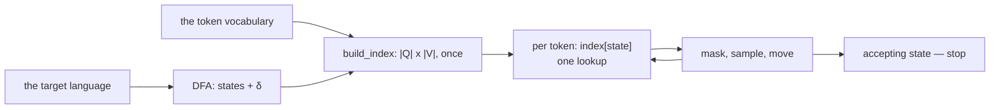

# Paper 01 — Efficient Guided Generation for Large Language Models

> **Efficient Guided Generation for Large Language Models**
> `arXiv:2307.09702` (2023)

## One-line answer

Reformulate generation as walking a finite-state machine over characters, then **precompute an index**
from each machine state to the set of vocabulary tokens allowed there — and constraining output stops
being a per-token search over the vocabulary and becomes a dictionary lookup.

---

## The story

Before this document, there were three ways to make a model produce JSON, and everybody had tried all
three.

**Ask it.** Put *"reply only with a JSON object"* in the prompt and hope. This works most of the time,
which is the worst possible failure rate: often enough to ship, rarely enough to page somebody. It is
[1.1](../parts/01-the-shape-on-the-way-out/1.1-a-shape-on-the-answer.md)'s open box with no lid.

**Ask it and retry.** Parse the answer; if it fails, ask again. Correct, and it costs a whole extra
generation each time it fires, which on a metered API is real money and on a free tier is your day.

**Filter every step.** At each token, score the whole vocabulary, then walk that vocabulary and discard
anything that would break the structure. This genuinely works and it is **O(|V|) per token** — a
vocabulary is tens of thousands of entries and the check runs on every single token generated. The
correctness is bought with a cost proportional to vocabulary size, forever.

So the field had a rule of thumb: *guaranteed structure is expensive, so use it only when you must.*
Whole systems were designed around avoiding it — a cheap unconstrained pass, a parse, a retry, a
fallback to prose.

This paper's contribution is that **the third option's cost was not necessary.** Most of that per-token
work is the same work, repeated, and it can be done once in advance.

---

## The idea in plain language

Two moves, and the second is the one that matters.

### Move one — the structure is a state machine

A regular expression is a finite-state machine. So is a JSON grammar, near enough, and the paper covers
context-free grammars too. The machine has states; a character moves it from one state to another; some
states are *accepting*, meaning the text so far is a complete valid answer.

That much is standard computer science and the paper says so. Its framing — the abstract's own words —
is that *"the problem of neural text generation can be constructively reformulated in terms of
transitions between the states of a finite-state machine."*

The reformulation matters because a model does not emit characters. It emits **tokens**, which are
multi-character chunks from a fixed vocabulary. So the question at each step is not *"which character is
allowed?"* but *"which of these fifty thousand tokens can I feed to this machine without it rejecting
the text?"*

### Move two — that question has a fixed answer per state

Here is the whole insight, and it is the kind that looks obvious afterwards.

The set of allowed tokens **depends only on which state the machine is in**. Not on the prompt, not on
the conversation, not on the model. If the machine is in state 7, the same tokens are allowed in state 7
today and in state 7 tomorrow and in state 7 during somebody else's request.

So you can compute it **once**, before generation starts, for every state:

> `index[state] -> {token: the state it lands in}`

and then during generation the mask for the current step is `index[state]` — one dictionary lookup,
independent of vocabulary size. The abstract's claim is exactly this: it *"adds little overhead to the
token sequence generation process."*

### What that buys

**Structure becomes a guarantee rather than a request.** Non-conforming output cannot be sampled,
because those tokens were removed before sampling. The abstract puts it as *"enables the construction of
reliable interfaces by guaranteeing the structure of the generated text."*

**And it is model-agnostic.** The index is built from the machine and the vocabulary. Nothing about it
knows which model is generating, which is why this technique appears everywhere rather than in one
vendor's stack.

That guarantee is what
[1.1](../parts/01-the-shape-on-the-way-out/1.1-a-shape-on-the-answer.md)'s
`response_mime_type="application/json"` is buying you, and it is why the native path can promise
something the injected-tool path
([3.2](../parts/03-schema-and-tools-together/3.2-the-tool-adk-injects.md)) can only ask for.

---

## Why Sutra needs it

**Sutra's native path is this paper.** Whenever an agent has an `output_schema` and no tools, the
provider constrains decoding, and this is the mechanism that makes that affordable enough to be a
default.

**And Sutra's actual path is not.** Sutra has tools on the Gemini API, so
[3.1](../parts/03-schema-and-tools-together/3.1-the-rule-that-changed.md)'s capability is `False` and the
structure is enforced by an instruction plus a retry. Knowing what the native path *is* is what makes
that trade legible rather than arbitrary.

**Day 16** brings built-in tools; **Day 49** brings retrieval, where constrained decoding shows up again
in a different guise.

**Day 68** is local models, where you may be the one running the sampler — and then the index is not an
API detail, it is code you can reach.

---

## The mechanism

The paper's method, written out rather than paraphrased.

**Inputs:** a regular expression (or grammar) `R`, and a vocabulary `V` — the model's token list.

**Step 1 — compile `R` to a deterministic finite automaton.** States `Q`, a transition function
`δ(q, c) → q'` over characters, a start state `q₀`, accepting states `F`. Standard construction; the
paper does not claim it.

**Step 2 — build the index.** For every state `q ∈ Q` and every token `v ∈ V`, feed the characters of
`v` through `δ` starting at `q`. If any character is rejected, `v` is not allowed in `q`. If all of them
are accepted, record the state the machine ended in:

> `index[q][v] = δ*(q, v)`

This is `|Q| × |V|` work, done **once**, offline, and reusable for every generation with that regex and
that vocabulary.

**Step 3 — generate.** Keep a current state `q`, starting at `q₀`. At each step:

1. The model produces scores over the whole vocabulary.
2. Mask everything not in `index[q]` — **a dictionary lookup**, not a scan.
3. Sample a token `v` from what remains.
4. Set `q = index[q][v]`.
5. Stop when `q ∈ F` and the sequence is complete.

**The cost claim.** Step 2's `|Q| × |V|` is paid once. Steps 1–5 are per token, and step 2 of that loop
— the part that used to be `O(|V|)` — is now a hash lookup. That is the whole result.

**The extension to grammars.** A context-free grammar needs a stack as well as a state, so the index is
keyed by the parser's state and the allowed set depends on what is on the stack. The paper handles this;
the shape of the argument is the same and the bookkeeping is larger.

---

## The paper in one demo

A complete, runnable implementation of **this paper's contribution and nothing else**: an FSM, an index
over a toy vocabulary, a generation loop, and a switch that turns the guidance off.

No model, no key, no network. The "model" is a fixed preference order over the vocabulary — enough to
have an opinion the guidance has to overrule, and deterministic so the output is the same every time.

### The file tree

```text
days/day-12-structured-output/lab/papers/guided-generation/
├── fsm.py        # the machine and the index - the paper's contribution
└── generate.py   # the loop, and the ablation switch
```

### `fsm.py`

```python
"""The paper's object: a character FSM, and an index from its states to a vocabulary.

arXiv:2307.09702 - "Efficient Guided Generation for Large Language Models".

Nothing here is ADK and nothing here calls a model. The file exists to build one
thing: for every FSM state, which tokens of the vocabulary may come next.
"""

from __future__ import annotations

# The target language: {"urgency": N} with one or two digits.
# Written as an explicit DFA so this file stays about the index, not about parsing regexes.
PREFIX = '{"urgency": '
DIGITS = frozenset("0123456789")

NEED_FIRST_DIGIT = len(PREFIX)  # the prefix is consumed
HAVE_ONE_DIGIT = NEED_FIRST_DIGIT + 1  # a digit or the closing brace may follow
HAVE_TWO_DIGITS = NEED_FIRST_DIGIT + 2  # only the closing brace may follow
END = NEED_FIRST_DIGIT + 3  # accepting
STATES = list(range(END + 1))
ACCEPTING = frozenset({END})


def step(state: int, char: str) -> int | None:
    """The transition function: one state, one character. None means rejected."""
    if state < len(PREFIX):
        return state + 1 if char == PREFIX[state] else None
    if state == NEED_FIRST_DIGIT:
        return HAVE_ONE_DIGIT if char in DIGITS else None
    if state == HAVE_ONE_DIGIT:
        if char in DIGITS:
            return HAVE_TWO_DIGITS
        return END if char == "}" else None
    if state == HAVE_TWO_DIGITS:
        return END if char == "}" else None
    return None


def walk(state: int, token: str) -> int | None:
    """Feed a whole token through the FSM. None means this token is not allowed here."""
    for char in token:
        next_state = step(state, char)
        if next_state is None:
            return None
        state = next_state
    return state


def build_index(vocabulary: list[str]) -> dict[int, dict[str, int]]:
    """The paper's contribution: state -> {allowed token: state it lands in}.

    Built once, before generation. During generation the mask for a state is a
    dictionary lookup instead of a scan over the whole vocabulary.
    """
    return {
        state: {token: landed for token in vocabulary if (landed := walk(state, token)) is not None}
        for state in STATES
    }
```

**Line by line:**

- `PREFIX = '{"urgency": '` — the target language is one field of Sutra's own triage schema, so the demo
  is about something the day has been using rather than an abstract regex.
- The DFA is written **by hand** rather than compiled from a regex. That is deliberate: the paper's
  contribution is step 2, the index, and a regex-to-DFA compiler would be forty lines of standard
  machinery obscuring it. If a file could be deleted and the claim still lands, it should be deleted.
- States are plain integers, and the first `len(PREFIX)` of them walk the literal prefix one character
  at a time. Crude, and it makes `step` readable in one pass.
- `step(state, char) -> int | None` — **the transition function `δ`**, returning `None` for rejection
  rather than raising, because rejection is the common case and not an error.
- `walk(state, token)` — `δ*` extended to a whole token, which is the operation that makes this about
  *tokens* rather than characters. This is the move the paper is built on.
- `build_index(vocabulary)` — steps over every state and every token: `|Q| × |V|`, once.
- `(landed := walk(state, token)) is not None` — the walrus operator so the result is computed once and
  used twice. Without it the dictionary comprehension would call `walk` twice per token.
- The returned index maps **token → landing state**, not token → `True`. Storing the destination is what
  makes step 4 of the generation loop free.
- `ACCEPTING` as a `frozenset` of one element — a set because the general case has several, frozen
  because nothing should mutate it.

### `generate.py`

```python
"""Generate with the index, and without it. The ablation is the point.

Run:
    uv run python generate.py            # guided by the index
    uv run python generate.py --no-guide # the same scorer, unmasked
"""

from __future__ import annotations

import sys

from fsm import ACCEPTING, STATES, build_index, walk

VOCABULARY = [
    '{"urgency"',
    '{"category"',
    ": ",
    "4",
    "9",
    "urgent",
    "}",
    "!",
    " very",
]

# A deterministic stand-in for a language model: a fixed preference order over the
# vocabulary. It likes prose. It is not trying to produce JSON, which is the point.
PREFERENCE = ["urgent", " very", "!", '{"category"', '{"urgency"', ": ", "9", "4", "}"]


def score(token: str) -> int:
    """Lower is better. A model would return logits; the ranking is what matters."""
    return PREFERENCE.index(token) if token in PREFERENCE else len(PREFERENCE)


def generate(guided: bool, limit: int = 8) -> tuple[str, int]:
    """Emit tokens greedily. Returns the text and the number of tokens examined."""
    index = build_index(VOCABULARY) if guided else None
    state, out, examined = 0, "", 0

    for _ in range(limit):
        if guided:
            allowed = index[state]  # one dictionary lookup
            examined += 1
            if not allowed:
                break
        else:
            allowed = {token: None for token in VOCABULARY}  # everything, every step
            examined += len(VOCABULARY)

        token = min(allowed, key=score)
        out += token
        if guided:
            state = allowed[token]
            if state in ACCEPTING:
                break
    return out, examined


def main() -> None:
    guided = "--no-guide" not in sys.argv
    text, examined = generate(guided)
    print(f"mode      : {'guided by the index' if guided else 'ABLATION - no guidance'}")
    print(f"output    : {text!r}")
    print(f"valid     : {walk(0, text) in ACCEPTING}")
    print(f"examined  : {examined} vocabulary entries across the run")
    if guided:
        index = build_index(VOCABULARY)
        print(
            f"index     : {len(STATES)} states, "
            f"{sum(len(v) for v in index.values())} state-token pairs, built once"
        )


if __name__ == "__main__":
    main()
```

**Line by line:**

- `VOCABULARY` is nine entries, and it is a **token** vocabulary, not a character set: `'{"urgency"'` is
  one token, `": "` is one token. That is what makes the index non-trivial — a character-level machine
  would need no index at all.
- `PREFERENCE` is the stand-in for a model. It ranks `"urgent"` first and `'{"urgency"'` fifth, so an
  unguided run goes straight into prose. A stand-in that already wanted JSON would prove nothing.
- `score(token)` returning a **rank** rather than a probability — the sampler only needs an ordering, and
  an integer ordering keeps the demo deterministic. The comment says what a real model would return.
- `generate(guided: bool, ...)` — **the ablation switch**, one boolean threaded through one function, so
  both runs use the same scorer, the same vocabulary and the same loop. Anything else would be comparing
  two programs.
- `index = build_index(VOCABULARY) if guided else None` — the index is built **before** the loop, which
  is the paper's whole point rendered as a line of code.
- `examined += 1` in the guided branch against `examined += len(VOCABULARY)` in the unguided one — the
  cost measurement, counted in **operations rather than seconds**. Seconds would be noise at this size
  and would not reproduce; the ratio is the claim.
- `min(allowed, key=score)` — greedy decoding over whatever survived the mask. In the guided branch
  `allowed` is already the legal set; in the ablation it is everything.
- `state = allowed[token]` — step 4, free, because the index stored the destination.
- `walk(0, text) in ACCEPTING` in `main` — an **independent** check of the finished string, so validity is
  verified by re-running the machine rather than by trusting the loop that produced it.
- `limit=8` — a cap, so the ablation terminates instead of producing prose forever. Real samplers have
  the same guard for the same reason.

### Run it

```console
cd days/day-12-structured-output/lab/papers/guided-generation
uv run python generate.py
uv run python generate.py --no-guide
```

### The output

```text
mode      : guided by the index
output    : '{"urgency": 99}'
valid     : True
examined  : 5 vocabulary entries across the run
index     : 16 states, 8 state-token pairs, built once
```

```text
mode      : ABLATION - no guidance
output    : 'urgenturgenturgenturgenturgenturgenturgenturgent'
valid     : False
examined  : 72 vocabulary entries across the run
```

Three things, and the third is the one worth arguing about.

**Same scorer, different output.** The preference order is identical in both runs. Guided, it produces
`{"urgency": 99}`; unguided, it produces `urgent` eight times. The guidance did not make the model
smarter — it removed the tokens that would have broken the structure, and the model's next choice among
what was left happened to be correct JSON.

**5 examinations against 72.** With the index, each step is one lookup. Without it, each step walks the
whole vocabulary. Nine tokens is a toy; a real vocabulary is fifty thousand, and the ratio is what
scales.

**And `99` is not the right urgency.** The ticket said nothing about urgency; `9` outranks `4` in the
preference order, so the guided run produced the highest number it could. **The structure is guaranteed
and the content is not** — which is
[4.1](../parts/04-when-a-schema-lies/4.1-valid-is-not-true.md), demonstrated by the paper's own
mechanism. The demo could have been rigged to avoid this. It is more useful left in.



---

## When it breaks

**💥 Where the claim does not hold: the index is not free to build.**

`|Q| × |V|` with a fifty-thousand-token vocabulary and a large grammar is real work and real memory. For
a fixed schema it is amortised over every request, which is the paper's whole economic argument. For a
schema that is **different every time** — generated per tenant, per user, per call — you are paying the
construction cost per request, and the win evaporates. This is the honest limit and it is why providers
expose schema-constrained decoding as a feature of *their* stack, where they can cache.

**💥 Tokenisation is not character alignment.**

The demo walks whole tokens through a character machine, which is correct and is also where real
implementations get complicated: a token may end **mid-state** in ways that interact with how the
tokeniser merges characters, and byte-level vocabularies bring their own edge cases. The paper addresses
this; a naive implementation is where subtle bugs live.

**💥 Guaranteed structure, unguaranteed content.**

Shown above, in the demo's own output. The paper does not claim otherwise — it says *"guaranteeing the
structure of the generated text"* and structure is exactly what it delivers. The failure is in how the
result gets read: *"the output is guaranteed"* is a sentence people finish differently in their heads.

**💥 A grammar that can paint the model into a corner.**

If the only legal continuations at some state are tokens the model finds very unlikely, you get valid
output the model did not want to produce — degraded quality with no error. Tighter grammars are not
uniformly better, which is
[4.1](../parts/04-when-a-schema-lies/4.1-valid-is-not-true.md)'s *"tightening the schema is usually the
wrong response"* arriving from the sampling side.

---

## In production

**What survived.** Almost all of it, and it survived by disappearing into infrastructure.

The FSM-plus-index formulation is now the standard way constrained generation is implemented, and it is
what sits behind a JSON-schema or regex parameter on a modern inference API. The abstract names the
reference implementation — the open-source library **Outlines** — and equivalents now ship in the major
serving stacks. Nobody writes an index by hand any more, which is the strongest possible endorsement of
a systems paper: **it became a checkbox.**

Concretely, in Sutra's own stack: `response_mime_type="application/json"` with a `response_schema`
([1.1](../parts/01-the-shape-on-the-way-out/1.1-a-shape-on-the-answer.md)) is a provider-side feature
that only makes sense because guided decoding is cheap. Before this line of work, an API vendor offering
"guaranteed JSON" would have been offering to spend `O(|V|)` per token on your behalf.

**What did not survive, or has not yet.**

**The general-grammar case is much less used than the JSON case.** The paper covers context-free
grammars, and the overwhelming majority of production usage is *"give me this JSON schema"*. The
long tail — SQL grammars, DSLs, arbitrary regex — exists and is niche, partly because a JSON schema is
what the surrounding tooling already speaks.

**And structured output did not replace the retry.** In practice systems still parse, still validate,
and still retry — because the schema you can express is narrower than the answer you actually want, and
because a large fraction of deployments (Sutra's included) are on paths where the guarantee is not
available at all. ADK's `SetModelResponseTool`
([3.2](../parts/03-schema-and-tools-together/3.2-the-tool-adk-injects.md)) is precisely the
ask-and-retry pattern, alive and in production, three years after a paper that made it unnecessary — for
the ordinary reason that the guarantee has preconditions.

**The review comment a senior engineer leaves** on a system that could use this and does not: *"We're
parsing and retrying on a provider that supports schema-constrained decoding. Set the schema and delete
the retry; the reason that used to be expensive stopped being true."*

**The interview question:** *"how does a model guarantee valid JSON?"* The answer that shows you know
the mechanism: "It isn't the model — it's the sampler. The structure you want is a finite-state machine
over characters, and the key result is that the set of vocabulary tokens allowed at any point depends
only on the machine's current state, not on the prompt or the model. So you precompute an index from
each state to the tokens legal there, and at each step you mask the scores with a dictionary lookup
instead of scanning the vocabulary. That's what turned constrained generation from something you avoided
because it cost O(vocabulary) per token into something a provider can offer as a flag. Two caveats I'd
raise. Building the index is real work proportional to states times vocabulary, so it's amortised over
requests — a schema that's different every call loses the benefit. And it guarantees *structure*, not
content: my own toy implementation of the paper produces perfectly valid JSON with the wrong number in
it, which is the honest summary of what the technique does and does not buy."

---

## Check yourself

```bash
cd days/day-12-structured-output/lab/papers/guided-generation
uv run python generate.py
uv run python generate.py --no-guide
```

Then add `'{"summary"'` to the vocabulary and re-run. The index changes, the output does not, and
working out why is the exercise.

**Answer out loud, without scrolling up:**

> Say what the index maps and why it can be built in advance. Then give the per-token cost with and
> without it, and the one thing the guarantee does not cover.

---

**Next:** [back to the hub](../LESSON.md) — §11 has the ledger rows, including the `docs/PAPERS.md` row
for this paper.
