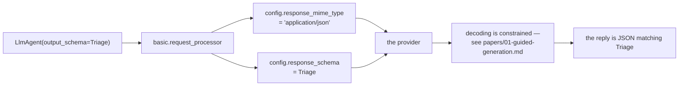

# 1.1 — A shape on the answer

## One-line answer

`output_schema` puts a declared shape on what the agent *says*, the mirror of what Day 10 put on what
the model *asks for* — and on the simple path it becomes a `response_schema` on the request, so the
provider enforces it rather than your prompt asking nicely.

---

## The story

A shape-sorter, the wooden kind with a lid.

There is a round hole, a square hole, a triangle, a star. A small child sits in front of it with a
handful of blocks and does what small children do: takes the star, aims it at the round hole, and
pushes. Nothing happens. Pushes harder. Still nothing.

Nobody is telling the child off. Nobody wrote *"stars go in the star hole"* on a label. The lid is
simply cut so that only the right thing fits, and every wrong attempt fails immediately and quietly,
and the child works it out in about four minutes.

Now imagine the same toy with no lid at all — an open box. You could say *"please put the star in the
star place"*, and repeat it, and the child would sometimes do it. That version needs a supervisor. The
version with the lid does not, because the constraint moved out of the instructions and into the
apparatus.

That is the difference between asking a model for JSON in the prompt and setting `output_schema`.

---

## The idea in plain language

### What you have been doing until today

Day 6 gave the desk an instruction. Day 10 gave it tools, and with them a real schema — but only on
the way **in**: the arguments the model sends *to* your function are described, typed and validated.

What comes back out of the agent is still prose. If Sutra's triage decision needs to be `billing`,
`4`, and one sentence, the only thing standing between you and a paragraph beginning *"Certainly! Here
is the triage:"* is a sentence in the instruction and hope.

You have already seen where that leads:
[Day 6](../../../day-06-instructions-and-personas/parts/01-writing-the-handbook/1.5-every-line-is-a-tax.md)
established that everything you add to the instruction costs tokens on every turn, and
[Day 10, part 1.2](../../../day-10-function-tools/parts/01-the-form-fills-itself/1.2-the-docstring-is-the-description.md)
established that a description is a request, not a guarantee.

### What `output_schema` is

One field on the agent, holding a Pydantic model:

```python
class Triage(BaseModel):
    category: Literal["billing", "technical", "account"]
    urgency: int
    summary: str


agent = LlmAgent(..., output_schema=Triage)
```

**Line by line:**

- `class Triage(BaseModel)` — an ordinary Pydantic model, exactly the kind Day 10's tools already use
  for arguments. Nothing about it is ADK-specific, which is why it is also your validator, your type
  and your test fixture.
- `Literal[...]` — the closed set from
  [Day 11, part 3.3](../../../day-11-tool-context/parts/03-designing-a-tool/3.3-arguments-the-model-can-supply.md),
  pointed the other way. There it constrained what the model could ask your function for; here it
  constrains what the model may say.
- `output_schema=Triage` — the class, not an instance. ADK reads it as a schema, not as a value.

And then the agent's replies are JSON matching `Triage`, not prose.

### Where it actually goes

This is the part worth seeing rather than believing. When an agent has an `output_schema` **and no
tools**, ADK puts two things on the request it sends:

```text
plain agent            mime=None                   response_schema=None
output_schema=Triage   mime='application/json'     response_schema=Triage
```

`response_mime_type` becomes `application/json` and `response_schema` becomes your model. Those are
**provider features**, not ADK features. The model is not being asked in words to produce JSON; the
decoding is constrained so that non-conforming output cannot be produced in the first place — which is
the lid on the shape-sorter, and which is what
[the paper](../../papers/01-guided-generation.md) explains how to do at all.

**When the agent also has tools, none of this happens** and something quite different does. That is
[section 3](../03-schema-and-tools-together/3.1-the-rule-that-changed.md), and it matters more for
Sutra than it looks, because Sutra has tools.

### What it does not do

It constrains **shape**. It says nothing about **truth**: a schema-perfect triage that files a billing
complaint under `technical` is still valid.
[4.1](../04-when-a-schema-lies/4.1-valid-is-not-true.md) is that, measured, and it is
[Day 4, part 4.1](../../../day-04-tools-by-hand/parts/04-the-limits/4.1-validated-is-not-correct.md)
arriving at the output end of the same pipe.

---

## Why Sutra needs it

**Sutra's triage decision is about to be consumed by code.** Everything the desk has produced so far
was read by a person. From Phase 8 the triage result is read by a *router*, and a router cannot parse
*"Certainly! This looks like a billing issue, probably fairly urgent."*

**[1.2](1.2-the-answer-with-an-address.md)** gives that decision a place to live in session state, and
the two fields together are how one agent hands work to the next.

**Day 25** is evaluation. A structured answer can be compared with an expected answer by `==`; a
paragraph needs a rubric and a model to judge it, which costs quota and is not deterministic.

**Phase 8** is the triage graph, and `output_schema` plus `output_key` is the wiring between its nodes.

---

## The paper behind it

> **Efficient Guided Generation for Large Language Models**
> `arXiv:2307.09702` (2023)

The claim: text generation can be reformulated as transitions between the states of a finite-state
machine, and an **index** can be built over the model's vocabulary so that the set of tokens allowed at
each step is a lookup rather than a search — making guided generation cost approximately nothing per
token.

That is the machinery underneath `response_schema`. Read it **after** the parts:
[papers/01-guided-generation.md](../../papers/01-guided-generation.md).

---

## The mechanism

The request ADK assembles, with and without a schema. **No model call, no cost:**

```python
# lab/shape.py - what output_schema puts on the request the runtime would send.
import asyncio
from typing import Literal

from google.adk.agents import LlmAgent
from google.adk.agents.invocation_context import InvocationContext
from google.adk.agents.run_config import RunConfig
from google.adk.flows.llm_flows import basic
from google.adk.models.llm_request import LlmRequest
from google.adk.sessions import InMemorySessionService
from pydantic import BaseModel, Field


class Triage(BaseModel):
    """How Sutra files one ticket."""

    category: Literal["billing", "technical", "account"] = Field(
        description="which queue it goes to"
    )
    urgency: int = Field(description="1 = whenever, 5 = now")
    summary: str = Field(description="one sentence, no jargon")


async def request_for(**agent_kwargs) -> LlmRequest:
    """Assemble the request ADK would send for an agent built with these kwargs."""
    service = InMemorySessionService()
    session = await service.create_session(app_name="sutra", user_id="u", state={})
    agent = LlmAgent(
        name="sutra_desk",
        model="gemini-3.7-flash",
        instruction="Triage it.",
        **agent_kwargs,
    )
    invocation = InvocationContext(
        session_service=service,
        invocation_id="inv-1",
        agent=agent,
        session=session,
        run_config=RunConfig(),
    )
    request = LlmRequest()
    async for _ in basic.request_processor.run_async(invocation, request):
        pass
    return request


async def main() -> None:
    for label, kwargs in (
        ("plain agent", {}),
        ("output_schema=Triage", {"output_schema": Triage}),
    ):
        request = await request_for(**kwargs)
        schema = request.config.response_schema
        print(
            f"{label:<22} mime={request.config.response_mime_type!r:<22} "
            f"response_schema={getattr(schema, '__name__', schema)}"
        )


asyncio.run(main())
```

**Line by line:**

- `basic.request_processor` — a **real** piece of ADK's request pipeline, not a simulation of it. It is
  the processor that copies the agent's configuration onto the outgoing request, so running it is the
  cheapest honest way to see what the provider would receive.
- `RunConfig()` on the `InvocationContext` — required. Without it the processor raises
  `ValueError: LLM flow requires a RunConfig in InvocationContext.`, which is worth meeting here rather
  than in your own code.
- `request_for(**agent_kwargs)` taking keyword arguments — so the plain agent and the schema agent go
  through **identical** code and the only difference is the one field.
- `async for _ in ...: pass` — the processor is an async generator that yields events (none, here). The
  loop exists to drive it to completion; the underscore says nothing is expected.
- `request.config.response_mime_type` and `.response_schema` — the two fields the provider reads. These
  are `google.genai` fields, not ADK ones, which is the finding.
- `getattr(schema, '__name__', schema)` — the schema is a **class**, so printing it directly gives a
  long repr. The name is the informative part; the fallback covers the other shapes
  [1.3](1.3-what-output-schema-accepts.md) introduces.
- `Field(description=...)` on all three fields — they play no part in *this* script and they matter
  enormously two parts later ([2.3](../02-schemas-in-practice/2.3-the-descriptions-that-do-not-arrive.md)),
  so they are here from the start.

The output:

```text
plain agent            mime=None                   response_schema=None
output_schema=Triage   mime='application/json'     response_schema=Triage
```

Two fields, set by one line of agent configuration, read by the provider rather than by the model.

Compare that with every constraint you have written so far. Day 6's persona was a sentence the model
could ignore. Day 10's tool descriptions were prose the model could misread. **This one is not a
request.**



---

## When it breaks

**💥 The schema set in the wrong place.**

```text
ValueError: Response schema must be set via LlmAgent.output_schema.
```

Raised by ADK's own validator when you put `response_schema` on `generate_content_config` instead. The
same validator rejects `tools` and `system_instruction` there for the same reason: ADK needs to know
about these to run its own machinery, and a value smuggled past it would work until the day section 3's
workaround needed to fire.

**💥 The agent that has tools.**

No error, and the two fields above are simply **not set** — `mime=None`, `response_schema=None`. Your
schema has not been ignored; ADK has taken a completely different route, which
[3.1](../03-schema-and-tools-together/3.1-the-rule-that-changed.md) explains. If you check only the
request and only in the no-tools case, you will believe something about your production agent that is
not true of it.

**💥 The schema that is an instance.**

```python
output_schema = Triage(category="billing", urgency=1, summary="x")
```

A value where a type belongs. Pydantic's field accepts a wide union — `dict`, `type`,
`types.Schema`, and more — so this does not always fail where you would like, and what you have
declared is not a shape but one particular answer.

---

## In production

**What a professional writes instead of the teaching version** is a schema module — `sutra/desk/schemas.py`
— rather than a model class defined next to the agent. The schema is consumed by the agent, by the
tests, by whatever reads the result downstream and eventually by a different service; a class that
lives beside one agent quietly becomes three near-identical classes.

**What degrades at scale** is schema churn. A field renamed in `Triage` changes what the model is asked
to produce, what lands in state, and what every downstream reader expects — three things, in one diff,
with only the first of them type-checked. Teams that have been through this once version their output
schemas the way they version an API, because that is what it is.

**The failure that only shows with real traffic** is the shape you did not think of. Development
tickets are all real tickets, so every one of them triages. Production brings empty bodies, autoreply
loops, forwarded threads containing four other tickets, and marketing spam — and a schema with no way
to say *"this is not a ticket"* forces a confident answer to every one of them. That is
[5.1](../05-failure-lab/5.1-the-schema-that-silenced-the-agent.md), and it is a design failure rather
than a bug: nothing errors, ever.

**The review comment a senior engineer leaves:** *"Good — but check what this actually puts on the
request now that the agent has tools, because the no-tools path and the with-tools path are completely
different mechanisms and only one of them is enforced by the provider. And add an `outcome` field
before we ship: right now the schema says every input is triageable."*

**The interview question:** *"how do you make a model return something your code can consume?"* The
answer that shows you have shipped one: "Declare the output schema on the agent rather than asking for
JSON in the prompt. On the simple path the framework turns that into two fields on the request — a JSON
mime type and a response schema — and the provider constrains decoding, so non-conforming output isn't
produced rather than being asked for politely. That's a real difference from a prompt instruction,
which is a request. Two caveats I'd raise immediately. It constrains shape and not truth: a perfectly
valid triage can put a billing complaint in the technical queue, so the schema is not a correctness
check. And the moment the agent also has tools, most frameworks can't put both on one request, so
something else happens — worth knowing exactly what, because it's the path your production agent is
actually on."

---

## Check yourself

```bash
uv run python days/day-12-structured-output/lab/shape.py
```

Then add `tools=[some_function]` to the schema agent and run it again. Both fields go back to `None`.
Do not fix it yet — that is section 3.

**Answer out loud, without scrolling up:**

> Say the two fields `output_schema` sets on the request, and who enforces them. Then say the one thing
> a schema constrains and the one thing it does not.

---

**Next:** [1.2 — The answer with an address](1.2-the-answer-with-an-address.md)
