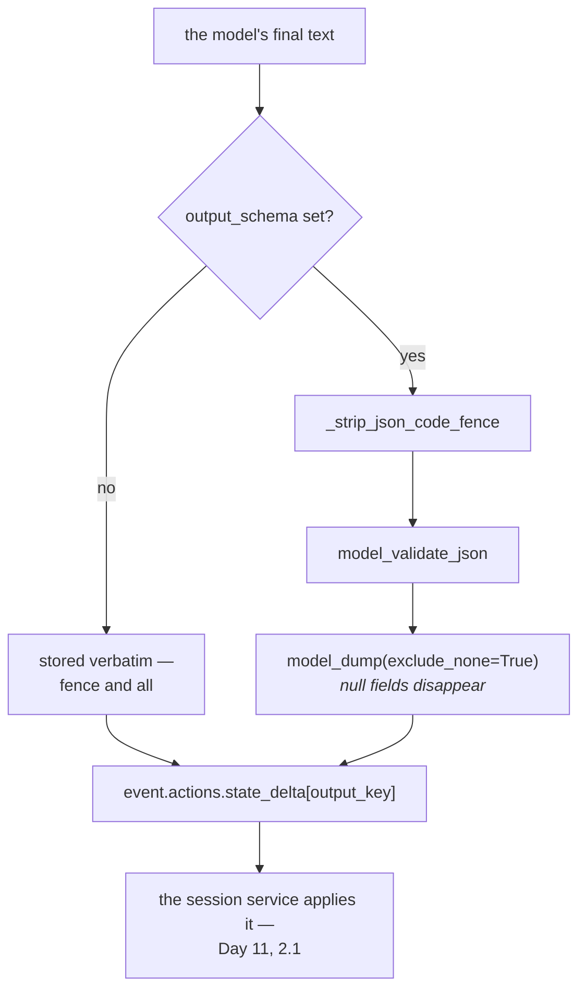

# 1.2 — The answer with an address

## One-line answer

`output_key` writes the agent's final answer into session state — through exactly the mechanism Day 11
took apart, `event.actions.state_delta[key] = result` — and when `output_schema` is also set, what
lands there is a **parsed dictionary** with the code fence stripped and every `null` field dropped.

---

## The story

Ordering something to a flat in a big building.

You put the building name in the address and nothing else, because everybody knows the building. The
parcel arrives at the gate. The guard has it. It is definitely here, somewhere, and now finding it is
a matter of you being awake, being at the gate at the right moment, or knowing to ask.

The month you start writing the flat number, all of that stops. The parcel does not merely arrive; it
arrives **somewhere specific**, and you can go to that place and look, at any time, without asking
anybody.

Nothing about the parcel changed. What changed is that it now has an address rather than a
neighbourhood.

`output_schema` is the parcel being the right shape. `output_key` is the flat number.

---

## The idea in plain language

An agent's answer is an event, and events go past. Anything watching the stream at that moment sees it;
anything that looks later has to go through the history and work out which event was the answer.
[Day 7, part 1.3](../../../day-07-events-and-streaming/parts/01-the-event-object/1.3-is-final-response-is-not-the-last-one.md)
was about exactly how fiddly *"which one was the answer"* is.

`output_key` removes the question:

```python
agent = LlmAgent(..., output_schema=Triage, output_key="triage")
```

**Line by line:**

- `output_key="triage"` — a plain string, and it is a **state key**, so everything
  [Day 11, part 2.3](../../../day-11-tool-context/parts/02-state-from-a-tool/2.3-what-not-to-put-on-the-noticeboard.md)
  said about naming applies. It is read by other agents, by templated instructions and by tests.
- `output_schema` and `output_key` are independent. Either works alone; together they are the pair
  that makes an agent a **node** rather than a conversation.

### It is Day 11's carbon copy, unchanged

Here is the line ADK runs, from `llm_agent.py`:

> `event.actions.state_delta[self.output_key] = result`

That is
[Day 11, part 2.1](../../../day-11-tool-context/parts/02-state-from-a-tool/2.1-writing-on-the-carbon-copy.md)'s
carbon copy, written by the framework instead of by your tool. Same `EventActions`, same delta, same
session service applying it when the event is appended. **There is no second state mechanism**, and that
is worth knowing because it means everything true of a tool's state write is true of this one: it is
permanent, it is in the run's history, and it is visible to anything that reads state.

### What lands there depends on `output_schema`

Without a schema, the value is the model's **text**, verbatim — including the ```` ```json ```` fence
models like to wrap JSON in.

With a schema, ADK runs `validate_schema(self.output_schema, result)` first, and three things happen:

1. **The code fence is stripped.** `_strip_json_code_fence` runs before parsing.
2. **The JSON is parsed and validated**, so what lands in state is a `dict`, not a `str`.
3. **`model_dump(exclude_none=True)`** — so any field whose value is `None` **disappears entirely**.

That third one is the surprise, and it has a consequence worth carrying into
[2.2](../02-schemas-in-practice/2.2-optional-default-and-null.md): once the value is in state, *"the
model said `null`"* and *"the model did not answer"* look identical. Both are an absent key.

---

## Why Sutra needs it

**Sutra's triage decision needs somewhere to be.** From today the desk produces a `Triage`, and
`state["triage"]` is where the rest of the system finds it.

**[6.1](../06-in-the-graph/6.1-output-key-is-how-agents-talk.md)** is the payoff: a second agent's
instruction contains `{triage}`, and this is what fills it in.

**Day 17** is the state deep dive, where the naming and prefix questions this key raises get answered
properly.

**Day 25** is evaluation: `assert session.state["triage"] == expected` is a test; grading a paragraph is
a project.

---

## The mechanism

The same model reply, stored two ways. **No model call, no cost:**

```python
# lab/address.py - what output_key writes, and what output_schema changes about it.
from typing import Literal

from google.adk.events import EventActions
from google.adk.utils._schema_utils import validate_schema
from pydantic import BaseModel, Field

MODEL_SAID = """```json
{"category": "billing", "urgency": 4, "summary": "Charged twice for one month.",
 "ticket_id": null}
```"""


class Triage(BaseModel):
    category: Literal["billing", "technical", "account"] = Field(description="the queue")
    urgency: int = Field(description="1 = whenever, 5 = now")
    summary: str = Field(description="one sentence")
    ticket_id: str | None = None


actions = EventActions()

print("--- output_key alone: the text, verbatim ---")
actions.state_delta["triage"] = MODEL_SAID
print(
    type(actions.state_delta["triage"]).__name__,
    repr(actions.state_delta["triage"])[:60],
    "...",
)

print()
print("--- output_key + output_schema: parsed, then stored ---")
actions.state_delta["triage"] = validate_schema(Triage, MODEL_SAID)
value = actions.state_delta["triage"]
print(type(value).__name__, value)
print()
print("ticket_id was null in the model's JSON:", "ticket_id" in value)
```

**Line by line:**

- `MODEL_SAID` written with a real ```` ```json ```` fence and a line break inside the object — because
  that is what models actually emit, and a fixture that is already clean would prove nothing about the
  stripping.
- `"ticket_id": null` in the fixture, deliberately. It is the field whose fate is the point.
- `EventActions()` used directly, and the two writes done **into `actions.state_delta`** rather than
  into a plain dictionary — because that is literally the object ADK assigns into, and using anything
  else would be a demonstration of a different thing.
- `validate_schema(Triage, MODEL_SAID)` — ADK's own function, imported from where ADK keeps it. The
  underscore in `_schema_utils` says it is internal; it is imported here to show a mechanism, not to be
  called from product code.
- `type(value).__name__` printed in both blocks — `str` against `dict` is the whole finding of the first
  half.
- `repr(...)[:60]` on the raw text so the fence is visible as `'```json\\n...'` rather than being
  rendered.
- `"ticket_id" in value` as the last line — a membership test rather than a value test, because the
  question is not *what is it* but *is it there at all*.

The output:

```text
--- output_key alone: the text, verbatim ---
str '```json\n{"category": "billing", "urgency": 4, "summary": " ...

--- output_key + output_schema: parsed, then stored ---
dict {'category': 'billing', 'urgency': 4, 'summary': 'Charged twice for one month.'}

ticket_id was null in the model's JSON: False
```

Three things in three lines.

The first stored value is a **string with a markdown fence in it** — which is what you get if you set
`output_key` and forget `output_schema`, and which will be parsed by somebody, somewhere, with a
`json.loads` that has not been told about fences.

The second is a **dictionary**. Nothing downstream needs to parse anything.

And `ticket_id` is **gone**. It was `null` in the model's reply, `exclude_none=True` dropped it, and any
code that later writes `state["triage"]["ticket_id"]` gets a `KeyError` rather than a `None`.



---

## When it breaks

**💥 The `KeyError` on a field you declared.**

```text
KeyError: 'ticket_id'
```

You declared `ticket_id: str | None = None`, the model correctly said `null`, and the key is not in
state. Every downstream reader must use `.get()`, and the honest way to say so is to make that a rule
rather than a habit: **anything optional in the schema is absent, not `None`, by the time it is state.**

**💥 The fence that reached `json.loads`.**

```text
json.decoder.JSONDecodeError: Expecting value: line 1 column 1 (char 0)
```

`output_key` without `output_schema`, and something downstream assumed the string was JSON. The fence
is the first character. ADK strips it on the schema path and does not on the text path, because on the
text path it has no reason to believe the text is JSON at all.

**💥 The key that collided.**

No error. Two agents in one session both use `output_key="result"`, and the second overwrites the first
— which is
[Day 11, part 2.3](../../../day-11-tool-context/parts/02-state-from-a-tool/2.3-what-not-to-put-on-the-noticeboard.md)'s
noticeboard problem, arriving from the framework rather than from your tool. Name the key after the
agent that writes it: `triage`, not `result`.

**💥 The streaming answer that arrived in pieces.**

ADK accumulates text across a streaming turn for `output_key` — and its own docstring says the
accumulation is a *"no-op when accumulation doesn't apply (different author, no `output_key`,
`output_schema` set, partial event, no content, no text)"*. **With `output_schema` set, accumulation is
off**, because a half-finished JSON document cannot be parsed. Structured output and token-by-token
streaming pull in opposite directions, which is
[Day 7, part 2.4](../../../day-07-events-and-streaming/parts/02-the-stream/2.4-nothing-is-credited-until-the-receipt.md)'s
lesson with a new reason behind it.

---

## In production

**What a professional writes instead of the teaching version** is `output_key` named for the producing
agent and never for the consuming one — `triage`, not `input_for_responder`. The key outlives the
pairing: the day a third agent also wants the triage decision, a key named after its first consumer is
a small lie in the state dictionary that nobody will be brave enough to rename.

**What degrades at scale** is state as an untyped bus. Every agent with an `output_key` adds a key, and
after a dozen of them the session state is a shared structure with no schema, assembled by whichever
agents happened to run. **The irony is worth noticing**: you adopted `output_schema` because untyped
prose was a problem, and then put the typed result into an untyped dictionary. Day 17's `state_schema`
is where that gets closed.

**The failure that only shows with real traffic** is the absent optional field. In development the
fixtures are complete, so `state["triage"]["order_id"]` works. In production a third of tickets do not
mention an order, the model correctly says `null`, `exclude_none` drops it, and a `KeyError` arrives in
a downstream agent — reported as *"the responder crashes sometimes"*, which is two systems away from the
cause.

**The review comment a senior engineer leaves:** *"Use `.get()` for every optional field of the triage —
they're dropped, not nulled, so subscripting works right up until the model correctly declines to fill
one in. And rename the key from `result` to `triage`; the next agent that wants this shouldn't have to
know which agent produced it."*

**The interview question:** *"how does one agent's output reach the next one?"* The answer that shows
you have wired one: "Through session state, via a declared output key on the agent. The mechanism isn't
special — the framework writes the final answer into the same state delta on the same event that a tool
writes to, so it's stored, permanent and visible exactly like any other state write. What's worth
knowing is what lands there: with no output schema you get the model's raw text, code fence included,
so the next consumer is parsing markdown. With a schema you get a parsed dictionary, fence stripped —
but it's dumped with nulls excluded, so an optional field the model correctly declined to fill is
*absent*, not `None`. Every downstream read of an optional field has to be a `.get`. And structured
output turns off text accumulation for streaming, which makes sense — you can't accumulate half a JSON
document — but it surprises people who wanted both."

---

## Check yourself

```bash
uv run python days/day-12-structured-output/lab/address.py
```

Then change `"ticket_id": null` to `"ticket_id": "T-1"` and confirm the key comes back.

**Answer out loud, without scrolling up:**

> Say the one line ADK runs for `output_key`, and which day you already met it. Then say the three
> things `output_schema` changes about what lands in state.

---

**Next:** [1.3 — What `output_schema` accepts](1.3-what-output-schema-accepts.md)
