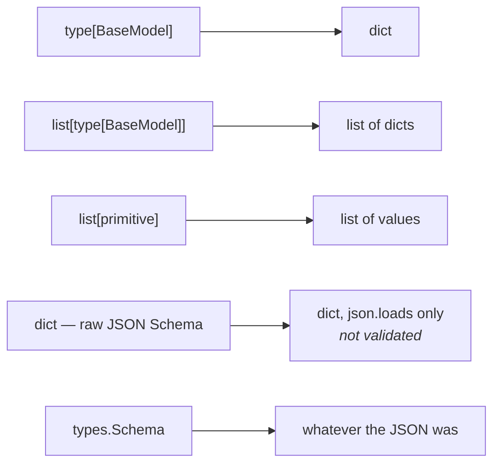

# 1.3 — What `output_schema` accepts

## One-line answer

Five shapes, not one: a Pydantic model, a list of one, a list of primitives, a raw JSON-Schema
dictionary and a `types.Schema` — and what lands in state is a `dict`, a `list`, or a bare value
depending on which you chose.

---

## The story

The payment machine at a car park barrier.

The first time you use it you assume it takes coins, because it has a coin slot and that is what you
had. It does. The second time you have no change and discover the note slot, which is a different
shape, on a different part of the machine, and works. Months later somebody in front of you taps a
card against a panel you had never registered as a panel.

One machine, one job — take the money and lift the barrier — and three inlets, each suited to a
different thing the customer happens to be carrying.

Nobody was ever wrong. The coin user was not doing it the primitive way; they had coins.

`output_schema` is that machine, and most people only ever find the coin slot.

---

## The idea in plain language

ADK's own field documentation lists them:

> *"Supports all schema types that the underlying Google GenAI API supports: `type[BaseModel]` · `list[type[BaseModel]]` · `list[primitive]` · `dict` — raw dict schemas · `Schema` — Google's Schema type"*

Here is what each one is actually for.

### `type[BaseModel]` — one object

`output_schema=Triage`. The default choice and the right one nearly always: named fields, types,
defaults, validation, and a class you can import into a test. Lands in state as a `dict`.

### `list[type[BaseModel]]` — many objects

`output_schema=list[Triage]`. For *"extract every one of these from that"* — every action item in a
thread, every product mentioned in a complaint. Lands as a `list` of dicts.

Worth knowing how ADK builds this on the workaround path: it creates a single parameter called `items`
of type `list[Triage]`, rather than making the whole reply a bare array. A small detail with a real
consequence — the model is filling in one field called `items`, so *"how many?"* is a question with no
constraint on it unless your prompt gives one.

### `list[primitive]` — many simple values

`output_schema=list[str]`. A list of categories, of ticket ids, of keywords. Cheap and legible, and
worth reaching for when a `BaseModel` with one field would be ceremony. Lands as a `list`.

### `dict` — a raw JSON Schema

`output_schema={"type": "object", "properties": {...}}`. For a schema that is **data** rather than
code: loaded from a file, fetched from a registry, generated for a tenant. Lands as whatever the JSON
says.

The cost is everything Pydantic was giving you. `validate_schema` for a raw dict just calls
`json.loads` — **no validation at all against the schema you supplied.** On the native path the
provider still constrains generation, so the shape usually holds; on the workaround path nothing checks
it. This is the one option that trades away the safety net, and it should be a deliberate trade.

### `types.Schema` — the provider's own type

`output_schema=types.Schema(type=types.Type.STRING)`. The `google.genai` object, for the cases the other
four cannot express. Rare, and it is the escape hatch rather than the front door. Note that
`SetModelResponseTool` converts a `types.Schema` to a raw dict on the way in — its own comment says this
is *"to avoid unhashable crash"* — so on the workaround path it degrades to the `dict` case above.

### How to choose

**Start with `type[BaseModel]`.** Reach for `list[...]` when the answer is genuinely plural, and for the
raw `dict` only when the schema is not yours to write in Python. If you are choosing `types.Schema`, you
have a specific reason and you know what it is.

---

## Why Sutra needs it

**Sutra's triage is one object**, so `Triage` it is — and the reason to know the other four now is that
Day 49's retrieval and Day 55's fan-out both produce lists, and reaching for a wrapper model with a
single `items` field is the thing people do when they have not read this table.

**[2.2](../02-schemas-in-practice/2.2-optional-default-and-null.md)** is what happens *inside* the
model you chose.

**Day 33** is MCP, where tool schemas arrive as raw JSON-Schema dictionaries from somebody else's
server — the `dict` case, not by choice.

**Day 55** is parallel agents, where several nodes each produce one object and something collects them.

---

## The mechanism

All five, accepted and parsed. **No model call, no cost:**

```python
# lab/accepts.py - the five shapes output_schema accepts, and what each one yields.
import json
from typing import Literal

from google.adk.agents import LlmAgent
from google.adk.utils._schema_utils import validate_schema
from google.genai import types
from pydantic import BaseModel, Field


class Triage(BaseModel):
    category: Literal["billing", "technical"] = Field(description="the queue")
    urgency: int


CASES = [
    ("type[BaseModel]", Triage, '{"category": "billing", "urgency": 4}'),
    ("list[type[BaseModel]]", list[Triage], '[{"category": "billing", "urgency": 4}]'),
    ("list[primitive]", list[str], '["billing", "technical"]'),
    (
        "raw dict",
        {"type": "object", "properties": {"queue": {"type": "string"}}},
        '{"queue": "billing"}',
    ),
    ("types.Schema", types.Schema(type=types.Type.STRING), '"billing"'),
]

for label, schema, model_said in CASES:
    agent = LlmAgent(name="a", model="gemini-3.7-flash", instruction="x", output_schema=schema)
    value = validate_schema(schema, model_said)
    print(f"  {label:<22} accepted -> {type(value).__name__:<5} {json.dumps(value)}")
```

**Line by line:**

- `CASES` pairs each schema with a **plausible model reply** for it, so the script proves two things at
  once: that ADK accepts the schema, and what the value becomes.
- `LlmAgent(..., output_schema=schema)` constructed for every case and then **not used** — its only job
  is to prove the field accepts that shape. If any of the five were rejected, this line would raise a
  Pydantic validation error at construction.
- `list[Triage]` written as the builtin generic rather than `List[Triage]` — Python 3.12, and ADK's own
  documentation uses this form.
- The raw dict written inline as a genuine JSON Schema fragment — `{"type": "object", "properties":
  {...}}` — because a dict that is not a valid schema would be accepted here and would fail at the
  provider, which is exactly the trade this option makes.
- `types.Schema(type=types.Type.STRING)` — the simplest possible instance of the provider's own type,
  chosen so the case is about the *shape being accepted* rather than about `types.Schema`'s own surface.
- `type(value).__name__` in the output — the finding. Three different Python types come back, and code
  downstream has to know which.
- `json.dumps(value)` rather than printing the object — so a string result is visibly quoted and cannot
  be confused with a name.

The output:

```text
  type[BaseModel]        accepted -> dict  {"category": "billing", "urgency": 4}
  list[type[BaseModel]]  accepted -> list  [{"category": "billing", "urgency": 4}]
  list[primitive]        accepted -> list  ["billing", "technical"]
  raw dict               accepted -> dict  {"queue": "billing"}
  types.Schema           accepted -> str   "billing"
```

Five accepted, three different Python types out.

That last column is the one to keep. `state["triage"]` is a `dict` for the first and fourth, a `list` for
the second and third, and a `str` for the fifth — so *"read the triage from state"* is a different line
of code depending on a decision made in the agent's constructor.



---

## When it breaks

**💥 The raw dict that was never validated.**

No error, and no validation. `validate_schema` for anything that is not a `BaseModel` or a list of them
falls through to `json.loads`. On the native path the provider's constrained decoding still holds the
shape; on the workaround path
([3.2](../03-schema-and-tools-together/3.2-the-tool-adk-injects.md)) there is nothing between the model
and your state key. **If you choose the raw dict, validate it yourself** — the same Pydantic you skipped,
applied one layer later.

**💥 The list that came back as one item.**

```text
[{"category": "billing", "urgency": 4}]
```

Correct, valid, and possibly wrong: the thread had four action items. Nothing in `list[Triage]`
expresses *how many*, and on the workaround path it is a single `items` parameter the model fills in.
Completeness is a prompt problem, not a schema problem — which is
[4.1](../04-when-a-schema-lies/4.1-valid-is-not-true.md) in a new costume.

**💥 The downstream reader that assumed a dict.**

```text
TypeError: list indices must be integers or slices, not str
```

Somebody changed `output_schema=Triage` to `output_schema=list[Triage]` because a ticket can raise two
issues. One line in an agent constructor; every reader of `state["triage"]` is now wrong. There is no
type checking across that boundary today, and
[6.1](../06-in-the-graph/6.1-output-key-is-how-agents-talk.md) is where the boundary gets named.
Day 17's state schema is where it starts to be enforced.

---

## In production

**What a professional writes instead of the teaching version** is a `BaseModel` even where a
`list[primitive]` would do, once the answer has any chance of growing. `list[str]` of ticket ids is
lovely until somebody wants a confidence score beside each one, and then it is a migration of every
reader; `list[TicketRef]` with one field is a migration of nothing.

**What degrades at scale** is the raw-dict path. It arrives for a good reason — a per-tenant schema, an
MCP server's tool definition — and it brings no validation, no class to import, no autocompletion and no
test fixture. Teams that use it seriously end up building a Pydantic model **from** the dict at startup
so the rest of the system gets the typed object back. That is a reasonable place to arrive, and it is
better arrived at deliberately than by accident.

**The failure that only shows with real traffic** is plurality. Every development ticket raises one
issue, because that is how you wrote the fixtures. Real tickets raise two, and a `Triage` schema forces
the model to pick one of them and silently discard the other — with a perfectly valid, perfectly
confident result. The tell in production is a category distribution that does not match what support
staff say they see, which is a slow and expensive thing to notice.

**The review comment a senior engineer leaves:** *"`list[str]` for the ticket ids works now and every
consumer will need changing the first time we want anything alongside an id. Make it a one-field model.
And if we're taking the tenant schema as a raw dict, run it through Pydantic ourselves — `validate_schema`
does a bare `json.loads` for dict schemas, so on the tools path nothing is checking it at all."*

**The interview question:** *"can a structured output be something other than an object?"* The answer
that shows you have read the field: "Yes — a Pydantic model is the common case, but a list of models, a
list of primitives, a raw JSON-Schema dictionary and the provider's own schema type are all accepted,
and what you get back differs: a dict, a list of dicts, a list of values, or a bare value. Two things I
watch. The raw-dict option skips Pydantic entirely — the framework just parses JSON — so on the path
where the provider isn't enforcing the schema, nothing is; if I take a schema as data I validate it
myself. And plurality is a decision, not a detail: `Model` versus `list[Model]` changes the type of
everything downstream, and choosing the singular because the fixtures are singular is how you end up
discarding half of every multi-issue input without an error anywhere."

---

## Check yourself

```bash
uv run python days/day-12-structured-output/lab/accepts.py
```

Then feed the raw-dict case a reply that does not match its schema at all — `'{"nonsense": 1}'` — and
watch it be accepted.

**Answer out loud, without scrolling up:**

> Name the five shapes and the Python type each one lands in state as. Then say which one skips
> validation, and what you do about it.

---

**Next:** [1.4 — 🅿️ The sheet you fill in before you are called](1.4-the-sheet-you-fill-in-before-you-are-called.md)
