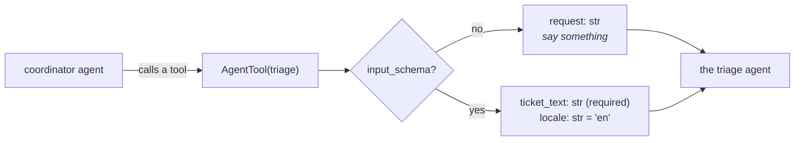

# 1.4 — 🅿️ The sheet you fill in before you are called

## One-line answer

`input_schema` is `output_schema`'s mirror — it types what goes *into* an agent — and it only does
anything when the agent is used as a **tool** by another agent, which is why it is parked until
Phase 8.

---

## The story

The clipboard at a clinic reception.

Before anybody sees you, you are handed a sheet and a pen and asked to sit down. Name. Age. What is
wrong. Any medicines you already take. Any allergies. Fifteen boxes, and you fill them in while you
wait.

You could, in principle, walk in and just talk. Plenty of small clinics work exactly that way, and it
is fine when there is one doctor who knows everybody. What the sheet buys is different: by the time you
are called, the person seeing you already has the same five facts they have for every other patient,
in the same order, and the conversation starts at *"tell me about the pain"* instead of at *"and how old
are you?"*.

Notice who the sheet is really for. Not you — you knew all of it already. It is for **the next person in
the chain**, so that what reaches them is predictable.

`input_schema` is that sheet, and the next person in the chain is another agent.

---

## The idea in plain language

🅿️ **This part is parked**: awareness-level, deliberately not built today. Sutra has one agent, so
nothing calls it as a tool, so `input_schema` would be a field with no effect.

### What it is

One field, taking a Pydantic model, and ADK's own documentation for it is a single sentence:

> *"The input schema when agent is used as a tool."*

adk.dev adds the consequence: *"If set, the user message content passed to this agent **must** be a
JSON string conforming to this schema."*

### Where it takes effect

Not in an ordinary conversation. An agent becomes a tool when another agent wraps it in an `AgentTool`
— the delegation pattern of Phase 8 — and at that moment the wrapped agent needs a declaration, exactly
like any function tool from
[Day 10, part 1.1](../../../day-10-function-tools/parts/01-the-form-fills-itself/1.1-the-declaration-you-no-longer-write.md).

Without `input_schema`, that declaration has one parameter:

```text
parameters={"request": {"type": "string"}}
required=['request']
```

A single string called `request`. Which is to say: *say something to this agent, in words.* That is the
small clinic with one doctor, and it works.

With `input_schema`, the declaration becomes the sheet — named fields, types, defaults, descriptions —
and everything
[Day 11, section 3](../../../day-11-tool-context/parts/03-designing-a-tool/3.3-arguments-the-model-can-supply.md)
said about designing a tool's arguments applies to it, because it now *is* a tool's arguments.

### The symmetry, and where it breaks

| | Types | Takes effect |
| --- | --- | --- |
| `input_schema` | what goes in | only when the agent is used as a tool |
| `output_schema` | what comes out | always |

They are not the same kind of field, and it is worth being precise about it rather than enjoying the
symmetry: `output_schema` changes how the agent talks to *you*; `input_schema` changes how the agent is
**advertised to another model**.

One more asymmetry, verified below and useful later: the descriptions on an `input_schema`'s fields
**do** reach the declaration, while the descriptions on an `output_schema`'s fields
[are dropped on the workaround path](../02-schemas-in-practice/2.3-the-descriptions-that-do-not-arrive.md).
Two schemas, two code paths, two different answers to the same question.

---

## Why Sutra needs it

**Phase 8** builds the triage graph, where a coordinator delegates to specialists. That is the first
time one Sutra agent is a tool of another, and the first time `input_schema` does anything.

**Day 57** is the coordinator pattern specifically; **Day 15** is toolsets, which is the other route by
which an agent's declaration matters.

**Day 90** is A2A, where the same question — *what does the caller have to send?* — becomes a contract
between two systems rather than two objects in one process.

---

## The mechanism

The same agent, advertised two ways. **No model call, no cost:**

```python
# lab/as_a_tool.py - the other schema, and the shape it gives an agent used as a tool.
import json

from google.adk.agents import LlmAgent
from google.adk.tools.agent_tool import AgentTool
from pydantic import BaseModel, Field


class TriageRequest(BaseModel):
    """What the triage agent needs before it can start."""

    ticket_text: str = Field(description="the customer's own words, verbatim")
    locale: str = Field(default="en", description="BCP-47 tag, e.g. 'en' or 'hi'")


plain = LlmAgent(name="triage", model="gemini-3.7-flash", instruction="Triage it.")
typed = LlmAgent(
    name="triage",
    model="gemini-3.7-flash",
    instruction="Triage it.",
    input_schema=TriageRequest,
)

for label, agent in (("no input_schema", plain), ("input_schema set", typed)):
    declaration = AgentTool(agent=agent)._get_declaration()
    schema = declaration.parameters_json_schema or {}
    print(f"  {label:<18} name={declaration.name!r}")
    print(f"  {'':<18} parameters={json.dumps(schema.get('properties', {}))}")
    print(f"  {'':<18} required={schema.get('required')}")
    print()
```

**Line by line:**

- `AgentTool(agent=agent)` — the wrapper that makes an agent callable by another agent. Constructing it
  is enough; nothing runs.
- `_get_declaration()` — the same method Day 10 used on a `FunctionTool`. That it is the same method is
  the point: **an agent used as a tool is a tool**, with a name and a parameter schema like any other.
- `declaration.name` printed for both — it is the agent's own `name`, so
  [Day 11, part 3.2](../../../day-11-tool-context/parts/03-designing-a-tool/3.2-name-it-for-the-model.md)'s
  rule about names being prompts applies to agent names too, from Phase 8 onwards.
- `TriageRequest` written with a docstring and per-field descriptions, so the comparison shows what is
  gained rather than only that the shape changed.
- `locale: str = Field(default="en", ...)` — a defaulted field, to show `required` shrinking rather than
  merely changing.
- `parameters_json_schema or {}` — the same nullary guard as
  [Day 10, part 1.4](../../../day-10-function-tools/parts/01-the-form-fills-itself/1.4-the-wrapper-that-arrives-late.md);
  a tool with no parameters has `None` here.
- Two agents built with the **same name and instruction** so nothing but the schema differs.

The output:

```text
  no input_schema    name='triage'
                     parameters={"request": {"type": "string"}}
                     required=['request']

  input_schema set   name='triage'
                     parameters={"ticket_text": {"description": "the customer's own words, verbatim", "title": "Ticket Text", "type": "string"}, "locale": {"default": "en", "description": "BCP-47 tag, e.g. 'en' or 'hi'", "title": "Locale", "type": "string"}}
                     required=['ticket_text']
```

The first is a single untyped `request` string — the caller says something, in words, and hopes.

The second is a form: two named fields, one required and one defaulted, **with the descriptions intact**.



---

## When it breaks

**💥 The field that does nothing.**

Set `input_schema` on your only agent, run it, and observe: nothing changes. No error, no warning. The
field is read by `AgentTool`, and if nothing wraps your agent, nothing reads it. **A configuration field
with no effect is worse than a missing one**, because it looks like a decision that was made.

**💥 The user message that must now be JSON.**

adk.dev's sentence is not decoration: *"the user message content passed to this agent must be a JSON
string conforming to this schema."* Set `input_schema` on an agent a **person** talks to and the person's
sentences stop being acceptable input.

**💥 The schema that asked the coordinator for something it cannot know.**

```python
class TriageRequest(BaseModel):
    ticket_text: str
    customer_tier: str  # the coordinator does not know this
```

Exactly [Day 11, part 3.3](../../../day-11-tool-context/parts/03-designing-a-tool/3.3-arguments-the-model-can-supply.md)'s
rule, and it bites harder here: the thing filling this form is another **model**, so a field it cannot
answer gets something plausible. Tier comes from the context, not from the caller.

---

## In production

**What a professional writes instead of the teaching version** is an `input_schema` on every agent that
is ever delegated to, with the same discipline as a tool's parameters: few fields, closed sets where
possible, and nothing the calling agent cannot know. The untyped `request: str` is fine for one hop and
becomes the reason a coordinator's delegations are unreliable at four.

**What degrades at scale** is the free-text hop. Each delegation through a bare `request` string is a
place where meaning is re-encoded into prose and re-parsed by the next model, and the losses compound:
by the third hop, a `customer_tier` that was known exactly at the top has become an adjective. A typed
input schema is how you stop paying that tax at every boundary.

**The failure that only shows with real traffic** is delegation drift. In testing you drive the
coordinator with clean requests, so the sub-agent gets clean input. In production the coordinator
paraphrases the customer, and the sub-agent triages the paraphrase rather than the ticket — a
degradation with no error, visible only as *"the specialist gets it wrong more often than it does when I
call it directly"*, which is a sentence support engineers really do say.

**The review comment a senior engineer leaves:** *"If we're going to delegate to this agent, give it an
`input_schema` — right now the coordinator hands it one free-text string, which means the sub-agent is
working from a paraphrase rather than the customer's own words. And put `ticket_text` in the schema as
verbatim text, not a summary."*

**The interview question:** *"what's the input equivalent of a structured output?"* The answer that
shows you know when it applies: "An input schema on the agent — but the important thing is that it only
does anything when the agent is used as a tool by another agent. In a normal conversation it's inert.
When it does apply, it replaces a single untyped `request` string in the sub-agent's declaration with a
real parameter list, which matters because the thing filling it in is another model: a free-text hop
means each delegation re-encodes meaning into prose and re-parses it, and the losses compound down a
chain. The rule for its fields is the same as for a tool's — don't ask the caller for anything it can't
know, because it will produce something plausible. And it has a mirror-image quirk worth knowing: field
descriptions survive into an input schema's declaration, whereas on the output side, when the framework
falls back to a synthesized tool, they don't."

---

## Check yourself

```bash
uv run python days/day-12-structured-output/lab/as_a_tool.py
```

Then give `TriageRequest` a third field with no default and watch `required` grow.

**Answer out loud, without scrolling up:**

> Say when `input_schema` takes effect and when it does nothing. Then say what the declaration looks
> like without it, and why that costs something at the third delegation.

---

**Next:** [2.1 — A schema a model can fill](../02-schemas-in-practice/2.1-a-schema-a-model-can-fill.md)
