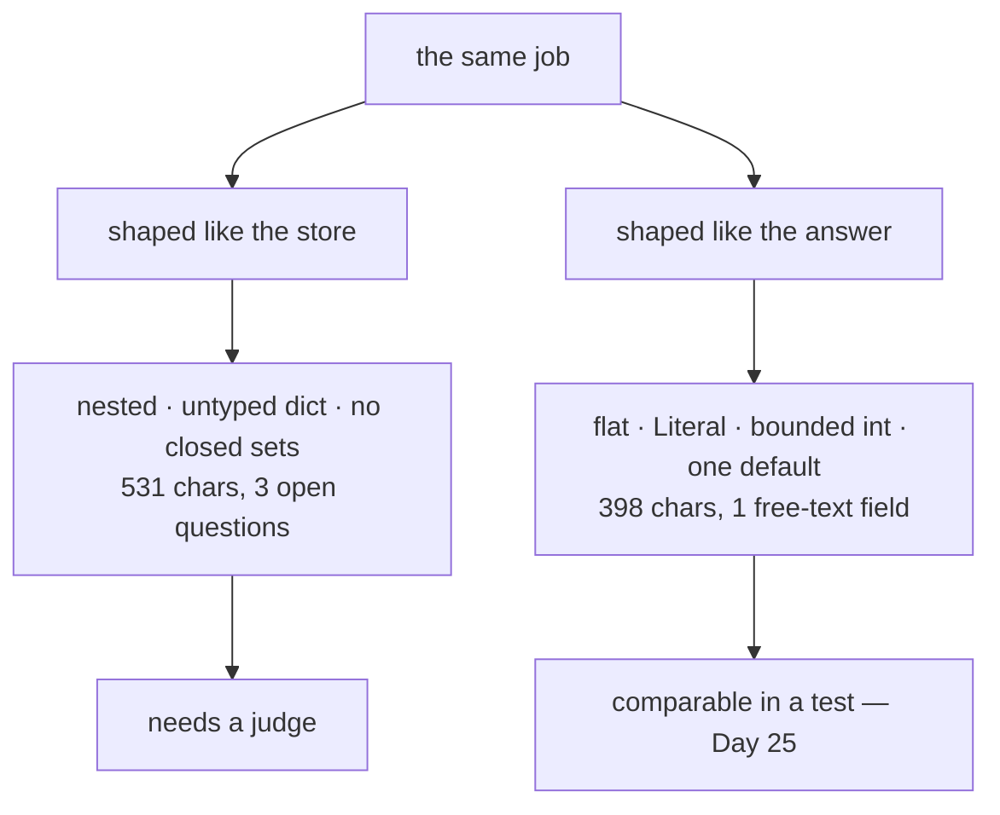

# 2.1 — A schema a model can fill

## One-line answer

Write the schema for the thing that has to fill it in, not for the thing that will store it: flat
rather than nested, named in the reader's words, closed sets wherever a set is closed, and as few
required fields as the job genuinely has.

---

## The story

The weekly pill organiser.

Somebody's grandmother has seven medicines. Before the organiser they lived in a carrier bag: strips,
bottles, a box with the lid missing, and a folded paper from the doctor. Every morning was a small
puzzle, solved correctly about six days in seven.

The organiser is a plastic tray with twenty-eight compartments, four a day, seven days across, and the
days are printed on the lids. It does not contain more information than the carrier bag. It contains
**the same information, arranged for the moment it is used** — and the person filling it on Sunday and
the person opening it on Wednesday morning are doing two completely different jobs, only one of which is
difficult.

Here is the part that makes it a lesson rather than a nice object. You could imagine an organiser
arranged by *medicine* — one compartment per drug, all the doses of each together. Perfectly logical.
That is how the pharmacy thinks about it, and it is how the bag was already arranged, and it is
completely useless on Wednesday morning.

**The arrangement that matches the storage is not the arrangement that matches the filling.**

---

## The idea in plain language

Your first draft of a schema will be shaped like your database, because that is where the data is going.
That draft is the medicine-shaped organiser.

Five rules, in the order they pay off.

### 1 — Flat, not nested

A model filling a nested object has to hold the structure in mind while producing content. Every level
of nesting is a place to lose a brace. Flatten until flattening starts to lose meaning, and then stop:
`category`, `urgency`, `summary` — not `data.classification.primary`.

Nesting is not banned. It earns its place when the nested thing is genuinely a repeated unit — a list of
line items, each with the same three fields. It does not earn its place as a namespace.

### 2 — Named in the reader's words

`category`, not `cls`. `summary`, not `desc_txt`. This is
[Day 11, part 3.2](../../../day-11-tool-context/parts/03-designing-a-tool/3.2-name-it-for-the-model.md)'s
rule about tool names, and it applies for the same reason: the field name is text the model reads, and a
short name saves you nothing measurable while costing you accuracy on every call.

There is a second reason here that Day 11 did not have. This schema's field names become the keys in
`state["triage"]`, which become the words in a templated instruction
([Day 6, part 3.1](../../../day-06-instructions-and-personas/parts/03-the-instruction-fields/3.1-where-your-instruction-lands.md)),
which are read by a **second** model. `cls` is a bad name three times.

### 3 — Closed sets as `Literal`

Wherever the set of answers is known, say so:

```python
category: Literal["billing", "technical", "account"]
```

**Line by line:**

- `Literal[...]` becomes an `enum` in the schema — on **both** paths, native and workaround; it is one of
  the few annotations that survives everywhere
  ([2.3](2.3-the-descriptions-that-do-not-arrive.md)).
- Three values and no `"other"`. Adding `"other"` feels safe and is a decision: it gives the model a
  place to put everything it is unsure about, and it will use it.

An open `category: str` gets you `"Billing"`, `"billing_issue"`, `"payments"` and `"BILLING"` across four
tickets, and every one is valid.

### 4 — Required means "always answerable"

Every required field is a promise that an answer always exists.
[4.2](../04-when-a-schema-lies/4.2-the-field-that-was-always-filled.md) is what happens when that promise
is false. Make required only what the job cannot be done without.

### 5 — Small

Measured below: the flat version's declaration is **398 characters** against the nested version's **531**,
while carrying more information. Every character is sent on every turn
([2.4](2.4-the-schema-is-the-prompt-again.md)), and — more importantly — every field is a decision the
model has to make correctly.

### The test

**Could a competent new colleague fill this in from the ticket alone, with no access to your database?**
If not, the schema is asking the wrong thing of the wrong participant, which is
[Day 11, part 3.3](../../../day-11-tool-context/parts/03-designing-a-tool/3.3-arguments-the-model-can-supply.md)
pointed at the output.

---

## Why Sutra needs it

**`Triage` is the schema Sutra keeps.** It gets written today, read by the router in Phase 8, compared
against expected values in Day 25's evalset, and stored in every session from now on. It is worth
getting right while it costs nothing to change.

**[2.2](2.2-optional-default-and-null.md)** is the field-level version of rule 4.

**[5.1](../05-failure-lab/5.1-the-schema-that-silenced-the-agent.md)** is rule 4 broken, deliberately.

**Day 25** is evaluation, where a schema of five closed fields can be compared exactly and a schema with
a free-text field needs a judge.

---

## The mechanism

Two schemas for one job. **No model call, no cost:**

```python
# lab/fillable.py - two schemas for the same job, and what each one asks the model to do.
import json
from typing import Literal

from google.adk.tools.set_model_response_tool import SetModelResponseTool
from pydantic import BaseModel, Field


class Nested(BaseModel):
    """A first draft: modelled on the database, not on the answer."""

    class Meta(BaseModel):
        created_by: str
        source_system: str

    data: dict
    meta: Meta
    flags: list[str]


class Flat(BaseModel):
    """The same triage, shaped for the thing that has to fill it in."""

    category: Literal["billing", "technical", "account"] = Field(
        description="which queue it goes to"
    )
    urgency: int = Field(ge=1, le=5, description="1 = whenever, 5 = now")
    summary: str = Field(description="one sentence a human can read")
    needs_human: bool = Field(default=False, description="true only if a person must act")


def report(schema: type[BaseModel]) -> None:
    declared = SetModelResponseTool(schema)._get_declaration().parameters_json_schema
    properties = declared["properties"]
    free_text = [
        name
        for name, spec in properties.items()
        if spec.get("type") == "string" and "enum" not in spec
    ]
    print(f"  {schema.__name__}")
    print(f"    fields          : {list(properties)}")
    print(f"    required        : {declared.get('required')}")
    print(f"    closed choices  : {[n for n, s in properties.items() if 'enum' in s]}")
    print(f"    free text       : {free_text}")
    print(f"    declaration size: {len(json.dumps(declared))} chars")


print("what the model is asked for:")
report(Nested)
print()
report(Flat)
```

**Line by line:**

- `Nested` is a **real** first draft, not a caricature: `data`, `meta`, `flags` are the three fields
  every internal record grows, and a nested `Meta` class is what a schema modelled on a table looks
  like.
- `data: dict` — untyped, which in a schema means *the model may put anything here*. It is the
  output-side twin of Day 10's unannotated parameter.
- `Flat`'s four fields each demonstrate one rule: a `Literal`, a bounded integer, a described free-text
  field, and a defaulted boolean.
- `SetModelResponseTool(schema)._get_declaration()` — the declaration the model would actually be shown
  on Sutra's path ([3.2](../03-schema-and-tools-together/3.2-the-tool-adk-injects.md)), rather than the
  Pydantic schema. The measurement should be of what is sent, not of what you wrote.
- `free_text` computed as *string-typed and not an enum* — a deliberately mechanical definition, so the
  count is a fact rather than a judgement. Free-text fields are the ones a test cannot compare exactly.
- `closed choices` printed beside it, because the ratio between those two lists is the single most
  useful number about a schema.
- `len(json.dumps(declared))` — characters of declaration, the same proxy used on
  [Day 11, part 3.1](../../../day-11-tool-context/parts/03-designing-a-tool/3.1-one-tool-one-job.md).
- `report()` printing five lines per schema in a fixed order, so the two blocks can be read down rather
  than across.

The output:

```text
what the model is asked for:
  Nested
    fields          : ['data', 'meta', 'flags']
    required        : ['data', 'meta', 'flags']
    closed choices  : []
    free text       : []
    declaration size: 531 chars

  Flat
    fields          : ['category', 'urgency', 'summary', 'needs_human']
    required        : ['category', 'urgency', 'summary']
    closed choices  : ['category']
    free text       : ['summary']
    declaration size: 398 chars
```

Read the two blocks as a pair.

`Nested` has **three required fields and zero closed choices** — every one of them is an open-ended
question, and `data: dict` is an invitation. It is also the **larger** declaration, which is the part
people do not expect: nesting costs characters and buys no constraint.

`Flat` has **four fields, three required, one closed choice, one free-text field** — and one of its
fields is a boolean with a default the model may skip entirely. It is 25% smaller and every field is a
question with a knowable answer.



---

## When it breaks

**💥 The `dict` field.**

```python
data: dict
```

No error, and no constraint. The model may return `{}`, or a nested structure it invented, or the whole
ticket. Nothing downstream can rely on any key existing. This is the output-side version of
[Day 10, part 6.1](../../../day-10-function-tools/parts/06-failure-lab/6.1-the-jar-with-no-label.md)'s
untyped parameter, and the fix is the same: name the fields.

**💥 The `"other"` that ate the distribution.**

No error. `category: Literal["billing", "technical", "account", "other"]` and six weeks later 40% of
tickets are `other`. An escape hatch on a *classification* is different from an escape hatch on the
*whole answer* — [5.1](../05-failure-lab/5.1-the-schema-that-silenced-the-agent.md) argues for the
second and this argues against the first. The distinction: *"I cannot triage this at all"* is a real
outcome; *"it is a ticket but I would rather not say which kind"* is an unanswered question wearing a
value's clothes.

**💥 The field named for the database.**

```python
cust_seg_cd: str
```

No error, a worse answer, and a state key that a templated instruction later shows to a second model.
Nobody writes this deliberately; it arrives by copying a table definition.

---

## In production

**What a professional writes instead of the teaching version** is a schema with a docstring on the class
and a `description` on every field — not because the model always sees them
([2.3](2.3-the-descriptions-that-do-not-arrive.md) shows one path where it does not), but because that
schema is read by everyone who maintains the system, and a field called `urgency` with no note is a
field four people will interpret four ways.

**What degrades at scale** is field count. Schemas grow the way instructions grow: somebody needs one
more thing, adds a field, and the field is required because that is the default thing to type. At
fifteen fields the model's accuracy on each one is measurably worse than it was at five, and the fields
added last are usually the least important. **A schema is a budget**, and the discipline is the same one
Day 6 applied to the handbook.

**The failure that only shows with real traffic** is the free-text field that became a key. `summary`
is written for a human to read, and then somebody groups by it in a dashboard, or matches on it, or —
worst — uses it as a deduplication key. Free text is generated fresh every time and is never twice the
same, so the dashboard shows one occurrence of everything. The rule that prevents it: **anything code
will compare must be a closed set or an identifier**, and `summary` is neither.

**The review comment a senior engineer leaves:** *"`data: dict` means the model can return anything and
we can't rely on a single key — name the three fields we actually need. And `category` should be a
`Literal`; right now we'll get four spellings of billing and every one of them will be valid. Drop
`other` while you're there, or we'll be looking at a 40% other bucket in two months."*

**The interview question:** *"how do you design the schema for a structured output?"* The answer that
shows you have maintained one: "For the thing that has to fill it in, not for the thing that stores it —
those are different arrangements and the storage one is what everybody writes first. Concretely: flat
rather than nested, field names in ordinary words because the model reads them and so does whatever
templates them into the next agent's prompt, `Literal` for any set that's actually closed, and required
only for fields that always have an answer. The measurement that surprised me is that the nested,
database-shaped version was the *bigger* declaration — nesting costs characters and buys no constraint.
Two things I'd flag in review: an untyped `dict` field is the output-side version of an untyped
parameter, and an `other` value on a classification is an unanswered question wearing a value's clothes
— it fills up."

---

## Check yourself

```bash
uv run python days/day-12-structured-output/lab/fillable.py
```

Then flatten `Nested` field by field and watch the character count fall while the constraint rises.

**Answer out loud, without scrolling up:**

> Give the five rules. Then say the test for whether a schema is asking the right participant, and why
> the nested version was the larger one.

---

**Next:** [2.2 — Optional, default, and null](2.2-optional-default-and-null.md)
