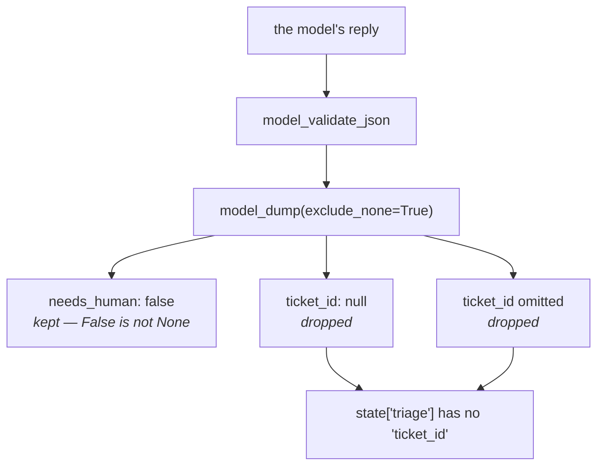

# 2.2 — Optional, default, and null

## One-line answer

*Required*, *defaulted* and *nullable* are three different instructions to the model — and by the time
the answer reaches session state, `exclude_none=True` has made *"the model said null"* and *"the model
skipped it"* indistinguishable.

---

## The story

The tick boxes on a takeaway order card.

There is a line that says **onions**, with a box. Three things can happen to that box, and everybody who
has ever ordered food knows the difference between them even if nobody has ever said it out loud.

**You tick it.** You want onions. Unambiguous.

**You leave it blank.** The shop has a house rule for blank: onions, because that is how the dish comes.
You did not say anything and the default applied.

**You cross it out and write "NO onions" beside it.** You said something. It is not the default and it
is not silence; it is an instruction, and it is the one the kitchen actually reads.

Now the failure. The order gets printed on a little thermal slip for the kitchen, and the slip only
prints the boxes that were **ticked**. Your crossing-out does not appear. Neither does anybody else's
blank. From the kitchen's side, *"no onions"* and *"didn't say"* look exactly the same — and they come
out of the same fryer.

That last paragraph is `model_dump(exclude_none=True)`.

---

## The idea in plain language

Four ways to declare a field, and they are four different sentences to the model.

```python
class Triage(BaseModel):
    summary: str                                              # required
    needs_human: bool = False                                 # defaulted
    ticket_id: str | None = None                              # nullable and defaulted
    refund_amount: int | None = Field(default=None, ...)       # the same, said explicitly
```

**Line by line:**

- `summary: str` — no default, so it is in `required`. The sentence to the model is **"you must produce
  one of these."**
- `needs_human: bool = False` — a Python default, so it leaves `required` and gains a `"default": false`
  in the schema. The sentence is **"say something only if it is not the usual answer."**
- `ticket_id: str | None = None` — the type itself admits `None`, so the model may *state* that there
  isn't one. The sentence is **"answer, or say explicitly that there is nothing to answer."**
- `refund_amount: int | None = Field(default=None, ...)` — the same declaration written the long way,
  which is what you use when you also want a `description`. Identical in effect.

### The three sentences, side by side

| Declaration | In `required`? | What the model is told |
| --- | --- | --- |
| `x: str` | yes | always produce one |
| `x: str = "billing"` | no | produce one only if it differs from this |
| `x: str \| None = None` | no | produce one, or say there is none |

The middle row is the one people under-use, and it is the cheapest accuracy improvement in a schema: a
sensible default removes a decision from every call where the default is right.

### And then the flattening

Here is what makes this more than pedantry. `validate_schema` ends with:

> `schema.model_validate_json(json_text).model_dump(exclude_none=True)`

So a field whose value is `None` — whether because the model **said** `null` or because the model
**omitted it** and the default is `None` — is **not in the dictionary at all**. Verified below: the
"bare minimum" reply and the "explicit nulls" reply produce byte-identical state.

Three consequences, and the third is the one that will cost you an afternoon:

1. **Read optional fields with `.get()`.** Subscripting works until it does not.
2. **`needs_human=False` survives** — `False` is not `None`. A defaulted non-`None` field is always
   present. A defaulted `None` field never is.
3. **You cannot tell a stated absence from a skipped field.** If that distinction matters — *"the
   ticket says there is no order number"* against *"the model did not consider it"* — a nullable field
   cannot carry it. Use a value that is not `None`: a `Literal["not_stated"]`, or a separate boolean.

---

## Why Sutra needs it

**`Triage` has fields that genuinely may not have an answer.** An order id, a refund amount, a device
model. Every one of them is a nullable field, which means every one of them is a `.get()` downstream.

**[4.2](../04-when-a-schema-lies/4.2-the-field-that-was-always-filled.md)** is what happens when you
make one of them required instead: the model produces something rather than nothing, and it is
fabrication with a valid schema.

**[6.1](../06-in-the-graph/6.1-output-key-is-how-agents-talk.md)** is the second agent reading these
keys out of state, where a `KeyError` becomes somebody else's crash.

**Day 17** is state properly, where the shape of `state["triage"]` stops being implicit.

---

## The mechanism

Four declarations, four replies, and what survives. **No model call, no cost:**

```python
# lab/optional.py - required, defaulted and nullable are three different instructions.
import json

from google.adk.tools.set_model_response_tool import SetModelResponseTool
from google.adk.utils._schema_utils import validate_schema
from pydantic import BaseModel, Field, ValidationError


class Triage(BaseModel):
    summary: str = Field(description="required: the model must produce one")
    needs_human: bool = False  # defaulted: the model may skip it
    ticket_id: str | None = None  # nullable and defaulted: it may say 'none'
    refund_amount: int | None = Field(default=None, description="nullable, no default value")


declared = SetModelResponseTool(Triage)._get_declaration().parameters_json_schema
print("required, as the model is told:", declared["required"])
print()

for label, said in (
    (
        "everything",
        '{"summary": "s", "needs_human": true, "ticket_id": "T-1", "refund_amount": 500}',
    ),
    ("bare minimum", '{"summary": "s"}'),
    ("explicit nulls", '{"summary": "s", "ticket_id": null, "refund_amount": null}'),
    ("summary missing", '{"needs_human": true}'),
):
    try:
        value = validate_schema(Triage, said)
        print(f"  {label:<16} -> {json.dumps(value)}")
    except ValidationError as error:
        print(f"  {label:<16} -> ValidationError: {str(error).splitlines()[2].strip()}")
```

**Line by line:**

- The four fields are written in the four styles deliberately, with the comment on each saying which
  sentence it is. In product code you would not mix `= None` and `Field(default=None)` in one class;
  here the point is that they are the same.
- `SetModelResponseTool(Triage)._get_declaration()` first, because `required` is the *only* part of this
  the model is actually told. Everything after it is what happens to the reply.
- The four replies are chosen to be the four realistic cases: a complete answer, a minimal answer, an
  answer that explicitly nulls the optional fields, and a broken answer.
- `"explicit nulls"` and `"bare minimum"` differ **only** in whether the nulls are stated. If they
  produce the same output, the distinction has been lost — which is the finding.
- `str(error).splitlines()[2]` — Pydantic's error text puts the count on line 1 and the field on line 2,
  so line 3 (index 2) is the message. Fragile, and fine in a lab script whose job is to fit the message
  on one line.
- `json.dumps(value)` rather than printing the dict, so an absent key is visibly absent rather than
  ambiguous punctuation.

The output:

```text
required, as the model is told: ['summary']

  everything       -> {"summary": "s", "needs_human": true, "ticket_id": "T-1", "refund_amount": 500}
  bare minimum     -> {"summary": "s", "needs_human": false}
  explicit nulls   -> {"summary": "s", "needs_human": false}
  summary missing  -> ValidationError: Field required [type=missing, input_value={'needs_human': True}, input_type=dict]
```

Read the first line and then rows two and three.

Only `summary` is required, which is correct — three of the four fields are things the model may
legitimately not answer.

And rows two and three are **identical**. One reply said nothing about `ticket_id`; the other said, in JSON,
that there is none. They arrive in state the same way, and there is no recovering the difference.

And notice `needs_human` in both: `false`, present, because a default that is not `None` survives
`exclude_none`. Two optional fields, two different fates, decided by whether the default happens to be
`None`.



---

## When it breaks

**💥 The `KeyError` on a field you declared.**

```text
KeyError: 'ticket_id'
```

Already met on [1.2](../01-the-shape-on-the-way-out/1.2-the-answer-with-an-address.md), and this is
where it comes from. The rule, worth writing on the schema itself: **anything `| None` is absent, not
`None`, downstream.**

**💥 The `None` that was supposed to mean something.**

No error. You made `refund_amount: int | None = None` intending `None` to mean *"the customer did not
ask for a refund"*, and it is now indistinguishable from *"the model did not fill this field in"*. If
the distinction is real, encode it as a value:

```python
refund_amount: int | Literal["not_requested"] | None = None
```

**Line by line:**

- `Literal["not_requested"]` — a **stated** absence, which is a string and therefore survives
  `exclude_none`. The model can now say the thing you wanted it to be able to say.
- `| None = None` kept as well — because there is still a third case, *"the model did not get to this"*,
  and collapsing it into the second would be the same mistake one level up.
- The cost is real: every reader now handles three cases instead of two. Only do this where the
  distinction changes what somebody does.

**💥 The required field on an optional fact.**

```text
ValidationError: Field required [type=missing, input_value={'needs_human': True}, input_type=dict]
```

Loud here, because the fixture omitted it deliberately. In production the model does not omit required
fields — it invents them, which is
[4.2](../04-when-a-schema-lies/4.2-the-field-that-was-always-filled.md) and produces no error at all.

**💥 The default that answered on the model's behalf.**

No error. `urgency: int = 3` looks kind and means *"do not think about urgency unless it is unusual"* —
and a model that is uncertain will take the offer. ADK's own guidance for tool parameters says it
exactly: *"Do not add defaults for information the model should derive from the user request."*
([Day 10, part 1.3](../../../day-10-function-tools/parts/01-the-form-fills-itself/1.3-type-hints-are-the-schema.md)).
The same sentence applies to an output schema, with the direction reversed.

---

## In production

**What a professional writes instead of the teaching version** is a schema where the optionality of each
field is a decision with a sentence behind it, and the sentence is in the `description`. *"Only if the
ticket states one"* is worth four words. Fields drift towards required over time, because required is
what you type when you are not thinking, and the `description` is what stops the drift being invisible.

**What degrades at scale** is the `.get()` discipline. One optional field is easy. Eight, read by three
different downstream consumers written by three different people, and one of them subscripts. The
structural fix is to stop passing the raw dict around: parse `state["triage"]` back into the Pydantic
model at the point of consumption, and let the model's own defaults reinstate the `None`s that
`exclude_none` removed. **Round-tripping through the class restores the shape** — and it is two lines.

**The failure that only shows with real traffic** is the field that is optional in reality and required
in the schema. Every development ticket has an order number, because you wrote the fixtures from real
tickets that had one. A third of production tickets do not, and the model — which cannot leave a
required field blank — supplies a plausible number. There is no error, no validation failure and no
anomaly in the logs; there is a small, steady rate of refunds attached to somebody else's order.

**The review comment a senior engineer leaves:** *"`order_id` is required, and plenty of tickets don't
mention one — that's an instruction to the model to always have an answer, and it'll comply. Make it
`str | None`. And downstream, parse the state dict back into `Triage` instead of subscripting it;
`exclude_none` drops the nulls, so `state['triage']['order_id']` is a `KeyError` waiting for the first
ticket without an order."*

**The interview question:** *"what's the difference between an optional field and a nullable one?"* The
answer that shows you have debugged one: "Three different things, and they're three different
instructions to the model. Required says always produce an answer. A non-null default says only speak up
if it isn't the usual value — that's the cheapest accuracy win, because it removes a decision. Nullable
says answer or state that there's nothing to answer. The catch is what survives: the framework dumps the
validated model with nulls excluded, so a nullable field is *absent* from state, not `None` — and a
reply that explicitly said `null` is byte-identical to a reply that skipped the field. So every
downstream read is a `.get`, or better, you round-trip the dict back through the Pydantic class so the
defaults come back. And if a stated absence genuinely means something different from a skipped field,
`None` can't carry it; you need a real value like a `not_stated` literal."

---

## Check yourself

```bash
uv run python days/day-12-structured-output/lab/optional.py
```

Then change `needs_human: bool = False` to `needs_human: bool | None = None` and watch it vanish from
the last two rows.

**Answer out loud, without scrolling up:**

> Give the three declarations and the sentence each one says to the model. Then say which optional
> fields survive into state and which do not, and why.

---

**Next:** [2.3 — The descriptions that do not arrive](2.3-the-descriptions-that-do-not-arrive.md)
