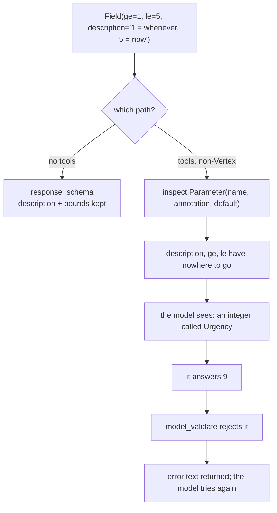

# 2.3 — The descriptions that do not arrive

## One-line answer

On the path Sutra is actually on, `Field(description=...)` and numeric bounds like `ge`/`le` are
**stripped out** of what the model is shown — Pydantic still enforces them afterwards, so the
constraint survives as a retry loop instead of as an instruction.

---

## The story

A recipe copied at the photocopy shop.

The original is a page from an aunt's notebook, and the useful half of it is not the printed recipe —
it is what she wrote around the edges. *Half this much salt.* *Not the big pan.* *Take it off before it
looks done.* Twenty years of corrections in pencil in the margin.

The shop's machine is set for high contrast, which makes the printed text beautifully crisp. The
pencil, being grey, comes out as nothing at all.

You get home with a clean copy of the recipe and no idea about the salt.

The dish is still edible — the printed recipe is a real recipe — and it is not the dish she makes. And
the failure is quiet: nothing is missing from the page, because the notes were never *on* the page in a
way the copier could see. You would only find out by putting the two sheets side by side.

That is `Field(description=...)` on an output schema, when the agent has tools.

---

## The idea in plain language

### Two paths, one schema

[1.1](../01-the-shape-on-the-way-out/1.1-a-shape-on-the-answer.md) mentioned it and
[section 3](../03-schema-and-tools-together/3.1-the-rule-that-changed.md) explains it properly. The
short version, because this part cannot be understood without it:

- **No tools** → your schema goes to the provider as `response_schema`. The **native** path.
- **Tools, on a model that cannot do both** → ADK invents a tool called `set_model_response` whose
  parameters are your schema's fields. The **workaround** path.

Sutra has tools, and Sutra runs on the free Gemini API rather than Vertex, so **Sutra is on the
workaround path**. That is not a detail of this day; it is which column of the table below you live in.

### What each path carries

Measured below, for the same three-field schema:

| | descriptions | `ge` / `le` bounds | `Literal` enums |
| --- | --- | --- | --- |
| native path | **all three** | **kept** | kept |
| workaround path | **none** | **dropped** | kept |

The enums survive everywhere, which is why
[2.1](2.1-a-schema-a-model-can-fill.md) put `Literal` at the top of its list. Everything else you write
inside `Field(...)` may or may not reach the model depending on a configuration decision made elsewhere.

### Why it happens

Not a bug, and worth understanding rather than resenting.

`SetModelResponseTool` builds a **synthetic Python function** whose parameters are your model's fields,
and then generates a declaration from that function the ordinary way. The line that does it:

```python
inspect.Parameter(
    field_name,
    inspect.Parameter.KEYWORD_ONLY,
    annotation=field_info.annotation,
    default=(...),
)
```

**Line by line:**

- `field_name` — the name survives, because a parameter has a name.
- `annotation=field_info.annotation` — the **type** survives, which is why `Literal` and therefore
  `enum` survive: the enum is part of the type.
- `default=(...)` — the default survives, which is why `2.2`'s defaulted fields still show a `"default"`.
- And **that is the whole list.** A `Field`'s `description`, `ge`, `le`, `pattern` and the rest are
  Pydantic metadata attached to the *field*, not to the *annotation*. A `inspect.Parameter` has nowhere
  to put them, so they are not carried across.

This is the same shape as
[Day 10, part 1.2](../../../day-10-function-tools/parts/01-the-form-fills-itself/1.2-the-docstring-is-the-description.md)'s
finding that per-parameter descriptions do not reach a tool's schema. Two different mechanisms, one
recurring consequence: **in ADK 2.7.1, per-field description text has a habit of not arriving.**

### What survives the loss

The constraint is not gone — it has **moved**. `SetModelResponseTool.run_async` validates the model's
arguments with `output_schema.model_validate(args)`, and on a `ValidationError` it returns, verbatim:

> *"Validation Error found:\n{e}\nRecall the set_model_response function correctly, fix the errors, and
> call it again with all required fields using the correct types."*

So `ge=1, le=5` is enforced — as a **rejection and a retry**, after a model call, rather than as an
instruction the model had before it answered.

That is the trade, stated plainly:

| | told in advance | enforced |
| --- | --- | --- |
| native path | yes | by constrained decoding |
| workaround path | no | by a retry loop, one model call at a time |

### What to do about it

**Put the constraint where the model will see it.** Three options, in order:

1. **Encode it in the type.** `Literal[1, 2, 3, 4, 5]` instead of `int` with `ge`/`le`. Ugly, and it
   survives both paths.
2. **Put it in the field name.** `urgency_1_to_5` is not elegant and it is text the model reads on the
   workaround path.
3. **Put it in the instruction.** The agent's instruction is always sent. One line — *"urgency is 1 to
   5"* — costs a few tokens on every turn and arrives on both paths.

And **keep writing the `description`s anyway.** They reach the model on the native path, and they reach
every human who maintains the schema on both.

---

## Why Sutra needs it

**Sutra's `Triage` has a bounded `urgency`.** Written as `Field(ge=1, le=5)` it is invisible to the
model on Sutra's path, and the first thing you would notice is a retry.

**[3.3](../03-schema-and-tools-together/3.3-what-that-costs-you.md)** is the full accounting of the
workaround path, of which this is the first item.

**[2.4](2.4-the-schema-is-the-prompt-again.md)** is what the surviving text costs on every turn.

**Day 31** is the quality gate, and *"every output-schema field is either a `Literal` or named
self-explanatorily"* is the kind of rule that is easier to lint than to remember.

---

## The mechanism

The same schema, seen from both sides. **No model call, no cost:**

```python
# lab/dropped.py - what a Field(...) carries, and how much of it reaches the model.
import asyncio
import json
from typing import Literal

from google.adk.tools.set_model_response_tool import SetModelResponseTool
from google.adk.utils._schema_utils import validate_schema
from pydantic import BaseModel, Field, ValidationError


class Triage(BaseModel):
    category: Literal["billing", "technical", "account"] = Field(
        description="which queue it goes to"
    )
    urgency: int = Field(ge=1, le=5, description="1 = whenever, 5 = now")
    summary: str = Field(description="one sentence, no jargon")


def keys_of(properties: dict) -> dict:
    """Which annotations survived, per field."""
    return {name: sorted(spec) for name, spec in properties.items()}


pydantic_schema = Triage.model_json_schema()
declared = SetModelResponseTool(Triage)._get_declaration().parameters_json_schema

print("what Pydantic knows:")
print(" ", json.dumps(keys_of(pydantic_schema["properties"])))
print()
print("what reaches the model through set_model_response:")
print(" ", json.dumps(keys_of(declared["properties"])))
print()

lost = {
    name: sorted(set(pydantic_schema["properties"][name]) - set(declared["properties"][name]))
    for name in pydantic_schema["properties"]
}
print("lost on the way:", json.dumps(lost))
print()

print("but Pydantic still enforces it at validation time:")
try:
    validate_schema(Triage, '{"category": "billing", "urgency": 9, "summary": "x"}')
except ValidationError as error:
    print("  ", str(error).splitlines()[2].strip())


async def main() -> None:
    tool = SetModelResponseTool(Triage)
    result = await tool.run_async(
        args={"category": "billing", "urgency": 9, "summary": "x"}, tool_context=None
    )
    print()
    print("and what the model is handed back instead of a result:")
    print("  ", json.dumps(result)[:180], "...")


asyncio.run(main())
```

**Line by line:**

- `keys_of(properties)` returning the **sorted key names** rather than the values — the question is which
  annotations exist, not what they say, and comparing name sets makes the loss computable rather than
  spotted by eye.
- `Triage.model_json_schema()` — Pydantic's own view, which is the upper bound on what could possibly be
  carried.
- `SetModelResponseTool(Triage)._get_declaration()` — the lower bound: what the model is actually shown
  on Sutra's path.
- `lost` computed as a **set difference** per field, so the finding is derived rather than asserted. If a
  future ADK carries descriptions across, this prints `[]` and the document is wrong — which is the
  point of computing it.
- `validate_schema(Triage, ...)` with `urgency: 9` — a value the model was never told was out of range,
  chosen to show the constraint still exists somewhere.
- `tool.run_async(args=..., tool_context=None)` — the real dispatch path. `tool_context=None` is safe
  **only** because the validation error returns before the context is touched; the success path assigns
  `tool_context.actions.set_model_response`, so a valid argument set here would raise. That is a lab
  shortcut and worth knowing is one.
- `json.dumps(result)[:180]` — the error dictionary is long, and the useful half is the front.

The output:

```text
what Pydantic knows:
  {"category": ["description", "enum", "title", "type"], "urgency": ["description", "maximum", "minimum", "title", "type"], "summary": ["description", "title", "type"]}

what reaches the model through set_model_response:
  {"category": ["enum", "title", "type"], "urgency": ["title", "type"], "summary": ["title", "type"]}

lost on the way: {"category": ["description"], "urgency": ["description", "maximum", "minimum"], "summary": ["description"]}

but Pydantic still enforces it at validation time:
   Input should be less than or equal to 5 [type=less_than_equal, input_value=9, input_type=int]

and what the model is handed back instead of a result:
   {"error": "Validation Error found:\n1 validation error for Triage\nurgency\n  Input should be less than or equal to 5 [type=less_than_equal, input_value=9, input_type=int]\n    For ...
```

Read the `lost` line. **Every description, and both of `urgency`'s bounds.** What is left of `urgency` is
`title` and `type` — the model is told there is an integer called Urgency and nothing else at all.

Then read the last two blocks together, because they are the consolation and the cost in one place. The
bound is real: `9` is rejected. It is rejected **after** the model produced it, and the model is handed
an error message and asked to go again — which is a second model call, a second charge against
[Day 10's `max_llm_calls`](../../../day-10-function-tools/parts/03-the-dispatch-you-deleted/3.3-the-brakes-still-matter.md),
and a second chance to be wrong.



---

## When it breaks

**💥 The bound the model never knew about.**

```text
{"error": "Validation Error found:\n1 validation error for Triage\nurgency\n  Input should be less
than or equal to 5 ..."}
```

Not an exception — a **tool result**, handed back to the model. The run continues, one call poorer. In
a log this looks like the model making a mistake; it is closer to the model answering a question it was
not asked.

**💥 The retry loop that ran out of calls.**

```text
LlmCallsLimitExceededError: Max number of llm calls limit of `8` exceeded
```

A schema the model keeps failing to satisfy — a tight `pattern`, a bound it cannot see — turns into
repeated `set_model_response` attempts until `max_llm_calls` stops the run. Day 10 set that brake for
exactly this class of situation, and this is a new way to hit it.

**💥 The description that was doing all the work.**

No error, and this is the expensive one. A field called `priority` with the description *"our priority,
not the customer's stated priority"* is unambiguous on the native path and a coin toss on the
workaround path. **A schema that reads well and behaves badly is a schema whose descriptions were
carrying it**, and nothing in the code review shows the difference.

**💥 The version that fixes it.**

Also worth naming: this is a **2.7.1 observation**, not a law. If a later ADK carries `Field` metadata
into the synthesized declaration, the `lost` line above prints `[]`, your model gets better instructions
for free, and this part is out of date. Run the script rather than trusting it.

---

## In production

**What a professional writes instead of the teaching version** is a constraint expressed in the type
wherever the type can hold it: `Literal` for closed sets, and a bounded integer written as
`Literal[1, 2, 3, 4, 5]` if the range is short enough for that not to be absurd. It is less elegant
Python and it is the version that behaves identically on both paths, which is worth more than elegance
in a system where the path depends on whether somebody added a tool.

**What degrades at scale** is the gap between the schema you read and the schema the model sees. One
person writes rich `Field` descriptions; another reviews them and approves; a third debugs a model that
appears to ignore them. Nobody in that chain is wrong, and the only thing that closes the gap is a
script that prints what is actually sent — which is why
[the day's §8](../../LESSON.md) insists on running one rather than reading a table.

**The failure that only shows with real traffic** is retry cost. In development the schema is satisfied
first time, because your fixtures were written by somebody who knew the bounds. In production a small
percentage of tickets produce an out-of-range `urgency`, each one costing an extra model call, and on a
twenty-a-day free tier a 10% retry rate is two requests you did not budget for. It is not a correctness
failure; it is a **quota** failure, which is the currency Sutra is actually denominated in.

**The review comment a senior engineer leaves:** *"These `Field` descriptions don't reach the model on
our path — we have tools and we're not on Vertex, so the schema is turned into a synthesized tool that
only carries name, type and default. Move the important ones into the instruction, and make `urgency` a
`Literal[1,2,3,4,5]` so the range survives. Keep the descriptions for us."*

**The interview question:** *"do field descriptions in a structured-output schema actually reach the
model?"* The answer that shows you have checked rather than assumed: "It depends which path the request
takes, and that's the thing worth checking rather than assuming. If the schema goes to the provider as a
response schema, the whole thing goes — descriptions, numeric bounds, everything. If the framework has
to fall back to a synthesized tool because the agent also has tools, the parameters are rebuilt from
`inspect.Parameter` objects that carry only name, type and default — so descriptions and `ge`/`le`
bounds are dropped, while `Literal` enums survive because the enum is part of the type. The constraint
isn't lost, it moves: Pydantic still validates the arguments and returns an error message asking the
model to try again, so a bound becomes a retry loop instead of an instruction. That costs a model call
per failure, which on a quota-limited tier is the real cost. So I encode constraints in the type where I
can, put the important ones in the instruction, and keep the descriptions for the humans."

---

## Check yourself

```bash
uv run python days/day-12-structured-output/lab/dropped.py
```

Then change `urgency` to `Literal[1, 2, 3, 4, 5]` and run it again — the range appears in the `enum` and
the `lost` line for that field goes quiet.

**Answer out loud, without scrolling up:**

> Say which parts of a `Field(...)` survive to the model on Sutra's path, and why exactly those. Then
> say where the dropped constraint went, and what it costs each time it fires.

---

**Next:** [2.4 — The schema is the prompt again](2.4-the-schema-is-the-prompt-again.md)
