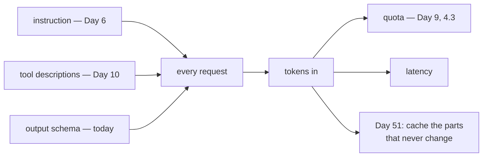

# 2.4 — The schema is the prompt again

## One-line answer

A schema is text, sent on every turn, exactly like the instruction from Day 6 and the tool descriptions
from Day 10 — so it is a budget line, and the way to shrink it is fewer fields, never shorter names.

---

## The story

The safety card in the seat pocket.

It is a stiff plastic sheet with pictures on it, and it is genuinely useful — not decoration,
regulation. Somebody designed it carefully.

Now count. One card per seat. Roughly 180 seats. One aircraft in a fleet of a hundred. It is on the
aircraft on every flight, whether or not a single passenger looks at it, and it weighs a small amount,
and that small amount is carried into the air several times a day for years.

Airlines do the arithmetic. There is a whole small discipline of it — thinner cards, lighter trolleys,
less water in the tanks — and it is not stinginess. **A cost that is trivial per unit and paid on every
unit is not a trivial cost.**

Nobody proposes removing the card. What they do is stop putting *unnecessary* things in the seat
pocket.

---

## The idea in plain language

You have met this shape twice already and this is the third time, which is the point of the part.

[Day 6](../../../day-06-instructions-and-personas/parts/01-writing-the-handbook/1.5-every-line-is-a-tax.md)
— the instruction is sent on every turn.
[Day 10, part 1.2](../../../day-10-function-tools/parts/01-the-form-fills-itself/1.2-the-docstring-is-the-description.md)
— every tool's whole docstring is sent on every turn, whether or not the tool is called.

And now: **your output schema is serialised and sent on every turn too.** Either as `response_schema` on
the request or as a `set_model_response` declaration, depending on
[section 3](../03-schema-and-tools-together/3.1-the-rule-that-changed.md)'s path.

Measured below, for the same three fields written two ways:

| | native path | workaround path |
| --- | --- | --- |
| terse names, no descriptions | 282 chars | 263 chars |
| readable names, descriptions, bounds | 522 chars | 320 chars |

### The two things worth reading in that table

**The readable schema is bigger.** 522 against 282 on the native path — roughly double, for the same
three facts. That is what descriptions cost.

**And the gap nearly closes on the workaround path.** 320 against 263, because
[2.3](2.3-the-descriptions-that-do-not-arrive.md)'s dropped descriptions were most of the difference.
Which means the honest summary of the workaround path is: **you pay less and you get less.** The
saving is not a saving; it is the instructions going missing.

### The lever that is not the lever

Reading 522 against 282, the tempting move is to shorten names and drop descriptions. Do not.
[2.1](2.1-a-schema-a-model-can-fill.md) argued against it on accuracy grounds and the arithmetic argues
against it too: the difference between `category` and `cat` is six characters on every turn, against a
measurable drop in how reliably the field is filled. You are trading something that matters for
something that does not.

**The lever is field count.** A field costs its name, its type, its title, its description if that
survives, and — the part that is not in the character count — **a decision the model has to make
correctly**. Removing a field you do not use saves all four.

### And the credit side

Before `output_schema`, getting JSON out of a model meant writing it into the instruction: *"Reply only
with a JSON object. It must have the keys category, urgency and summary. Do not add any other text. Do
not wrap it in a code fence."* Five or six lines of prompt, sent every turn, and still only a request.

The schema replaces those lines, is shorter than them, and — on the native path — is not a request at
all. **The schema is usually a net saving against the prompt it replaced**, and the arithmetic in this
part is about spending the remainder well, not about whether to spend it.

---

## Why Sutra needs it

**Sutra's budget is quota, not money** ([Day 9, part 4.3](../../../day-09-four-free-providers/parts/04-the-benchmark/4.3-three-shops-three-closing-times.md)),
and tokens per request feed directly into how many requests a day the free tier gives you.

**Day 24** is token economics properly, where the instruction, the tool declarations, the schema and the
conversation history are added up in one place. Today's number is one of that day's inputs.

**Day 51** is caching, which is the real answer to *"the same text on every turn"* — and knowing which
parts of the request are identical every time is what makes caching possible.

**[3.3](../03-schema-and-tools-together/3.3-what-that-costs-you.md)** is the rest of the workaround
path's bill, of which this is one line.

---

## The mechanism

The same three fields, priced four ways. **No model call, no cost:**

```python
# lab/the_prompt_again.py - a schema is text, and text is sent on every turn.
import json
from typing import Literal

from google.adk.tools.set_model_response_tool import SetModelResponseTool
from google.genai._transformers import t_schema
from pydantic import BaseModel, Field


class Terse(BaseModel):
    c: Literal["billing", "technical", "account"]
    u: int
    s: str


class Readable(BaseModel):
    category: Literal["billing", "technical", "account"] = Field(
        description="which queue it goes to"
    )
    urgency: int = Field(ge=1, le=5, description="1 = whenever, 5 = now")
    summary: str = Field(description="one sentence a human can read")


for schema in (Terse, Readable):
    native = json.dumps(t_schema(None, schema).model_dump(exclude_none=True))
    forced = json.dumps(SetModelResponseTool(schema)._get_declaration().parameters_json_schema)
    print(
        f"  {schema.__name__:<9} native path {len(native):>4} chars   "
        f"workaround path {len(forced):>4} chars"
    )

print()
print("both are sent on every turn the agent takes, like an instruction.")
```

**Line by line:**

- `Terse` and `Readable` carry **exactly the same three facts** — a closed category, an integer, a
  string. Everything different in the numbers comes from names, descriptions and bounds.
- `Terse`'s fields are one letter each, which nobody would ship. It is the floor, present so the other
  numbers have something to be measured against.
- `t_schema(None, schema)` — the `google.genai` transformer that turns a Pydantic class into the
  provider's `Schema` object. That is what actually goes on the wire for `response_schema`, so
  serialising *it* is the honest measurement rather than serialising the Pydantic schema.
- `.model_dump(exclude_none=True)` before `json.dumps` — the provider's object is full of unset optional
  fields, and counting `None`s would inflate the native path's number for no reason.
- `SetModelResponseTool(schema)._get_declaration().parameters_json_schema` for the other column — the
  same measurement taken at the other end of
  [2.3](2.3-the-descriptions-that-do-not-arrive.md)'s fork.
- Characters, not tokens. Tokens need a tokenizer and are model-specific; the **ratio** is what the
  argument rests on, and characters carry a ratio faithfully.
- The closing `print` is a sentence rather than a number, because the numbers mean nothing without it.

The output:

```text
  Terse     native path  282 chars   workaround path  263 chars
  Readable  native path  522 chars   workaround path  320 chars

both are sent on every turn the agent takes, like an instruction.
```

Read the `Readable` row first: **522 characters, on every turn**, for a three-field schema. A ten-field
schema is not ten characters more.

Then read down the workaround column: **320 against 522**. The workaround path is cheaper for the same
schema, and it is cheaper for a bad reason — the descriptions and bounds that made up the difference
were dropped, not compressed.

And then read the `Terse` row and do not act on it. Nineteen characters separate `Terse` from `Readable`
on the workaround path, because with the descriptions gone the only difference left is the field names.
**Nineteen characters is not worth `c` instead of `category`.**



---

## When it breaks

**💥 The schema that grew a field a month.**

No error. Nothing about a fourteen-field schema fails; it costs more per turn, and each of the fourteen
is a decision. The symptom is accuracy: the fields added last are filled worst, and the fields added
first start being filled worse than they used to be. Nothing in a diff shows a regression, because each
diff added exactly one field.

**💥 The optimisation that made it worse.**

```python
c: Literal["b", "t", "a"]
```

Nineteen characters saved, and now the model must map *"billing"* to `"b"` with no help. Both
[2.1](2.1-a-schema-a-model-can-fill.md) and this part say the same thing from different directions:
**names are for the model, not for the wire.**

**💥 The number nobody has.**

Not an error either, and it is the reason this part exists. Most teams cannot say what their per-turn
overhead is — instruction, tool declarations, schema — because nobody has added it up. The fix is one
script and it is Day 24's, and the habit of running it starts now.

---

## In production

**What a professional writes instead of the teaching version** is a test that asserts an upper bound on
the schema's serialised size — not because the exact number matters, but because it turns a slow drift
into a red build. `assert len(json.dumps(...)) < 600` is a rude, effective way of making somebody
justify the fourteenth field.

**What degrades at scale** is the total, not any one part. The instruction is 300 characters, the two
tool descriptions are 900, the schema is 500, and the conversation history grows every turn. Each was
added by somebody who checked only their own contribution. The arithmetic only exists if somebody keeps
it, which is Day 24's job and the reason it is a whole day.

**The failure that only shows with real traffic** is the interaction with history. A fixed per-turn
overhead is harmless on turn one and is still there on turn forty, by which point the conversation has
grown around it and the request is close to a limit you did not know you had. Long conversations are a
production phenomenon — nobody's test fixture has forty turns — and the first sign is a truncation or a
cost that does not match the model of it in your head.

**The review comment a senior engineer leaves:** *"Fine to add the field, but we're at eleven now and
they all ship on every turn. Which of the eleven does anything downstream actually read? Drop the ones
nothing reads, and put a size assertion on the schema so the next one is a conversation."*

**The interview question:** *"what does a structured-output schema cost?"* The answer that shows you
have measured one: "It's prompt text, so it costs on every turn, exactly like the system instruction and
the tool descriptions. For a readable three-field schema I measured around 500 characters going to the
provider, roughly double the same three fields with one-letter names and no descriptions — but the right
response to that is not shorter names, because the accuracy you lose is worth more than the characters
you save. The lever is field count: a field costs its name, its type, its description, and a decision
the model has to get right. It's also worth saying the credit side — the schema replaces the five lines
of 'reply only with JSON, these keys, no code fence' that you'd otherwise have in the instruction, and
it's usually shorter and actually enforced. The number that matters is the total per-turn overhead
across instruction, tools and schema, and most teams don't have it."

---

## Check yourself

```bash
uv run python days/day-12-structured-output/lab/the_prompt_again.py
```

Then add three more fields to `Readable` and watch both columns grow. Write down the per-field cost.

**Answer out loud, without scrolling up:**

> Name the three things sent on every turn and which day taught each one. Then say the right lever for
> shrinking a schema and the wrong one, and why the workaround path's smaller number is not good news.

---

**Next:** [3.1 — The rule that changed](../03-schema-and-tools-together/3.1-the-rule-that-changed.md)
