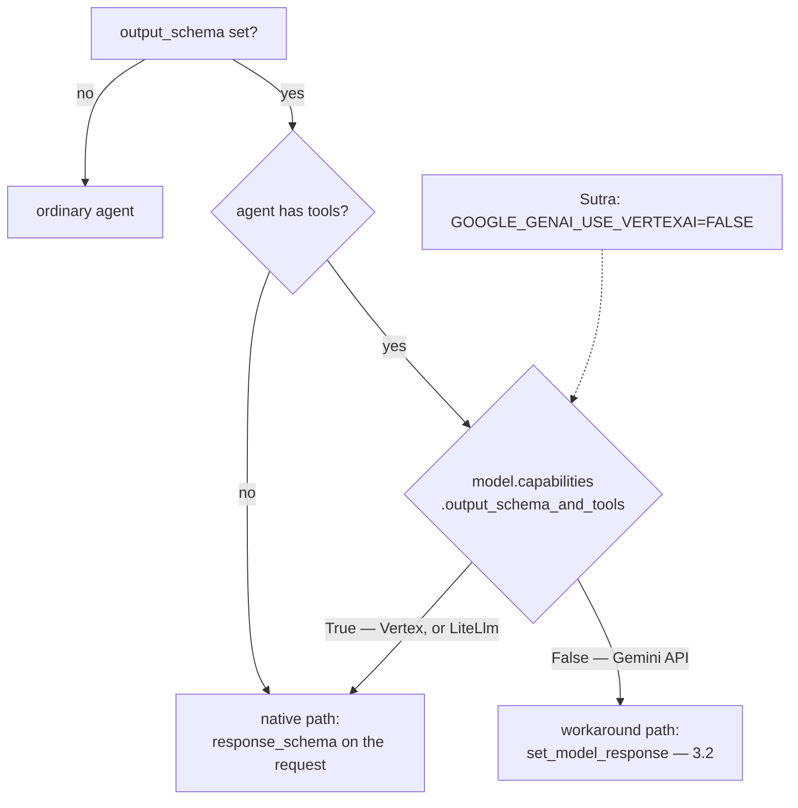

# 3.1 — The rule that changed

## One-line answer

"An agent with an `output_schema` cannot have tools" was true, is quoted everywhere, and is **not** how
ADK 2.x behaves — but the thing that replaced it is decided by a model capability, and on Sutra's free
Gemini lane that capability is `False`.

---

## The story

The bus route that used to skip your stop.

For years the 34 did not stop at the hospital. Everybody knew. You took it to the junction and walked
the last part, and if a newcomer asked, four people would tell them the same thing without hesitating,
because it was true and they had all done the walk.

Then they changed the route. A small notice went up at the depot. The 34 has stopped at the hospital
for eighteen months now.

And people still walk from the junction.

Not out of stubbornness — out of **confidence**. Nobody re-checks a fact they are sure of, and a rule
that everybody agrees on is the last kind of rule anybody looks up. The people most certain about the
34 are the ones who have been taking it longest.

That is the state of "output schema and tools cannot coexist".

---

## The idea in plain language

### What the rule was

In ADK 1.x, setting `output_schema` on an agent that had tools was refused. The reason was real: the
underlying model APIs would not accept a response schema and a tool list in the same request, so a
framework that let you configure both would be promising something it could not deliver.

The rule is still in circulation, and — importantly — **it is still on the documentation**. adk.dev's
LlmAgent page says:

> *"Using `output_schema` with `tools` in the same LLM request is only supported by specific models,
> including Gemini 3.0."*

and its example carries the comment:

> *"# *** NO tools parameter here - using output_schema prevents tool use ***"*

### What the installed package says

The docstring on the field itself, in `google-adk` 2.7.1:

> *"NOTE: The ADK supports using `output_schema` and `tools` together. It works by exposing tools
> during the thought loop and enforcing structure only on the final output."*

**Both of these are true and they are about different things.** The page is describing what a *model
API* accepts in one request. The docstring is describing what *ADK* does for you when the model API
will not. Reading either one alone gives you a wrong picture, and Principle 8 exists for exactly this:
the documentation and the installed code are two sources and you check both, on the day.

### How ADK decides

One expression, in `basic.py`:

```python
if getattr(agent, "mode", None) != "task" and agent.output_schema:
    if not agent.tools or model.capabilities.output_schema_and_tools:
        llm_request.set_output_schema(agent.output_schema)
```

**Line by line:**

- `agent.output_schema` — nothing happens at all unless you set one.
- `not agent.tools` — **no tools means the native path**, unconditionally. This is
  [1.1](../01-the-shape-on-the-way-out/1.1-a-shape-on-the-answer.md)'s case.
- `or model.capabilities.output_schema_and_tools` — with tools, it comes down to the model. A model that
  can take both gets the native path anyway.
- `set_output_schema(...)` — the only line that sets `response_schema` and `response_mime_type`. If this
  `if` is false, neither field is ever set, and
  [3.2](3.2-the-tool-adk-injects.md)'s processor picks up the pieces.
- `mode != 'task'` — workflow-node agents (Phase 8) are excluded and handled elsewhere. Not today's
  subject; noted so the line is not mysterious.

### And what that capability actually is

`Gemini.capabilities.output_schema_and_tools` resolves through one function, and here is the whole of
it:

> `return get_google_llm_variant() == GoogleLLMVariant.VERTEX_AI and is_gemini_model(model_name)`

**A Gemini model on Vertex AI gets the native path. The same model on the Gemini API does not.** Not a
different model — a different *variant* of the same one.

Sutra sets `GOOGLE_GENAI_USE_VERTEXAI=FALSE`
([Day 5, part 3.3](../../../day-05-first-adk-agent/parts/03-the-model-pin/3.3-two-doors-to-gemini.md)),
because Vertex needs a billing account and Addendum 02 forbids one. So:

**Sutra is permanently on the workaround path, by a decision made on Day 5 for a different reason.**

`LiteLlm` is the other case worth knowing: ADK reports `True` for it, because LiteLLM handles the
tools-plus-response-format problem per provider itself. So Day 9's Groq and OpenRouter lanes behave
differently here from the Gemini lane — which is
[Day 9, part 3.3](../../../day-09-four-free-providers/parts/03-local/3.3-the-learner-driver.md)'s point
arriving in a place nobody expects it.

### The rule, restated correctly

> **You may set `output_schema` and `tools` together. Whether the provider enforces the schema, or ADK
> simulates it with an injected tool, depends on the model — and you should know which one you are on.**

---

## Why Sutra needs it

**Sutra has two tools and a triage schema**, so this decision is made on Sutra's behalf on every request
from today onwards.

**[3.2](3.2-the-tool-adk-injects.md)** is what actually happens on the workaround path, and
**[3.3](3.3-what-that-costs-you.md)** is what it costs.

**Day 16** brings built-in tools, which have their own constraints about coexisting with other tools —
the same *shape* of problem, and a good moment to remember not to trust a remembered rule.

**Day 90** is A2A, where "which of us enforces this?" stops being an implementation detail and becomes a
contract.

---

## The mechanism

Who decides, read off the machine. **No model call, no cost:**

```python
# lab/capability.py - who decides whether output_schema and tools can share a request.
import os

from google.adk.agents import LlmAgent
from google.adk.models._capabilities import gemini_output_schema_and_tools
from google.adk.utils.variant_utils import get_google_llm_variant
from pydantic import BaseModel


class Triage(BaseModel):
    category: str


def lookup_ticket(ticket_id: str) -> dict:
    """Read a ticket.

    Args:
        ticket_id: the id.
    """
    return {"status": "ok"}


print("GOOGLE_GENAI_USE_VERTEXAI =", os.environ.get("GOOGLE_GENAI_USE_VERTEXAI"))
print("resolved variant           =", get_google_llm_variant())
print()

for model in ("gemini-3.7-flash", "gemini-2.0-flash"):
    agent = LlmAgent(
        name="a",
        model=model,
        instruction="x",
        output_schema=Triage,
        tools=[lookup_ticket],
    )
    native = agent.canonical_model.capabilities.output_schema_and_tools
    print(f"  {model:<20} output_schema_and_tools = {native}")
    print(
        f"  {'':<20} -> "
        f"{'the provider enforces it' if native else 'ADK injects set_model_response'}"
    )

print()
print("the rule itself, read off ADK rather than remembered:")
print(
    "  gemini_output_schema_and_tools('gemini-3.7-flash') =",
    gemini_output_schema_and_tools("gemini-3.7-flash"),
)
print("  it is True only when the Vertex AI variant is in use.")
```

**Line by line:**

- `LlmAgent(..., output_schema=Triage, tools=[lookup_ticket])` **constructed without error** — the first
  finding, and the one that refutes the old rule. In 1.x this raised.
- `agent.canonical_model` rather than `agent.model` — the resolved object, not the string, which is
  [Day 9, part 1.2](../../../day-09-four-free-providers/parts/01-one-model-field/1.2-the-spare-tyre-you-never-checked.md)'s
  late derivation. Capabilities live on the resolved model.
- Two model strings, so the answer is visibly about the **variant** and not about a particular model.
- `get_google_llm_variant()` printed beside the raw environment variable — because the variable can be
  unset, `FALSE`, or absent from your shell while present in `.env`, and the *resolved* variant is the
  thing that decides.
- `gemini_output_schema_and_tools(...)` called directly at the end — ADK's own function, so the rule is
  quoted from the source rather than paraphrased.
- The ternary printing *"the provider enforces it"* or *"ADK injects set_model_response"* — translating
  a boolean into the consequence, because `False` on its own tells you nothing about what happens
  instead.

The output:

```text
GOOGLE_GENAI_USE_VERTEXAI = None
resolved variant           = GoogleLLMVariant.GEMINI_API

  gemini-3.7-flash     output_schema_and_tools = False
                       -> ADK injects set_model_response
  gemini-2.0-flash     output_schema_and_tools = False
                       -> ADK injects set_model_response

the rule itself, read off ADK rather than remembered:
  gemini_output_schema_and_tools('gemini-3.7-flash') = False
  it is True only when the Vertex AI variant is in use.
```

Three things, in order.

**The agents were constructed.** No exception, no warning. The old rule is not enforced because it is no
longer ADK's rule.

**Both models answer `False`** — so this is not about picking a newer model. It is about the variant,
and the variant is `GEMINI_API` because Sutra does not use Vertex.

**And the last line is the whole rule**, read from the function that implements it rather than from
memory or from a page.



---

## When it breaks

**💥 The rule you remembered.**

No error, and this is the failure that costs the most. You believe an agent cannot have both, so you
split it into two agents — one that uses tools and one that formats the output — and carry a second
agent, a second model call and a hand-off for the rest of the project. That is a real pattern with real
uses; adopting it to route around a constraint that no longer exists is a permanent tax paid for a fact
that expired.

**💥 The rule you read on the page.**

Also no error, and subtler. adk.dev's *"only supported by specific models"* is accurate about the model
API and silent about what ADK does when the model cannot. A reader who stops there concludes the same
thing as the person who remembered 1.x.

**💥 The environment variable that changed the path.**

```text
resolved variant = GoogleLLMVariant.VERTEX_AI
```

Someone sets `GOOGLE_GENAI_USE_VERTEXAI=TRUE` in a deployment, and the agent silently switches from the
workaround path to the native one — which is **better**, and which changes what the model is told
([2.3](../02-schemas-in-practice/2.3-the-descriptions-that-do-not-arrive.md)), how the answer is
produced, and how many model calls a run takes. Behaviour that depends on an environment variable this
indirectly deserves to be printed at startup.

**💥 The provider swap that changed it back.**

Day 9 made the model a string you can swap. Swapping a Gemini string for a `LiteLlm` object flips this
capability to `True` and moves you to the native path — again, silently, and again for reasons nothing
in the diff mentions. **One field, three behaviours**, and the only defence is the script above.

---

## In production

**What a professional writes instead of the teaching version** is a startup log line naming the path:
*"structured output: workaround (set_model_response), variant=GEMINI_API"*. It is one line, it is
written once, and it converts a question that takes twenty minutes of source-reading into something
visible in every log you already have.

**What degrades at scale** is the number of places this decision is made from. The model string, the
Vertex variable, whether the agent happens to have tools, and whether somebody wrapped the model in
`LiteLlm` — four independent inputs to one behaviour, none of them near the others in the code. Teams
that get bitten once put all four into a single resolved-configuration object and log it.

**The failure that only shows with real traffic** is the environment difference. Development on the
Gemini API, production on Vertex — or the reverse — and the two run different mechanisms for the same
agent. Everything works in both, differently: different token counts, different retry behaviour,
different instructions reaching the model. The bug reports are of the form *"it behaves differently in
production"*, with no diff to point at, and the answer is a capability boolean resolved from an
environment variable.

**The review comment a senior engineer leaves:** *"We don't need the formatter sub-agent — that was a
1.x constraint and 2.x handles schema-plus-tools. But check which path we're on: we're on the Gemini API
rather than Vertex, so the schema isn't going to the provider, it's being simulated with an injected
tool. Log the path at startup so nobody has to read the source to find out."*

**The interview question:** *"can an agent have a structured output and tools at the same time?"* The
answer that shows you checked rather than remembered: "In current ADK, yes — you can configure both, and
it constructs. Whether that means what you hope depends on the model: the framework asks the resolved
model whether it can take a response schema and a tool list in one request, and only then does it put
the schema on the request. For Gemini that capability is true on Vertex and false on the Gemini API —
the same model, different variant — so on a free-tier setup you're on the fallback, where the framework
injects a tool called `set_model_response` and instructs the model to answer through it. The reason I'd
raise it in an interview at all is that the old rule — 'output schema means no tools' — is still on the
docs page and still in everybody's head, and people carry a formatter sub-agent for the rest of a
project to route around a constraint that expired."

---

## Check yourself

```bash
uv run python days/day-12-structured-output/lab/capability.py
```

Then read `basic.py`'s three-line `if` for yourself and predict the answer before running it again.

**Answer out loud, without scrolling up:**

> State the old rule, the current rule, and the one expression that decides between them. Then say which
> path Sutra is on and which Day-5 decision put it there.

---

**Next:** [3.2 — The tool ADK injects](3.2-the-tool-adk-injects.md)
