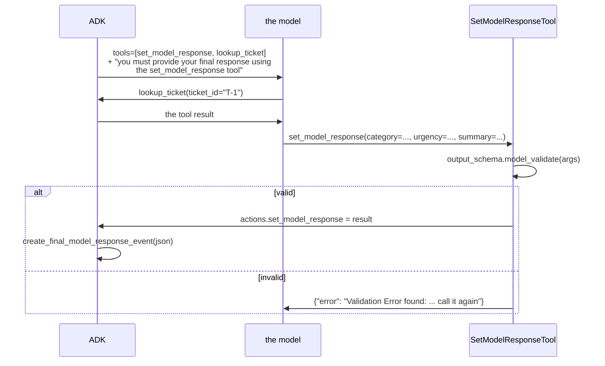

# 3.2 — The tool ADK injects

## One-line answer

On the workaround path ADK adds a tool called `set_model_response`, whose parameters are your schema's
fields, and appends an instruction telling the model to answer through it — so structured output stops
being a decoding constraint and becomes a tool call.

---

## The story

The shop with no card machine.

You have picked out what you want, you get to the counter, and the card reader is dead. He shrugs.
Then he says *"one second"*, taps at his phone, and your phone buzzes: a payment link, for the exact
amount, with the shop's name on it. You tap it, pay, show him the screen, and walk out with the thing
you came for.

Nothing about that transaction was wrong. You paid, he was paid, the amount was right.

And it was a different mechanism. The card reader would have taken three seconds and involved nobody's
judgement. The link involved his phone, your phone, your bank's app, an extra minute, and — this is the
part worth holding on to — **a step where you could have simply not tapped it.** The card reader
authorises or declines; the link asks.

`set_model_response` is the payment link.

---

## The idea in plain language

[3.1](3.1-the-rule-that-changed.md) established which path you are on. This is what the workaround path
actually does, and there are exactly two moving parts.

### Part one: a tool that did not exist

ADK constructs a `SetModelResponseTool` from your `output_schema` and appends it to the request's tool
list. Its declaration is generated the ordinary way, so the model sees an ordinary tool:

```text
tools declared    : ['set_model_response', 'lookup_ticket']
```

Your schema's fields are its **parameters**. `Triage` with `category`, `urgency` and `summary` becomes a
tool taking `category`, `urgency` and `summary`.

Its description is short and is written by ADK, not by you:

> *"Set your final response using the required output schema. Use this tool to provide your final
> structured answer instead of outputting text directly."*

### Part two: an instruction that was not yours

ADK appends this to the request's system instruction, verbatim:

> *"IMPORTANT: You have access to other tools, but you must provide your final response using the
> set_model_response tool with the required structured format. After using any other tools needed to
> complete the task, always call set_model_response with your final answer in the specified schema
> format."*

You did not write it. It is in every request this agent makes, and it is the mechanism by which the
schema is "enforced".

**Read that word again.** Enforcement, on this path, is **a sentence in a prompt**. This is the same
shape as
[Day 10, part 4.1](../../../day-10-function-tools/parts/04-tool-shapes/4.1-the-tailors-receipt.md)'s
long-running note — the framework's lever, at that layer, is asking the model nicely — and it is the
central fact of this section.

### What happens to the answer

The model calls `set_model_response(category=..., urgency=..., summary=...)`. Then:

1. `run_async` validates the arguments with `output_schema.model_validate(args)`.
2. On success it sets `tool_context.actions.set_model_response = result` — a field on `EventActions`,
   which is [Day 7, part 1.4](../../../day-07-events-and-streaming/parts/01-the-event-object/1.4-the-half-that-is-not-text.md)'s
   object gaining a use you have not seen before.
3. ADK then builds a **synthetic final event** — `create_final_model_response_event` — carrying the
   validated JSON as ordinary model text, *"so it looks like a normal model response"*.
4. On failure it returns the error dictionary from
   [2.3](../02-schemas-in-practice/2.3-the-descriptions-that-do-not-arrive.md), and the model tries
   again.

Step 3 is why everything downstream still works. `output_key`, `is_final_response()`, your display loop
— none of them know a tool was involved. **The workaround is invisible from outside**, which is good
engineering and is exactly why nobody notices which path they are on.

---

## Why Sutra needs it

**This is Sutra's actual path**, so this is the mechanism Sutra's triage runs through from today.

**[3.3](3.3-what-that-costs-you.md)** is the bill: a second tool declaration, a lost set of field
descriptions, a retry loop, and enforcement that is a prompt.

**Day 13** is callbacks, where you can see the `set_model_response` call go past like any other tool
call — and where a `before_tool_callback` that assumes every tool is yours will meet one that is not.

**Day 14** is observability, and *"why is there a tool call I did not write in my trace?"* is a question
worth having the answer to before it is asked in an incident.

---

## The mechanism

Both paths, assembled side by side. **No model call, no cost:**

```python
# lab/the_cost.py - the same schema on the native path and on the workaround path.
import asyncio
import json
from typing import Literal

from google.adk.agents import LlmAgent
from google.adk.agents.invocation_context import InvocationContext
from google.adk.agents.run_config import RunConfig
from google.adk.flows.llm_flows import _output_schema_processor, basic
from google.adk.models.llm_request import LlmRequest
from google.adk.sessions import InMemorySessionService
from google.genai._transformers import t_schema
from pydantic import BaseModel, Field


class Triage(BaseModel):
    category: Literal["billing", "technical", "account"] = Field(
        description="which queue it goes to"
    )
    urgency: int = Field(ge=1, le=5, description="1 = whenever, 5 = now")
    summary: str = Field(description="one sentence, no jargon")


def lookup_ticket(ticket_id: str) -> dict:
    """Read one support ticket.

    Args:
        ticket_id: the ticket id.
    """
    return {"status": "ok"}


async def request_for(tools: list) -> LlmRequest:
    """The request ADK would send, with the two processors that matter run in order."""
    service = InMemorySessionService()
    session = await service.create_session(app_name="sutra", user_id="u", state={})
    agent = LlmAgent(
        name="sutra_desk",
        model="gemini-3.7-flash",
        instruction="Triage it.",
        output_schema=Triage,
        output_key="triage",
        tools=tools,
    )
    invocation = InvocationContext(
        session_service=service,
        invocation_id="inv-1",
        agent=agent,
        session=session,
        run_config=RunConfig(),
    )
    request = LlmRequest()
    async for _ in basic.request_processor.run_async(invocation, request):
        pass
    async for _ in _output_schema_processor.request_processor.run_async(invocation, request):
        pass
    request.append_tools(await agent.canonical_tools())
    return request


def declared_names(request: LlmRequest) -> list[str]:
    return [
        declaration.name
        for tool in (request.config.tools or [])
        for declaration in (getattr(tool, "function_declarations", None) or [])
    ]


def described(properties: dict) -> int:
    return sum(1 for spec in properties.values() if "description" in spec)


async def main() -> None:
    native = await request_for([])
    workaround = await request_for([lookup_ticket])

    print("native path - output_schema, no tools")
    print("  response_mime_type:", native.config.response_mime_type)
    sent = t_schema(None, native.config.response_schema).model_dump(exclude_none=True)
    print("  tools declared    :", declared_names(native))
    print("  fields described  :", described(sent["properties"]), "of", len(sent["properties"]))
    print(
        "  urgency bounds    :",
        {
            k: sent["properties"]["urgency"][k]
            for k in ("minimum", "maximum")
            if k in sent["properties"]["urgency"]
        },
    )
    print()

    print("workaround path - output_schema + one tool")
    print("  response_mime_type:", workaround.config.response_mime_type)
    print("  tools declared    :", declared_names(workaround))
    forced = next(
        d.parameters_json_schema
        for tool in workaround.config.tools
        for d in tool.function_declarations
        if d.name == "set_model_response"
    )
    print("  fields described  :", described(forced["properties"]), "of", len(forced["properties"]))
    print(
        "  urgency bounds    :",
        {
            k: forced["properties"]["urgency"][k]
            for k in ("minimum", "maximum")
            if k in forced["properties"]["urgency"]
        },
    )
    print()
    print("  appended instruction:")
    print("   ", json.dumps(str(workaround.config.system_instruction))[-200:])


asyncio.run(main())
```

**Line by line:**

- Two **real** ADK request processors, run in the order `single_flow` runs them: `basic` first, then
  `_output_schema_processor` last. Order matters — the output-schema processor is deliberately last in
  ADK's own list so it can see the finished request.
- `request.append_tools(await agent.canonical_tools())` **after** both processors, because that is where
  `base_llm_flow` does it. Which is why `set_model_response` appears **first** in the declared names: it
  was appended before your own tools were.
- `request_for(tools: list)` — one function, called with `[]` and with `[lookup_ticket]`. Every
  difference in the output comes from that list being empty or not.
- `declared_names(request)` flattening `config.tools` — the provider's structure nests function
  declarations inside a `Tool` object, so a flat list of names needs two loops. Worth knowing before you
  go looking for a tool name in a request dump.
- `t_schema(None, native.config.response_schema)` — the `google.genai` transformer, applied so the
  native path is measured as it goes on the wire rather than as a Python class.
- `described(properties)` counting `"description"` keys — a number rather than a wall of JSON, so the
  two paths can be compared at a glance. This is
  [2.3](../02-schemas-in-practice/2.3-the-descriptions-that-do-not-arrive.md)'s finding, restated as a
  count.
- `next(... if d.name == "set_model_response")` — pulling one declaration out of the nesting by name.
  `next` on a generator with no default raises `StopIteration` if it is absent, which is the correct
  behaviour: if that tool is missing, the script's premise is wrong and it should stop loudly.
- `json.dumps(str(...))[-200:]` on the system instruction — the **tail**, because the appended sentence
  is at the end, and `json.dumps` so the newlines show as `\n` rather than wrapping.

The output:

```text
native path - output_schema, no tools
  response_mime_type: application/json
  tools declared    : []
  fields described  : 3 of 3
  urgency bounds    : {'minimum': 1.0, 'maximum': 5.0}

workaround path - output_schema + one tool
  response_mime_type: None
  tools declared    : ['set_model_response', 'lookup_ticket']
  fields described  : 0 of 3
  urgency bounds    : {}

  appended instruction:
    model_response tool with the required structured format. After using any other tools needed to complete the task, always call set_model_response with your final answer in the specified schema format."
```

Four lines to read.

**`response_mime_type` is `None`** on the workaround path. There is no response schema on the request at
all. Nothing at the provider knows your agent has an output schema.

**`tools declared` has two entries**, and you wrote one of them. `set_model_response` is first because
it was appended first.

**`3 of 3` becomes `0 of 3`**, and the bounds go from `{'minimum': 1.0, 'maximum': 5.0}` to `{}`. That is
[2.3](../02-schemas-in-practice/2.3-the-descriptions-that-do-not-arrive.md), measured on the real
request rather than on a tool in isolation.

**And the instruction ends with a sentence you did not write.** That sentence is the enforcement.



---

## When it breaks

**💥 The model that never called it.**

No error, and it is the failure this path is built on. The instruction says *must*; a model can still
produce a plain text answer. What you get is prose where you expected JSON, `output_key` holding a
sentence, and a downstream parse failure. On the native path this is impossible; here it is a
probability, and it is worse on smaller models — which is
[Day 9, part 3.3](../../../day-09-four-free-providers/parts/03-local/3.3-the-learner-driver.md)'s point
arriving with real consequences.

**💥 The callback that met a tool it did not write.**

```python
def before_tool_callback(tool, args, tool_context):
    return AUDIT[tool.name](args)  # KeyError: 'set_model_response'
```

Day 13's callbacks fire for **every** tool, including this one. Any code that indexes a registry by tool
name, or asserts `tool.name in MY_TOOLS`, meets `set_model_response` the first time it runs against a
schema agent.

**💥 The retry that costs a model call.**

The happy path costs no extra model call — ADK builds the final event from the function response
directly, with no further round trip. A **validation failure** does: the error dictionary goes back to
the model and the model answers again. So a schema the model struggles to satisfy is a multiplier on
[Day 10, part 3.3](../../../day-10-function-tools/parts/03-the-dispatch-you-deleted/3.3-the-brakes-still-matter.md)'s
`max_llm_calls` arithmetic, and the multiplier is invisible until it fires.

**💥 The name collision.**

```text
WARNING Duplicate tool name 'set_model_response': the previously registered tool is shadowed and can no
longer be called.
```

You will not hit this by accident, and it is worth knowing that `set_model_response` is a name in your
agent's namespace now. `set_model_response` is reserved on this path, the way
[Day 11, part 3.2](../../../day-11-tool-context/parts/03-designing-a-tool/3.2-name-it-for-the-model.md)
established that names collide silently.

---

## In production

**What a professional writes instead of the teaching version** is a test that asserts the answer parses
— not that the model is well behaved, but that the pipeline produced the shape. On the native path that
test is nearly redundant. On this path it is the only thing standing between a prompt-strength promise
and a downstream crash, and it belongs in the evalset rather than in the unit tests, because it needs a
model to be meaningful.

**What degrades at scale** is the tool list. Every tool declaration is sent every turn
([2.4](../02-schemas-in-practice/2.4-the-schema-is-the-prompt-again.md)), and this path adds one more
plus a paragraph of instruction. On an agent with two tools that is a third more declarations than you
wrote. It also adds one more candidate for the model to choose wrongly, which is
[Day 11, part 3.4](../../../day-11-tool-context/parts/03-designing-a-tool/3.4-two-tools-that-overlap.md)'s
problem given a new member for free.

**The failure that only shows with real traffic** is the compliance rate. In development every run
produces valid JSON, because the tickets are simple and the model is not under pressure. In production,
long conversations, unusual inputs and a busy context all reduce how reliably an instruction is
followed, so a small percentage of turns come back as prose. The tell is not an error — it is a
downstream parser with a rising exception rate, and the cause is three components away.

**The review comment a senior engineer leaves:** *"We're on the injected-tool path, so 'the schema is
enforced' is really 'the model is asked firmly'. Two things: handle the case where the final answer
isn't valid JSON rather than assuming it, and check the `before_tool_callback` — it indexes a dict by
tool name and it's about to meet `set_model_response`."*

**The interview question:** *"what does a framework do when the model can't take a response schema and
tools in one request?"* The answer that shows you have read the source: "It simulates it. ADK injects a
tool called `set_model_response` whose parameters are the schema's fields, appends an instruction saying
the final answer must come through that tool, and then validates the arguments with Pydantic when the
model calls it — on success it fabricates a normal-looking final event carrying the validated JSON, so
everything downstream is unchanged. The invisibility is good engineering and it's also the risk: from
outside you can't tell which path you're on, and the two have genuinely different guarantees. On the
native path non-conforming output can't be produced. On this path enforcement is a sentence in a prompt,
so a model can just answer in prose — which it will, occasionally, and more often on smaller models. So
I'd want a test that the answer parses, and I'd want the code that inspects tool calls to expect a tool
nobody in the team wrote."

---

## Check yourself

```bash
uv run python days/day-12-structured-output/lab/the_cost.py
```

Then print the whole `system_instruction` rather than its last 200 characters and read the appended
paragraph in full.

**Answer out loud, without scrolling up:**

> Name the two things ADK adds on the workaround path, and say which one is the enforcement. Then say
> what happens to the model's `set_model_response` call on success, and why nothing downstream notices.

---

**Next:** [3.3 — What that costs you](3.3-what-that-costs-you.md)
