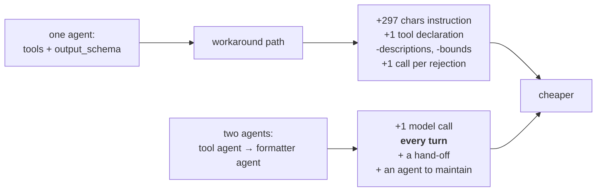

# 3.3 — What that costs you

## One-line answer

The bill for the workaround path, itemised: no extra model call on the happy path, one per rejection,
297 characters of instruction you did not write, an extra tool in the list, every field description and
numeric bound gone — and enforcement that is a request rather than a constraint.

---

## The story

Talking to somebody through an interpreter.

It works. You conduct the whole meeting, you agree on things, everybody leaves with the same
understanding of what was decided. Nobody would call it a failure.

And you know, if you have done it, that three specific things happen. It takes longer, because
everything is said twice. Your jokes do not land, because the parts of a sentence that are not
information are the parts that do not survive. And **you cannot tell how much you lost** — the
interpreter says something, the other person nods, and you have no independent way to know whether the
nuance you cared about made it across.

The third one is the reason people who do this often learn to speak differently: shorter sentences,
fewer idioms, the important thing said plainly rather than implied. They stop putting weight on the
parts that will not survive the crossing.

That is how you write a schema for the workaround path.

---

## The idea in plain language

[3.2](3.2-the-tool-adk-injects.md) showed the mechanism. This part adds it up, and then says what to do.

### The bill

Measured below, for one three-field schema:

| | native | workaround |
| --- | --- | --- |
| schema text per turn | 514 chars | 320 chars |
| extra tool declarations | 0 | 1 |
| extra instruction text | 0 | **297 chars** |
| field descriptions kept | 3 of 3 | **0 of 3** |
| numeric bounds kept | yes | **no** |
| `Literal` enums kept | yes | yes |
| enforced by | constrained decoding | **an instruction + a Pydantic retry** |
| extra model calls, happy path | 0 | **0** |
| extra model calls, per rejection | n/a | **1** |

Three of those deserve a sentence each.

**The schema text is smaller and that is not a saving.** 320 against 514, and the difference is the
descriptions and bounds that were dropped. You are sending less because you are saying less.

**The happy path costs no extra model call.** This surprises people, including the version of me that
wrote the first draft of this section. ADK builds the final event from the function response directly —
`create_final_model_response_event` — with no further round trip. The model call count is the same.

**A rejection costs one.** The error dictionary goes back, the model answers again, and that is a real
model call against
[Day 10's `max_llm_calls`](../../../day-10-function-tools/parts/03-the-dispatch-you-deleted/3.3-the-brakes-still-matter.md)
and a real request against
[Day 9's daily quota](../../../day-09-four-free-providers/parts/04-the-benchmark/4.3-three-shops-three-closing-times.md).
A schema the model finds hard to satisfy is a quota multiplier that is invisible until it fires.

### And the credit side

The bill is only half the accounting. **What you get is tools and a schema in one agent**, and the
alternative is worth pricing honestly.

Before this existed, the pattern was two agents: one with tools that does the work in prose, and one
with a schema that formats the prose. That costs **a whole extra model call on every single turn**,
plus a hand-off through state, plus a second agent to maintain, plus one more place for the meaning to
change.

So: an occasional extra call on rejection, against a guaranteed extra call always. **The workaround path
is cheaper than the pattern it replaced**, and that is worth saying plainly before spending the rest of
the part on its shortcomings.

### What to do about it

**1 — Say important things where they survive.** `Literal` survives; descriptions do not. Put the
constraint in the type, or in the agent's instruction, which is always sent.
([2.3](../02-schemas-in-practice/2.3-the-descriptions-that-do-not-arrive.md) has the three options in
order.)

**2 — Keep the schema small.** Every field is a decision, and on this path each one arrives with less
help than you wrote for it.

**3 — Assume the answer might not be JSON.** Enforcement is an instruction. Handle prose.
([5.1](../05-failure-lab/5.1-the-schema-that-silenced-the-agent.md) is the other half of this.)

**4 — Know that a free lane exists on the other path.** `LiteLlm` declares
`output_schema_and_tools=True` — its own comment says *"LiteLLM reconciles tools + response_format per
provider"* — so Day 9's Groq and OpenRouter `:free` lanes take the **native** path. That is a real,
zero-budget option, and it is a different model with different quality
([Day 9, part 4.1](../../../day-09-four-free-providers/parts/04-the-benchmark/4.1-two-routes-to-work.md)),
so it is a trade rather than a fix.

---

## Why Sutra needs it

**This is Sutra's bill, on Sutra's lane, from today.** The numbers in the table are the numbers Sutra
pays.

**Day 24** is token economics, and this table is one of its inputs.

**Day 25** is evaluation, where *"how often does the answer come back as prose?"* stops being a worry and
becomes a measured rate.

**Day 51** is caching, which is the real answer to 297 characters of identical instruction on every
turn.

---

## The mechanism

The bill, itemised from the objects themselves. **No model call, no cost:**

```python
# lab/the_bill.py - the workaround path, itemised.
import json
from typing import Literal

from google.adk.models._capabilities import gemini_output_schema_and_tools
from google.adk.tools.set_model_response_tool import SetModelResponseTool
from google.genai._transformers import t_schema
from pydantic import BaseModel, Field

APPENDED_INSTRUCTION = (
    "IMPORTANT: You have access to other tools, but you must provide "
    "your final response using the set_model_response tool with the "
    "required structured format. After using any other tools needed "
    "to complete the task, always call set_model_response with your "
    "final answer in the specified schema format."
)


class Triage(BaseModel):
    category: Literal["billing", "technical", "account"] = Field(
        description="which queue it goes to"
    )
    urgency: int = Field(ge=1, le=5, description="1 = whenever, 5 = now")
    summary: str = Field(description="one sentence, no jargon")


native = t_schema(None, Triage).model_dump(exclude_none=True)
declaration = SetModelResponseTool(Triage)._get_declaration()
forced = declaration.parameters_json_schema


def described(properties: dict) -> int:
    return sum(1 for spec in properties.values() if "description" in spec)


rows = [
    (
        "schema text per turn",
        f"{len(json.dumps(native))} chars",
        f"{len(json.dumps(forced))} chars",
    ),
    ("extra tool declarations", "0", "1 (set_model_response)"),
    ("extra instruction text", "0 chars", f"{len(APPENDED_INSTRUCTION)} chars"),
    (
        "field descriptions kept",
        f"{described(native['properties'])} of 3",
        f"{described(forced['properties'])} of 3",
    ),
    ("numeric bounds kept", "yes", "no"),
    ("Literal enums kept", "yes", "yes"),
    ("enforced by", "constrained decoding", "an instruction + Pydantic retry"),
    ("extra model calls, happy path", "0", "0"),
    ("extra model calls, per rejection", "n/a", "1"),
]

print(f"  {'':<32} {'native':<24} workaround")
for label, native_value, forced_value in rows:
    print(f"  {label:<32} {native_value:<24} {forced_value}")

print()
print("who gets which path, on the free tier:")
for label, capable in (
    ("Gemini via the Gemini API", gemini_output_schema_and_tools("gemini-3.7-flash")),
    ("Gemini via Vertex AI", "needs billing - Addendum 02 says no"),
    ("LiteLlm (Groq, OpenRouter :free)", "declares True - see lite_llm.py"),
):
    print(f"  {label:<34} {capable}")
```

**Line by line:**

- `APPENDED_INSTRUCTION` copied **verbatim** from ADK's `_output_schema_processor` and measured with
  `len()`. Copying rather than importing is deliberate: it is a private module-level string, and a
  document that quotes it should be measuring the thing it quoted. If ADK changes the sentence, this
  number is wrong and the mismatch is the signal to re-read the source.
- `t_schema(None, Triage)` against `SetModelResponseTool(Triage)._get_declaration()` — the two ends of
  [3.1](3.1-the-rule-that-changed.md)'s fork, each measured as it goes on the wire.
- `rows` as a list of three-tuples rather than a printed paragraph — the table is the deliverable, and
  building it as data makes adding a row later a one-line change.
- The two model-call rows are **stated constants, not measured**, because measuring them needs a model.
  They come from reading `base_llm_flow.py`: the final event is built from the function response with
  no further round trip, and the validation-error path returns to the model. Saying which numbers are
  measured and which are read is Principle 10 applied to a table.
- `gemini_output_schema_and_tools("gemini-3.7-flash")` printed live for the first row and **strings** for
  the other two — because Vertex cannot be tested without billing and `LiteLlm` cannot be imported
  without `litellm` installed. A `False` you measured and a claim you read are different things and the
  output should not pretend otherwise.
- `f"{'':<32}"` for the header's first cell — an empty label so the two column headings line up over
  their columns.

The output:

```text
                                   native                   workaround
  schema text per turn             514 chars                320 chars
  extra tool declarations          0                        1 (set_model_response)
  extra instruction text           0 chars                  297 chars
  field descriptions kept          3 of 3                   0 of 3
  numeric bounds kept              yes                      no
  Literal enums kept               yes                      yes
  enforced by                      constrained decoding     an instruction + Pydantic retry
  extra model calls, happy path    0                        0
  extra model calls, per rejection n/a                      1

who gets which path, on the free tier:
  Gemini via the Gemini API          False
  Gemini via Vertex AI               needs billing - Addendum 02 says no
  LiteLlm (Groq, OpenRouter :free)   declares True - see lite_llm.py
```

The row to sit with is **`enforced by`**. Everything above it is arithmetic — characters, counts, calls —
and arithmetic can be budgeted for. That row is a difference in **kind**: one column contains a
guarantee and the other contains a request.

And the last block is the actionable one. Sutra's lane is row one and it says `False`. Row two is closed
by Addendum 02. **Row three is open**, costs nothing, and is the reason
[Day 9](../../../day-09-four-free-providers/parts/02-the-translator/2.3-the-express-counter.md)'s work
on providers keeps paying.



---

## When it breaks

**💥 The rejection loop that ate the quota.**

```text
LlmCallsLimitExceededError: Max number of llm calls limit of `8` exceeded
```

A schema with a constraint the model was never shown — a `ge`/`le` bound, a `pattern` — and a model that
keeps producing values outside it. Each attempt is a call. Day 10's brake stops the run, which is what
it is for, and the underlying fix is
[2.3](../02-schemas-in-practice/2.3-the-descriptions-that-do-not-arrive.md)'s: put the constraint where
the model can see it.

**💥 The prose answer.**

No error. `state["triage"]` holds a sentence, and whatever reads it next gets a `str` where it expected
a `dict`:

```text
TypeError: string indices must be integers, not 'str'
```

That traceback is one component away from the cause and does not mention schemas, models or tools.

**💥 The two-agent pattern kept for no reason.**

No error, and the most expensive mistake in this part. A formatter sub-agent costs a model call on
every turn, forever, and was adopted to work around
[3.1](3.1-the-rule-that-changed.md)'s expired rule. Check before you build one.

**💥 The lane that changed the path.**

Switching Sutra's model string to a `LiteLlm` lane silently moves the agent onto the native path — which
is better in every row of the table and is a different model producing different answers. Both facts are
true and neither is in the diff.

---

## In production

**What a professional writes instead of the teaching version** is a startup line that prints the path
and a counter that records rejections. The path tells you which table column you are in; the rejection
counter is the only number in this part that varies with traffic, and it is the one that will surprise
you. Both are cheap and neither exists by default.

**What degrades at scale** is the invisible multiplier. A 2% rejection rate on a schema is nothing in
development and is 2% more model calls in production — which, on a daily-quota tier, is the difference
between finishing the day and not. It is also the kind of cost that does not appear in any dashboard
built around "requests the user made", because these are requests the *framework* made on the user's
behalf.

**The failure that only shows with real traffic** is compliance decay over a long conversation. The
appended instruction sits near the top of the request; by turn thirty it is competing with thirty turns
of history for the model's attention. The rate at which answers come back as prose is not constant — it
climbs with conversation length, which is precisely the variable no test fixture has.

**The review comment a senior engineer leaves:** *"Fine, but log which structured-output path we're on
and count the `set_model_response` rejections. Right now a schema constraint the model can't see turns
into extra model calls we can't see, and on a twenty-a-day tier that's the whole budget. And before you
add a formatter sub-agent — read 3.1; we don't need one."*

**The interview question:** *"what does it cost to use structured output alongside tools?"* The answer
that shows you have priced it: "It depends on whether the model can take both in one request. If it
can, nothing — the schema goes to the provider and decoding is constrained. If it can't, the framework
simulates it, and the bill is: a couple of hundred characters of injected instruction on every turn, an
extra tool declaration, every field description and numeric bound dropped from what the model is shown,
and — the one that costs real quota — an extra model call every time Pydantic rejects the arguments. The
happy path costs no extra call, which people assume it does; the final event is built from the function
response directly. And the row that isn't arithmetic is enforcement: one path can't produce
non-conforming output, the other asks firmly. But I'd state the credit side too — the alternative people
used before this existed was a separate formatting agent, which costs a full extra model call on every
turn, so the workaround is cheaper than what it replaced."

---

## Check yourself

```bash
uv run python days/day-12-structured-output/lab/the_bill.py
```

Then add three fields to `Triage` and watch which rows move and which do not.

**Answer out loud, without scrolling up:**

> Give the four things the workaround path costs and the one thing it does not. Then say what it is
> cheaper than, and the one row of the table that is a difference in kind rather than in degree.

---

**Next:** [4.1 — Valid is not true](../04-when-a-schema-lies/4.1-valid-is-not-true.md)
