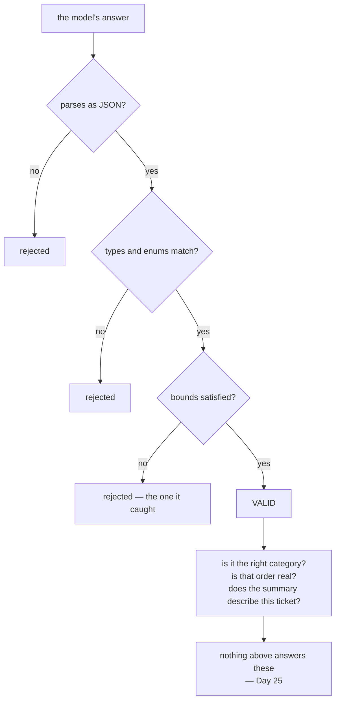

# 4.1 — Valid is not true

## One-line answer

A schema checks shape, and shape is not meaning: for one ticket, four different triages pass validation
and only one of them is right — so a green `validate_schema` proves the answer is **parseable**, never
that it is correct.

---

## The story

The answer sheet with the bubbles.

Two hundred questions, four bubbles each, filled in with an HB pencil because the instructions were
specific about the pencil. The machine reads it in about a second: no stray marks, no double-filled
rows, no blanks, every bubble properly dark and inside the circle.

The machine is delighted. It has nothing else to say, and it *cannot* have anything else to say. It
reads darkness and position.

Somebody who filled in every bubble in column B gets exactly the same clean read as the person who
actually knew the answers. The sheet is perfect in both cases, and one of them is going to be a
surprise.

That is a schema-valid model output.

---

## The idea in plain language

[Day 4, part 4.1](../../../day-04-tools-by-hand/parts/04-the-limits/4.1-validated-is-not-correct.md)
made this point about a tool's **arguments**: a schema-perfect call can ask for the wrong record. This is
the same point at the other end of the pipe, and it is worth making twice because the output end feels
different.

It feels different because the output is *the answer*. When a tool argument is wrong, something usually
fails: the ticket is not found, the lookup returns nothing. When the **answer** is wrong but valid, it
flows straight through to whatever comes next — a router, a database, a customer — with a shape that
says *"I have been checked."*

### What a schema can and cannot say

| A schema can say | A schema cannot say |
| --- | --- |
| `category` is one of three strings | it is the **right** one of the three |
| `urgency` is an integer | it reflects how urgent this actually is |
| `summary` is a string | it describes **this** ticket |
| `order_id` is a string or absent | the number is one that exists |

Measured below, against one real ticket: five candidate triages, **four of them valid**, one right. The
one the schema rejects is the one with an out-of-range integer — a **typographical** error, essentially,
and the only kind of error a schema is equipped to see.

### The three ways an answer can be wrong while being valid

**Wrong choice from a closed set.** `technical` instead of `billing`. The `Literal` did its job — the
value is a member — and membership is not correctness.

**Invented content.** `order_id: "88214"` when the ticket says 88213. One digit, valid string, and
[Day 11, part 3.3](../../../day-11-tool-context/parts/03-designing-a-tool/3.3-arguments-the-model-can-supply.md)'s
warning about dense identifier spaces applies exactly: in production most six-digit numbers are
somebody's order.

**Fluent nonsense.** A `summary` that is a good sentence about a different problem. This is the one no
mechanical check will ever catch, because the field's whole purpose is free text.

### So what *does* check it

Not the schema, and not a bigger schema. Three things, in increasing cost:

1. **Cross-field rules** — Pydantic validators for facts that are internally checkable. *"If
   `outcome` is `triaged` then `category` must be present."* Cheap, deterministic, free.
2. **Checks against the world** — is that `order_id` a real order? That is a lookup, and it is your code
   rather than a schema.
3. **Evaluation** — a dataset of tickets with known-correct triages, scored. That is Day 25, it costs
   quota, and it is the only thing that measures the first two failure modes.

**Tightening the schema does none of these.** It is the instinctive response and it makes the output
harder to produce without making it truer.

---

## Why Sutra needs it

**Sutra's triage feeds a router in Phase 8.** A wrong-but-valid category sends a billing complaint to a
technical queue, and everything about that transaction looks healthy.

**[4.2](4.2-the-field-that-was-always-filled.md)** is the mechanism that manufactures the second failure
mode: a required field the ticket cannot answer.

**Day 25** is evaluation, which is the only real answer here.

**Day 30** is prompt injection, where an attacker's goal is precisely a valid answer with the wrong
content — and every layer between them and the router checks shape.

---

## The mechanism

One ticket, five triages, one right. **No model call, no cost:**

```python
# lab/valid_not_true.py - five triages, every one of them schema-perfect.
import json
from typing import Literal

from google.adk.utils._schema_utils import validate_schema
from pydantic import BaseModel, Field, ValidationError

TICKET = "Hi, I was charged twice for March. Order 88213. Please refund one of them."


class Triage(BaseModel):
    category: Literal["billing", "technical", "account"] = Field(description="the queue")
    urgency: int = Field(ge=1, le=5, description="1 = whenever, 5 = now")
    summary: str = Field(description="one sentence, no jargon")
    order_id: str | None = None


CANDIDATES = [
    (
        "correct",
        '{"category": "billing", "urgency": 3, "summary": "Charged twice for March.", "order_id": "88213"}',
    ),
    (
        "wrong queue",
        '{"category": "technical", "urgency": 3, "summary": "Charged twice for March.", "order_id": "88213"}',
    ),
    (
        "invented order",
        '{"category": "billing", "urgency": 3, "summary": "Charged twice for March.", "order_id": "88214"}',
    ),
    (
        "summary is a lie",
        '{"category": "billing", "urgency": 3, "summary": "Customer wants to close their account.", "order_id": "88213"}',
    ),
    (
        "urgency out of range",
        '{"category": "billing", "urgency": 11, "summary": "Charged twice.", "order_id": "88213"}',
    ),
]

print("the ticket:", TICKET)
print()
for label, said in CANDIDATES:
    try:
        validate_schema(Triage, said)
        print(f"  {label:<22} schema says: VALID")
    except ValidationError:
        print(f"  {label:<22} schema says: rejected")
print()
print("four of the five are valid. one of the four is right.")
```

**Line by line:**

- `TICKET` written out as a real customer sentence, with a real order number in it, because every
  candidate has to be judged against something concrete. An abstract example would let the reader
  imagine the schema doing more than it does.
- The five candidates differ from the correct one by **exactly one thing each** — the category, one digit
  of the order id, the whole meaning of the summary, and the urgency's range. Isolating the variable is
  what makes the result readable.
- `"invented order"` differs by a **single character**. That is the point of choosing 88214: a wrong
  answer need not look wrong.
- `"summary is a lie"` is a well-formed, grammatical, plausible sentence about a different problem. It
  is the failure no validator can reach.
- `"urgency": 11` is the control — the only candidate a schema can catch, and it is the least
  interesting error in the list.
- `validate_schema` rather than `Triage.model_validate_json` — ADK's function, so the result is what
  ADK would conclude, fence-stripping and all.
- `except ValidationError` printing `rejected` rather than the message, because here the *verdict* is
  the data and the message would be noise.
- The closing sentence is not decoration; without it the four `VALID`s read as a success.

The output:

```text
the ticket: Hi, I was charged twice for March. Order 88213. Please refund one of them.

  correct                schema says: VALID
  wrong queue            schema says: VALID
  invented order         schema says: VALID
  summary is a lie       schema says: VALID
  urgency out of range   schema says: rejected

four of the five are valid. one of the four is right.
```

Read the middle three rows. A billing complaint filed as technical, an order number that is off by one,
and a summary about closing an account — **all valid**.

Then read the last one and notice what the schema *did* catch: an integer outside a range. That is the
category of mistake schemas are for, and it is the category of mistake that matters least.



---

## When it breaks

**💥 The router that did what it was told.**

No error, anywhere. `category: "technical"` reaches Phase 8's router, the router routes, a billing
complaint sits in a technical queue for two days, and every log line is green. The failure surfaces as a
customer complaint about the response time, which is three systems away from the cause.

**💥 The identifier that resolved.**

```text
{"status": "ok", "order": {"id": "88214", "customer": "u-773"}}
```

The invented order id was somebody's order. The lookup succeeded. The agent now has a real record
belonging to a different customer, and — because it succeeded — nothing anywhere flags it.
[Day 11, part 4.2](../../../day-11-tool-context/parts/04-blast-radius/4.2-the-identity-a-tool-needs.md)'s
ownership check is what stops this becoming a disclosure, and it is worth noticing that the *reason* it
matters is this part.

**💥 The tightened schema.**

```python
summary: str = Field(min_length=20, max_length=120, pattern=r"^[A-Z].*\.$")
```

A perfectly reasonable response to a bad summary, and it constrains **length and punctuation**. The
sentence about closing an account satisfies all three. On the workaround path the model is not even told
about them ([2.3](../02-schemas-in-practice/2.3-the-descriptions-that-do-not-arrive.md)), so they arrive
as rejections and retries — you have bought yourself extra model calls in exchange for nothing.

**💥 The test that only asserts validity.**

```python
assert validate_schema(Triage, reply)  # green for four of the five above
```

A test that the answer parses is a useful test. A test named `test_triage_is_correct` that does only
this is a lie in the test suite, and the version that goes red for the right reason needs an expected
value — which is [6.2](../06-in-the-graph/6.2-testing-structured-output-for-free.md).

---

## In production

**What a professional writes instead of the teaching version** is a cross-field validator for anything
the answer can be checked against **itself**, and a lookup for anything checkable against the world.
*"If `category` is `billing` then `order_id` must be present"* is a `@model_validator` and it is free. It
does not make the answer true; it removes a class of internally inconsistent answers, which is a real
and cheap win people skip because it is not exciting.

**What degrades at scale** is trust in the shape. Everybody downstream of a validated structure treats it
as checked, because it is checked — and the word does not distinguish *checked for shape* from *checked
for truth*. Six components later, somebody is making a refund decision on a field whose only guarantee
is that it is a string. **The word "validated" is where this rot starts**, and the countermeasure is
vocabulary: say *parsed*, and reserve *validated* for things you actually verified.

**The failure that only shows with real traffic** is the drift in a category distribution. Every
individual triage is valid, every one is plausible, and over ten thousand tickets the model puts 8% in
the wrong queue in a way that is invisible per ticket and obvious in aggregate. The only instrument that
sees it is an evalset with known-correct answers, which is why Day 25 exists and why *"we validate the
output"* is not an answer to *"how good is it?"*.

**The review comment a senior engineer leaves:** *"This asserts the triage parses, which is fine, but the
test is called `test_triage_is_correct` — rename it or give it an expected value. And add a
`model_validator`: right now `category='billing'` with no `order_id` is valid, and it shouldn't be. For
the actual accuracy question we need the evalset, not a tighter schema."*

**The interview question:** *"if the output is validated against a schema, what can still go wrong?"*
The answer that shows you have shipped one: "Almost everything that matters. A schema checks shape:
types, enums, presence, bounds. It can't tell you the right member of an enum was chosen, that an
identifier that looks real is real, or that a free-text summary describes the input at all. I like the
concrete version — for one ticket I can write five candidate outputs where four validate and one is
right, and the one the schema rejects is an integer out of range, which is the least interesting mistake
in the set. The dangerous part is that a validated structure *reads* as checked, so everything
downstream trusts it, and six components later somebody is making a refund decision on a field whose
only guarantee is that it's a string. What actually helps is cross-field validators for internal
consistency, real lookups for anything checkable against the world, and an evalset for the rest —
tightening the schema helps with none of it and, on the injected-tool path, costs you retries."

---

## Check yourself

```bash
uv run python days/day-12-structured-output/lab/valid_not_true.py
```

Then write a sixth candidate that is wrong in a new way and predict the verdict before running it.

**Answer out loud, without scrolling up:**

> Give the three ways an answer can be wrong while being valid, and say which one no mechanical check
> will ever catch. Then say what tightening the schema buys you, and what it costs on Sutra's path.

---

**Next:** [4.2 — The field that was always filled](4.2-the-field-that-was-always-filled.md)
