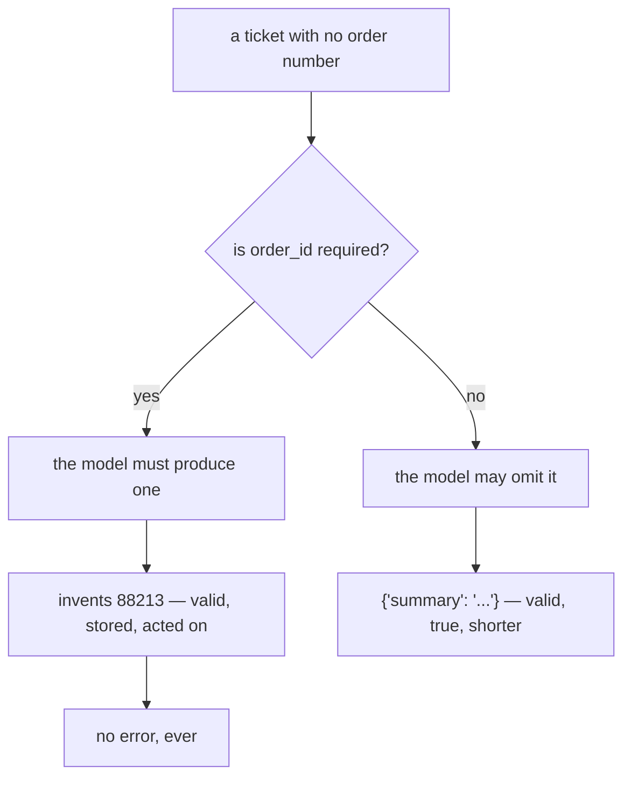

# 4.2 — The field that was always filled

## One-line answer

A required field is an instruction to always have an answer, so a required field for a fact the input
may not contain is a machine for manufacturing plausible values — and the fix is one character of type
annotation.

---

## The story

The delivery app that will not let you order again.

You open it, you are hungry, and before it will show you anything it puts up a card: *rate your last
order*. Five stars in a row and a **Submit** button. There is no *skip*, or there is one and it is grey
and small and you have already tapped a star by accident trying to find it.

You do not remember the last order. It was eleven days ago. You tap five, because five is furthest from
trouble and because you want to see the menu.

Somewhere, that becomes data. It joins a column that a report is built on, and the report says the
restaurant is excellent, and it is not that the report is lying — it is that the question was **asked in
a way that made "I don't know" unavailable**, and every single person in that column did what you did.

The restaurant's rating is not a measurement. It is the shape of the form.

That is a required field on a fact the input does not contain.

---

## The idea in plain language

[2.2](../02-schemas-in-practice/2.2-optional-default-and-null.md) established that *required*,
*defaulted* and *nullable* are three different instructions. This part is what the first instruction
does when it is wrong.

### The instruction you are actually giving

`order_id: str` in a schema is not *"tell me the order id if there is one."* It is:

> **You may not produce an answer that lacks an order id.**

A model faced with that and a ticket containing no order number has exactly two options: refuse to
answer at all, or produce something. Refusing is a failed turn. Producing something is a successful
turn with a valid answer. Models are trained to be helpful and the schema has removed the honest
option, so you get a number.

This is not the model behaving badly. It is
[Day 11, part 3.3](../../../day-11-tool-context/parts/03-designing-a-tool/3.3-arguments-the-model-can-supply.md)'s
child-and-the-form, on the output side: **a cooperative participant, a required box, and no
information.** The box gets filled.

### The fix is one character

```python
order_id: str | None = Field(default=None, description="only if the ticket states one")
```

**Line by line:**

- `| None` — the type now admits an absence, so `order_id` leaves `required` and the model has somewhere
  honest to put *"the ticket does not say."*
- `default=None` — required by Python once the field is nullable, and it is what makes omission legal
  rather than merely representable.
- `description="only if the ticket states one"` — the sentence that tells the model the omission is
  *wanted* rather than tolerated. On the native path it arrives; on Sutra's path it does not
  ([2.3](../02-schemas-in-practice/2.3-the-descriptions-that-do-not-arrive.md)), which is a reason to
  also say it in the agent's instruction.

Measured below: `required` goes from three fields to one, and the honest answer — *"a payment problem,
and the ticket gives no numbers"* — becomes expressible.

### The rule

**Required means: this always has an answer, for every possible input.**

Not *"we usually have one"*. Not *"the important ones have one"*. Every input. Anything else is
nullable, and the cost of getting it wrong is not a validation error — it is a number in a database that
nobody will ever know was invented.

### Where it hides

Two places, and both are ordinary.

**Fixtures made of good tickets.** You wrote the test data from real tickets, and you picked clear ones,
and clear ones have order numbers. The schema was correct for every example you had.

**Required as the default keystroke.** `order_id: str` is what you type. `order_id: str | None = None` is
what you type when you have thought about it. Schemas drift towards required for the same reason
instructions drift towards longer — nobody decided.

---

## Why Sutra needs it

**Sutra's `Triage` wants an `order_id` and a `refund_amount`**, and plenty of tickets contain neither.
Getting this wrong today produces invented order numbers on every one of them.

**[5.1](../05-failure-lab/5.1-the-schema-that-silenced-the-agent.md)** is the same failure at the level
of the **whole answer** rather than one field: a schema with no way to decline at all.

**[6.2](../06-in-the-graph/6.2-testing-structured-output-for-free.md)** turns the rule into an
assertion: only the fields that always have an answer are in `required`.

**Day 25** is evaluation, where an invented `order_id` is a scored failure rather than a plausible
string.

---

## The mechanism

The same three fields, demanded and offered. **No model call, no cost:**

```python
# lab/always_filled.py - a required field is an instruction to always have an answer.
import json

from google.adk.tools.set_model_response_tool import SetModelResponseTool
from google.adk.utils._schema_utils import validate_schema
from pydantic import BaseModel, Field, ValidationError


class Demanding(BaseModel):
    """Every field required. There is no way to say 'the ticket does not say'."""

    summary: str
    order_id: str
    refund_amount: int


class Honest(BaseModel):
    """The same fields, with somewhere to put 'not stated'."""

    summary: str
    order_id: str | None = Field(default=None, description="only if the ticket states one")
    refund_amount: int | None = Field(default=None, description="only if the ticket states one")


TICKET_WITH_NO_NUMBERS = "Hi, something went wrong with my last payment. Please help."

for schema in (Demanding, Honest):
    declared = SetModelResponseTool(schema)._get_declaration().parameters_json_schema
    print(f"  {schema.__name__:<10} required = {declared['required']}")

print()
print("the ticket:", TICKET_WITH_NO_NUMBERS)
print()
print("what the model has to produce to satisfy each schema:")
for schema, said in (
    (
        Demanding,
        '{"summary": "Payment problem.", "order_id": "88213", "refund_amount": 500}',
    ),
    (Honest, '{"summary": "Payment problem."}'),
):
    value = validate_schema(schema, said)
    print(f"  {schema.__name__:<10} {json.dumps(value)}")

print()
try:
    validate_schema(Demanding, '{"summary": "Payment problem."}')
except ValidationError as error:
    print("Demanding, told the truth instead:")
    for line in str(error).splitlines()[1:5]:
        print("  ", line.strip())
```

**Line by line:**

- Two classes with **identical field names and types apart from `| None`** — so the difference in
  `required` and in what the model must produce comes from that, and nothing else.
- The docstrings state the intent in one line each, because a schema class's docstring is the first
  thing a maintainer reads and these two would otherwise look like the same class.
- `TICKET_WITH_NO_NUMBERS` chosen to be a completely ordinary support message. It is not adversarial, it
  is not malformed; it is what a third of real tickets look like.
- `'{"order_id": "88213", "refund_amount": 500}'` — **invented values, written by hand**, standing in for
  what a model produces when the box is required and the ticket is silent. They are plausible: five
  digits, a round amount. That is the whole danger.
- `Honest`'s reply is the **shorter** one, and that is the finding: honesty is expressible, so the model
  can be brief.
- The final `try` block feeding `Demanding` the honest answer — proving that the truthful reply is
  *invalid* against the demanding schema. The model is not choosing to invent; it is choosing between
  inventing and failing.
- `str(error).splitlines()[1:5]` — Pydantic reports both missing fields, and the slice keeps the two
  field names and their messages without the trailing documentation URL noise. It is a lab convenience
  and it does interleave field names with messages, which the output shows honestly.

The output:

```text
  Demanding  required = ['summary', 'order_id', 'refund_amount']
  Honest     required = ['summary']

the ticket: Hi, something went wrong with my last payment. Please help.

what the model has to produce to satisfy each schema:
  Demanding  {"summary": "Payment problem.", "order_id": "88213", "refund_amount": 500}
  Honest     {"summary": "Payment problem."}

Demanding, told the truth instead:
   order_id
   Field required [type=missing, input_value={'summary': 'Payment problem.'}, input_type=dict]
   For further information visit https://errors.pydantic.dev/2.13/v/missing
   refund_amount
```

Read the last block first, because it is the argument.

**The honest answer is invalid.** `{"summary": "Payment problem."}` — which is exactly what the ticket
supports — is rejected by `Demanding` with two missing-field errors. The model is not being
untrustworthy when it produces `88213`; it is producing the only kind of answer the schema accepts.

Then read the middle block. `Demanding`'s reply contains an order number and an amount **that appear
nowhere in the ticket**, and it is valid, and it will be stored, and something downstream will act on
it.

And `Honest`'s reply is two words shorter and true.



---

## When it breaks

**💥 The invented identifier that resolved.**

```text
{"status": "ok", "order": {"id": "88213", "customer": "u-773"}}
```

[4.1](4.1-valid-is-not-true.md)'s failure, with this part as its cause. In development the invented id
does not exist and the lookup fails loudly. In production the identifier space is dense and it belongs
to somebody.

**💥 The `KeyError` you introduced by fixing it.**

```text
KeyError: 'order_id'
```

You correctly make the field nullable, and now
[2.2](../02-schemas-in-practice/2.2-optional-default-and-null.md)'s `exclude_none` drops it and every
downstream subscript breaks. The fix is right and it is not free: **making a field optional is a
breaking change for its readers.** Do both halves in one commit.

**💥 The default that is worse than required.**

```python
refund_amount: int = 0
```

An attempt to avoid both problems that creates a third: `0` is not `None`, so it survives
`exclude_none`, so every ticket now carries a refund amount of zero — which is a **statement**, and one
that some report will average.

**💥 The audit that cannot be done.**

No error. Six months of triages, some with real order numbers and some with invented ones, and **no way
to tell them apart** — the invented ones were valid, stored and indistinguishable at rest. This is the
part that makes it worth fixing early rather than when it is noticed.

---

## In production

**What a professional writes instead of the teaching version** is a schema where `required` is a short
list they can justify field by field, out loud. For Sutra's `Triage` that is `outcome` and very little
else. Everything a ticket *may* not contain is nullable, and everything with a sensible default has one.
The exercise takes ten minutes once and prevents a class of fabrication permanently.

**What degrades at scale** is the proportion of inputs your fixtures do not represent. A schema tuned to
clean tickets is correct for clean tickets, and the fraction of real traffic that is clean is a number
nobody measures until something forces them to. The general form: **required fields encode an assumption
about the input distribution**, and that assumption is invisible in the code and untested by the tests.

**The failure that only shows with real traffic** is the confident average. Invented `refund_amount`s are
plausible — a model asked for a number produces a reasonable one — so the distribution of invented values
looks like the distribution of real values. A dashboard averaging refund amounts is not obviously wrong.
Nothing about it looks broken. It is simply a measurement of what the model thinks a refund usually is,
mixed in with the real ones, and the mixing is unrecoverable.

**The review comment a senior engineer leaves:** *"`order_id` and `refund_amount` are required, and plenty
of tickets contain neither — that's an instruction to the model to always produce one, and it will. Make
them `str | None` and `int | None`, and fix the downstream readers in the same commit, because
`exclude_none` means they'll be absent rather than null. And walk me through the `required` list field by
field; if you can't say why each one always has an answer, it doesn't belong there."*

**The interview question:** *"what's the risk of marking a field required in a model's output schema?"*
The answer that shows you have found one in production: "You're instructing the model to always have an
answer for it. If the input sometimes doesn't contain that fact, the model's choices are to fabricate or
to fail validation — and fabricating produces a valid, successful, stored answer, so that's what
happens. It isn't the model misbehaving; the honest reply is literally invalid against the schema. The
version that bites is an identifier: in development a made-up order number doesn't resolve and you see
it immediately, and in production identifier spaces are dense enough that it resolves to somebody
else's record. The fix is one character — make it nullable — but it's a breaking change for every
downstream reader, because a null field is dropped from the dumped output rather than being present as
`None`. The rule I use is that `required` means 'this has an answer for every possible input', and the
test is whether you can justify each field on the list out loud."

---

## Check yourself

```bash
uv run python days/day-12-structured-output/lab/always_filled.py
```

Then add `refund_amount: int = 0` as a third class and decide, in writing, whether it is better or worse
than either.

**Answer out loud, without scrolling up:**

> Say what `required` actually instructs the model to do, and what a model does with a required field it
> cannot answer. Then say why fixing it is a breaking change.

---

**Next:** [5.1 — 💥 The schema that silenced the agent](../05-failure-lab/5.1-the-schema-that-silenced-the-agent.md)
