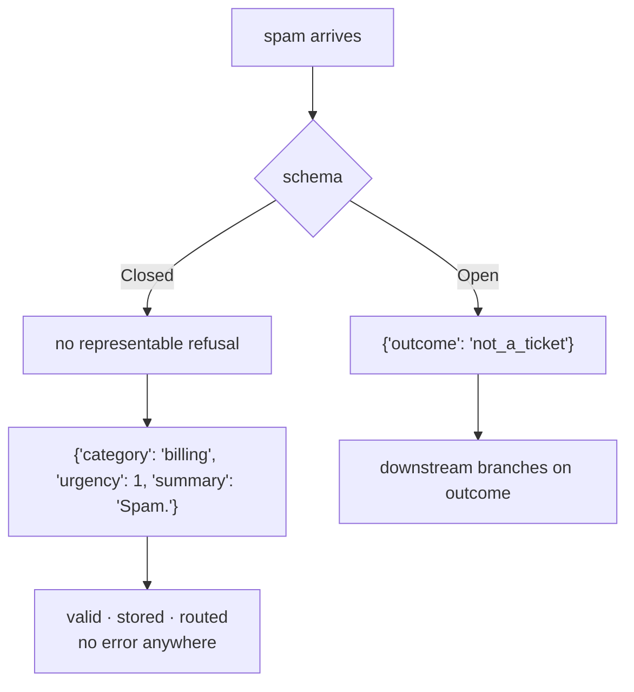

# 5.1 — 💥 The schema that silenced the agent

## One-line answer

Today's deliberate failure: a schema every field of which is required and closed, so *"I cannot triage
this"* is not a value the agent is able to produce — and every empty, spam or nonsense input comes back
as a confident triage, with no error anywhere.

---

## The story

🎬 **The scene.** The automated phone line for a utility company. *"Press 1 for billing. Press 2 for a
new connection. Press 3 for meter readings. Press 4 to repeat this menu."*

Your problem is that a workman dug up the pavement outside and the cable is lying in a puddle.

You listen to the menu twice. There is no option. There is no zero-for-an-operator; you try it anyway
and it repeats the menu. So you press 1, because billing is the one where a human eventually answers,
and you spend the first ninety seconds of that call explaining that this is not about billing.

😬 **The naive fix.** Add an option 5: *other*. Now everybody with an unusual problem has somewhere to
go.

💥 **Why it fails.** Option 5 goes to a queue nobody staffed, because *other* is not a department. And
worse, option 5 now attracts everybody who was merely *unsure* — the person with a billing question
they could not quite categorise presses 5 rather than 1, and the "other" queue fills with things that
had a home all along. The menu is now longer and less accurate.

💡 **The insight.** What was missing was not a category. It was a way to say **"this call is not one of
these things"** — which is a different kind of answer from a category, and it needs to live somewhere
else on the form, not as one more option in the same list.

That is the difference between adding `"other"` to your `Literal` and adding an `outcome` field.

---

## The idea in plain language

### The failure

You write `Triage` from your fixtures. The fixtures are real tickets, so every field always has an
answer, so every field is required and `category` is a closed set of the three queues that exist.

Then production arrives:

```text
["", "aaaaaaa", "CONGRATULATIONS!!! You have won. Click here to claim."]
```

An empty body from a mis-clicked form. A test message. Spam that made it through the filter.

**None of these has a category, an urgency or a summary.** And the schema requires all three, so what
the agent produces for the spam is:

```text
{"category": "billing", "urgency": 1, "summary": "Spam."}
```

Valid. Stored. Routed to the billing queue, where a person will eventually look at it and wonder.

There is **no error at any point**. Not in the model, not in Pydantic, not in the router. This is
[4.2](../04-when-a-schema-lies/4.2-the-field-that-was-always-filled.md) applied to every field at once,
and it is worth a failure lab of its own because the fix is structural rather than per-field.

### Why the honest answers do not work

Try, below, the four things an honest agent might do:

| Attempt | Verdict |
| --- | --- |
| return `{}` | rejected — three fields missing |
| say so in words: `"I cannot triage this."` | rejected — not an object |
| null everything: `{"category": null, ...}` | rejected — `None` is not in the `Literal` |
| invent a category: `{"category": "unknown", ...}` | rejected — not a member |

**All four rejected.** The only thing the schema accepts is a confident triage, so a confident triage is
what you get. Principle 10 says errors must surface and never be papered over; here the schema has made
surfacing one **impossible**, which is a more thorough version of the same sin.

### The fix that is not the fix

Add `"other"` to the `Literal`. It works, in the sense that the spam now has somewhere to go, and it
brings the phone menu's problem: `"other"` is now available to a model that is merely *uncertain* about
a real ticket, and it will use it. Within weeks a large fraction of genuine tickets are `other`, and you
have lost the classification you had.

**An escape hatch on a field attracts everything the field is unsure about. An escape hatch on the
answer does not.**

### The fix

A separate field that says what kind of answer this is:

```python
class Open(BaseModel):
    outcome: Literal["triaged", "unclear", "not_a_ticket"] = Field(
        description="'triaged' only when the text describes a real problem"
    )
    category: Literal["billing", "technical", "account"] | None = None
    urgency: int | None = Field(default=None, ge=1, le=5)
    summary: str | None = Field(default=None, description="omit when outcome is not 'triaged'")
```

**Line by line:**

- `outcome` is the **only required field**, and its three values are three *kinds* of answer rather than
  three categories. That separation is the whole idea.
- `"triaged"` first, because it is the ordinary case and the order of a `Literal` is text the model
  reads.
- `"unclear"` and `"not_a_ticket"` distinguished rather than merged into one `"failed"` — they need
  different handling downstream: one wants a clarifying question, the other wants a bin.
- `category`, `urgency` and `summary` all `| None = None` — they are the *contents* of a triage, and
  there is no triage in two of the three outcomes.
- `ge=1, le=5` kept on `urgency` even though
  [2.3](../02-schemas-in-practice/2.3-the-descriptions-that-do-not-arrive.md) showed it does not reach
  the model on Sutra's path — because Pydantic still enforces it, and because the day this runs on
  Vertex or a LiteLLM lane it starts arriving.
- The `description` on `summary` tells the model when to **omit** a field, which is a sentence people
  rarely write and which is exactly the instruction that makes an optional field genuinely optional.

Downstream now branches on `outcome` before touching anything else, and the branch is explicit rather
than a guess about whether `summary` looks like a real summary.

---

## Why Sutra needs it

**Sutra reads customer text.** Empty bodies, autoreplies, forwarded threads and spam are not edge cases;
they are a steady fraction of any support inbox.

**Day 6's failure lab** was the handbook that promised equipment the agent did not have — a *capability*
claimed falsely. This is its mirror: a *judgement* claimed falsely, because the schema left no way to
withhold one.

**Day 25** is evaluation, and *"how often does the desk claim to have triaged something untriageable?"*
is a metric you can only have if the schema can express the difference.

**Day 30** is prompt injection: a schema that cannot say *"this input is not a ticket"* is a schema that
cannot flag a hostile one either.

---

## The mechanism

Four honest attempts, all rejected. **No model call, no cost:**

```python
# lab/silenced.py - a schema with no way to say "I cannot triage this".
import json
from typing import Literal

from google.adk.utils._schema_utils import validate_schema
from pydantic import BaseModel, Field, ValidationError

HOPELESS = [
    "",
    "aaaaaaa",
    "CONGRATULATIONS!!! You have won. Click here to claim.",
]


class Closed(BaseModel):
    """Every field required, every choice closed. No room to decline."""

    category: Literal["billing", "technical", "account"]
    urgency: int = Field(ge=1, le=5)
    summary: str


class Open(BaseModel):
    """The same triage, with one field that can carry a refusal."""

    outcome: Literal["triaged", "unclear", "not_a_ticket"] = Field(
        description="'triaged' only when the text describes a real problem"
    )
    category: Literal["billing", "technical", "account"] | None = None
    urgency: int | None = Field(default=None, ge=1, le=5)
    summary: str | None = Field(default=None, description="omit when outcome is not 'triaged'")


HONEST_ATTEMPTS = [
    ("say nothing", "{}"),
    ("say so in words", '"I cannot triage this."'),
    ("null the fields", '{"category": null, "urgency": null, "summary": null}'),
    (
        "a category for it",
        '{"category": "unknown", "urgency": 1, "summary": "Not a ticket."}',
    ),
]

print("three inputs that cannot honestly be triaged:", json.dumps(HOPELESS))
print()
print("--- against Closed, four honest attempts ---")
for label, said in HONEST_ATTEMPTS:
    try:
        validate_schema(Closed, said)
        print(f"  {label:<20} accepted")
    except (ValidationError, ValueError) as error:
        print(f"  {label:<20} rejected: {type(error).__name__}")

print()
print("the only thing Closed accepts is a confident triage:")
print(
    "  ",
    json.dumps(
        validate_schema(Closed, '{"category": "billing", "urgency": 1, "summary": "Spam."}')
    ),
)

print()
print("--- against Open, the same situation ---")
for label, said in (
    ("not a ticket", '{"outcome": "not_a_ticket"}'),
    (
        "unclear",
        '{"outcome": "unclear", "summary": "Cannot tell what the problem is."}',
    ),
    (
        "a real triage",
        '{"outcome": "triaged", "category": "billing", "urgency": 4, "summary": "Charged twice."}',
    ),
):
    print(f"  {label:<20} {json.dumps(validate_schema(Open, said))}")
```

**Line by line:**

- `HOPELESS` printed at the top with `json.dumps` so the empty string is visible as `""` rather than as
  nothing. The three inputs are the three real ones: a blank body, a test message, and spam.
- `Closed` written the way a first schema is written — required, closed, and correct for every ticket
  the author had seen.
- `HONEST_ATTEMPTS` is the important list. It is not four *bad* answers; it is four attempts at
  **honesty**, one for each strategy a person would try.
- `'"I cannot triage this."'` is a JSON **string**, which is why it is quoted twice. It parses as JSON
  and is still rejected, because the schema wants an object. Worth seeing: even valid JSON is not
  enough.
- `except (ValidationError, ValueError)` — a bare string reaches Pydantic as the wrong type and a
  non-object may raise either, so both are caught. Printing `type(error).__name__` rather than the
  message keeps the table readable and still says which.
- The single accepted answer printed on its own between the two blocks — the sentence and the value
  together, because *"the only thing it accepts is a confident triage"* is the finding and it should
  appear as data.
- `Open`'s three attempts chosen to show all three outcomes, including a real triage — so the fix is
  demonstrated not to have broken the ordinary case.
- No `try` around the `Open` loop, deliberately: if any of those three raised, the fix would be wrong and
  the script should stop.

The output:

```text
three inputs that cannot honestly be triaged: ["", "aaaaaaa", "CONGRATULATIONS!!! You have won. Click here to claim."]

--- against Closed, four honest attempts ---
  say nothing          rejected: ValidationError
  say so in words      rejected: ValidationError
  null the fields      rejected: ValidationError
  a category for it    rejected: ValidationError

the only thing Closed accepts is a confident triage:
   {"category": "billing", "urgency": 1, "summary": "Spam."}

--- against Open, the same situation ---
  not a ticket         {"outcome": "not_a_ticket"}
  unclear              {"outcome": "unclear", "summary": "Cannot tell what the problem is."}
  a real triage        {"outcome": "triaged", "category": "billing", "urgency": 4, "summary": "Charged twice."}
```

Four rejections in a row, and not one of them is a *wrong* answer — they are four different ways of
telling the truth, and the schema has no room for any of them.

Then the accepted line: **spam, filed as billing, urgency 1.** That is what the agent will produce,
because it is the only thing it *can* produce, and there is no error to catch anywhere in the run.

And then `Open`, where `{"outcome": "not_a_ticket"}` is a complete, valid, three-word answer.



---

## When it breaks

**💥 The one with no error at all.**

That is this whole part. There is no traceback to paste, and that is the reason it is the failure lab
rather than a footnote in
[2.2](../02-schemas-in-practice/2.2-optional-default-and-null.md). Every mechanism worked. The output
was valid. The only thing wrong was that the question had no honest answer available.

**💥 The `"other"` bucket.**

No error either. Six weeks after adding `"other"` to the `Literal`, it is the largest category, and it
contains real billing tickets the model was 70% sure about. The tell is the **rate**: an escape hatch
that is used more than a few per cent of the time is being used for uncertainty rather than for
impossibility.

**💥 The downstream that ignored `outcome`.**

```text
KeyError: 'category'
```

You add `outcome` correctly, and something downstream still reads `state["triage"]["category"]` first.
Now the honest answer crashes the consumer, which will be reported as *"the fix broke it"*. **Branch on
`outcome` before touching anything else**, and do it in the same commit.

**💥 The refusal that was never checked.**

No error. `outcome` exists, the model uses it correctly, and nothing counts how often. A refusal rate is
a health metric — a sudden climb means the inbox changed, an upstream filter broke, or somebody is
probing you — and it is invisible unless somebody counts it.

---

## In production

**What a professional writes instead of the teaching version** is a discriminated result: one required
field naming the kind of answer, and every other field optional and only meaningful for one kind. It is
the same shape as the `{"status": "ok" | "not_found" | "error"}` convention
[Day 10, part 2.1](../../../day-10-function-tools/parts/02-what-a-tool-returns/2.1-return-a-dict-with-a-status.md)
established for tool results, arriving at the agent's own output — and noticing that it is the same
shape is worth more than either instance.

**What degrades at scale** is the proportion of inputs the schema was not designed for. A support inbox
that is 95% real tickets in a pilot is 80% real tickets when it is public, because the other 20% is
automated: bounce messages, out-of-office replies, forwarded threads, and things sent to the address by
mistake. **The schema encodes an assumption about the input distribution, and the distribution changes
when the audience does.**

**The failure that only shows with real traffic** is the accumulation. One spam ticket in a billing queue
is nothing. Two hundred a month, each valid, each routed, each eventually closed by a person who was
mildly confused, is a real cost that nobody attributes to a schema — because by the time anybody asks,
the question is *"why is the billing queue so noisy?"* and the answer is four systems upstream in a
Pydantic class.

**The review comment a senior engineer leaves:** *"There's no way for this schema to say 'not a ticket'.
Every field is required, so an empty body comes back as a confident billing triage — valid, stored,
routed, and no error. Add an `outcome` discriminator and make the triage fields optional. Don't add
`other` to the category; that'll collect uncertainty rather than impossibility. And update the consumer
in the same commit — it reads `category` first."*

**The interview question:** *"how do you let a model with a structured output say it doesn't know?"* The
answer that shows you have been bitten: "You have to give it somewhere to put that, and it has to be a
separate field rather than an extra value in an existing one. If every field is required and every
choice is closed, the honest answers are all invalid — I've written the four you'd try, and a schema
like that rejects all of them, so the model produces a confident answer because that's the only kind it
can produce. No error anywhere. The instinct is to add `other` to the category enum, and that's the
wrong shape: an escape hatch on a field collects everything the model is *uncertain* about, so it fills
up with real tickets and you lose the classification. What works is a discriminated result — one
required `outcome` field naming the kind of answer, with the actual triage fields optional — which is
the same shape as the status convention you'd use for a tool result. Two things go with it: branch on
the discriminator downstream before reading anything else, and count the refusal rate, because a sudden
change in it is a real signal about your inputs."

---

## Check yourself

```bash
uv run python days/day-12-structured-output/lab/silenced.py
```

Then add `"other"` to `Closed`'s category and add a fifth attempt,
`{"category": "other", "urgency": 1, "summary": "Not a ticket."}`. The original four still all fail —
the escape hatch did not make honesty expressible; it added one more confident answer.

**Answer out loud, without scrolling up:**

> Give the four honest answers a closed schema rejects, and say what the agent produces instead. Then
> say why `"other"` on the category is the wrong fix, and what the right one is.

---

**Next:** [6.1 — `output_key` is how agents talk](../06-in-the-graph/6.1-output-key-is-how-agents-talk.md)
