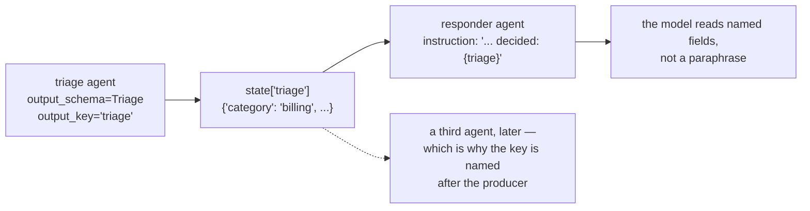

# 6.1 — `output_key` is how agents talk

## One-line answer

One agent's `output_key` writes into state and the next agent's `{key}` template reads it out — so
`output_schema` plus `output_key` plus a templated instruction is the whole hand-off mechanism of Phase
8, assembled today from three things you already have.

---

## The story

The job card in a vehicle workshop.

A car comes in and a card goes on the dashboard. The person at the front desk writes the complaint on
it — *pulls left under braking* — and the card stays with the car. The mechanic adds what he found. The
card goes with it to the alignment bay, where somebody reads what the mechanic wrote rather than asking
the customer again. At the end it goes to the counter, where the bill is written from the card.

Four people, one car, and **not one conversation between them**. Nobody handed anything to anybody or
explained the job twice. Each person read the card, did their part, and wrote on it.

Two properties are doing the work, and they are worth separating.

**The card travels with the car**, so there is never a question of *which* car the note is about. And
**the boxes are the same on every card**, so the alignment technician knows where to look without
reading the whole thing.

Session state is the card. `output_schema` is the printed boxes.

---

## The idea in plain language

You now have three pieces, all met separately:

| Piece | Met on | What it does here |
| --- | --- | --- |
| `output_schema` | [1.1](../01-the-shape-on-the-way-out/1.1-a-shape-on-the-answer.md) | the boxes are the same every time |
| `output_key` | [1.2](../01-the-shape-on-the-way-out/1.2-the-answer-with-an-address.md) | the card has a place in state |
| `{key}` in an instruction | [Day 6, part 4.1](../../../day-06-instructions-and-personas/parts/04-state-templating/4.1-the-instruction-is-a-template.md) | the next reader looks at the box |

Put together:

```text
triage agent  --output_key="triage"-->  state["triage"]  --{triage}-->  responder agent
```

That is the whole hand-off. There is no message-passing, no queue, no shared object between the agents.
**The session is the channel**, exactly as
[Day 11, part 2.2](../../../day-11-tool-context/parts/02-state-from-a-tool/2.2-reading-what-you-did-not-fetch.md)
described for tools, and one level up.

### What the second agent actually sees

Not a dictionary. Its instruction is a string, and the template substitution puts the value in as text:

```text
The triage desk decided: {'category': 'billing', 'urgency': 4, 'summary': 'Charged twice for March.'}
```

**Python's `repr`, single quotes and all.** Not JSON. It is perfectly readable — models handle it
fine — and it is worth knowing rather than assuming, because a downstream instruction that says *"the
JSON below"* is describing something that is not quite JSON.

### Why the schema matters more here than anywhere else

Without a schema, `state["triage"]` is whatever the first agent said, in prose, fence and all. The second
agent's instruction then contains a paragraph of somebody else's writing, and the second agent has to
**re-read and re-interpret** it. Every hop through free text is a re-encoding, and the losses compound —
which is [1.4](../01-the-shape-on-the-way-out/1.4-the-sheet-you-fill-in-before-you-are-called.md)'s
point about delegation, arriving from the output side.

With a schema, the second agent gets named fields with known values. `urgency: 4` means the same thing
in the responder as it meant in the triage desk, because they are the same three characters.

### The two rules that come with it

**Name the key after the producer.** `triage`, not `input_for_responder`. The moment a third agent wants
it, a consumer-named key is a lie.
([Day 11, part 2.3](../../../day-11-tool-context/parts/02-state-from-a-tool/2.3-what-not-to-put-on-the-noticeboard.md).)

**Branch on the discriminator first.** If the schema has an `outcome`
([5.1](../05-failure-lab/5.1-the-schema-that-silenced-the-agent.md)), the second agent's instruction has
to handle all of its values — including the ones where `category` is absent. An instruction that
templates `{triage}` and then talks about "the category" is wrong for two of the three outcomes.

---

## Why Sutra needs it

**Phase 8 is the triage graph**, and this is its wiring. Days 53–59 build the coordinator, the
specialists and the fan-out; all of them hand work over exactly this way.

**Day 17** is state properly, including whether a key like `triage` should be namespaced.

**Day 57** is the coordinator pattern, where the hand-off is one agent calling another as a tool —
[1.4](../01-the-shape-on-the-way-out/1.4-the-sheet-you-fill-in-before-you-are-called.md)'s
`input_schema`, meeting this part's `output_schema` from the other side.

**Day 25** is evaluation, and a hand-off through a typed key is testable at the boundary — you can assert
what agent one produced without running agent two.

---

## The mechanism

The hand-off, rendered. **No model call, no cost:**

```python
# lab/handoff.py - output_key writes to state; the next agent's instruction reads it.
import asyncio

from google.adk.agents import LlmAgent
from google.adk.agents.invocation_context import InvocationContext
from google.adk.agents.readonly_context import ReadonlyContext
from google.adk.sessions import InMemorySessionService
from google.adk.utils.instructions_utils import inject_session_state

TRIAGED = {
    "category": "billing",
    "urgency": 4,
    "summary": "Charged twice for March.",
}


async def main() -> None:
    service = InMemorySessionService()
    session = await service.create_session(app_name="sutra", user_id="u", state={"triage": TRIAGED})
    responder = LlmAgent(
        name="sutra_responder",
        model="gemini-3.7-flash",
        instruction=(
            "Write a reply to the customer.\n"
            "The triage desk decided: {triage}\n"
            "Match the urgency; do not restate the category."
        ),
    )
    invocation = InvocationContext(
        session_service=service, invocation_id="inv-1", agent=responder, session=session
    )
    rendered = await inject_session_state(responder.instruction, ReadonlyContext(invocation))
    print("what the second agent is actually told:")
    print()
    for line in rendered.splitlines():
        print("   ", line)


asyncio.run(main())
```

**Line by line:**

- `state={"triage": TRIAGED}` seeded directly — standing in for what the first agent's `output_key`
  would have written. Running the first agent would cost a request and would prove nothing this script
  is about.
- `TRIAGED` as a plain dictionary with exactly the fields
  [1.2](../01-the-shape-on-the-way-out/1.2-the-answer-with-an-address.md) showed `validate_schema`
  producing — same shape, same absence of nulls.
- The instruction written as a **three-line string** with `{triage}` in the middle, because that is what
  a real hand-off instruction looks like: a job, the input, and a constraint.
- `ReadonlyContext(invocation)` — the context type instruction templating takes. It is a read-only view
  ([Day 6, part 4.1](../../../day-06-instructions-and-personas/parts/04-state-templating/4.1-the-instruction-is-a-template.md)),
  which is the right shape for something that must not modify state while rendering a prompt.
- `inject_session_state(...)` — ADK's own templating function, so the output is what the model would
  really be sent rather than a `str.format` approximation.
- Printing line by line with an indent, so the rendered substitution can be read in place rather than as
  one long line.

The output:

```text
what the second agent is actually told:

    Write a reply to the customer.
    The triage desk decided: {'category': 'billing', 'urgency': 4, 'summary': 'Charged twice for March.'}
    Match the urgency; do not restate the category.
```

The middle line is the hand-off, and there are two things in it.

**The whole dictionary went in.** Not a summary of it, not a re-description — the three fields, with
their values, exactly as the first agent produced them.

**And it is Python's `repr`.** Single quotes, no spaces after the braces. Fine for a model to read, and
not JSON, so an instruction that calls it JSON is teaching the model something slightly false about its
own input.



---

## When it breaks

**💥 The key that was not there yet.**

```text
KeyError: 'triage'
```

The responder ran before the triage agent, or the triage agent failed, or somebody renamed the key on
one side. Templating a missing key is the hard contract from
[Day 6, part 4.2](../../../day-06-instructions-and-personas/parts/04-state-templating/4.2-hard-and-soft-contracts.md),
and it is a **good** failure: loud, immediate, and naming the key.

**💥 The instruction that assumed a triage happened.**

No error. The triage agent honestly returned `{"outcome": "not_a_ticket"}`, and the responder's
instruction says *"Match the urgency"* — so the responder writes a reply to spam, at an urgency it
inferred from nothing. **The second agent must branch on the discriminator**, and an instruction is
where that branch lives.

**💥 The paragraph that used to be a dictionary.**

Somebody removes `output_schema` from the first agent — to debug something, to try a different prompt —
and `state["triage"]` becomes prose with a code fence in it. The responder still works, in the sense
that it produces a reply. It is now reading a paragraph and inferring the urgency, and the only symptom
is worse answers.

**💥 The state that grew a channel per pair.**

No error. `triage`, `triage_for_responder`, `triage_v2`, `enriched_triage` — four keys carrying the same
decision, because each new consumer wanted it slightly differently and adding a key is easier than
agreeing. This is
[Day 11, part 2.3](../../../day-11-tool-context/parts/02-state-from-a-tool/2.3-what-not-to-put-on-the-noticeboard.md)'s
noticeboard, at the level of agents, and it is how a two-agent system becomes unmaintainable at five.

---

## In production

**What a professional writes instead of the teaching version** is a schema module that both agents
import — the producer as its `output_schema`, the consumer as the thing it parses `state["triage"]` back
into. That round trip is two lines, it restores the `None`s that `exclude_none` dropped
([2.2](../02-schemas-in-practice/2.2-optional-default-and-null.md)), and it makes the hand-off a typed
interface rather than a shared dictionary with a convention attached.

**What degrades at scale** is that state is a global namespace with no owner. Every agent writes one key
and reads several, nothing declares which, and the dependency graph between agents exists only in the
instructions. At three agents you can hold it in your head; at eight, changing a key is a search across
the codebase and a hope. Day 17's `state_schema` is the beginning of an answer and the real one is
treating each key as an interface with a named owner.

**The failure that only shows with real traffic** is the discriminator branch nobody exercised. In
testing you drive the pipeline with real tickets, so `outcome` is always `triaged` and the responder's
instruction is always correct. The first `not_a_ticket` in production goes through a responder that was
never asked to handle one, and it writes a courteous reply to a spam message — which is not an error,
does not appear in any failure metric, and is genuinely embarrassing.

**The review comment a senior engineer leaves:** *"The responder templates `{triage}` and then talks about
the urgency, but the triage schema has an `outcome` that can be `not_a_ticket` — so for those we'll write
a polite reply to spam. Branch in the instruction. And parse `state['triage']` back into the `Triage`
class in the consumer rather than reading the raw dict; the optional fields are dropped, not nulled."*

**The interview question:** *"how do agents pass work to each other?"* The answer that shows you have
built a pipeline: "Through session state, usually — one agent declares an output key, the framework
writes its final answer there, and the next agent's instruction templates that key in. The reason it
works well is the output schema: without one, the second agent is reading the first agent's prose and
re-interpreting it, and every free-text hop is a re-encoding whose losses compound down a chain. With
one, the second agent gets named fields with the values the first agent actually chose. Two details
worth knowing: the templating inserts the Python `repr` of the value, so it looks like JSON and isn't
quite, and if the schema has a discriminator for 'I couldn't do this' then every consumer's instruction
has to branch on it — otherwise the first untriageable input produces a polite reply to spam, with no
error anywhere. The thing that rots at scale is that state is a global namespace nobody owns, so I'd
treat each key as an interface: named after its producer, with a schema class both sides import."

---

## Check yourself

```bash
uv run python days/day-12-structured-output/lab/handoff.py
```

Then change the seeded state to `{"outcome": "not_a_ticket"}` and read the rendered instruction again.
Ask yourself what the responder would write.

**Answer out loud, without scrolling up:**

> Name the three pieces the hand-off is made of and where you met each. Then say what the second agent
> literally sees, and the one branch its instruction must have.

---

**Next:** [6.2 — Testing structured output for free](6.2-testing-structured-output-for-free.md)
