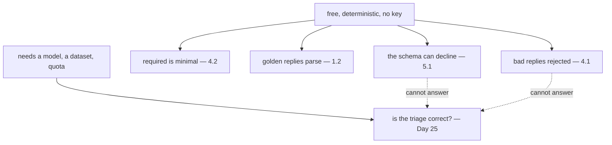

# 6.2 — Testing structured output for free

## One-line answer

Four assertions that need no model and no key: the schema can decline, only always-answerable fields are
required, golden replies parse to expected values, and bad replies are rejected — and the fifth
question, *is the answer right?*, cannot be asked here at all.

---

## The story

Getting a key cut.

The man takes your key, clamps it beside a blank, runs the cutter along it, files the burr off, and then
— before you pay — does two things that take four seconds. He holds the new key against the old one,
edge to edge, in the light. Then he runs his thumb along the teeth.

Neither of those is *"does it open your door"*. He cannot test that; your door is a kilometre away. What
he can test is that the shape matches and there is nothing sharp left, and he does, every time, because
those are the two ways the job usually goes wrong and both are checkable on the spot.

You still have to go home and try it. That is a different test, it happens later, and it is the only one
that answers the real question — which is exactly why he does not skip the four-second one.

---

## The idea in plain language

[Day 11, part 6.1](../../../day-11-tool-context/parts/06-in-production/6.1-a-tool-without-a-model.md)
built a context and tested a tool with no model. This is the same move on the output side, and it is
easier: a schema is a class, and `validate_schema` is a pure function.

### The four free assertions

**1 — The schema can decline.** [5.1](../05-failure-lab/5.1-the-schema-that-silenced-the-agent.md)'s
rule, as a test: some field of the result offers something other than success. It is a strange-looking
assertion and it catches the most expensive mistake in this day.

**2 — Only always-answerable fields are required.**
[4.2](../04-when-a-schema-lies/4.2-the-field-that-was-always-filled.md)'s rule, as a test:
`declared["required"] == ["outcome"]`. It goes red when somebody adds a required field, which is the
moment to have the conversation rather than six months later.

**3 — Golden replies parse to expected values.** A handful of realistic model replies — including one
wrapped in a code fence, because models do that — each with the dictionary it should become. This
catches fence-stripping, `exclude_none`, and every change to the schema's field names.

**4 — Bad replies are rejected.** A wrong enum member, an out-of-range integer, a non-JSON string. It
asserts that the validation you think is happening is happening.

### The fifth question, and why it is not here

*Is the triage correct?*

That needs a model, a dataset of tickets with known-correct answers, and a scoring rule. It is **Day
25**, it costs quota, and it is not deterministic.
[4.1](../04-when-a-schema-lies/4.1-valid-is-not-true.md) is the reason the two must not be confused: four
of five wrong answers pass every assertion on this page.

So name the tests accurately. `test_golden_replies_parse_to_the_expected_value` is true.
`test_triage_is_correct` would be a lie in the test suite, and a lie in a test name is worse than a
missing test, because it stops anybody writing the real one.

### What this buys you

Every one of these runs with **no `GOOGLE_API_KEY`, no network and no quota**, in milliseconds, on a
fresh clone. They belong in `./m check` from today. And they catch, between them, every mistake this day
has described except the ones that need a model to see.

---

## Why Sutra needs it

**Sutra's `Triage` is about to be depended on** by a router, an evalset and a second agent. A schema with
tests is a schema you can change; one without is a schema everybody is afraid of.

**Day 25** is the other half — the evalset, the quota, the scoring.

**Day 31** is the quality gate, where these join
[Day 11's tool tests](../../../day-11-tool-context/parts/06-in-production/6.1-a-tool-without-a-model.md)
and Day 9's `:free` lint in one command.

**Phase 8** changes `Triage` more than once as the graph grows. Assertion 3 is what makes each of those
changes a two-minute job.

---

## The mechanism

Four tests, no model. **No model call, no cost:**

```python
# lab/testing.py - four free assertions about structured output.
import json
from typing import Literal

from google.adk.tools.set_model_response_tool import SetModelResponseTool
from google.adk.utils._schema_utils import validate_schema
from pydantic import BaseModel, Field, ValidationError


class Triage(BaseModel):
    outcome: Literal["triaged", "unclear", "not_a_ticket"] = Field(
        description="'triaged' only when the text describes a real problem"
    )
    category: Literal["billing", "technical", "account"] | None = None
    urgency: int | None = Field(default=None, ge=1, le=5)
    summary: str | None = None


GOLDEN = [
    ('{"outcome": "not_a_ticket"}', {"outcome": "not_a_ticket"}),
    (
        '```json\n{"outcome": "triaged", "category": "billing", "urgency": 4, "summary": "Charged twice."}\n```',
        {
            "outcome": "triaged",
            "category": "billing",
            "urgency": 4,
            "summary": "Charged twice.",
        },
    ),
]

REJECTED = [
    '{"outcome": "maybe"}',
    '{"outcome": "triaged", "urgency": 9}',
    "not json at all",
]


def test_the_schema_has_a_way_to_decline() -> None:
    """5.1: a schema with no refusal value forces a confident answer."""
    outcomes = Triage.model_fields["outcome"].annotation.__args__
    assert len(outcomes) > 1, "outcome must offer something other than success"


def test_only_the_decline_field_is_required() -> None:
    """4.2: a required field is an instruction to always have an answer."""
    declared = SetModelResponseTool(Triage)._get_declaration().parameters_json_schema
    assert declared["required"] == ["outcome"]


def test_golden_replies_parse_to_the_expected_value() -> None:
    """1.2: what lands in state is the parsed value, fences stripped, nulls dropped."""
    for said, expected in GOLDEN:
        assert validate_schema(Triage, said) == expected


def test_bad_replies_are_rejected() -> None:
    """4.1: the schema catches shape. Only shape."""
    for said in REJECTED:
        try:
            validate_schema(Triage, said)
        except (ValidationError, ValueError, json.JSONDecodeError):
            continue
        raise AssertionError(f"schema accepted {said!r}")


for test in (
    test_the_schema_has_a_way_to_decline,
    test_only_the_decline_field_is_required,
    test_golden_replies_parse_to_the_expected_value,
    test_bad_replies_are_rejected,
):
    test()
    print(f"  PASS  {test.__name__}")
```

**Line by line:**

- `Triage` is the **fixed** schema — [5.1](../05-failure-lab/5.1-the-schema-that-silenced-the-agent.md)'s
  `Open`, with a discriminator and optional contents. Testing the broken one would be testing the wrong
  thing.
- `Triage.model_fields["outcome"].annotation.__args__` — the members of the `Literal`, read off the
  class. `__args__` is a `typing` internal and it is the honest way to ask *"how many choices does this
  field offer?"* without hard-coding the answer.
- `len(outcomes) > 1` with a **message on the assert** — the message is what a maintainer sees when it
  goes red, and *"outcome must offer something other than success"* explains the rule where the failure
  happens.
- `declared["required"] == ["outcome"]` — an **exact** comparison, not a membership check. `in` would
  pass while somebody added three more required fields; equality is what makes this test a gate.
- `GOLDEN`'s second entry carries a real ```` ```json ```` fence, because a golden set of already-clean
  strings would never exercise the stripping that
  [1.2](../01-the-shape-on-the-way-out/1.2-the-answer-with-an-address.md) depends on.
- `GOLDEN`'s first entry expects `{"outcome": "not_a_ticket"}` and nothing else — asserting the
  `exclude_none` drop rather than assuming it.
- `REJECTED` covers three different failure kinds: a bad enum member, a bound violation, and text that is
  not JSON at all. Three mechanisms, three exception types, which is why the `except` names three.
- The `try` / `except` / `continue` / `raise AssertionError` shape rather than `pytest.raises` — so the
  script runs without pytest, and so the failure message names the string that was wrongly accepted.
  Under pytest this becomes `with pytest.raises(...)`.
- Each test's docstring names the part it comes from, so a red test is traceable to the paragraph that
  explains it.
- The runner loop at the bottom stands in for pytest;
  [Day 11's `pytest-asyncio` question](../../../day-11-tool-context/parts/06-in-production/6.1-a-tool-without-a-model.md)
  does not arise here, because none of this is async.

The output:

```text
  PASS  test_the_schema_has_a_way_to_decline
  PASS  test_only_the_decline_field_is_required
  PASS  test_golden_replies_parse_to_the_expected_value
  PASS  test_bad_replies_are_rejected
```

Four green, no key, no network, no quota.

And notice what each one is actually guarding. The first two are assertions about **the schema's
design** — they go red when somebody makes a change this day argued against. The second two are
assertions about **the parsing pipeline** — they go red when the framework's behaviour changes under
you, which on a pinned dependency is exactly the signal Principle 14 wants you to notice.



---

## When it breaks

**💥 The test that asserts nothing.**

```python
assert validate_schema(Triage, reply)
```

A non-empty dictionary is truthy, so this passes for any valid reply and for several wrong ones. Compare
with an **expected value**, always. This is the single most common way a golden test stops testing.

**💥 The `in` that should have been `==`.**

```python
assert "outcome" in declared["required"]
```

Green while three more required fields appear beside it. Assertion 2 exists to catch exactly that
addition, and `in` disables it.

**💥 The golden set of clean strings.**

Every fixture written by hand, none with a code fence, none with a `null`. The tests pass and the two
behaviours that actually surprise people — fence-stripping and `exclude_none` — are never exercised.
**Golden fixtures should look like what a model produces**, not like what you would type.

**💥 The `__args__` that moved.**

```text
AttributeError: 'type' object has no attribute '__args__'
```

Someone changes `outcome` from a `Literal` to a plain `str`, and assertion 1 crashes rather than failing
cleanly. That is a red test either way and the message is unhelpful, so it is worth writing the
assertion defensively — `getattr(annotation, "__args__", ())` — once this leaves the lab.

**💥 The name that promised more than it delivered.**

No error. `test_triage_is_correct` that only checks parsing is a test suite telling you something it
does not know. Nobody writes the evalset, because the box is already ticked.

---

## In production

**What a professional writes instead of the teaching version** is these four as pytest tests beside the
schema module, plus a **golden file** rather than an inline list once the set grows past about five:
`tests/golden/triage/*.json`, each holding a model reply and its expected parse. Adding a case becomes
adding a file, which is the difference between a fixture set that grows and one that stops at the day it
was written.

**What degrades at scale** is fixture staleness. Golden replies are captured from a model at a point in
time; the model changes, the prompt changes, and the fixtures keep passing because they are checking the
parser rather than the model. That is still worth having — but a team that believes the golden set
represents current model behaviour is wrong within a month. **Say what these tests cover**, in a comment
at the top of the file, or somebody will assume they cover more.

**The failure that only shows with real traffic** is the reply shape nobody captured. Models emit
leading prose before a JSON block, trailing explanations, doubled fences, and occasionally two JSON
objects. Your golden set has none of those because you wrote it. The way to fix it is not imagination —
it is to log the raw text on every parse failure in production and turn each one into a golden case.
**The fixture set should be fed by the failures**, and that loop is worth building before you need it.

**The review comment a senior engineer leaves:** *"Compare to an expected dict rather than asserting
truthiness — right now that test passes for any valid reply. Make the `required` check an equality. And
put one fence-wrapped reply in the golden set; that's the behaviour we're actually relying on and none
of the current fixtures exercise it."*

**The interview question:** *"how do you test a structured output?"* The answer that shows you know where
the line is: "In two layers, and the important part is not confusing them. The free layer needs no model:
assert the schema can express a refusal, assert that `required` contains only fields that always have an
answer, run golden model replies through the parser and compare with expected dictionaries — including
one wrapped in a code fence, because models do that and the framework strips it — and assert that bad
replies are rejected. All deterministic, all in milliseconds, all in CI with no API key. The second layer
is whether the answer is *right*, and nothing in the first layer touches it: for one ticket I can write
five outputs where four validate and one is correct. That needs an evalset with known-correct answers
and it costs quota. The failure I'd warn about is naming: a test called `test_triage_is_correct` that
only checks parsing stops anybody from writing the one that measures accuracy."

---

## Check yourself

```bash
uv run python days/day-12-structured-output/lab/testing.py
```

Then add a required field to `Triage` and watch the second test go red. Then remove `"unclear"` and
`"not_a_ticket"` from the `Literal` and watch the first.

**Answer out loud, without scrolling up:**

> Give the four free assertions and the question none of them can answer. Then say why a golden fixture
> should contain a code fence.

---

**Next:** [back to the hub](../../LESSON.md) — then read the paper in
[`papers/01-guided-generation.md`](../../papers/01-guided-generation.md), and the ledger rows in §11.
