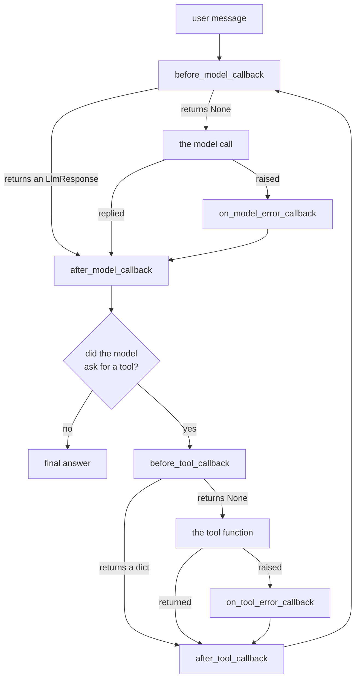

# 1.1 — The function you never call

## One-line answer

A callback is a plain Python function that you write, hand to the agent once, and then never call
yourself: ADK calls it for you at a fixed moment in the run, and what it returns decides whether the
thing behind that moment still happens.

---

## The story

A small shop with a chime on the door.

The owner did not want to stand at the counter all day watching the entrance, so she screwed a chime
to the top of the door frame. She wires it up once, in the morning. After that she never touches it.
Somebody walks in, the door swings, the chime sounds, and she looks up from the back room.

She is not checking the door. The door is telling her.

Now think about what she can do in the half second after the chime. Mostly she just looks up and
carries on, because the chime was information and nothing more. But sometimes she calls out "we're
closed, sorry" before the person has taken three steps, and then the whole visit does not happen.
Same chime, same wiring. The difference is entirely in what she does when it sounds.

That is a callback. You wire it up once, when you build the agent. The framework rings it. And you
decide, each time, whether you are watching or whether you are stopping the thing that was about to
happen.

---

## The idea in plain language

Almost all the code you have written so far in this curriculum is code **you** call. You write
`lookup_ticket`, and somewhere there is a line that calls `lookup_ticket`. Control runs outward from
your code.

A **callback** inverts that direction. You write the function and hand it over, and something else
calls it. The word is old and literal: you leave your function with the framework the way you leave
your phone number with a shop, and the framework *calls you back* when the thing you cared about
happens.

Three words that will keep returning today, defined here:

- A **hook** is a point in somebody else's code where they promised to call your function. ADK's
  hooks are fixed. There are six of them on an agent and you cannot add a seventh.
- To **attach** a callback is to store your function in one of the agent's fields when you build the
  agent. Nothing runs at that moment.
- To **fire** is what the framework does later, during a run, when execution reaches the hook.

The six hooks come in three pairs. One pair sits around the model call, one pair sits around every
tool call, and one pair fires only when something raised an exception:

| Field on the agent | Fires |
| --- | --- |
| `before_model_callback` | just before the request goes to the model |
| `after_model_callback` | just after a reply comes back from the model |
| `before_tool_callback` | just before a tool function runs |
| `after_tool_callback` | just after a tool function returns |
| `on_model_error_callback` | when the model call raised |
| `on_tool_error_callback` | when the tool raised |

The first four are today's subject, and they are what the curriculum means by ADK-14 (the model
pair) and ADK-15 (the tool pair). The error pair is
[3.4](../03-the-tool-doors/3.4-the-doors-that-only-open-on-an-error.md), because an error hook only
makes sense once you know what the ordinary hook does.

Two more hooks exist one level up, `before_agent_callback` and `after_agent_callback`, which wrap the
agent's *whole* turn rather than one model or tool call. 🅿️ They are **parked**: know that they
exist and that they hand you a `types.Content` rather than an `LlmResponse`. Sutra does not use one
today.

---

## Why Sutra needs it

**Day 3 had a chokepoint and Day 10 gave it away.** In
[Day 3, part 2.2](../../../day-03-loop-hand-rolled/parts/02-tools-and-dispatch/2.2-the-dispatch-table-is-the-boundary.md)
you dispatched every tool call through a dictionary you owned, so there was exactly one line in the
program where a call could be logged, counted or refused. Then
[Day 10, part 3.1](../../../day-10-function-tools/parts/03-the-dispatch-you-deleted/3.1-what-the-courier-took.md)
handed dispatch to ADK and that line stopped existing. Today it comes back, and there are four of it.

**Day 11's audit prints are in the wrong place.** They live in your `run_once` harness, outside the
agent, so a run started by `adk web` prints nothing. A callback runs *inside* the agent, so it fires
no matter who started the run.

**Everything Sutra restrains later is built on this.** Day 21 turns the error pair into a retry
ladder. Day 51's response cache is `before_model_callback` with a dictionary behind it. Day 67's
output guardrails are `after_model_callback` grown up. None of those days introduce new machinery.
They introduce new *policies*, wired into these same six fields.

---

## The mechanism

A callback is attached the way a tool is: as an argument to the agent's constructor.

```python
# lab/wiring.py - attaching a callback, and proving nothing has run yet.
from google.adk.agents import LlmAgent


def announce(callback_context, llm_request):
    """Fires before every model call. Watches; never interferes."""
    print(f"  [before_model] agent={callback_context.agent_name}")


agent = LlmAgent(
    name="chime",
    model="gemini-3.7-flash",
    instruction="You are a demo agent.",
    before_model_callback=announce,
)

print("attached:", agent.before_model_callback.__name__)
print("fired so far:", 0)
print("the other five doors:")
for field in (
    "after_model_callback",
    "before_tool_callback",
    "after_tool_callback",
    "on_model_error_callback",
    "on_tool_error_callback",
):
    print(f"  {field} = {getattr(agent, field)}")
```

**Line by line:**

- `def announce(callback_context, llm_request)` — two parameters, and the names are not a style
  choice. They are the contract, which is the whole of [1.2](1.2-the-names-are-the-contract.md).
- No `return` statement at all. A Python function that falls off the end returns `None`, and `None`
  is the value that means *carry on* — [1.3](1.3-none-means-carry-on.md).
- `before_model_callback=announce` — the function object, **not** `announce()`. The parentheses
  would call it immediately, at construction, with no arguments. This is the most common first
  mistake with callbacks in any framework, and *When it breaks* below has the exact message.
- `model="gemini-3.7-flash"` — pinned explicitly, because ADK's default model is a preview (ADK-73,
  [Day 5, part 3.1](../../../day-05-first-adk-agent/parts/03-the-model-pin/3.1-the-default-that-moved.md)).
  This script never calls the model, so the pin costs nothing today. It is here because an agent
  without an explicit pin is an agent whose behaviour can change under you.
- `agent.before_model_callback.__name__` — the field holds your function object unchanged. ADK does
  not wrap it, rename it or copy it, which is why this line can print your own function's name.
- The loop over the other five field names prints `None` for each, because attaching one callback
  implies nothing about the others. It is a tuple rather than a list only because nothing appends to
  it.

The output:

```text
attached: announce
fired so far: 0
the other five doors:
  after_model_callback = None
  before_tool_callback = None
  after_tool_callback = None
  on_model_error_callback = None
  on_tool_error_callback = None
```

`fired so far: 0` is the whole point of the script. You built an agent, you attached a function, and
nothing called it. The chime is screwed to the door frame and nobody has walked in.

Where the six hooks sit in one run:



The arrow from `after_tool_callback` back to `before_model_callback` is
[Day 3, part 1.1](../../../day-03-loop-hand-rolled/parts/01-loop-anatomy/1.1-the-navigator-and-the-driver.md)'s
think–act–observe loop, still running. Callbacks did not add a loop. They added six places to stand
inside the one you already had.

Verified against `adk.dev/callbacks/types-of-callbacks/` and the installed `google-adk` 2.7.1
(`google/adk/agents/llm_agent.py`, the block the source itself marks `# Callbacks - End`) on
2026-08-29.

---

## When it breaks

**💥 The parentheses that fired it at construction.**

```text
TypeError: announce() missing 2 required positional arguments: 'callback_context' and 'llm_request'
```

You wrote `before_model_callback=announce()`. Python evaluated `announce()` before the agent existed,
with no arguments. The traceback points at your own agent definition rather than at anything in ADK,
which is the clue: nothing had started running yet.

**💥 The callback that never fires.**

No error at all, and no output. Three causes, in the order they actually happen:

1. You attached it to a **different agent object** than the one the runner is driving. Two
   `LlmAgent(...)` calls make two agents, and only one of them has your function.
2. You attached a **tool** callback to an agent with no tools, so there was never a tool call to
   wrap.
3. The run short-circuited earlier. A `before_model_callback` returned a response, the model never
   ran, and `after_model_callback` had nothing to fire on — [1.3](1.3-none-means-carry-on.md).

**💥 The mutable default that remembered the last run.**

```python
def audit(callback_context, llm_request, seen=[]):
    seen.append(llm_request.model)
```

**Line by line:**

- `seen=[]` is evaluated **once**, when the function is defined, so every call shares one list.
- ADK holds your function object for the life of the agent, so that one list now survives across
  runs, across sessions and across users. It is Python's oldest footgun meeting a function that lives
  far longer than the code around it suggests. Per-run state belongs in `callback_context.state` —
  [Day 11, part 2.1](../../../day-11-tool-context/parts/02-state-from-a-tool/2.1-writing-on-the-carbon-copy.md).

---

## In production

**What a professional writes instead of the teaching version** is a callback that is small, pure and
named for what it decides. `announce` is a fine teaching name and a poor production one. A real
codebase has `audit_model_calls`, `block_credential_queries`, `truncate_tool_results` — names that
tell a reviewer what the door does without opening the function.

**What degrades at scale** is the count. Six hooks is a small number until you have twelve agents,
at which point you have seventy-two attachment points and no single place that states the system's
policy. That is the problem plugins solve, and it is the reason today's parts keep repeating the
word *per-agent*: a callback is a property of one agent, never of your application. See
[4.2](../04-where-the-rule-bites/4.2-the-plugin-goes-first.md).

**The failure that only shows with real traffic** is the callback that was cheap on your machine.
Every hook runs on the request path, synchronously, once per model call and once per tool call. A
forty-line function that reads a policy file from disk therefore runs thousands of times a day and
adds its disk read to every single turn. That is
[6.2](../06-in-production/6.2-what-belongs-in-a-callback.md).

**The review comment a senior engineer leaves:** *"Attach this to the agent, not inside `run_once` —
otherwise it doesn't fire under `adk web`, and we end up with an audit trail that depends on which
entry point somebody happened to use."*

**The interview question:** *"What is a callback, and how is it different from calling the function
yourself?"* The answer that shows you have wired one: "Control is inverted. I hand the framework a
function and it calls it at a fixed point in its own execution, which means my code runs on paths I
didn't write — the dev UI, another service's entry point, a scheduled run. That's the whole value:
it's the only way to make a rule apply to every caller. The cost is that my function now runs inside
someone else's control flow, so its parameter names, its return value and its runtime are all part of
a contract I didn't design."

---

## Check yourself

```bash
uv run python days/day-13-callbacks-four-doors/lab/wiring.py
```

Then add `before_tool_callback=announce` to the same agent and run it again. The script still prints
`fired so far: 0`, and now two fields hold the same function object.

**Answer out loud, without scrolling up:**

> Name the six hooks an ADK agent has, say which two are parked today, and say what happened when you
> constructed an agent with a callback attached.

---

**Next:** [1.2 — The names are the contract](1.2-the-names-are-the-contract.md)
