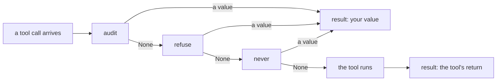

# 1.4 — A list, not just a function

## One-line answer

Every callback field also accepts a **list** of functions, run in the order you listed them, and the
first one that returns something other than `None` stops the rest — so the order you write them in is
a policy decision, not a formatting choice.

---

## The story

Three checks at a stadium gate.

The first person scans the barcode on your phone. The second glances at the age on the ticket against
the section you are heading to. The third opens your bag. You walk past all three in a line and then
you are inside.

Now watch what happens when something is wrong. If the barcode does not scan, you are pulled aside at
the first person, and the second and third never look at you at all. Your bag is not checked, because
you never got as far as the bag check. The queue is a chain, and the first stop ends it.

Which means the order the three of them stand in decides which reason you are turned away for. If the
bag check were first, a person with an invalid ticket and a bottle of water in their bag would be
turned away over the water. Same three checks, same three people, a different sentence at the end.

---

## The idea in plain language

Everything so far has attached one function to one field. ADK also accepts a list:

```python
agent = LlmAgent(
    name="desk",
    model="gemini-3.7-flash",
    before_tool_callback=[audit, block_credentials, count_searches],
)
```

**Line by line:**

- The field holds the list itself; ADK does not merge them or combine their return values.
- They run **left to right**, in exactly the order written.
- The chain stops at the first one that returns a value. On a list of pure observers, all three run
  every time; on a list containing an override, everything after the override may never run.

ADK's field documentation states the rule as *"the callbacks will be called in the order they are
listed until a callback does not return None"*, and the adk.dev callbacks reference says the same
thing more briefly: *"Every callback field also accepts a list of functions instead of a single
function."*

Two words for the two things a list buys you:

- **Composition** — one function per concern. An audit function that only audits, a policy function
  that only enforces, a metrics function that only counts. Each is separately testable and separately
  deletable.
- **Precedence** — the order encodes which rule wins. A refusal placed before a rewrite means
  forbidden calls are never rewritten; the other order means you rewrite a request you were about to
  refuse, and waste the work.

There is a wrinkle here too, and it is the same one as in [1.3](1.3-none-means-carry-on.md): the loop
stops on a **truthy** value, not on a not-`None` value, and the tool doors have a further quirk about
what the *last* callback in the list leaves behind. That is
[4.1](../04-where-the-rule-bites/4.1-truthy-is-not-the-same-as-not-none.md). For now, hold the rule as
the documentation states it, and know that the exception has an address.

---

## Why Sutra needs it

**Sutra's tool door has two jobs today.** It must audit every call *and* refuse forbidden ones. Those
are two concerns, and [Day 11, part 3.1](../../../day-11-tool-context/parts/03-designing-a-tool/3.1-one-tool-one-job.md)'s
one-tool-one-job argument applies to callbacks for exactly the same reason: a function that both logs
and decides cannot be tested for either without the other.

**The order is a real decision you make today.** Audit first, then refuse, so the audit trail records
the calls that were blocked. Refuse first and your log has a hole exactly where the interesting events
are.

**Day 14 stacks another layer on top.** Plugins are the same idea at application scope, and they run
*before* the whole list — [4.2](../04-where-the-rule-bites/4.2-the-plugin-goes-first.md). Knowing that
one field can hold several functions is what makes the plugin layer feel like an extension rather than
a replacement.

---

## The mechanism

Three functions at one door, with a print in each so you can see who ran:

```python
# lab/a_list.py - order is policy. The first value stops the chain.
import asyncio

from google.adk.agents import LlmAgent
from google.adk.runners import InMemoryRunner
from google.genai import types
from scripted import ScriptedModel, call, text


def lookup_ticket(ticket_id: str) -> dict:
    """Look up a support ticket by id."""
    print("      the tool actually ran")
    return {"status": "ok", "ticket_id": ticket_id}


def audit(tool, args, tool_context):
    """Observer. Runs, prints, returns None: the chain continues."""
    print(f"      1 audit: {tool.name}({args})")


def refuse(tool, args, tool_context):
    """Override. Returns a dict, so the chain stops here."""
    print("      2 refuse: blocking")
    return {"status": "blocked", "message": "policy: no lookups in this demo"}


def never(tool, args, tool_context):
    """Also an override - but it only runs if nothing before it returned."""
    print("      3 never: I ran after all")
    return {"status": "second override"}


async def drive(agent: LlmAgent) -> None:
    runner = InMemoryRunner(agent=agent)
    session = await runner.session_service.create_session(app_name=runner.app_name, user_id="u")
    async for event in runner.run_async(
        user_id="u",
        session_id=session.id,
        new_message=types.Content(role="user", parts=[types.Part(text="ticket 4521")]),
    ):
        for part in (event.content.parts if event.content else []) or []:
            if part.function_response:
                print("      result:", part.function_response.response)


def build(chain) -> LlmAgent:
    return LlmAgent(
        name="desk",
        model=ScriptedModel(
            model="scripted",
            replies=[[call("lookup_ticket", ticket_id="4521")], [text("done")]],
        ),
        instruction="Triage the ticket.",
        tools=[lookup_ticket],
        before_tool_callback=chain,
    )


async def main() -> None:
    print("a. [audit, refuse, never]")
    await drive(build([audit, refuse, never]))

    print("b. [refuse, audit] - the audit never happens")
    await drive(build([refuse, audit]))

    print("c. [audit] alone - the tool runs")
    await drive(build([audit]))


asyncio.run(main())
```

**Line by line:**

- `before_tool_callback=chain` where `chain` is a **list** — the same field that took a single
  function in [1.1](1.1-the-function-you-never-call.md). ADK normalises both forms internally, so
  there is no separate "list mode" to switch on.
- `audit` prints and has no `return`, which is what lets `refuse` run after it.
- `never` is the control. If it prints, the chain did not stop where the documentation says it should,
  and the experiment has told you something surprising rather than confirming a belief.
- Experiment **b** reverses the first two, which is the whole teaching: the same two functions, the
  same agent, a different audit trail.
- Experiment **c** is the baseline. Without it you cannot tell "the chain stopped" from "the tool
  never gets called in this script anyway".
- `build` returns a **new** agent each time, with a new `ScriptedModel`, because an agent's callback
  field is read on every call and a reused model would carry its call count between experiments.

The output:

```text
a. [audit, refuse, never]
      1 audit: lookup_ticket({'ticket_id': '4521'})
      2 refuse: blocking
      result: {'status': 'blocked', 'message': 'policy: no lookups in this demo'}
b. [refuse, audit] - the audit never happens
      2 refuse: blocking
      result: {'status': 'blocked', 'message': 'policy: no lookups in this demo'}
c. [audit] alone - the tool runs
      1 audit: lookup_ticket({'ticket_id': '4521'})
      the tool actually ran
      result: {'status': 'ok', 'ticket_id': '4521'}
```

In **a**, `3 never` is absent. The chain stopped at `refuse`.

In **b**, `1 audit` is absent. The blocked call was never recorded, and the log for that run has no
entry for a tool call that a policy actively refused. If that log is your evidence in an incident
review, it is evidence of nothing.

In **c**, `the tool actually ran` appears — the observer alone lets everything through.



Verified against `adk.dev/callbacks/types-of-callbacks/` and the installed `google-adk` 2.7.1
(`LlmAgent.canonical_before_tool_callbacks` and the loop in
`google/adk/flows/llm_flows/functions.py`) on 2026-08-29.

---

## When it breaks

**💥 The parentheses, inside a list this time.**

```text
TypeError: audit() missing 3 required positional arguments: 'tool', 'args', and 'tool_context'
```

You wrote `before_tool_callback=[audit(), refuse()]`. Python builds the list *before* the agent is
constructed, so both functions are called on the spot with no arguments and the agent never exists.
Same mistake as [1.1](1.1-the-function-you-never-call.md)'s, harder to spot inside brackets, and the
tool-door version names three missing parameters instead of two.

**💥 The `None` left in the list while you were commenting one out.**

```text
pydantic_core._pydantic_core.ValidationError: 2 validation errors for LlmAgent
before_tool_callback.callable
  Input should be callable [type=callable_type, input_value=[<function audit at 0x...>, None], input_type=list]
before_tool_callback.list[callable].1
  Input should be callable [type=callable_type, input_value=None, input_type=NoneType]
```

Two errors for one mistake, because the field's type is *a callable **or** a list of callables* and
Pydantic reports why each branch of that union failed. Read the second one: `list[callable].1` is the
path — index 1 of the list. That is the item to look at. This one fails at construction, which is the
good kind of failure: a list is validated the moment you build the agent, not on the first tool call.

**💥 The audit that stopped auditing.** No error. You added a policy function to the front of the
list, and every blocked call vanished from the log at the same moment. The symptom appears as
*"blocking works but we have no record of it"*, which reads like a logging bug and is an ordering
bug.

**💥 The second override that never runs.** Also no error. Two policy functions in one list, both
correct, and the second one is dead code because the first one returns a value on the same condition.
The test for each function passes in isolation; the system behaves as if only one exists.

---

## In production

**What a professional writes instead of the teaching version** is a list with a comment stating why
the order is what it is, because the order is the policy and a future reader will otherwise sort it
alphabetically:

```python
root_agent = LlmAgent(
    name="sutra_desk",
    model="gemini-3.7-flash",
    # The order below IS the policy. Do not sort this list.
    before_tool_callback=[
        audit_tool_calls,  # 1. observer - must run first so refusals are recorded
        block_forbidden_queries,  # 2. the only override; anything after it may not run
    ],
)
```

**Line by line:**

- The numbering in the comments is deliberate. It survives a diff in a way that "the order matters"
  does not.
- The observer is first so that the audit trail contains the refusals — the events most likely to be
  asked about later.
- Naming the override *as* the override in the comment tells the next person adding a function where
  it is safe to append.

**What degrades at scale** is exactly this ordering knowledge. A list of two is obvious; a list of
seven, edited by four people over a year, contains at least one function that has not run since
somebody inserted an override above it. The defence is a test that asserts the chain's shape rather
than each function's behaviour, and the honest version of that test asserts the *ordering rule*, not
the current order.

**The failure that only shows with real traffic** is the expensive observer behind a rare override. A
metrics callback placed after a policy callback stops emitting for the exact population you care
about — blocked calls — and the gap in the dashboard looks like a drop in traffic rather than a gap in
instrumentation.

**The review comment a senior engineer leaves:** *"Move the audit above the policy check. As written,
the only calls we never record are the ones somebody will ask us about."*

**The interview question:** *"How do you compose several concerns onto the same hook?"* The answer
that shows you have wired one: "The field takes a list, and it runs left to right until one returns
something. So I put pure observers first — audit, metrics — and overrides last, because anything after
an override may never execute. That ordering is a policy decision: put the policy check first and your
audit log is missing precisely the blocked calls. And I'd write it as one function per concern rather
than one big function, because a list is testable a function at a time and a fifty-line callback isn't."

---

## Check yourself

```bash
cd days/day-13-callbacks-four-doors/lab && uv run python a_list.py
```

Then move `never` to the front of experiment **a**'s list and predict the output before you run it.

**Answer out loud, without scrolling up:**

> Say what a list of callbacks does when the second of three returns a dict. Then say why an audit
> function belongs before a policy function and not after it.

---

**Next:** [2.1 — What is actually in the request](../02-the-model-doors/2.1-what-is-actually-in-the-request.md)
