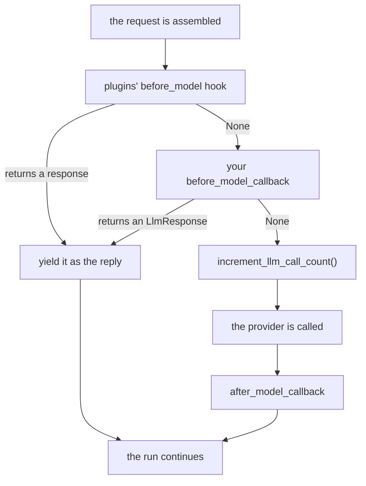

# 2.3 — The call that never happened

## One-line answer

A `before_model_callback` that returns an `LlmResponse` **short-circuits** the model call: no request
leaves the machine, no quota is spent, and — because ADK increments its call counter *after* the
callback — the skipped call does not count against `max_llm_calls` either.

---

## The story

The phone menu that answers before anyone picks up.

You call the electricity board about a power cut. Before a single ring, a recorded voice says: "There
is a known outage in your area. Supply is expected by six o'clock." Then it offers you the menu.

Nobody answered your call. There is no person on the other end who now knows you rang, no ticket, no
queue position. And yet you have your answer, in three seconds, and you hang up.

The recording did not make the call centre faster. It made your call **not happen**. Those are
different achievements, and only one of them scales: a faster call centre still needs a person per
call, while a recording that answers the top question serves everybody who has that question at no
extra cost at all.

---

## The idea in plain language

**Short-circuiting** means answering at the door instead of letting the request through. Applied
here: your callback recognises a request it can answer, builds the reply itself, and returns it. ADK
uses your reply as the model's reply, and the model layer is never entered.

ADK's field documentation states the effect plainly: *"The content to return to the user. When
present, the model call will be skipped and the provided content will be returned to user."*

Three things a short-circuit buys, in rising order of how much they matter:

**Latency.** A model call is a network round trip and hundreds of milliseconds at best. A dictionary
lookup is not.

**Quota.** Sutra has 20 free Gemini requests a day. A short-circuited call is not one of them. On a
metered lane the arithmetic is the point of the technique, not a side effect.

**Determinism.** A short-circuited reply is exactly the same every time. For a health check, a ping,
a "what can you do?", a canned reply is not a degradation — it is *better* than asking a sampling
process to produce roughly the same sentence.

There is a fourth effect that is easy to miss and matters in production. ADK enforces a per-run limit
on model calls, `RunConfig.max_llm_calls`, defaulting to 500 — the brake
[Day 7, part 4.1](../../../day-07-events-and-streaming/parts/04-the-brakes/4.1-the-meter-that-cuts-off.md)
introduced. In the flow's source, the short-circuit returns **before**
`invocation_context.increment_llm_call_count()` is reached, so a skipped call is not counted. A
callback that answers half the calls therefore doubles the number of loop iterations the run is
allowed. Whether that is a feature or a hazard depends on what your callback answers, and knowing
which is which is the difference between using this technique and being surprised by it.

The one thing a short-circuit is **not** is a cache. A cache is a short-circuit *plus* a store, plus
a key, plus an invalidation policy — and those three are the hard part. Day 51 is that day. Today is
the mechanism it will be built on.

---

## Why Sutra needs it

**Sutra's own health check should not cost a model call.** A `ping` that spends one of twenty daily
requests to hear the model say "yes, I am here" is a health check that competes with the work.

**Day 51 builds the response cache on exactly this hook.** By then the interesting questions are what
to key on and when to evict. The mechanism will be nine lines you already recognise.

**Day 67's input guardrails are the same shape with the opposite intent.** A request that must not
reach the model — a prompt injection attempt, a request for credentials — is refused by returning an
`LlmResponse` that says so. Blocking and caching are the same mechanism pointed in different
directions, which is worth noticing now.

---

## The mechanism

```python
# lab/shortcut.py - the model call that never happened, and the counter that proves it.
import asyncio

from google.adk.agents import LlmAgent
from google.adk.models import LlmResponse
from google.adk.runners import InMemoryRunner
from google.genai import types
from scripted import ScriptedModel, text

CANNED = {
    "ping": "pong - the desk is up.",
    "what can you do?": "I triage support tickets against a knowledge base.",
}


def latest_user_text(llm_request) -> str:
    """The newest user message in the request, lowercased and stripped."""
    for content in reversed(llm_request.contents):
        if content.role != "user":
            continue
        for part in content.parts or []:
            if part.text:
                return part.text.strip().lower()
    return ""


def answer_at_the_door(callback_context, llm_request):
    """Answer the questions we already know the answer to. Otherwise carry on."""
    reply = CANNED.get(latest_user_text(llm_request))
    if reply is None:
        return None
    print(f"    [shortcut] answered {latest_user_text(llm_request)!r} without the model")
    return LlmResponse(content=text(reply))


model = ScriptedModel(model="scripted", replies=[[text("...a real answer from the model...")]])
agent = LlmAgent(
    name="desk",
    model=model,
    instruction="You are Sutra.",
    before_model_callback=answer_at_the_door,
)


async def ask(runner: InMemoryRunner, session_id: str, question: str) -> None:
    async for event in runner.run_async(
        user_id="u",
        session_id=session_id,
        new_message=types.Content(role="user", parts=[types.Part(text=question)]),
    ):
        if event.is_final_response() and event.content:
            said = "".join(part.text or "" for part in event.content.parts or [])
            print(f"    {question!r} -> {said!r}")


async def main() -> None:
    runner = InMemoryRunner(agent=agent)
    session = await runner.session_service.create_session(app_name=runner.app_name, user_id="u")
    for question in ("ping", "what can you do?", "why was ticket 4521 charged twice?"):
        await ask(runner, session.id, question)
    print(f"    model calls actually made: {model.calls} of 3 questions")


asyncio.run(main())
```

**Line by line:**

- `CANNED` is a module-level dict and that is safe here because it is **read-only** — the opposite of
  the mutable-default trap in [1.1](../01-the-four-doors/1.1-the-function-you-never-call.md). A
  short-circuit that *writes* to a module-level dict is a cache shared across every user on the
  process, which is Day 51's first hard problem and not something to do by accident today.
- `latest_user_text` walks `contents` **backwards** and stops at the first user turn. Forwards would
  find the first message of the conversation, which is right on turn one and wrong forever after.
- `if content.role != "user": continue` — a tool result also has `role="user"`, so this loop can meet
  a function response before it meets a real message. The `if part.text` inside is what filters those
  out: a function-response part has no `text`.
- `CANNED.get(...)` returns `None` for a miss, and `if reply is None: return None` turns that into the
  carry-on value. Written as `is None` rather than `if not reply` on purpose — an empty string is a
  miss too, but conflating "no entry" with "an entry that is empty" is exactly the class of bug
  [4.1](../04-where-the-rule-bites/4.1-truthy-is-not-the-same-as-not-none.md) is about.
- `LlmResponse(content=text(reply))` — the model doors trade in `LlmResponse` objects. Returning the
  bare string would fail Pydantic validation.
- The print happens **only** on the hit path, so the output distinguishes the two cases without a
  second instrument.
- `model.calls` is read after all three questions. It is the evidence; the printed replies alone
  cannot tell you whether a model was involved.

The output:

```text
    [shortcut] answered 'ping' without the model
    'ping' -> 'pong - the desk is up.'
    [shortcut] answered 'what can you do?' without the model
    'what can you do?' -> 'I triage support tickets against a knowledge base.'
    'why was ticket 4521 charged twice?' -> '...a real answer from the model...'
    model calls actually made: 1 of 3 questions
```

**One of three.** Two questions were answered and no request was built, no connection opened, no token
counted. The third fell through to the model exactly as it should.

Where the short-circuit sits in the flow:



The order of the last two boxes on the left branch is the fourth effect: `increment_llm_call_count()`
is downstream of the callback, so a short-circuited call is invisible to `max_llm_calls`.

Verified against `adk.dev/callbacks/types-of-callbacks/` and the installed `google-adk` 2.7.1
(`_call_llm_with_tracing` in `google/adk/flows/llm_flows/base_llm_flow.py`, where
`if response := await self._handle_before_model_callback(...)` yields and returns above the
`increment_llm_call_count()` line) on 2026-08-29.

---

## When it breaks

**💥 The bare string returned instead of a response.**

```text
AttributeError: 'str' object has no attribute 'content'
```

You returned `"pong"`. Nothing validated it — the callback's return value is not type-checked — so the
string travelled a little way into the flow and then met code that expected an `LlmResponse`. Note
what the message does **not** say: it does not name your callback, and there is no mention of a
callback anywhere in it. This is the shape of every wrong-type return from a hook, and the way to
recognise it is that the attribute being missed (`content`) belongs to the class you should have
returned.

Wrapping only once fails earlier and more helpfully, at construction:

```text
pydantic_core._pydantic_core.ValidationError: 1 validation error for LlmResponse
content
  Input should be a valid dictionary or object to extract fields from [type=model_attributes_type, input_value='pong', input_type=str]
```

That is `LlmResponse(content="pong")` — a string where a `types.Content` belongs. The field
documentation says *"the content to return to the user"*, and it means an `LlmResponse` whose
`content` is a `types.Content` whose `parts` is a list of `types.Part`. Three wrappers, and the
`text()` helper in `lab/scripted.py` exists precisely so you write them once.

**💥 The short-circuit that fired inside a tool loop.** No error, and a confusing transcript. Your
callback matched on the newest user text — but on the second model call of a tool-using turn, the
newest `role="user"` entry is the **tool result**, not the person's question. Match on something that
cannot be a tool result, or check that the run is on its first model call, or you will answer "ping"
to a knowledge-base lookup.

**💥 The greeting that swallowed a real question.** No error. `"hi"` in your canned table matches the
user who typed `"hi, ticket 4521 has been open for three weeks"` if you match on a prefix or a
substring. Exact match is the only safe default; anything looser is a policy decision that deserves a
test.

---

## In production

**What a professional writes instead of the teaching version** never lets a short-circuit be invisible
in a trace:

```python
def answer_at_the_door(callback_context, llm_request) -> LlmResponse | None:
    """Answer known questions without the model. Records that it did."""
    reply = CANNED.get(latest_user_text(llm_request))
    if reply is None:
        return None
    callback_context.state["temp:answered_by"] = "shortcut"
    logger.info("model_call_skipped", extra={"invocation": callback_context.invocation_id})
    return LlmResponse(content=text(reply))
```

**Line by line:**

- `-> LlmResponse | None` says at a glance that this is an override with a carry-on path.
- `state["temp:answered_by"]` uses the `temp:` prefix from
  [Day 11, part 2.3](../../../day-11-tool-context/parts/02-state-from-a-tool/2.3-what-not-to-put-on-the-noticeboard.md),
  so the marker exists for this invocation and is not persisted into the session forever. It is what
  lets a test, or a downstream agent, tell a canned answer from a real one.
- The log line is the operational half. Without it, the metric "model calls per user message" silently
  drops and looks like a traffic decline rather than a cache doing its job.

**What degrades at scale** is staleness. A canned answer is a copy of a fact, and the fact moves. The
day the knowledge base gains a new capability, the canned answer to "what can you do?" is wrong and
nothing failed. Every short-circuit is a small piece of duplicated truth, and the maintenance cost is
real — which is why the honest rule is to short-circuit **process** questions (ping, health, help) far
more readily than **content** questions.

**The failure that only shows with real traffic** is the interaction with `max_llm_calls`. A run
allowed 500 model calls, half of which are being short-circuited, is a run whose real ceiling is now
1000 iterations. If your short-circuit ever answers a question in a way that makes the agent ask
again, you have built a loop that the framework's own brake cannot see. Test the brake with the
callback attached, not without it.

**The review comment a senior engineer leaves:** *"This matches on the last user turn, which is the
tool result on any call after the first. Gate it on the invocation's first model call, or match on
something a tool can't produce."*

**The interview question:** *"How would you cut cost and latency for repeated requests without
touching the model?"* The answer that shows you have wired one: "Short-circuit at the before-model
hook. If I recognise the request I build the `LlmResponse` myself and return it, and the framework
skips the call entirely — I've measured it with a call counter: three questions, one request. Grow the
recogniser into a keyed store and it's a response cache at the right layer, inside the agent, so every
entry point gets it. Two things I'd watch. It's a copy of a fact, so it goes stale silently, which is
why I'd cache process questions much more freely than content ones. And in ADK the skipped call isn't
counted against `max_llm_calls`, because the counter increments after the callback — so the run's real
iteration ceiling goes up, and that's worth knowing before it surprises you."

---

## Check yourself

```bash
cd days/day-13-callbacks-four-doors/lab && uv run python shortcut.py
```

Then add `"hi"` to `CANNED` and ask `"hi there"`. Confirm it is **not** matched, and say why that is
the behaviour you want.

**Answer out loud, without scrolling up:**

> Say what a `before_model_callback` returns to skip the model, and name the three things skipping
> buys you. Then say why the skipped call does not count against `max_llm_calls`.

---

**Next:** [2.4 — Reading the reply first](2.4-reading-the-reply-first.md)
