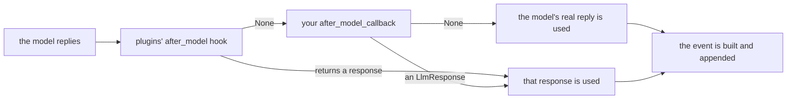

# 2.4 — Reading the reply first

## One-line answer

`after_model_callback` receives the model's reply before anything downstream does, so it is the one
place where a leaked secret can be removed, a malformed answer replaced, or a refusal detected — and
returning a new `LlmResponse` substitutes yours for the model's.

---

## The story

Blurring the number out of the screenshot.

Somebody sends you a screenshot of a message thread and asks you to forward it to the group. You look
at it before you send. Most of it is fine. But the top of the screen has a phone number in it, and the
group has forty people in it, and one of them will save it.

So you open the image, draw a grey box over the number, and send that. The group gets a screenshot.
They get almost exactly the screenshot you were given. They do not get the number, and — this is the
part that matters — they have no idea there ever was one.

You did not refuse to forward it. You forwarded a modified copy, and the modification is invisible to
everyone downstream. That is power worth being careful with, and it is the only kind
`after_model_callback` has.

---

## The idea in plain language

By the time the model has replied, the interesting decisions look different from the ones before it.
Before the call you are deciding *whether to spend*; after the call the money is spent, and you are
deciding *what the rest of the system gets to see*.

`after_model_callback` is handed a `CallbackContext` and an `LlmResponse`. The response's useful
fields:

| Field | What is in it |
| --- | --- |
| `content` | a `types.Content` — the model's turn: text, or a function call, or both |
| `partial` | `True` when this is a fragment of a streamed reply rather than a whole one |
| `error_code`, `error_message` | set when the provider returned an error rather than a reply |
| `usage_metadata` | the token counts, when the provider sent them |

The one rule applies unchanged. Return `None` and the model's real reply is used. Return an
`LlmResponse` and yours replaces it. ADK's field documentation: *"When present, the actual model
response will be ignored and the provided content will be returned to user."*

Three honest uses, and one that looks like a use and is not.

**Redaction.** The reply contains something that must not leave — an API key the model repeated back,
a customer's full card number that a tool put in the transcript. Replace the response.

**Normalisation.** The reply is right but the shape is wrong: a JSON object wrapped in a code fence,
a stray "Sure! Here's..." preamble. Rewrite it before anything tries to parse it.

**Detection.** Count refusals, count empty replies, notice the model saying "I cannot help with that"
and record it. Return `None`; you are only watching.

And the one that is not a use: **retrying.** A callback cannot ask the model again. It has one
response and it either passes it on or replaces it. Retrying belongs to the error hook
([3.4](../03-the-tool-doors/3.4-the-doors-that-only-open-on-an-error.md)) or to the caller, and
attempting it here produces a callback that blocks the flow while doing network work — which is
[6.2](../06-in-production/6.2-what-belongs-in-a-callback.md)'s problem.

There is also a timing subtlety that changes how you write this callback, and it is important enough
to have its own part: `after_model_callback` fires once **per response yielded**, not once per model
call, so a streaming reply fires it many times. That is
[2.5](2.5-the-door-that-fires-on-every-chunk.md), and this part deliberately uses a non-streaming
example so the mechanism lands first.

---

## Why Sutra needs it

**Sutra's tools return ticket bodies, and ticket bodies contain whatever customers typed.** A
customer who pastes a password into a support ticket has put it into `contents`, from where the model
can repeat it back. The instruction asks the model not to. This hook is where the request becomes a
guarantee.

**Day 67 is the output guardrail day and it lives here.** By then the questions are about detection
quality — what counts as a leak, what the false-positive rate costs. The mechanism is this part.

**Day 25's evaluation needs to know which replies were substituted.** An eval that grades an agent's
answers, without knowing that a callback replaced one in ten of them, is grading the callback.

---

## The mechanism

```python
# lab/redact.py - the reply, inspected and replaced before anything downstream sees it.
import asyncio
import re

from google.adk.agents import LlmAgent
from google.adk.models import LlmResponse
from google.adk.runners import InMemoryRunner
from google.genai import types
from scripted import ScriptedModel, text

# Deliberately crude: a real detector is Day 67's subject, not this part's.
SECRET = re.compile(r"\b(sk-[A-Za-z0-9_\-]{4,}|AIza[A-Za-z0-9_\-]{4,})\b")


def redact(callback_context, llm_response):
    """Replace the reply if it carries something that must not leave."""
    if not llm_response.content or not llm_response.content.parts:
        return None
    said = "".join(part.text or "" for part in llm_response.content.parts)
    if not SECRET.search(said):
        return None
    cleaned = SECRET.sub("[redacted]", said)
    print("    [guard] a secret was removed from the reply")
    return LlmResponse(content=text(cleaned))


async def ask(agent: LlmAgent, question: str) -> None:
    runner = InMemoryRunner(agent=agent)
    session = await runner.session_service.create_session(app_name=runner.app_name, user_id="u")
    async for event in runner.run_async(
        user_id="u",
        session_id=session.id,
        new_message=types.Content(role="user", parts=[types.Part(text=question)]),
    ):
        if event.is_final_response() and event.content:
            said = "".join(part.text or "" for part in event.content.parts or [])
            print(f"    downstream saw: {said!r}")


def build(reply: str) -> LlmAgent:
    return LlmAgent(
        name="desk",
        model=ScriptedModel(model="scripted", replies=[[text(reply)]]),
        instruction="You are Sutra.",
        after_model_callback=redact,
    )


async def main() -> None:
    print("a. a clean reply")
    await ask(build("Ticket 4521 is a billing issue. Refund issued."), "what is 4521?")

    print("b. a reply that repeated a key back")
    await ask(build("Your key sk-live-7f2a is still valid, so try again."), "why did auth fail?")


asyncio.run(main())
```

**Line by line:**

- `SECRET` is compiled once at module level, because a regex recompiled inside a callback is
  recompiled on every model call of every run. The comment above it is there so nobody mistakes two
  patterns for a secret detector; the real one is Day 67's, and pretending otherwise here would be the
  kind of toy-that-looks-finished this curriculum tries not to ship.
- `if not llm_response.content or not llm_response.content.parts: return None` — the guard that must
  come first. A response can legitimately have no content: an error response, or a response that is
  only a function call. Without this line the callback raises on the first tool-using turn.
- `"".join(part.text or "" for part in ...)` — a reply can arrive in several parts, and a part that is
  a function call has `text=None`. Joining with `or ""` handles both without a branch.
- `if not SECRET.search(said): return None` — the carry-on path, taken for almost every reply. An
  override callback should return `None` more often than it returns anything, and writing the cheap
  path as an early return keeps that visible.
- `SECRET.sub("[redacted]", said)` — substitute rather than reject. Rejecting the whole reply would
  lose the useful sentence around the secret, and the user would get nothing.
- `LlmResponse(content=text(cleaned))` builds a **new** response rather than mutating the one we were
  given. Both work in 2.7.1; returning a new one is better practice because the returned value is the
  documented channel, and a mutation that is *also* returned invites the reader to wonder which of the
  two had the effect.
- `build()` makes a fresh agent per case so the scripted reply differs; the callback is the same
  function object in both.

The output:

```text
a. a clean reply
    downstream saw: 'Ticket 4521 is a billing issue. Refund issued.'
b. a reply that repeated a key back
    [guard] a secret was removed from the reply
    downstream saw: 'Your key [redacted] is still valid, so try again.'
```

In **a** the callback ran, found nothing, returned `None`, and the model's own words came through
untouched. In **b** the sentence survived and the key did not.

Now notice what is *not* in that output: any indication, downstream, that a substitution happened. The
event that reaches the caller looks exactly like a model reply. That is the screenshot with the grey
box, and it is why the production version of this callback logs.



Verified against `adk.dev/callbacks/types-of-callbacks/` and the installed `google-adk` 2.7.1
(`_handle_after_model_callback` in `google/adk/flows/llm_flows/base_llm_flow.py`) on 2026-08-29.

---

## When it breaks

**💥 The response with no content.**

```text
AttributeError: 'NoneType' object has no attribute 'parts'
```

You reached for `llm_response.content.parts` without the guard. The reply that triggers it is usually
the **first** one of a tool-using turn, or an error response — so this crashes on exactly the runs you
most wanted instrumented.

**💥 The redaction that broke the JSON.** No error here, and a `JSONDecodeError` two systems away.
Substituting `[redacted]` inside a structured reply — which on Sutra is every reply, because
[Day 12](../../../day-12-structured-output/parts/01-the-shape-on-the-way-out/1.1-a-shape-on-the-answer.md)
gave the desk an output schema — produces a string that is no longer valid JSON if the pattern
happened to span a quote or a brace. An after-model callback that rewrites text has to know what shape
the text is in.

**💥 The callback that fired far more often than expected.** No error, and a log full of duplicates.
That is [2.5](2.5-the-door-that-fires-on-every-chunk.md).

---

## In production

**What a professional writes instead of the teaching version** makes the substitution auditable and
keeps the detection out of the callback:

```python
def redact(callback_context, llm_response) -> LlmResponse | None:
    """Replace a reply that carries a secret. Records that it did."""
    if not llm_response.content or not llm_response.content.parts:
        return None
    said = "".join(part.text or "" for part in llm_response.content.parts)
    cleaned, hits = SECRET.subn("[redacted]", said)
    if not hits:
        return None
    logger.warning(
        "reply_redacted",
        extra={"invocation": callback_context.invocation_id, "hits": hits},
    )
    return LlmResponse(content=text(cleaned))
```

**Line by line:**

- `SECRET.subn(...)` instead of `search` then `sub` — one pass over the string, and it returns the
  replacement count, which is both the branch condition and the metric. Two passes over every model
  reply in production is a real cost for no benefit.
- `logger.warning`, not `info`. A redaction means a secret reached the model's output, which is a
  security event even though it was contained. The severity is the signal to whoever reads the logs.
- `hits` in the log, never `said`. Logging the text you just redacted, in order to record that you
  redacted it, is a mistake that has been made in production by people who knew better.
- No detection logic in the callback body beyond calling the pattern. When Day 67 replaces the crude
  regex with something real, this function does not change.

**What degrades at scale** is the false positive. A pattern tuned on the examples you thought of will
eventually match a legitimate ticket reference, a product code, or a customer's own words, and the
user gets `[redacted]` in the middle of a helpful sentence with no explanation. Detection quality is
not a detail of this hook; it is the whole risk of using it, and it is why the metric matters more
than the mechanism.

**The failure that only shows with real traffic** is the empty reply. Some fraction of production
replies have no content — a safety filter fired, the connection dropped mid-stream, the provider
returned an error object. In development that fraction is zero. The guard on the first line is not
defensive programming; it is the line that keeps your guardrail from becoming the outage.

**The review comment a senior engineer leaves:** *"Don't log the matched text. And use `subn` — right
now we scan every reply twice and still don't know how often this fires."*

**The interview question:** *"Where would you stop an agent leaking a secret it was told?"* The
answer that shows you have wired one: "At the after-model hook, which is the last point before the
reply becomes an event anything else can read. I get the `LlmResponse`, and returning a new one
replaces the model's — invisibly, which is why it has to be logged. Two things I'd insist on. It has
to guard for an empty or function-call-only response first, because those are common in production and
never in testing. And it fires once per yielded response, so under streaming it runs on every
fragment, which means detecting a secret split across two chunks is a genuinely different problem from
detecting one in a whole reply."

---

## Check yourself

```bash
cd days/day-13-callbacks-four-doors/lab && uv run python redact.py
```

Then remove the first guard line and script a reply of `text("")`. Read the `AttributeError` and put
the guard back.

**Answer out loud, without scrolling up:**

> Say what `after_model_callback` receives and what returning an `LlmResponse` from it does. Then say
> why the very first thing it must do is check that `content` exists.

---

**Next:** [2.5 — The door that fires on every chunk](2.5-the-door-that-fires-on-every-chunk.md)
