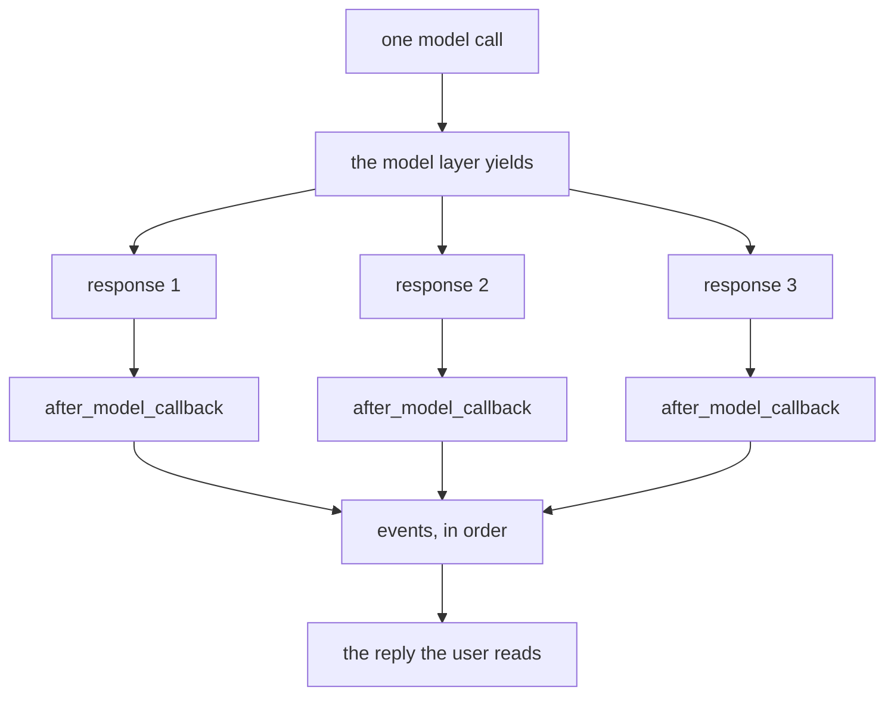

# 2.5 — The door that fires on every chunk

## One-line answer

`after_model_callback` fires once per **response the model layer yields**, not once per model call —
so under streaming it runs on every fragment, and a check written for a whole reply will be looking at
a piece of one.

---

## The story

The taxi meter.

You agree the trip in your head as one thing: home to the station, about a hundred rupees. When you
get in, the meter starts, and it does not tick once at the end. It ticks the whole way — a small
click every few hundred metres, each one adding a little.

Nothing is wrong with the meter. The trip really is made of those small pieces; you were the one
thinking of it as a single event. And the difference matters the moment you try to *do* something per
tick. Round up to the nearest rupee at the end and you lose almost nothing. Round up on every tick and
you have quietly built a different fare.

A reply from a model is the same shape. You think of it as one answer. The machinery underneath
delivers it as a sequence, and a callback attached to that machinery runs on the sequence.

---

## The idea in plain language

A model can deliver a reply in two ways.

**All at once**: the provider finishes generating, and one response object comes back with the whole
text in it.

**Streamed**: the provider sends the text as it is produced, in fragments, and each fragment arrives
as its own response object with a `partial` flag set. That is
[Day 7, part 2.2](../../../day-07-events-and-streaming/parts/02-the-stream/2.2-the-partial-flag.md)'s
subject, seen from the event side. Today you meet it from the callback side.

ADK's flow iterates over whatever the model layer produces:

> `async for llm_response in agen:` … `if altered := await self._handle_after_model_callback(...)`

The callback call is **inside** that loop. One model call, five yielded responses, five calls to your
callback. Nothing announces this. There is no "final" flag on the callback's parameters and no
argument telling you which fragment you are looking at, so a callback written on the assumption of one
reply per call is wrong in a way that produces plausible-looking output.

The practical consequences, in the order they will bite you:

**Counting is wrong.** A callback that increments a "replies" counter counts fragments. Your metric
reads five times too high and looks like a traffic increase.

**Detection is unreliable.** A secret split across two fragments — `sk-live` in one and `-7f2a` in the
next — is invisible to a pattern applied to each fragment separately.
[2.4](2.4-reading-the-reply-first.md)'s redaction is correct on a whole reply and leaky on a stream.

**Replacement is per fragment.** Return a substituted response and you have substituted *that
fragment*, not the reply. The rest of the stream continues around it.

The defence has two halves and both are simple. Check `llm_response.partial` and return early when it
is set, so your logic runs only on complete responses. And if your logic genuinely needs the whole
text of a streamed reply, accumulate it in `callback_context.state` under a `temp:` key rather than
pretending each fragment is the answer.

---

## Why Sutra needs it

**Sutra's redaction guard is currently a per-fragment guard.** The moment the desk is put behind a
streaming UI — which is Day 76's live-voice work, and any real front end before that — a secret split
across a chunk boundary walks straight through the check written in
[2.4](2.4-reading-the-reply-first.md).

**Day 34's cost metrics are counted here.** A "model replies per session" number that is really
"fragments per session" is not a rounding error; it is a metric that means something else.

**Day 12's structured output pulls in the opposite direction.** With an `output_schema` set, ADK turns
off text accumulation entirely, because half a JSON document cannot be parsed. Structured output and
streaming are already in tension; a callback that assumes one is running while the other is configured
is a third way to get this wrong.

---

## The mechanism

The scripted model's `replies` field is a list **of turns**, each turn a list of responses — which is
exactly so this can be demonstrated. One turn with three responses in it is one model call that yields
three times.

```python
# lab/per_chunk.py - one model call, three yields, three callback firings.
import asyncio

from google.adk.agents import LlmAgent
from google.adk.runners import InMemoryRunner
from google.genai import types
from scripted import ScriptedModel, text

fired: list[str] = []


def watch(callback_context, llm_response):
    """Observer at the reply door. Records every firing, changes nothing."""
    said = ""
    if llm_response.content and llm_response.content.parts:
        said = "".join(part.text or "" for part in llm_response.content.parts)
    fired.append(said)
    print(f"    after_model fired: partial={llm_response.partial!r} text={said!r}")


model = ScriptedModel(
    model="scripted",
    replies=[[text("Ticket 4521 "), text("is a billing "), text("issue.")]],
)
agent = LlmAgent(
    name="desk",
    model=model,
    instruction="You are Sutra.",
    after_model_callback=watch,
)


async def main() -> None:
    runner = InMemoryRunner(agent=agent)
    session = await runner.session_service.create_session(app_name=runner.app_name, user_id="u")
    async for _ in runner.run_async(
        user_id="u",
        session_id=session.id,
        new_message=types.Content(role="user", parts=[types.Part(text="what is 4521?")]),
    ):
        pass
    print(f"    model calls: {model.calls}")
    print(f"    callback firings: {len(fired)}")
    print(f"    each firing saw: {fired}")
    print(f"    the whole reply was: {''.join(fired)!r}")


asyncio.run(main())
```

**Line by line:**

- `replies=[[text(...), text(...), text(...)]]` — one outer element, so one model call; three inner
  elements, so three yields. The double brackets are the whole experiment and are easy to misread.
- The three fragments are split mid-sentence (`"Ticket 4521 "`, `"is a billing "`, `"issue."`) on
  purpose. A split at sentence boundaries would let you believe each fragment is a small complete
  answer, which is exactly the belief this part is removing.
- `fired` is a module-level list, which is normally the mistake from
  [1.1](../01-the-four-doors/1.1-the-function-you-never-call.md). Here the script runs one agent once
  and then exits, and the list is the instrument rather than program state. In anything that outlives
  a single run it would belong in `callback_context.state`.
- `llm_response.partial!r` printed with `!r` so `None` and `False` are distinguishable. `partial` is
  the flag a real streaming provider sets; the scripted model does not set it, and printing it here
  shows you what "unset" looks like so you recognise it later.
- The guard `if llm_response.content and ...` is the same first line as
  [2.4](2.4-reading-the-reply-first.md)'s, for the same reason.
- `''.join(fired)` at the end reassembles the reply, which is the accumulation a production callback
  would have to do for itself.

The output:

```text
    after_model fired: partial=None text='Ticket 4521 '
    after_model fired: partial=None text='is a billing '
    after_model fired: partial=None text='issue.'
    model calls: 1
    callback firings: 3
    each firing saw: ['Ticket 4521 ', 'is a billing ', 'issue.']
    the whole reply was: 'Ticket 4521 is a billing issue.'
```

**One model call. Three firings.** And no single firing ever saw the sentence
`'Ticket 4521 is a billing issue.'` — the reply the user reads is a string that never existed inside
your callback.



Verified against the installed `google-adk` 2.7.1 — `_call_llm_async` in
`google/adk/flows/llm_flows/base_llm_flow.py` calls `_handle_after_model_callback` inside its
`async for llm_response in agen:` loop — on 2026-08-29. `partial` is documented on the event side at
`adk.dev/streaming/`, checked the same day.

---

## When it breaks

**💥 The count that was five times too high.** No error. Your dashboard shows model replies rising
sharply on the day somebody enabled streaming in the front end. Nothing about the agent changed. You
were counting fragments.

**💥 The secret that survived redaction.** No error, and the worst outcome on this page. `sk-live` at
the end of one fragment and `-7f2a` at the start of the next: two harmless-looking strings, one
pattern that matches neither, and the user reads the whole key because the front end reassembles what
your check took apart.

**💥 The replacement that arrived mid-sentence.** No error, and a visibly broken reply. Your callback
substitutes a fragment; the other fragments are unaffected; the user sees
`Ticket 4521 [redacted] issue.` — the guard fired and the sentence is nonsense.

**💥 The state write that happened five times.** No error. A callback that does
`state["replies"] = state.get("replies", 0) + 1` writes on every fragment, so a five-fragment reply
records five replies, permanently, in the session.

---

## In production

**What a professional writes instead of the teaching version** decides, on its first line, whether this
firing is one it cares about:

```python
def guard_reply(callback_context, llm_response):
    """Run only on complete responses. Accumulate the stream if we must see it whole."""
    if llm_response.partial:
        buffer = callback_context.state.get("temp:reply_so_far", "")
        callback_context.state["temp:reply_so_far"] = buffer + _text_of(llm_response)
        return None
    whole = callback_context.state.pop("temp:reply_so_far", "") + _text_of(llm_response)
    return _redact_if_needed(whole)
```

**Line by line:**

- `if llm_response.partial:` is the first line, before any logic, because every decision below it is
  wrong on a fragment. This single branch is the difference between a guard and a guard-shaped hazard.
- The accumulation uses `callback_context.state` with a `temp:` prefix —
  [Day 11, part 2.3](../../../day-11-tool-context/parts/02-state-from-a-tool/2.3-what-not-to-put-on-the-noticeboard.md)'s
  prefix, so the half-built string does not persist into the session after the invocation ends. A
  module-level buffer would interleave two users' replies on the same process.
- `state.pop(...)` on the complete branch, so the buffer is cleared as it is read. A buffer that is
  never cleared prepends the previous reply to the next one.
- `_text_of` and `_redact_if_needed` are named but not shown, because this part is about *when* the
  callback runs. [2.4](2.4-reading-the-reply-first.md) is what goes inside them.
- The complete branch returns whatever the redactor decides, which is `None` on the ordinary path.

**What degrades at scale** is the cost of the callback itself. A function that is acceptable at once
per model call may be unacceptable at forty times per model call. A regex over a fragment is fine; a
call to a moderation service per fragment is a self-inflicted denial of service, and it will look like
the model got slow.

**The failure that only shows with real traffic** is the mode change. Development is non-streaming, so
the callback fires once and every test passes. Production enables SSE for a responsive UI, the same
code fires per token group, and the guardrail quietly stops guarding — with no error, no exception and
no change to your test suite. The honest defence is a test that yields several responses from one
scripted call, which is precisely `lab/per_chunk.py` turned into an assertion —
[6.1](../06-in-production/6.1-testing-a-callback-without-a-model.md).

**The review comment a senior engineer leaves:** *"This runs per yielded response, so under SSE it's
per chunk. Bail out on `partial` at the top, and if you need the whole text, buffer it under a `temp:`
key rather than assuming."*

**The interview question:** *"How often does an after-model callback run?"* The answer that shows you
have measured it: "Once per response the model layer yields, not once per model call — the framework
calls it inside the loop that iterates the model's output. Non-streaming that's usually one, streaming
it's one per fragment. It matters because the three things people put in that hook all break: counting
counts fragments, pattern matching misses anything spanning a boundary, and a replacement substitutes
one chunk in the middle of a reply. So the first line checks `partial`, and if the logic genuinely
needs the whole reply I accumulate it in temp state and act on the final response."

---

## Check yourself

```bash
cd days/day-13-callbacks-four-doors/lab && uv run python per_chunk.py
```

Then split the reply into `text("Your key sk-live")` and `text("-7f2a is valid.")`, attach
`redact.py`'s guard instead of `watch`, and confirm the key comes through.

**Answer out loud, without scrolling up:**

> Say how many times `after_model_callback` fires for one streamed reply. Then say the two lines of
> defence a production version of it starts with.

---

**Next:** [3.1 — The chokepoint, restored](../03-the-tool-doors/3.1-the-chokepoint-restored.md)
