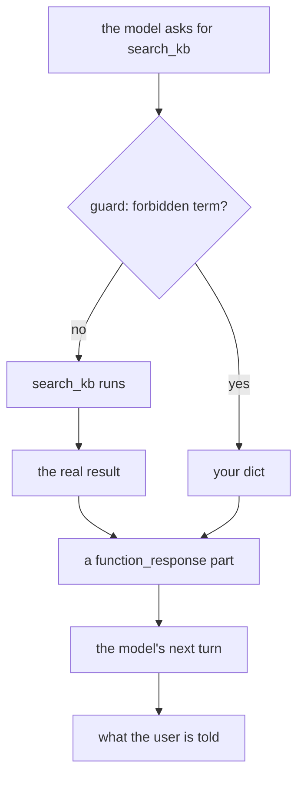

# 3.2 — Refusing a tool call honestly

## One-line answer

Returning a dict from `before_tool_callback` stops the tool and hands your dict to the model **as if
the tool had produced it** — so the refusal has to say, in the dict, that it is a refusal and why, or
you have taught your own agent something false.

---

## The story

The mechanic who writes on the job card.

You leave the car for its check. Two hours later there are two possible pieces of paper waiting for
you at the counter.

The first says: *Not certified. Rear brake pads at 1.5 mm, below the 3 mm limit. Replace pads, then
re-test. Everything else passed.* You are annoyed, and you know exactly what to do next, and you can
argue with it if you think he is wrong.

The second says: *Passed.* He did not actually test the brakes — the lift was busy — and "passed" was
the shortest thing to write. You drive away happy.

The first is a refusal. The second is not a lenient version of the first; it is a different object
entirely, and the difference only becomes visible at the bottom of a hill.

---

## The idea in plain language

[1.3](../01-the-four-doors/1.3-none-means-carry-on.md) established the mechanism: a dict from
`before_tool_callback` becomes the tool's result and the tool does not run. This part is about the
**content** of that dict, which is a design decision and not a mechanical one.

The value you return travels to exactly one reader: the model, on its next turn, in a
`function_response` part that looks identical to a real one. There is no flag saying "this came from
a callback". The model cannot tell, and neither can anything downstream that reads the transcript.

So the dict is a **statement to the model about what happened in the world**, and Principle 10 —
*fail honestly* — applies to it directly. Three shapes, in decreasing order of honesty:

| What you return | What the model concludes | Verdict |
| --- | --- | --- |
| `{"status": "blocked", "reason": ..., "next": ...}` | the call was refused, here is why, here is what to try | honest, and actionable |
| `{"status": "error", "message": "policy"}` | something went wrong | honest but useless — the model retries the same call |
| `{"status": "ok", "results": []}` | the search ran and found nothing | **a lie**, and the model will tell the user so |

The third row is the one people write by accident, because an empty successful result is the easiest
thing to hand back and it makes the run "work". It also means your agent will now say *"I searched the
knowledge base and there is nothing about that"* to a customer, in its own voice, about a search that
never happened.

A refusal that works has three fields:

**A discriminator** — a `status` the model can branch on. This is
[Day 10, part 2.1](../../../day-10-function-tools/parts/02-what-a-tool-returns/2.1-return-a-dict-with-a-status.md)'s
rule, and it applies here for a stronger reason: the model has to be able to tell a refusal from a
result without reading English.

**A reason** — one sentence, in plain language, because the model will paraphrase it to the user and
a vague reason becomes a vague apology.

**A way forward** — what a compliant call would look like. This is the field that turns a refusal into
a redirection, and it is the difference between an agent that gets stuck in a loop retrying the
forbidden call and one that tries something else.

And one thing the refusal must **not** contain: the forbidden thing. A refusal that says *"you may not
search for `admin_password_hunter42`"* has just put the credential into the transcript, from where it
will be resent on every subsequent turn.

---

## Why Sutra needs it

**Sutra's honesty rules currently live in the instruction, which is a request.** Day 6's handbook asks
the model not to do certain things. This is where an ask becomes a rule the model cannot talk its way
past — and where the rule has to be phrased so the model can obey the *spirit* of it after being
stopped.

**Day 30's SEC work and Day 67's guardrails are built out of these dicts.** The mechanism will be
familiar by then; the refusal vocabulary is what has to be designed, and it is designed once.

**Day 25's evals grade the answer, and a fabricated refusal poisons them.** An agent that reports a
search it did not run will be graded as having searched.

---

## The mechanism

Three refusal shapes, the same blocked call, and the model's next turn scripted to react to each — so
you can see the consequence rather than just the dict.

```python
# lab/refusal.py - the same veto, said three ways. Zero model calls.
import asyncio

from google.adk.agents import LlmAgent
from google.adk.runners import InMemoryRunner
from google.genai import types
from scripted import ScriptedModel, call, text

FORBIDDEN = ("password", "credential", "secret", "api key")


def search_kb(query: str) -> dict:
    """Search the knowledge base for articles matching a query."""
    print("      >> search_kb actually ran")
    return {"status": "ok", "hits": ["KB-104: duplicate charge on renewal"]}


def make_guard(refusal: dict):
    """Build a before_tool_callback that refuses with a given dict."""

    def guard(tool, args, tool_context):
        if tool.name != "search_kb":
            return None
        query = str(args.get("query", "")).lower()
        if not any(term in query for term in FORBIDDEN):
            return None
        return refusal

    return guard


def build(refusal: dict) -> LlmAgent:
    return LlmAgent(
        name="desk",
        model=ScriptedModel(
            model="scripted",
            replies=[
                [call("search_kb", query="how to reset the admin password")],
                [text("(the model's next turn)")],
            ],
        ),
        instruction="Triage the ticket.",
        tools=[search_kb],
        before_tool_callback=make_guard(refusal),
    )


async def drive(label: str, refusal: dict) -> None:
    print(f"  {label}")
    runner = InMemoryRunner(agent=build(refusal))
    session = await runner.session_service.create_session(app_name=runner.app_name, user_id="u")
    async for event in runner.run_async(
        user_id="u",
        session_id=session.id,
        new_message=types.Content(
            role="user", parts=[types.Part(text="how do I reset the password?")]
        ),
    ):
        for part in (event.content.parts if event.content else []) or []:
            if part.function_response:
                print(f"      the model was told: {part.function_response.response}")


async def main() -> None:
    await drive("a. the lie", {"status": "ok", "hits": []})
    await drive("b. the useless truth", {"status": "error", "message": "policy"})
    await drive(
        "c. the honest refusal",
        {
            "status": "blocked",
            "reason": "Queries about credentials are not searchable by policy.",
            "next": "Search for the symptom instead, for example 'cannot sign in after renewal'.",
        },
    )


asyncio.run(main())
```

**Line by line:**

- `FORBIDDEN` is a four-item tuple and deliberately naive. The point of this part is **where** the rule
  is enforced and **how the refusal is phrased**, not how clever the detector is; a real one is Day
  30's subject and pretending otherwise would be the toy-that-looks-finished problem.
- `make_guard(refusal)` is the closure pattern from
  [1.2](../01-the-four-doors/1.2-the-names-are-the-contract.md): the configuration is captured, and the
  returned `guard` has exactly the three parameter names ADK passes.
- `if tool.name != "search_kb": return None` is the **first** line of the body. A tool-door callback
  sees every tool, so a policy that does not narrow itself first is a policy that will one day fire on
  a tool it was never written for — [3.1](3.1-the-chokepoint-restored.md)'s `KeyError`, and
  [4.3](../04-where-the-rule-bites/4.3-the-tool-you-did-not-write.md)'s stranger version of it.
- `str(args.get("query", "")).lower()` — `get` with a default rather than subscripting, and `str()`
  because the model chooses the argument's value and a schema that says `str` does not guarantee a
  `str` arrived. Lower-casing once, into a local, rather than inside the loop.
- `any(term in query for term in FORBIDDEN)` — a generator expression, so it stops at the first match.
- `return refusal` returns the **same dict object** each time this guard fires. That is fine here
  because nothing mutates it, and it is a habit worth questioning in real code: a shared mutable
  default handed to the model is the [1.1](../01-the-four-doors/1.1-the-function-you-never-call.md)
  trap wearing a different hat.
- The scripted second turn is a placeholder string, because what the *model* would say next is not
  something this document can honestly predict without running one. What it can show is what the model
  was told, which is the printed `function_response`.

The output:

```text
  a. the lie
      the model was told: {'status': 'ok', 'hits': []}
  b. the useless truth
      the model was told: {'status': 'error', 'message': 'policy'}
  c. the honest refusal
      the model was told: {'status': 'blocked', 'reason': 'Queries about credentials are not searchable by policy.', 'next': "Search for the symptom instead, for example 'cannot sign in after renewal'."}
```

`>> search_kb actually ran` appears **nowhere**. All three refusals stopped the tool. That is the
mechanism working identically in all three cases, and it is exactly why the dict's content is the only
thing that differs.

Now read the three lines as the model reads them.

**a** says the knowledge base was searched and is empty. The model has no reason to doubt it and every
reason to tell the user. You have not blocked anything; you have inserted a false fact into your own
agent's reasoning.

**b** says something failed. The model's most reasonable next action is to try again, possibly with
the same query, which your guard will refuse again. This is how a refusal becomes a loop.

**c** says what happened, why, and what to do instead. The model can relay it, and it has a compliant
alternative to try.



The two paths meet at `F` and are indistinguishable from there on. That single merge is the whole
argument of this part.

Verified against `adk.dev/callbacks/types-of-callbacks/` and the installed `google-adk` 2.7.1
(`__build_response_event` in `google/adk/flows/llm_flows/functions.py` builds the same event shape from
either source) on 2026-08-29.

---

## When it breaks

**💥 The refusal loop.** No error, and a run that ends at the call limit.

The model asks for the forbidden call. You refuse with `{"status": "error"}`. The model retries. You
refuse. Five turns later `max_llm_calls` stops the run, or the user gives up. The fix is in the dict:
a `next` field that offers a different action is what breaks the cycle, and a `status` the model can
distinguish from a transient failure is what stops it treating a policy as an outage.

**💥 The credential echoed in the refusal.** No error. Your message was
`f"Query blocked: {query!r} contains a forbidden term."` The query contained the password. It is now
in the transcript, in `contents`, resent to the provider on every subsequent turn of the conversation
and stored in the session. Never quote the input back in a refusal.

**💥 The refusal that was not JSON-serialisable.**

```text
TypeError: Object of type set is not JSON serializable
```

You returned `{"status": "blocked", "matched": FORBIDDEN}` with `FORBIDDEN` as a `set`. The dict
becomes part of an event that is serialised, and a set is not a JSON type. The same applies to
`datetime`, `Decimal` and your own classes: a refusal dict lives under the same constraints as a tool's
return value, which [Day 10, part 2.2](../../../day-10-function-tools/parts/02-what-a-tool-returns/2.2-the-bare-value-the-spec-rewrites.md)
set out.

---

## In production

**What a professional writes instead of the teaching version** keeps the refusal vocabulary in one
place, so every guard in the system refuses the same way:

```python
def blocked(reason: str, next_step: str) -> dict[str, str]:
    """The one refusal shape every guard in this codebase returns."""
    return {"status": "blocked", "reason": reason, "next": next_step}


def block_credential_queries(tool, args, tool_context) -> dict | None:
    """Refuse knowledge-base searches for credentials. Records the refusal."""
    if tool.name != "search_kb":
        return None
    if not any(term in str(args.get("query", "")).lower() for term in FORBIDDEN):
        return None
    tool_context.state["temp:last_block"] = "credential_query"
    logger.warning(
        "tool_call_blocked",
        extra={"invocation": tool_context.invocation_id, "tool": tool.name, "rule": "credential"},
    )
    return blocked(
        "Queries about credentials are not searchable by policy.",
        "Search for the symptom instead, for example 'cannot sign in after renewal'.",
    )
```

**Line by line:**

- `blocked()` is a one-line constructor, and its whole value is consistency. Once six guards exist,
  a model that has learned to branch on `status == "blocked"` keeps working for all of them, and a
  test can assert the shape once.
- The two early returns are ordered cheapest-first: a string comparison before a scan of the query.
- `state["temp:last_block"]` uses the `temp:` prefix, so the marker is visible to
  [2.2](../02-the-model-doors/2.2-editing-the-request-in-place.md)'s instruction shaper within this
  invocation and does not persist into the session forever.
- `logger.warning` and not `info`: a blocked call is the event somebody will search the logs for.
- The log carries `rule`, not the query. The rule name is what you need for a dashboard; the query is
  the thing you must not store.
- The reason and the next step are literal strings rather than f-strings over the input, which is the
  code-level guarantee that the credential cannot leak into the refusal.

**What degrades at scale** is refusal sprawl. Every team that adds a guard invents a slightly
different shape — `"denied"`, `"forbidden"`, `"refused"` — and the model, which was doing well at
branching on one of them, starts treating the others as errors. The vocabulary is an interface with
the model, and interfaces need owners.

**The failure that only shows with real traffic** is the refusal that is right and unhelpful. In
testing you refuse the queries you thought of. In production the guard fires on a legitimate ticket
that happened to contain the word "password", the customer gets a polite non-answer, and nothing in
your metrics distinguishes that from a correctly blocked attack. Count refusals **by rule**, and read
the count.

**The review comment a senior engineer leaves:** *"Don't put the query in the refusal message. And add
a `next` — right now the model's only sensible move is to try the same call again, which we'll refuse
again."*

**The interview question:** *"You block a tool call. What does the model see?"* The answer that shows
you have done it: "A function response that is byte-for-byte the shape of a real one — there's no
'this was blocked by policy' channel, so whatever dict I return *is* the model's belief about what
happened. Which makes it a design problem, not a mechanism problem. Returning an empty success is the
common mistake and it's a lie: the agent then tells the customer it searched and found nothing.
I return a status the model can branch on, a plain-language reason it can relay, and a suggested
compliant action — without that last field the model just retries the forbidden call until it hits the
call limit. And the reason never quotes the input, because a refusal that echoes the credential has
put it in the transcript forever."

---

## Check yourself

```bash
cd days/day-13-callbacks-four-doors/lab && uv run python refusal.py
```

Then change case **a**'s dict to `{"status": "ok", "hits": ["KB-999: reset your password here"]}` and
sit with what your agent would now tell a customer.

**Answer out loud, without scrolling up:**

> Say the three fields an honest refusal carries and what each one is for. Then say what the model can
> use to tell your refusal from a real tool result.

---

**Next:** [3.3 — The result, on its way back](3.3-the-result-on-its-way-back.md)
