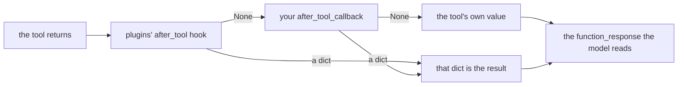

# 3.3 — The result, on its way back

## One-line answer

`after_tool_callback` sees what the tool returned before the model does, and returning a dict from it
**replaces** that result — which is where a result gets trimmed, stripped of fields the model has no
business seeing, or annotated, without touching the tool.

---

## The story

The laundry that comes back folded and counted.

You hand over a bag of clothes. What comes back is not the bag. It is a stack, folded, with a paper
slip on top: *12 items. 1 shirt — collar torn, not washed.*

Nothing was added to your clothes and nothing important was taken away. But somebody did work on the
way back: they counted, they folded, and they flagged the one thing you would otherwise have
discovered at seven in the morning. The count on the slip is what you actually check, and it is not
something the washing machine produced.

The washing machine washes. The counting and the slip happen at the counter, on the return leg,
because that is where they belong — and because putting a counter inside the washing machine would be
a strange machine.

---

## The idea in plain language

A tool has one job: do the thing and return what it found —
[Day 11, part 3.1](../../../day-11-tool-context/parts/03-designing-a-tool/3.1-one-tool-one-job.md).
Everything that is *about* the result rather than *part of* it belongs somewhere else, and
`after_tool_callback` is that somewhere.

It is handed four things: `tool`, `args`, `tool_context`, and `tool_response` — the value the tool
actually returned. Return `None` and that value is used. Return a dict and yours replaces it. ADK's
field documentation: *"When present, the returned dict will be used as tool result."*

Four things that genuinely belong on the return leg:

**Truncation.** A search tool that returns forty articles has just put forty articles into `contents`,
where they will be resent on every subsequent turn of the conversation — the growth
[2.1](../02-the-model-doors/2.1-what-is-actually-in-the-request.md) measured. Cutting to the top three
here keeps the tool honest (it really did find forty) and the transcript affordable.

**Field stripping.** A ticket record has an `internal_notes` field and a `customer_email`. The tool
returns the record because that is what a ticket is. The model does not need either, and anything in
`contents` is sent to the provider.

**Annotation.** Stamping a result with where it came from or when it was fetched, so a later reader of
the transcript — or a later agent — can tell.

**Normalisation.** Two tools that return the same kind of thing in two shapes can be made to agree
here, without either tool knowing about the other.

And one that does not belong here: **retrying a failed tool.** A tool that raised never reaches this
door at all; the error hook does — [3.4](3.4-the-doors-that-only-open-on-an-error.md). A tool that
returned `{"status": "error"}` does reach here, and "call it again" is not something this callback can
do; it can only rewrite what the model is told.

The one thing to keep in mind while writing one: the model's view of the world is now **your dict**,
not the tool's. Everything [3.2](3.2-refusing-a-tool-call-honestly.md) said about honesty applies with
the same force. Truncating forty results to three and saying nothing is a small lie of omission; the
`"truncated": True` field costs six characters and removes it.

---

## Why Sutra needs it

**Day 11's truncation exercise gets its enforcement point today.** That day asked you to think about
what a tool should return; this is where a result that is too big gets cut down for every tool at once,
whether or not the tool author remembered.

**Sutra's knowledge base will grow.** `search_kb` returning one article is a fixture. A real one
returns as many as match, and the day it returns twelve, the conversation's context cost triples with
no code change anywhere.

**Day 12 gave the desk an output schema, so `contents` is already carrying more than it used to.**
Every character saved on the return leg is a character available for the answer.

---

## The mechanism

```python
# lab/return_leg.py - trim, strip and stamp on the way back. Zero model calls.
import asyncio

from google.adk.agents import LlmAgent
from google.adk.runners import InMemoryRunner
from google.genai import types
from scripted import ScriptedModel, call, text

TOP_N = 3
PRIVATE = {"internal_notes", "customer_email"}


def search_kb(query: str) -> dict:
    """Search the knowledge base for articles matching a query."""
    return {
        "status": "ok",
        "hits": [f"KB-{100 + n}: duplicate charge, case {n}" for n in range(8)],
        "internal_notes": "escalate to billing team lead if repeated",
        "customer_email": "arun@example.com",
    }


def tidy(tool, args, tool_context, tool_response):
    """Trim the hits, drop the private fields, stamp what was done."""
    if not isinstance(tool_response, dict):
        return None
    hits = tool_response.get("hits")
    kept = {k: v for k, v in tool_response.items() if k not in PRIVATE}
    if isinstance(hits, list) and len(hits) > TOP_N:
        kept["hits"] = hits[:TOP_N]
        kept["truncated"] = f"{len(hits) - TOP_N} more not shown"
    kept["via"] = "sutra-desk"
    return kept


agent = LlmAgent(
    name="desk",
    model=ScriptedModel(
        model="scripted",
        replies=[[call("search_kb", query="duplicate charge")], [text("KB-100 covers this.")]],
    ),
    instruction="Triage the ticket.",
    tools=[search_kb],
    after_tool_callback=tidy,
)


async def main() -> None:
    raw = search_kb("duplicate charge")
    print(f"    the tool returned ..... {len(str(raw))} chars, keys={sorted(raw)}")
    runner = InMemoryRunner(agent=agent)
    session = await runner.session_service.create_session(app_name=runner.app_name, user_id="u")
    async for event in runner.run_async(
        user_id="u",
        session_id=session.id,
        new_message=types.Content(role="user", parts=[types.Part(text="charged twice")]),
    ):
        for part in (event.content.parts if event.content else []) or []:
            if part.function_response:
                seen = part.function_response.response
                print(f"    the model was told .... {len(str(seen))} chars, keys={sorted(seen)}")
                print(f"    hits: {seen['hits']}")
                print(f"    keys the model never saw: {sorted(set(raw) - set(seen))}")
                print(f"    truncated: {seen.get('truncated')}")


asyncio.run(main())
```

**Line by line:**

- `if not isinstance(tool_response, dict): return None` — the first line, because `tool_response` is
  whatever the tool returned, and ADK does not force it to be a dict.
  [Day 10, part 2.2](../../../day-10-function-tools/parts/02-what-a-tool-returns/2.2-the-bare-value-the-spec-rewrites.md)
  showed a bare value being rewrapped; a callback that assumes a dict crashes on the first tool that
  returns a list.
- `kept = {k: v for k, v in ... if k not in PRIVATE}` builds a **new** dict rather than deleting keys
  from `tool_response`. Mutating the tool's own return value would work and is worse: the tool may hold
  a reference to it, and a callback that silently edits somebody else's object is a bug waiting for a
  second caller.
- `PRIVATE` is a `set` because membership is the only operation — but note it never goes *into* the
  returned dict, which would be [3.2](3.2-refusing-a-tool-call-honestly.md)'s serialisation error.
- `if isinstance(hits, list) and len(hits) > TOP_N` — two guards, because `hits` may be absent (this
  callback sees every tool) and may not be a list.
- `kept["truncated"] = f"{len(hits) - TOP_N} more not shown"` — the honesty field, and it is a
  *sentence* rather than a boolean because the model reads it. `"5 more not shown"` tells the model it
  can ask for more; `True` tells it something happened.
- `kept["via"] = "sutra-desk"` — the annotation. Small, and it is what lets a later reader of a
  transcript tell a result that went through this desk from one that did not.
- `raw = search_kb(...)` is called **directly**, outside the agent, purely to print the before size.
  Calling a tool function as a plain Python function is legal and is the cheapest way to get a
  baseline — the tool is just a function, which was
  [Day 10, part 1.1](../../../day-10-function-tools/parts/01-the-form-fills-itself/1.1-the-declaration-you-no-longer-write.md)'s
  first claim.

The output:

```text
    the tool returned ..... 415 chars, keys=['customer_email', 'hits', 'internal_notes', 'status']
    the model was told .... 188 chars, keys=['hits', 'status', 'truncated', 'via']
    hits: ['KB-100: duplicate charge, case 0', 'KB-101: duplicate charge, case 1', 'KB-102: duplicate charge, case 2']
    keys the model never saw: ['customer_email', 'internal_notes']
    truncated: 5 more not shown
```

**415 characters became 188.** That saving is not once — it is on every remaining turn of the
conversation, because the result now lives in `contents` and is resent each time.

**The customer's email address never reached the provider.** The tool returned it, honestly, because
it is part of a ticket. The door on the return leg is where "part of the record" and "part of what the
model needs" stopped being the same set.

**And the model was told it was truncated.** Five results were withheld and the model knows it. That
is the difference between trimming and lying, and it is one line.



Verified against `adk.dev/callbacks/types-of-callbacks/` and the installed `google-adk` 2.7.1
(the `for after_callback in agent.canonical_after_tool_callbacks:` loop and the
`if altered_function_response is not None:` line that follows it, in
`google/adk/flows/llm_flows/functions.py`) on 2026-08-29.

---

## When it breaks

**💥 The result that was not a dict.**

```text
AttributeError: 'list' object has no attribute 'get'
```

You called `.get()` on `tool_response` without the `isinstance` guard, and a tool returned a list. The
guard is the first line for a reason.

**💥 The truncation nobody was told about.** No error. The model reads three results, answers from
three results, and states its answer with the confidence of something that saw everything. When the
right article was number seven, the agent is confidently wrong and there is no trace of why.

**💥 The stamp that broke a downstream parser.** No error here, and a `KeyError` later. Adding
`"via"` to every result is harmless until a consumer does `assert set(result) == EXPECTED`. Adding
keys to somebody else's data structure is an interface change; do it deliberately and write it down.

**💥 The empty dict returned by accident.** No error, and the tool's whole result vanishes. If your
callback builds `kept` and a bug leaves it empty, `{}` is still *returned* and — as
[4.1](../04-where-the-rule-bites/4.1-truthy-is-not-the-same-as-not-none.md) explains — a non-`None`
value replaces the result. The model is told the tool returned nothing at all.

---

## In production

**What a professional writes instead of the teaching version** does one job per callback and puts the
limits in named constants:

```python
root_agent = LlmAgent(
    name="sutra_desk",
    model="gemini-3.7-flash",
    after_tool_callback=[
        drop_private_fields,  # never send internal_notes / customer_email to the provider
        cap_result_size,  # keep the transcript affordable; stamps "truncated"
    ],
)
```

**Line by line:**

- Two functions, not one `tidy` — [Day 11, part 3.1](../../../day-11-tool-context/parts/03-designing-a-tool/3.1-one-tool-one-job.md)'s
  argument again. The privacy rule and the size rule change for different reasons, are reviewed by
  different people, and one of them is a security control.
- The privacy one runs **first**, so that if the size cap is ever removed the private fields are still
  dropped. Order as defence, exactly as in [1.4](../01-the-four-doors/1.4-a-list-not-just-a-function.md).
- But both must return `None` on the paths where they change nothing, or the second one never runs —
  the chain stops at the first value. A pair of transformers on one door is the case where the
  short-circuit rule is most easily forgotten, and the honest fix is to have the *last* one in the
  chain do the returning while the earlier ones mutate a copy they pass along in `tool_context.state`,
  or to accept one combined function. Which of those you pick is a real design decision; what is not
  optional is knowing that two independently-returning transformers do not compose.

**What degrades at scale** is exactly that composition problem. Callbacks look composable because the
field takes a list, and observers genuinely are. Transformers are not: the first one to return a value
ends the chain, so a list of three trimmers applies one trimmer. Teams discover this when the second
transformer is added and quietly does nothing.

**The failure that only shows with real traffic** is the result that was small in testing. Your cap of
three is never reached by a fixture that returns one. In production the knowledge base has grown, every
search returns twenty, and either the cap is doing enormous work you never validated, or there is no
cap and the context bill is quietly climbing. Log the pre-truncation size, not just the fact of
truncation.

**The review comment a senior engineer leaves:** *"These two both return dicts, so the second one never
runs. Split them into an observer and one transformer, or merge them and say so."*

**The interview question:** *"Where would you stop a tool sending customer data to the model
provider?"* The answer that shows you have wired one: "The after-tool hook. The tool returns the whole
record — that's what a record is — and the callback returns a copy with the private fields dropped, so
the provider never sees them and neither does the transcript. Two details I'd insist on. If I also
truncate, I add a field saying so, because a model that silently sees three of twenty results answers
confidently from three. And I'd keep privacy and size as separate functions in a list, while knowing
they don't actually compose — the chain stops at the first one that returns a value — which is a real
sharp edge in that API."

---

## Check yourself

```bash
cd days/day-13-callbacks-four-doors/lab && uv run python return_leg.py
```

Then add a second `after_tool_callback` that also returns a dict, put it second in the list, and
confirm it never runs.

**Answer out loud, without scrolling up:**

> Name the four parameters `after_tool_callback` receives. Then say why a truncating callback must add
> a field saying it truncated.

---

**Next:** [3.4 — The doors that only open on an error](3.4-the-doors-that-only-open-on-an-error.md)
