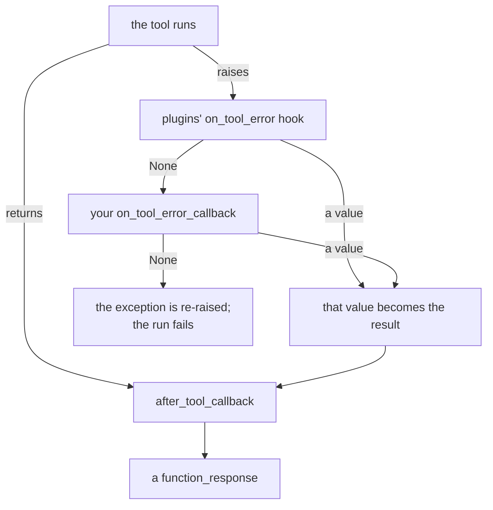

# 3.4 — The doors that only open on an error

## One-line answer

When a tool or a model call raises, ADK 2.x lets the exception out — unless `on_tool_error_callback`
or `on_model_error_callback` returns a value, in which case that value becomes the result and the
exception is **swallowed**, which is a decision you make deliberately and not a default you inherit.

---

## The story

The gas cylinder delivery that found nobody home.

The van comes at two in the afternoon. Nobody is in. There are two versions of what happens next.

In the first, the driver writes on a slip — *attempted 2:10 pm, no answer, will retry tomorrow, call
this number to change the slot* — and pushes it under the door. You come home, you read it, you know
exactly where you stand and what to do.

In the second, the driver marks the delivery complete in the app and drives on. Nothing under the
door. The system says you have gas. You find out at dinner.

The second one is not "handling the failure gracefully". It is the failure, plus a false record of
success, which is strictly worse than the failure alone — because now nobody is looking for it.

---

## The idea in plain language

Two more hooks, and they only fire when something went wrong:

| Hook | Parameters | Fires when |
| --- | --- | --- |
| `on_model_error_callback` | `callback_context`, `llm_request`, `error` | the model call raised |
| `on_tool_error_callback` | `tool`, `args`, `tool_context`, `error` | the tool function raised |

The `error` parameter is the exception object itself, not a message. You can inspect its type, read
its arguments, and re-raise it.

The return rule is the same one, pointed at a new question. Here the question is not *"did you handle
this?"* but *"do you have a result to substitute for the failure?"*:

- Return `None` — the exception is **re-raised** and the run fails.
- Return a value — the exception is **discarded**, your value is used as the result, and the run
  continues as though nothing had gone wrong.

That second bullet is a large amount of power in one `return`, and it is worth naming what it is: the
2.x error hooks are the framework's *supported* way to do the thing that 1.x tutorials did by wrapping
every tool body in `try/except` and returning a string. That habit is 1.x → 2.x **trap #4** (plan
§5.1): swallowing exceptions inside the tool hides them from the runtime, so retries, tracing and
callbacks never see them. ADK 2.x surfaces exceptions through the runtime *so that* something like
this hook can act on them — which means the hook is the right place, and it is only the right place if
what it returns is honest.

There is also a distinction worth being precise about, because two different things are called
"errors":

**A raised exception** — the tool threw. `KeyError`, `TimeoutError`, a provider's `ServerError`. This
is what reaches the error hook.

**A returned failure** — the tool caught its own problem and returned `{"status": "error", ...}`, as
[Day 10, part 2.3](../../../day-10-function-tools/parts/02-what-a-tool-returns/2.3-a-failed-tool-is-still-a-result.md)
recommends for expected failures. This never touches the error hook; it goes through
`after_tool_callback` like any other result.

So the two hooks are for the **unexpected**. An expected failure — ticket not found, no articles match
— is a result and should be returned as one. Routing expected failures through an exception and then
catching it in a hook is a longer way to write the same thing, with a stack unwind in the middle.

Two things the error hooks are genuinely good at:

**Turning an infrastructure failure into something the model can respond to.** A timeout is not the
customer's problem, and "the ticket system did not answer, try again or answer from what you know" is
a sentence a model can act on.

**Being the one place that knows.** Every tool's exception passes here, so this is where the metric,
the alert and the invocation id live — the same argument as
[3.1](3.1-the-chokepoint-restored.md)'s register, on the unhappy path.

And the thing they are dangerous at is the one in the story: returning a cheerful result. Everything
[3.2](3.2-refusing-a-tool-call-honestly.md) said about honest refusals applies verbatim to error
substitutions, and more sharply, because here there is a real failure underneath being covered up.

---

## Why Sutra needs it

**Day 21 is error surfacing (ADK-23) and it is built here.** By then the questions are about retry
ladders and escalation. The mechanism is these two hooks, and knowing that returning `None` re-raises
is the whole basis for a retry policy that gives up honestly.

**Sutra's providers are free-tier, so `429` is a matter of when.** Addendum 02 requires every model
call path to handle HTTP 429 with `retry-after` and backoff, then escalate. `on_model_error_callback`
is where "then escalate" gets written, and where "never fabricate a result" has to be resisted.

**Principle 10 has a code location.** *Fail honestly* stops being a slogan at the moment you have a
function whose entire job is to decide what a failure looks like from outside.

---

## The mechanism

```python
# lab/error_doors.py - what a raising tool does, with and without the hook. Zero model calls.
import asyncio

from google.adk.agents import LlmAgent
from google.adk.runners import InMemoryRunner
from google.genai import types
from scripted import ScriptedModel, call, text


def lookup_ticket(ticket_id: str) -> dict:
    """Look up a support ticket by its id in the ticket system."""
    if ticket_id == "9999":
        raise KeyError(ticket_id)
    return {"status": "ok", "ticket_id": ticket_id}


def honest(tool, args, tool_context, error):
    """Substitute a legible failure. The exception is swallowed; the run continues."""
    print(f"      [error door] {tool.name} raised {type(error).__name__}")
    return {
        "status": "unavailable",
        "reason": f"{tool.name} failed with {type(error).__name__}.",
        "next": "Tell the user the lookup is unavailable. Do not guess the ticket's contents.",
    }


def give_up(tool, args, tool_context, error):
    """Look, record, and decline to handle it. Returning None re-raises."""
    print(f"      [error door] {tool.name} raised {type(error).__name__}; not handling it")
    return None


def build(hook) -> LlmAgent:
    return LlmAgent(
        name="desk",
        model=ScriptedModel(
            model="scripted",
            replies=[[call("lookup_ticket", ticket_id="9999")], [text("(the model's next turn)")]],
        ),
        instruction="Triage the ticket.",
        tools=[lookup_ticket],
        on_tool_error_callback=hook,
    )


async def drive(label: str, hook) -> None:
    print(f"  {label}")
    runner = InMemoryRunner(agent=build(hook))
    session = await runner.session_service.create_session(app_name=runner.app_name, user_id="u")
    try:
        async for event in runner.run_async(
            user_id="u",
            session_id=session.id,
            new_message=types.Content(role="user", parts=[types.Part(text="ticket 9999")]),
        ):
            for part in (event.content.parts if event.content else []) or []:
                if part.function_response:
                    print(f"      the model was told: {part.function_response.response}")
    except KeyError as exc:
        print(f"      the run failed: KeyError {exc}")


async def main() -> None:
    await drive("a. no hook at all", None)
    await drive("b. a hook that returns None", give_up)
    await drive("c. a hook that substitutes a legible failure", honest)


asyncio.run(main())
```

**Line by line:**

- `raise KeyError(ticket_id)` — a genuinely *unexpected* failure for this demo. A ticket that does not
  exist is arguably expected and should be a returned `{"status": "not_found"}`; raising here is what
  a real bug or an infrastructure fault looks like, which is what these hooks are for.
- `honest` returns `status: "unavailable"` rather than `"error"`, and rather than `"ok"`. The word
  matters because the model branches on it, and "unavailable" says *the system, not your request* in a
  way "error" does not.
- The `next` field explicitly says **do not guess**. Without it, a model told that a lookup failed will
  quite often answer from its own training data, which is exactly the fabrication Principle 10 forbids
  — and this is one of the few places you get to say so in a sentence the model will actually read.
- `give_up` prints and returns `None`, which is the important control: it proves that *looking at* an
  error and *handling* it are separate decisions. This is the shape of a metrics-only error hook.
- `except KeyError` around the run loop — narrow, so a different exception is not swallowed by the
  demo's own harness. The `KeyError` really does escape `run_async`.
- `build(None)` for case **a**: no hook attached at all, which is the baseline. Without it you could
  not tell whether `give_up` re-raised or whether the framework was going to raise anyway.

The output:

```text
  a. no hook at all
      the run failed: KeyError '9999'
  b. a hook that returns None
      [error door] lookup_ticket raised KeyError; not handling it
      the run failed: KeyError '9999'
  c. a hook that substitutes a legible failure
      [error door] lookup_ticket raised KeyError
      the model was told: {'status': 'unavailable', 'reason': 'lookup_ticket failed with KeyError.', 'next': "Tell the user the lookup is unavailable. Do not guess the ticket's contents."}
```

**a** is what ADK does on its own: the exception comes out. That is trap #4 working correctly — the
failure is loud, and nothing pretended otherwise.

**b** shows the hook ran, saw the error, and chose not to handle it. Same outcome as **a**, plus a log
line. This is the useful default for a system that wants to *know* about failures without changing
what happens on one.

**c** is the substitution. The run continues, and the model gets a description of a real failure with
an instruction about what not to do next.



Note where the substituted value rejoins: it goes through `after_tool_callback` like any other result,
so [3.3](3.3-the-result-on-its-way-back.md)'s trimming and stamping apply to it too.

Verified against `adk.dev/callbacks/types-of-callbacks/` and the installed `google-adk` 2.7.1
(`_run_on_tool_error_callbacks` in `google/adk/flows/llm_flows/functions.py`, where
`if error_response is not None: ... else: raise tool_error`) on 2026-08-29.

---

## When it breaks

**💥 The exception that escaped the runner.**

```text
KeyError: '9999'
...
google.adk.workflow._errors.DynamicNodeFailError: Dynamic node desk failed
```

The default, and correct. Note the second line: the graph runtime wraps the failure as a node failure.
Read past it to the original exception — the wrapper says *where*, the cause says *what*.

**💥 The hook that swallowed a bug.** No error, and this is the failure this part exists to prevent. A
hook that returns `{"status": "ok", "result": None}` for every exception turns a `TypeError` in your
own tool — a real bug, on every call — into a silent empty result. The agent keeps working. Nobody is
paged. The bug ships.

**💥 The hook that raised.**

```text
AttributeError: 'KeyError' object has no attribute 'message'
```

You wrote `error.message` — which Python exceptions do not have — inside the error hook. An exception
in an error handler replaces the original error with a less informative one, and the thing you were
trying to diagnose is now invisible. Use `str(error)` and `type(error).__name__`.

**💥 The error hook that never ran in testing.** No error, ever, which is the problem. It fires only
on exceptions, and your test suite has none, so a misnamed parameter
([1.2](../01-the-four-doors/1.2-the-names-are-the-contract.md)) sits there until production. Test the
error path deliberately — [6.1](../06-in-production/6.1-testing-a-callback-without-a-model.md).

---

## In production

**What a professional writes instead of the teaching version** decides by exception type, and refuses
to substitute for anything it does not recognise:

```python
TRANSIENT = (TimeoutError, ConnectionError)


def on_tool_error(tool, args, tool_context, error) -> dict | None:
    """Substitute only for known infrastructure faults. Everything else is re-raised."""
    logger.exception(
        "tool_raised",
        extra={"invocation": tool_context.invocation_id, "tool": tool.name},
    )
    if not isinstance(error, TRANSIENT):
        return None
    return {
        "status": "unavailable",
        "reason": f"{tool.name} is temporarily unreachable.",
        "next": "Say the lookup is unavailable right now. Do not guess its contents.",
    }
```

**Line by line:**

- The log happens **before** the branch, so every exception is recorded whether or not it is handled.
  A hook that only logs what it handles has no record of the ones that took the run down.
- `logger.exception` rather than `logger.error` — it captures the traceback, which is the whole reason
  you want the record.
- `if not isinstance(error, TRANSIENT): return None` is an **allow-list of failures worth hiding**, and
  it is the line that keeps this hook from becoming a bug-concealer. A `KeyError` from your own code is
  not transient and must not be smoothed over.
- The returned `reason` names the tool but not the exception. Internal type names are for your logs,
  not for a transcript that goes to a provider and possibly to a customer.
- `-> dict | None` states that both paths exist.

**What degrades at scale** is the silence. An error hook that substitutes successfully is a hook that
makes failures invisible from the outside — the agent still answers, the user still gets a reply, and
the only evidence is a log line and a metric nobody set up. Every substitution needs a counter, and
the counter needs an alert, or you have built a system that degrades without telling anybody.

**The failure that only shows with real traffic** is the retry that is not one. A tool that fails
transiently 1% of the time and is substituted with "unavailable" produces a 1% rate of unhelpful
answers that no test reproduces and no error tracker records. On free-tier providers, where `429` is
routine, that rate is not 1%. Which is exactly why Day 21 exists and why the honest answer today is a
hook that logs, substitutes narrowly, and escalates rather than one that makes the problem disappear.

**The review comment a senior engineer leaves:** *"This substitutes for every exception, including
ours. Allow-list the transient ones and let the rest raise — otherwise the first `TypeError` we ship
looks like a quiet empty result."*

**The interview question:** *"What happens when a tool raises in your agent?"* The answer that shows
you have run it: "By default the exception comes out through the runtime and the run fails, which is
deliberate in ADK 2.x — 1.x code used to catch inside the tool and return a string, and that hid
failures from retries and tracing. If I attach an on-tool-error hook I get the exception object and one
decision: return `None` and it re-raises, or return a dict and it's swallowed and my dict becomes the
result. I'd log unconditionally, substitute only for an allow-list of transient infrastructure faults,
and make the substituted result say plainly that the lookup failed and that the model must not guess —
because the tempting version, returning an empty success, converts an outage into an agent that
confidently makes things up."

---

## Check yourself

```bash
cd days/day-13-callbacks-four-doors/lab && uv run python error_doors.py
```

Then change `honest` to return `{"status": "ok", "ticket_id": "9999", "body": ""}` and read what the
model would be told about a ticket the system could not reach.

**Answer out loud, without scrolling up:**

> Say what returning `None` from `on_tool_error_callback` does, and what returning a dict does. Then
> say which exceptions a production hook should refuse to substitute for, and why.

---

**Next:** [4.1 — Truthy is not the same as not-`None`](../04-where-the-rule-bites/4.1-truthy-is-not-the-same-as-not-none.md)
