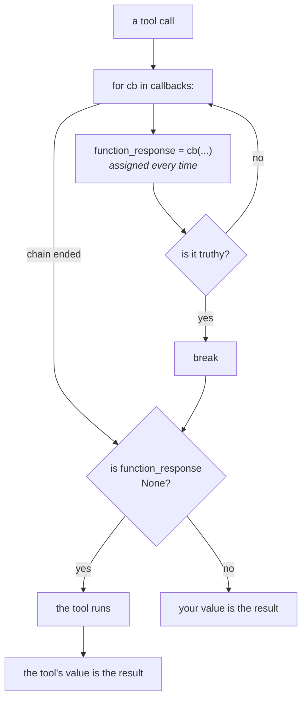

# 4.1 — Truthy is not the same as not-`None`

## One-line answer

The documentation says a tool callback chain runs *"until a callback does not return None"*, and the
code stops on a **truthy** value while keeping whatever the **last** callback returned — so an empty
dict skips the tool, and two functions in the other order produce the opposite outcome.

---

## The story

The lunchbox that came back empty.

You send lunch to school. In the evening you ask the one question you always ask: "did the box come
back?" Yes, it came back. Good. You put it in the sink.

The next morning you open it to pack lunch and it is exactly as it went — untouched, and now a day
old. The box came back. The lunch did not get eaten. Your question had an answer, and it was a true
answer, and it was an answer to a different question than the one you thought you were asking.

*Is there a box?* and *is there anything in the box?* are two questions. They give the same answer
almost every day, which is precisely why nobody notices they are different until the one day they
disagree.

---

## The idea in plain language

Python has two ways to ask whether a value is "nothing".

**Identity**: `if value is None` — true only for the object `None`.

**Truthiness**: `if value` — false for `None`, and *also* false for `0`, `False`, `""`, `[]` and
`{}`. Python calls these **falsy**: values that are not `None` but behave like it in an `if`.

[1.3](../01-the-four-doors/1.3-none-means-carry-on.md) taught the rule as ADK's documentation states
it, and the documentation says `None`. Every field's docstring in `llm_agent.py` says the same thing:
*"the callbacks will be called in the order they are listed until a callback does not return None."*

The code in `functions.py` does something else:

> ```
>       for before_callback in agent.canonical_before_tool_callbacks:
>         callback_result = before_callback(...)
>         ...
>         function_response = callback_result
>         if function_response:
>           break
>
>     # Step 3: Otherwise, proceed calling the tool normally.
>     if function_response is None:
> ```

Read those three decisions carefully, because all three matter:

1. `function_response = callback_result` — assigned **unconditionally**, on every iteration. The
   variable that decides everything now holds whatever the callback just returned, `None` included.
2. `if function_response: break` — the chain stops on a **truthy** value, not a non-`None` one.
3. `if function_response is None:` — the tool runs only if the surviving value **is** `None`.

Put together, the real rule is not the documented one:

> **The last callback in the chain decides — unless an earlier one returned something truthy, which
> ends the chain there.**

Two consequences you will meet.

**An empty dict skips the tool.** `{}` is falsy, so it does not break the loop — but it is not `None`,
so step 3 does not run the tool either. The tool is silently skipped and the model is handed `{}`.

**Order changes the outcome for the same two functions.** A chain of `[returns {}, returns None]` runs
the tool; `[returns None, returns {}]` does not. Nothing about either function changed.

This is not a criticism of ADK so much as a fact about it, and the reason it belongs in a part of its
own is Principle 8's second half: the docs are a claim, the installed code is the behaviour, and where
they differ **your terminal wins**. It is also a reason to be exact in your own callbacks. `return {}`
is never what you mean; `return None` is.

---

## Why Sutra needs it

**Sutra's tool door will have more than one function on it.** The moment the audit and the policy are
separate functions — [1.4](../01-the-four-doors/1.4-a-list-not-just-a-function.md)'s composition — the
ordering rule stops being trivia and starts deciding whether `search_kb` runs.

**A refusal builder can return `{}` by accident.** [3.2](../03-the-tool-doors/3.2-refusing-a-tool-call-honestly.md)'s
guard builds a dict. A bug that leaves it empty does not raise, does not log, and silently stops every
tool call in the system while telling the model nothing happened.

**Day 14's plugins add a layer above this one** with its own version of the same question, which is
[4.2](4.2-the-plugin-goes-first.md).

---

## The mechanism

Seven cases, one script, no model calls. The tool prints when it runs, so its **absence** is the
finding.

```python
# lab/falsy.py - what each return value actually does at the tool doors.
import asyncio

from google.adk.agents import LlmAgent
from google.adk.runners import InMemoryRunner
from google.genai import types
from scripted import ScriptedModel, call, text


def lookup_ticket(ticket_id: str) -> dict:
    """Look up a support ticket by its id."""
    print("      >> the tool actually ran")
    return {"status": "ok", "ticket_id": ticket_id}


def returns(value):
    """Build a before_tool_callback that returns exactly `value`."""

    def cb(tool, args, tool_context):
        return value

    cb.__name__ = f"returns_{value!r}"
    return cb


def build(before=None, after=None) -> LlmAgent:
    return LlmAgent(
        name="desk",
        model=ScriptedModel(
            model="scripted",
            replies=[[call("lookup_ticket", ticket_id="4521")], [text("done")]],
        ),
        instruction="x",
        tools=[lookup_ticket],
        **({"before_tool_callback": before} if before else {}),
        **({"after_tool_callback": after} if after else {}),
    )


async def drive(label: str, agent: LlmAgent) -> None:
    print(f"  {label}")
    runner = InMemoryRunner(agent=agent)
    session = await runner.session_service.create_session(app_name=runner.app_name, user_id="u")
    async for event in runner.run_async(
        user_id="u",
        session_id=session.id,
        new_message=types.Content(role="user", parts=[types.Part(text="hi")]),
    ):
        for part in (event.content.parts if event.content else []) or []:
            if part.function_response:
                print("      the model was told:", part.function_response.response)


def after_empty(tool, args, tool_context, tool_response):
    """An after-tool callback that returns an empty dict."""
    return {}


async def main() -> None:
    await drive("a. before_tool returns None", build(before=returns(None)))
    await drive("b. before_tool returns {}", build(before=returns({})))
    await drive("c. before_tool returns 0", build(before=returns(0)))
    await drive("d. before_tool returns False", build(before=returns(False)))
    await drive("e. list [returns {}, returns None]", build(before=[returns({}), returns(None)]))
    await drive("f. list [returns None, returns {}]", build(before=[returns(None), returns({})]))
    await drive("g. after_tool returns {}", build(after=after_empty))


asyncio.run(main())
```

**Line by line:**

- `returns(value)` is a factory, so all seven cases share one callback body and differ only in the
  returned value. If each case had its own function the experiment would be comparing functions rather
  than return values.
- `cb.__name__ = f"returns_{value!r}"` renames the closure so a traceback or a debugger says which one
  it is. A factory that produces six functions all called `cb` is a factory you will regret.
- `**({"before_tool_callback": before} if before else {})` — conditional keyword arguments, so a case
  that tests only the after-door does not attach a before-door callback at all. Passing `None`
  explicitly would also work here; building the kwargs makes it obvious in the source that the field
  is *absent* rather than *set to None*.
- `after_empty` is a module-level function rather than another `returns(...)`, because the after-door
  takes four parameters and the factory's `cb` takes three.
- The tool's `print` is the instrument. Every other line in the output is what the *model* saw; this
  one is what the *world* saw, and the two disagreeing is the entire subject.

The output:

```text
  a. before_tool returns None
      >> the tool actually ran
      the model was told: {'status': 'ok', 'ticket_id': '4521'}
  b. before_tool returns {}
      the model was told: {}
  c. before_tool returns 0
      the model was told: {'result': 0}
  d. before_tool returns False
      the model was told: {'result': False}
  e. list [returns {}, returns None]
      >> the tool actually ran
      the model was told: {'status': 'ok', 'ticket_id': '4521'}
  f. list [returns None, returns {}]
      the model was told: {}
  g. after_tool returns {}
      >> the tool actually ran
      the model was told: {}
```

Five findings, and only the first is the documented one.

**a** is the rule as everyone knows it. `None` carries on.

**b** is the surprise. `{}` is falsy, so it did not break the chain — and it is not `None`, so the tool
was skipped anyway. `>> the tool actually ran` is absent. The model was told the tool returned nothing
at all.

**c** and **d** show `0` and `False` doing the same thing, and being **rewrapped** as
`{'result': 0}`. That wrapping is the same rule
[Day 10, part 2.2](../../../day-10-function-tools/parts/02-what-a-tool-returns/2.2-the-bare-value-the-spec-rewrites.md)
found for tools returning bare values: the protocol requires an object, so ADK puts your value under a
`result` key. A callback that returns `0` has told the model the tool produced the number zero.

**e** and **f** are the pair that matters most. **The same two functions, swapped, and the tool runs in
one and not the other.** In **e** the last callback returned `None`, so `function_response` ended as
`None` and the tool ran — the `{}` from the first callback was overwritten. In **f** the `{}` came
last and survived.

**g** shows the after-door has the same edge from the other side: the tool ran, and its real result was
replaced by `{}`.



The two diamonds ask different questions. That is the bug-shaped gap, and everything in the output
above falls through it.

Verified against the installed `google-adk` 2.7.1 — the `canonical_before_tool_callbacks` loop and the
`if function_response is None:` that follows it, in `google/adk/flows/llm_flows/functions.py`, against
the `before_tool_callback` field docstring in `google/adk/agents/llm_agent.py` — on 2026-08-29. The
adk.dev callbacks reference describes the tool doors as stopping on a truthy value and the error doors
as stopping on any non-`None` value, which matches the code and not the docstring.

---

## When it breaks

**💥 The guard that built an empty dict.** No error, no log line, no traceback.

```python
def guard(tool, args, tool_context):
    """A refusal builder with a bug: `reasons` is empty, so `refusal` is too."""
    reasons = [r for r in RULES if r.matches(args)]
    refusal = {r.field: r.text for r in reasons}
    return refusal
```

**Line by line:**

- `reasons` is empty on the ordinary path, which is the *common* case — most calls break no rules.
- `refusal` is therefore `{}`, and the function returns it unconditionally.
- `{}` is falsy, so nothing breaks the chain, and not `None`, so the tool is skipped. **Every tool
  call in the system is now silently vetoed**, and the model is told each one returned an empty
  object. The agent will apologise its way through the day.
- The fix is one line: `return refusal or None`. The habit that prevents it is never building the
  return value on the path where you mean "carry on" — decide first, build second.

**💥 The two transformers that became one.** No error. Two `after_tool_callback` functions, both
returning dicts, and only the first ever runs — the truthy break. [3.3](../03-the-tool-doors/3.3-the-result-on-its-way-back.md)
raised this; here is why the loop does it.

**💥 The callback that returned `0` and meant "nothing to say".** No error, and
`{'result': 0}` in the transcript. A count, a length, a status code returned by habit becomes a tool
result. Observers end with no `return` statement at all.

---

## In production

**What a professional writes instead of the teaching version** never lets a falsy value reach the
return statement by accident:

```python
def block_forbidden_queries(tool, args, tool_context) -> dict | None:
    """Refuse, or carry on. Never returns a falsy value."""
    if tool.name != "search_kb":
        return None
    matched = _forbidden_term(args.get("query", ""))
    if matched is None:
        return None
    return blocked("Queries about credentials are not searchable by policy.", _SYMPTOM_HINT)
```

**Line by line:**

- Three exits, and two of them are a literal `return None`. Nothing is computed on the carry-on paths,
  so there is no value that could come out empty.
- `if matched is None` rather than `if not matched` — the detector returns the term it matched, and an
  empty-string match would be a bug worth seeing rather than silently treating as "no match".
- The one non-`None` exit calls `blocked(...)`, the shared constructor from
  [3.2](../03-the-tool-doors/3.2-refusing-a-tool-call-honestly.md), which always returns three
  populated fields. A refusal shape that cannot be empty is a refusal shape that cannot trip this.
- `-> dict | None` and no other return type. A callback annotated `-> dict` that sometimes returns
  `None` is a lie a type checker would catch, which is one more argument for the Day 31 quality gate.

**What degrades at scale** is trust in the documented rule. Every engineer who joins reads
"returns None to continue", writes a callback that returns a falsy value on some branch, and is right
according to the docs and wrong according to the runtime. The defence is not folklore; it is a test
that asserts the tool ran, in the ordinary case, for every callback you attach —
[6.1](../06-in-production/6.1-testing-a-callback-without-a-model.md).

**The failure that only shows with real traffic** is the rare branch. A guard that returns `{}` on a
path taken by 0.1% of calls is correct in every test and silently vetoes one call in a thousand. The
symptom reaching you is "the agent occasionally says it couldn't find anything", which nobody
will connect to a callback.

**The review comment a senior engineer leaves:** *"This returns whatever the dict comprehension
produced, which is `{}` on the happy path. Falsy isn't `None` here — that skips the tool. Return `None`
explicitly."*

**The interview question:** *"What does returning `None` from a before-tool callback do?"* — and the
answer that shows you have actually read the framework rather than its docs: "It lets the tool run.
But the interesting part is what *isn't* `None`. ADK's docstring says the chain runs until a callback
doesn't return `None`; the code breaks on a truthy value and then checks `is None` before running the
tool. So an empty dict falls between the two: it doesn't stop the chain and it doesn't let the tool
run — the tool is silently skipped and the model gets `{}`. I've measured it, and the sharpest version
is that a two-function chain gives opposite results depending on order, because the loop assigns the
result unconditionally and the last one wins. Practically: observers return nothing at all, overrides
return a populated dict, and I test that the ordinary path still calls the tool."

---

## Check yourself

```bash
cd days/day-13-callbacks-four-doors/lab && uv run python falsy.py
```

Then predict, before running, what `[returns({}), returns({})]` does — and why it is **not** the same
as case **e**.

**Answer out loud, without scrolling up:**

> Say what happens when a `before_tool_callback` returns `{}`, and why. Then say why the order of
> `[returns None, returns {}]` changes the outcome.

---

**Next:** [4.2 — The plugin goes first](4.2-the-plugin-goes-first.md)
