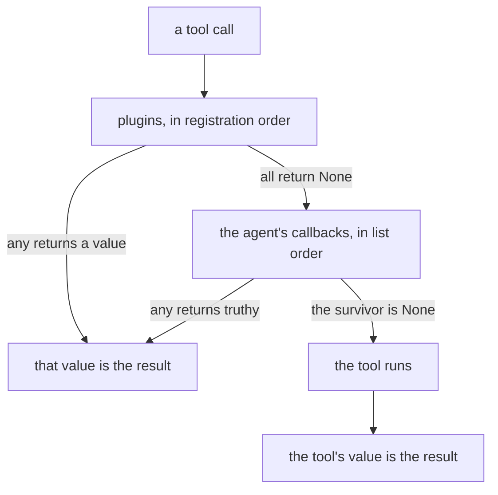

# 4.2 — The plugin goes first

## One-line answer

At every one of the six doors ADK runs the **application's plugins before the agent's callbacks**, and
a plugin that returns a value stops the agent's callbacks from running at all — so a callback is not
the outermost layer of your system, and tomorrow's subject already outranks today's.

---

## The story

The building gate and the flat door.

You live on the fourth floor. Somebody delivering a parcel meets two checks: the guard at the main
gate, and then you at your own door.

The order is not negotiable, and it is not symmetric. If the guard turns somebody away at the gate,
you never hear the doorbell. You do not get to decide, you do not get to look, you do not even know
they came. Your door is a real check with real authority, and it only ever sees the people the gate
let through.

Nobody living on the fourth floor thinks this is unfair. It is the point of having a gate. But it does
mean that "I decide who comes into my flat" is only true within a boundary somebody else drew, and it
is worth knowing where that boundary is before you rely on your door for something important.

---

## The idea in plain language

Everything so far in this day has been a **callback**: a function attached to **one agent**, at one of
six doors.

ADK has a second mechanism at the same six doors. A **plugin** is a class — a subclass of `BasePlugin`
— whose methods are the same hooks, registered on the **application** rather than on an agent. ADK's
own docstring draws the line: *"While agent callbacks apply to a particular agent, plugins applies
globally to all agents added in the runner."*

Tomorrow (Day 14, ADK-16) is the plugin day, and this part is not it. What belongs here is the one
fact about plugins that changes how you write a *callback*: **the plugin runs first, and it can stop
you.**

Every handler in the flow has the same three-step shape:

1. Run the plugins' version of this hook.
2. If a plugin returned something, use it and **return** — the agent's callbacks are never called.
3. Otherwise run the agent's callbacks, in order, by [1.4](../01-the-four-doors/1.4-a-list-not-just-a-function.md)'s rule.

So the layering, outermost first:

| Layer | Scope | Set on |
| --- | --- | --- |
| plugin | every agent in the application | the `App` |
| agent callback | one agent | the `LlmAgent` |
| the tool or the model call itself | one call | — |

Three practical consequences.

**Your callback is not a guarantee.** A policy you attach to an agent can be pre-empted by a plugin
you did not write, silently, with no trace in your function. If a rule genuinely must hold for the
whole application, it belongs in a plugin — the outer layer — and not in a callback on each agent.

**The parameter names differ.** A plugin's tool hooks take `tool_args` where an agent callback takes
`args`, and the after-tool hook takes `result` where the agent's takes `tool_response`. That is
[1.2](../01-the-four-doors/1.2-the-names-are-the-contract.md)'s rule biting on the day you copy a
working callback into a plugin. Plugin hooks are also `async def` and keyword-only.

**`Runner(plugins=[...])` is deprecated in 2.7.1.** The installed source says so directly: *"plugins:
Deprecated. A list of plugins for the runner. Please use the `app` argument to provide plugins
instead."* Plugins now go on an `App`, which is the object Day 14 introduces properly. If you have read
a 1.x-era or early-2.x tutorial, this is the line that has moved.

---

## Why Sutra needs it

**Sutra's audit belongs in a plugin, and today's version is deliberately not one.** Principle 4 —
build first, compare after. You wire the register as a callback today, feel the per-agent limitation,
and then tomorrow move it up a layer knowing exactly what that buys.

**Any rule that must hold for the whole desk is a plugin from the start.** Once Phase 8 gives Sutra a
graph with several agents, a credential filter attached to one of them is a filter with a hole in it.

**Day 84's tracing is a plugin** — `AutoTracingPlugin`, one line for OTel across the application
(ADK-74). That is only possible because the plugin layer sees every agent's doors.

---

## The mechanism

The same tool call, watched from both layers. The plugin prints `1`, the callback prints `2`.

```python
# lab/gate_order.py - plugins run before agent callbacks, and can stop them. Zero model calls.
import asyncio

from google.adk.agents import LlmAgent
from google.adk.apps import App
from google.adk.plugins import BasePlugin
from google.adk.runners import Runner
from google.adk.sessions import InMemorySessionService
from google.genai import types
from scripted import ScriptedModel, call, text


def lookup_ticket(ticket_id: str) -> dict:
    """Look up a support ticket by its id."""
    print("      >> the tool actually ran")
    return {"status": "ok", "ticket_id": ticket_id}


class GatePlugin(BasePlugin):
    """The outer layer. Note `tool_args`, not `args`."""

    def __init__(self, veto: bool):
        super().__init__(name="gate")
        self.veto = veto

    async def before_tool_callback(self, *, tool, tool_args, tool_context):
        print(f"      1 plugin.before_tool ({tool.name})")
        return {"status": "blocked-by-plugin"} if self.veto else None


def agent_guard(tool, args, tool_context):
    """The inner layer. Runs only if no plugin returned a value."""
    print("      2 agent before_tool_callback")
    return None


def make(veto: bool) -> App:
    agent = LlmAgent(
        name="desk",
        model=ScriptedModel(
            model="scripted",
            replies=[[call("lookup_ticket", ticket_id="4521")], [text("done")]],
        ),
        instruction="x",
        tools=[lookup_ticket],
        before_tool_callback=agent_guard,
    )
    return App(name="sutra", root_agent=agent, plugins=[GatePlugin(veto)])


async def drive(label: str, app: App) -> None:
    print(f"  {label}")
    runner = Runner(app=app, session_service=InMemorySessionService())
    session = await runner.session_service.create_session(app_name=app.name, user_id="u")
    async for event in runner.run_async(
        user_id="u",
        session_id=session.id,
        new_message=types.Content(role="user", parts=[types.Part(text="hi")]),
    ):
        for part in (event.content.parts if event.content else []) or []:
            if part.function_response:
                print("      the model was told:", part.function_response.response)


async def main() -> None:
    await drive("a. plugin returns None", make(veto=False))
    await drive("b. plugin returns a dict", make(veto=True))


asyncio.run(main())
```

**Line by line:**

- `class GatePlugin(BasePlugin)` with `super().__init__(name="gate")` — a plugin has a name, and it is
  required. The name is what appears in traces and what distinguishes two plugins at the same door.
- `async def before_tool_callback(self, *, tool, tool_args, tool_context)` — three differences from
  the agent callback in one line: it is a **method**, it is **`async`**, and the arguments after `*`
  are **keyword-only** with `tool_args` in place of `args`. Copying `agent_guard`'s signature here
  would fail with the `TypeError` from
  [1.2](../01-the-four-doors/1.2-the-names-are-the-contract.md).
- `App(name="sutra", root_agent=agent, plugins=[GatePlugin(veto)])` — plugins are declared on the
  application. `Runner(plugins=[...])` still works in 2.7.1 and is deprecated; this is the current
  form, and Day 14 is where `App` gets explained rather than merely used.
- `Runner(app=app, session_service=InMemorySessionService())` — the explicit runner, because
  `InMemoryRunner` builds its own `App` and there would be nowhere to hang the plugin. The session
  service has to be supplied for the same reason.
- `app_name=app.name` when creating the session, rather than `runner.app_name` — the same string, and
  taking it from the `App` says where it came from.
- Both layers print a number rather than a description, so the **order** is the first thing your eye
  finds in the output.

The output:

```text
  a. plugin returns None
      1 plugin.before_tool (lookup_ticket)
      2 agent before_tool_callback
      >> the tool actually ran
      the model was told: {'status': 'ok', 'ticket_id': '4521'}
  b. plugin returns a dict
      1 plugin.before_tool (lookup_ticket)
      the model was told: {'status': 'blocked-by-plugin'}
```

In **a** both layers ran, in order, and the tool ran after them.

In **b**, `2 agent before_tool_callback` is **absent**. The agent's callback did not run. It was not
overruled, not consulted and not informed — it simply never executed. If that callback were your audit
line, the run produced no audit record; if it were your policy check, your policy did not apply.



Verified against the installed `google-adk` 2.7.1 — `plugin_manager.run_before_tool_callback` is
awaited before the `canonical_before_tool_callbacks` loop in
`google/adk/flows/llm_flows/functions.py`, and `_handle_before_model_callback` in
`base_llm_flow.py` has the same shape with an early `return callback_response` — on 2026-08-29.
`BasePlugin`'s docstring and the deprecation note on `Runner(plugins=...)` are from the same install.

---

## When it breaks

**💥 The callback that stopped firing after somebody added a plugin.** No error. Your audit lines
disappeared from production the week a caching plugin was deployed, because on every cache hit the
plugin returns a response and your model-door callback is never reached. The audit gap is exactly the
population the cache serves, so the numbers look like a traffic drop.

**💥 The plugin signature copied from a callback.**

```text
TypeError: GatePlugin.before_tool_callback() got an unexpected keyword argument 'args'
```

You copied a working `before_tool_callback` into a plugin class and kept `args`. The plugin manager
passes `tool_args`. Same door, same idea, different name.

**💥 The deprecation you did not see.** No error, and a warning that scrolls past:

```text
plugins: Deprecated. A list of plugins for the runner. Please use the `app` argument to provide
plugins instead.
```

`Runner(plugins=[...])` works today. Writing new code against it is writing against a documented
deprecation on day one.

---

## In production

**What a professional writes instead of the teaching version** decides the layer deliberately, and
writes down why:

| The rule | Layer | Because |
| --- | --- | --- |
| never send credentials to a provider | plugin | it must hold for every agent, including ones added later |
| trace every model call | plugin | a gap in a trace is worse than no trace |
| this desk refuses credential *searches* | agent callback | it is about this agent's tools |
| this desk trims its knowledge-base results | agent callback | another agent's results are not its business |

The test is one question: *if somebody adds a new agent next quarter and forgets this rule, is that a
bug or a choice?* If it is a bug, it belongs in a plugin.

**What degrades at scale** is the invisible pre-emption. Once an application has four plugins and
twenty agent callbacks, "why did my callback not run?" becomes a genuinely hard question, because the
answer is in a different file written by a different team and there is no error anywhere. Teams that
run a lot of these end up logging at both layers with a shared invocation id — which is
[3.1](../03-the-tool-doors/3.1-the-chokepoint-restored.md)'s field, doing the job it exists for.

**The failure that only shows with real traffic** is the plugin that short-circuits rarely. A caching
plugin with a 5% hit rate pre-empts your callback on 5% of calls. Every test passes, because a test
suite has a cold cache. The 5% is invisible until somebody reconciles two counters that should agree
and finds they do not.

**The review comment a senior engineer leaves:** *"This is a security control on one agent. Move it to
a plugin — otherwise the next agent somebody adds doesn't have it, and nothing will fail to tell us."*

**The interview question:** *"What's the difference between a callback and a plugin?"* The answer that
shows you have wired both: "Scope and precedence. A callback is attached to one agent; a plugin is
registered on the application and applies to every agent in it. At every hook the plugins run first,
and if one returns a value the agent's callbacks never execute at all — not overruled, just skipped.
So the layer is a real design decision: anything that has to hold for agents nobody has written yet
goes in a plugin, and anything specific to one agent's tools stays a callback. The practical traps are
that the plugin hooks are async methods with slightly different parameter names — `tool_args`, not
`args` — and that in 2.7 plugins belong on the `App`; passing them to `Runner` is deprecated."

---

## Check yourself

```bash
cd days/day-13-callbacks-four-doors/lab && uv run python gate_order.py
```

Then add a `before_model_callback` to the agent and a `before_model_callback` to the plugin, and
confirm the same ordering holds at the model door.

**Answer out loud, without scrolling up:**

> Say what happens to an agent's `before_tool_callback` when a plugin's version returns a dict. Then
> give the one question that decides whether a rule belongs in a plugin or a callback.

---

**Next:** [4.3 — The tool you did not write](4.3-the-tool-you-did-not-write.md)
