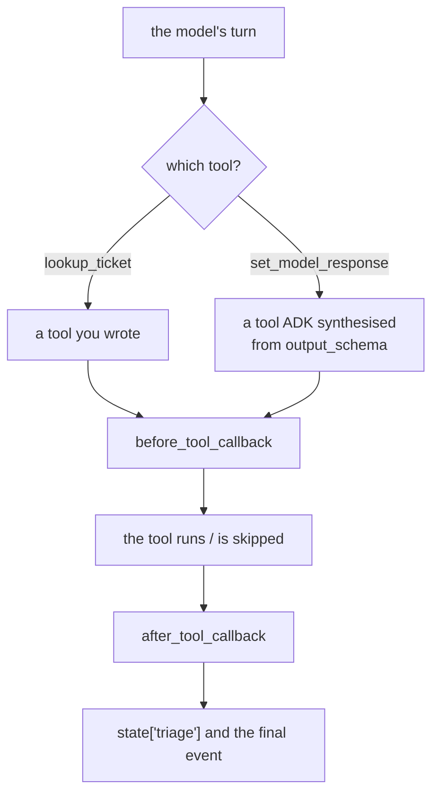

# 4.3 — The tool you did not write

## One-line answer

On Sutra's path, yesterday's `output_schema` makes ADK inject a tool called `set_model_response`, and
your tool-door callbacks fire for it exactly as they do for your own — so a policy that names tools,
counts them or trims their results is already meeting one it has never heard of.

---

## The story

The head count that included the caterers.

A family function, and the hall charges per plate. Somebody is told to stand near the entrance and
count heads, which they do, carefully, all evening. The number comes to two hundred and thirty.

The bill arrives for two hundred and thirty plates and it is wrong, because eleven of those heads
belonged to the catering staff — who walked in through the same door, were counted by the same person,
and did not eat a plate of the food they were serving.

Nobody miscounted. The counter did exactly what they were told. The number is a true count of *people
who came through the door*, and the bill needed a count of *guests*, and for one evening those had
quietly stopped being the same set.

---

## The idea in plain language

[Day 12, part 3.2](../../../day-12-structured-output/parts/03-schema-and-tools-together/3.2-the-tool-adk-injects.md)
established a fact about Sutra that becomes a live problem today.

When an agent has an `output_schema` **and** tools, most providers will not accept a response schema
and a tool list in one request. ADK's workaround is to stop asking the provider to constrain the
output, and instead **synthesise a tool** whose parameters are your schema's fields, called
`set_model_response`, plus an appended instruction telling the model that its final answer must come
through that tool.

You did not write it. It is not in your `tools=[...]` list. It is a `BaseTool` like any other, and the
model calls it exactly the way it calls yours.

Which means it goes through the tool doors.

Every callback in [section 3](../03-the-tool-doors/3.1-the-chokepoint-restored.md) sees it. Your
register logs it. Your policy check evaluates it. Your `after_tool_callback` gets its arguments and
may replace them. Three concrete failures follow, in rising severity:

**Your counts are wrong.** A tool-call counter on an agent with an output schema counts one extra
call per turn — the answer itself. The number is a true count of tool calls and a false count of
*work*.

**Your `args` handling meets an unfamiliar shape.** `set_model_response` is called with your schema's
field names as arguments — `outcome`, `category`, `urgency` — not with `query` or `ticket_id`. A
callback that reaches for `args["query"]` without checking `tool.name` first raises
[3.1](../03-the-tool-doors/3.1-the-chokepoint-restored.md)'s `KeyError`, on the last call of every
turn.

**Your after-tool transformer can corrupt the answer.** This is the severe one.
[3.3](../03-the-tool-doors/3.3-the-result-on-its-way-back.md)'s `tidy` stamps `via` onto every result
and truncates lists. Applied to `set_model_response`, it is editing **the agent's own structured
answer** on its way into `state["triage"]`, adding a key your schema does not declare and possibly
truncating a field.

The rule that falls out is short and it applies to every callback you write from now on: **narrow by
`tool.name` first, and decide explicitly what happens to tools that are not yours.**

---

## Why Sutra needs it

**This is not hypothetical for Sutra; it is the current configuration.** Day 12 set `output_schema`
and `output_key` on `sutra/desk/agent.py`, and Day 12 part 3.1 established that Sutra is permanently
on the workaround path because the desk runs on the Gemini API rather than Vertex AI. Every callback
you attach today runs in an agent that has an injected tool.

**It is the day's synthesis.** ADK-13 (yesterday) and ADK-15 (today) are independent features that
produce a third behaviour when both are on. That is the class of thing a curriculum has to point at
explicitly, because neither day's documentation mentions the other.

**Phase 8's graph multiplies it.** Every agent with an output schema in that graph has its own
injected tool, and a fleet-wide plugin ([4.2](4.2-the-plugin-goes-first.md)) will see all of them.

---

## The mechanism

Yesterday's `Triage` schema, today's register, and one run.

```python
# lab/injected.py - the tool nobody wrote, arriving at your callbacks. Zero model calls.
import asyncio
from typing import Literal

from google.adk.agents import LlmAgent
from google.adk.runners import InMemoryRunner
from google.genai import types
from pydantic import BaseModel
from scripted import ScriptedModel, call

seen: list[str] = []


class Triage(BaseModel):
    """Day 12's schema, trimmed to two fields."""

    outcome: Literal["triaged", "unclear", "not_a_ticket"]
    category: Literal["billing", "technical", "account"] | None = None


def lookup_ticket(ticket_id: str) -> dict:
    """Look up a support ticket by its id."""
    return {"status": "ok", "ticket_id": ticket_id}


def register(tool, args, tool_context):
    """The register from 3.1, unchanged. It counts what comes through the door."""
    seen.append(tool.name)
    print(f"      tool={tool.name} args={args}")


agent = LlmAgent(
    name="desk",
    model=ScriptedModel(
        model="scripted",
        replies=[
            [call("lookup_ticket", ticket_id="4521")],
            [call("set_model_response", outcome="triaged", category="billing")],
        ],
    ),
    instruction="Triage the ticket.",
    tools=[lookup_ticket],
    output_schema=Triage,
    output_key="triage",
    before_tool_callback=register,
)


async def main() -> None:
    runner = InMemoryRunner(agent=agent)
    session = await runner.session_service.create_session(app_name=runner.app_name, user_id="u")
    async for _ in runner.run_async(
        user_id="u",
        session_id=session.id,
        new_message=types.Content(role="user", parts=[types.Part(text="ticket 4521")]),
    ):
        pass
    after = await runner.session_service.get_session(
        app_name=runner.app_name, user_id="u", session_id=session.id
    )
    print(f"      tools you wrote ......... {[t.__name__ for t in [lookup_ticket]]}")
    print(f"      tools your callback saw . {seen}")
    print(f"      state['triage'] ......... {after.state.get('triage')}")
    print(f"      capability on this model  {agent.model.capabilities.output_schema_and_tools}")


asyncio.run(main())
```

**Line by line:**

- `Triage` is [Day 12](../../../day-12-structured-output/parts/02-schemas-in-practice/2.1-a-schema-a-model-can-fill.md)'s
  schema cut to two fields, because the subject here is the injected tool and a full schema would add
  length without adding evidence.
- `output_schema=Triage, output_key="triage"` — the two fields from yesterday, unchanged. Nothing in
  this script asks for an injected tool; it arrives as a consequence of these two lines plus `tools=`.
- The second scripted turn is `call("set_model_response", outcome=..., category=...)` — the model
  answering **through** the injected tool. Scripting it is how the demo stays free; on a real run the
  model does this because of the instruction ADK appended.
- `register` is [3.1](../03-the-tool-doors/3.1-the-chokepoint-restored.md)'s function with two lines
  changed, and it is deliberately **not** defensive. A hardened version would prove nothing here; the
  point is what an ordinary callback sees.
- `agent.model.capabilities.output_schema_and_tools` printed last — the boolean that decides which
  path the agent is on, and the same one Day 12 told you to run on your own machine. If it prints
  `True`, your provider takes both in one request and none of this applies to you.
- `seen` is compared against a literal list of the functions you passed, so the difference is printed
  rather than asserted in prose.

The output:

```text
      tool=lookup_ticket args={'ticket_id': '4521'}
      tool=set_model_response args={'outcome': 'triaged', 'category': 'billing'}
      tools you wrote ......... ['lookup_ticket']
      tools your callback saw . ['lookup_ticket', 'set_model_response']
      state['triage'] ......... {'outcome': 'triaged', 'category': 'billing'}
      capability on this model  False
```

**One tool in, two tools out.** The register recorded a call to a function that does not exist in your
codebase, with arguments that are your schema's fields.

And the last two lines connect it back to yesterday: the value in `state["triage"]` — the thing Phase
8's router will read — **came through the tool door you just attached a callback to.** Your callback
is standing between your agent and its own answer.



The two paths merge at `B`, which is the same merge
[3.2](../03-the-tool-doors/3.2-refusing-a-tool-call-honestly.md) drew for refusals. It keeps happening
because there is only one tool door, and everything that is shaped like a tool goes through it.

Verified against the installed `google-adk` 2.7.1 on 2026-08-29 by running the script above:
`SetModelResponseTool` is registered under the name `set_model_response` when
`model.capabilities.output_schema_and_tools` is `False` and the agent has both a schema and tools, and
the `canonical_before_tool_callbacks` loop in `google/adk/flows/llm_flows/functions.py` makes no
distinction between it and a `FunctionTool`. Day 12's part 3.2 is where the injection itself is taught.

---

## When it breaks

**💥 The `KeyError` on the last call of every turn.**

```text
KeyError: 'query'
```

Your search policy did `args["query"]` without checking `tool.name`. It worked for `search_kb` and
raised for `set_model_response`, whose arguments are `outcome` and `category`. The signature of this
bug is that it fires **once per turn, always at the end** — after all the real work is done, which
makes it look like a problem with the answer rather than with the policy.

**💥 The answer that got stamped.** No error. `after_tool_callback` adds `"via": "sutra-desk"` to
every tool result. `set_model_response`'s "result" is your structured answer, so `state["triage"]` now
contains a key your `Triage` model never declared, and the first consumer that does
`Triage(**state["triage"])` fails somewhere else entirely.

**💥 The tool budget that was never reachable.** No error, and an agent that refuses to answer. You
capped tool calls at three per turn. The agent makes three real calls, then tries to answer — through
the injected tool — and your cap blocks it. The refusal dict goes back as the *answer*, and the run
ends with a triage that says `{"status": "blocked"}`.

**💥 The metric that moved when nothing changed.** No error. Day 12 added `output_schema` to the desk
and your tool-call rate went up by exactly one per turn overnight. Nothing about tool usage changed.

---

## In production

**What a professional writes instead of the teaching version** knows the name and states its policy
towards it explicitly, in one place:

```python
# Tools the framework injects rather than tools we wrote. Day 12, part 3.2.
FRAMEWORK_TOOLS = {"set_model_response"}


def register(tool, args, tool_context) -> None:
    """Audit every call, and mark the ones that are not ours."""
    logger.info(
        "tool_call",
        extra={
            "invocation": tool_context.invocation_id,
            "tool": tool.name,
            "origin": "framework" if tool.name in FRAMEWORK_TOOLS else "app",
            "arg_names": sorted(args),
        },
    )


def cap_result_size(tool, args, tool_context, tool_response) -> dict | None:
    """Trim tool results. Never touches the agent's own answer."""
    if tool.name in FRAMEWORK_TOOLS:
        return None
    ...
```

**Line by line:**

- `FRAMEWORK_TOOLS` is a named constant with a comment pointing at the day that explains it. A bare
  string literal `"set_model_response"` buried in an `if` is a magic value that the next reader will
  delete as dead code.
- The register **still logs it**, tagged with `origin`. Filtering it out of the audit would be the
  wrong fix: it is a real call the model really made, and on the day the model calls it twice you want
  to know. Tag, do not hide.
- `cap_result_size` **returns `None` immediately** for framework tools. A transformer's correct
  posture towards the agent's own answer is to leave it alone, and the early return says so in one
  line that a reviewer can check.
- The two functions treat the same set differently on purpose — audit everything, transform only what
  is yours — which is the distinction that matters and the reason a single `if name in ...: return`
  copied into every callback would be wrong.

**What degrades at scale** is the assumption that `tools=[...]` is the whole list. `set_model_response`
is the first framework-injected tool this curriculum meets and it will not be the last: built-in tools,
agent-as-tool wrappers and transfer functions all arrive the same way. A callback written against a
list of names you control is a callback that will meet a name you do not.

**The failure that only shows with real traffic** is the interaction that appears when two features
are enabled together. Neither Day 12's structured output nor today's callbacks is unusual on its own,
and each is well tested alone. The injected tool only exists when both are on **and** the provider
lacks the capability — so it is absent on Vertex AI, absent without an output schema, and present in
your production configuration. Print
`agent.model.capabilities.output_schema_and_tools` in your own environment before believing any of
this applies to you.

**The review comment a senior engineer leaves:** *"This transformer runs on `set_model_response` too,
so it's editing the agent's structured answer before it lands in state. Skip framework tools
explicitly."*

**The interview question:** *"Have you ever had a callback fire for something you didn't expect?"* The
answer that shows you have shipped one: "Yes — the framework's own injected tool. When an agent has a
response schema and tools, and the provider won't take both in one request, ADK synthesises a tool
whose parameters are the schema's fields and tells the model to answer through it. It goes through the
same before-tool and after-tool hooks as everything else, so my audit counted an extra call per turn
and, worse, my result-trimming callback was editing the agent's own answer on its way into session
state. The fix is a named set of framework tool names: audit them, tagged by origin, and never
transform them. The general lesson is that `tools=[...]` isn't the complete list of tools your
callbacks will see, so branch on the name before you touch the arguments."

---

## Check yourself

```bash
cd days/day-13-callbacks-four-doors/lab && uv run python injected.py
```

Then remove `output_schema=Triage` and run it again. `set_model_response` disappears from `seen`, and
so does `state['triage']`.

**Answer out loud, without scrolling up:**

> Say why a tool you never wrote reaches your `before_tool_callback`, and name the two conditions that
> have to be true for it to exist. Then say what an `after_tool_callback` must do about it.

---

**Next:** [💥 5.1 — The note that became the result](../05-failure-lab/5.1-the-note-that-became-the-result.md)
