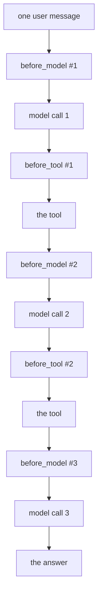

# 6.2 — What belongs in a callback

## One-line answer

A callback runs **on the request path**, inside an async event loop, on every model call and every
tool call — so it must be fast, non-blocking and unable to raise, and anything that is none of those
three belongs somewhere else.

---

## The story

The toll booth that also sells snacks.

One lane, one booth, one person. Collecting the toll takes eight seconds: take the note, punch the
amount, hand back the change and the receipt. The queue moves.

Then somebody has the reasonable idea that people stuck in traffic would buy tea and biscuits, and
since the booth operator is already talking to every single car, why build a second counter? So the
tea goes in the booth.

Now some cars take eight seconds and some take ninety. The average is still fine — most people do not
want tea. But the queue is not made of averages. Every car behind the tea drinker waits, and by
evening the queue is a kilometre long, and the report says *"toll plaza congestion"*, which sounds
like a toll problem.

The mistake was not selling tea. It was selling tea **in the one place every single car has to stop**.

---

## The idea in plain language

Everything today has been about what a callback *can* do. This part is about what it should do, and
the answer comes from one fact: **a callback runs on the request path.**

That phrase means: it happens between the user's message arriving and the answer going back, while
somebody waits. Three consequences that decide everything else.

**It runs often.** Once per model call at the model doors — and once per *yielded response* at
`after_model_callback`, which under streaming is per fragment
([2.5](../02-the-model-doors/2.5-the-door-that-fires-on-every-chunk.md)). Once per tool call at the
tool doors, plus once more per turn for the injected tool if the agent has an output schema
([4.3](../04-where-the-rule-bites/4.3-the-tool-you-did-not-write.md)). A single user question routinely
fires the doors ten times.

**It runs inside an async event loop.** ADK's flow is `async`. A callback that does blocking work — a
synchronous HTTP request, a `time.sleep`, a file read from a slow disk — does not just slow its own
call down. It blocks the **event loop**, which means every other concurrent run in the same process
stops too. This is the toll booth, exactly: the cost is not paid by the car buying tea.

The framework does support `async def` callbacks; ADK checks `inspect.isawaitable` on the result and
awaits it. So the fix for necessary IO is `async def` plus an async client — not "it's only 50
milliseconds".

**An exception from it kills the turn.** Verified in
[1.2](../01-the-four-doors/1.2-the-names-are-the-contract.md): a `TypeError` in a callback comes out
through the runtime and the run fails. That is correct behaviour and it is a constraint on you.
A callback that can raise has made every request depend on its own correctness — so a metrics callback
that does `args["query"][:50]` will one day take down a live conversation over a log line.

Which gives a short test for anything you are about to put in a callback:

| Ask | If the answer is no |
| --- | --- |
| Does it finish in well under the time a model call takes? | move it off the request path |
| Is it non-blocking — pure computation, or `async` with an async client? | make it `async`, or move it |
| Can it raise? | wrap the risky part, or do not do it here |
| Does it need to be *inside* the agent rather than around it? | put it in the caller |
| Must it apply to agents nobody has written yet? | make it a plugin ([4.2](../04-where-the-rule-bites/4.2-the-plugin-goes-first.md)) |

And the resulting split, which is the practical content of this part:

**Belongs in a callback:** a log line · a counter in session state · a policy decision from data
already in hand · trimming a result · redacting a pattern · a dictionary lookup for a cached answer.
All of these are microseconds and none of them touch the network.

**Does not belong in a callback:** a synchronous HTTP call to a policy service · a database query ·
reading a config file from disk on every call · sending an email or a webhook · anything with a retry
loop · a second model call.

The last one deserves naming. Calling a model from inside a callback — an LLM-as-judge check on every
reply, say — doubles your model calls, doubles your latency, and puts a rate-limited network call on a
path that must not block. There are systems that do it deliberately, and every one of them does it
**asynchronously and off the critical path**. Day 25's evaluation and Day 67's guardrails both face
this decision explicitly; today's answer is simply: not like this.

---

## Why Sutra needs it

**Sutra's callbacks are about to become permanent.** Everything you attach today runs on every turn
for the rest of the curriculum. A cheap habit now is a cheap system in Phase 14; an expensive one is a
rewrite.

**The free tier makes latency visible.** With 20 requests a day, you are not going to notice a slow
callback from throughput. You will notice it as a conversation that feels sluggish, and you will blame
the model, which is free-tier and therefore an easy thing to blame.

**Day 84's tracing exists to answer this question with numbers.** `AutoTracingPlugin` (ADK-74) puts a
span around each of these hooks. Until then the discipline has to be a rule rather than a measurement,
and this is the rule.

---

## The mechanism

Two callbacks that do the same amount of "work", one blocking and one async, on an agent making three
model calls. The clock is the only assertion.

```python
# lab/cost_of_a_door.py - what a slow callback costs, per call and per run. Zero model calls.
import asyncio
import time

from google.adk.agents import LlmAgent
from google.adk.runners import InMemoryRunner
from google.genai import types
from scripted import ScriptedModel, call, text

WORK = 0.05  # what a small network round trip costs, standing in for one


def lookup_ticket(ticket_id: str) -> dict:
    """Look up a support ticket by its id."""
    return {"status": "ok", "ticket_id": ticket_id}


def cheap(callback_context, llm_request):
    """The right kind of callback: pure computation, no waiting."""
    _ = len(llm_request.contents)


def blocking(callback_context, llm_request):
    """The wrong kind: it waits, and it waits on the event loop."""
    time.sleep(WORK)


async def non_blocking(callback_context, llm_request):
    """The same wait, done in a way that yields the loop to other work."""
    await asyncio.sleep(WORK)


def build(callback) -> LlmAgent:
    return LlmAgent(
        name="desk",
        model=ScriptedModel(
            model="scripted",
            replies=[
                [call("lookup_ticket", ticket_id="4521")],
                [call("lookup_ticket", ticket_id="4522")],
                [text("done")],
            ],
        ),
        instruction="Triage the ticket.",
        tools=[lookup_ticket],
        before_model_callback=callback,
    )


async def one_run(agent: LlmAgent) -> None:
    runner = InMemoryRunner(agent=agent)
    session = await runner.session_service.create_session(app_name=runner.app_name, user_id="u")
    async for _ in runner.run_async(
        user_id="u",
        session_id=session.id,
        new_message=types.Content(role="user", parts=[types.Part(text="hi")]),
    ):
        pass


async def timed(label: str, callback, concurrent: int) -> None:
    started = time.perf_counter()
    await asyncio.gather(*(one_run(build(callback)) for _ in range(concurrent)))
    elapsed = time.perf_counter() - started
    print(f"    {label:<34} {concurrent} concurrent runs took {elapsed:.2f}s")


async def main() -> None:
    await timed("no callback", None, 1)
    await timed("cheap (pure computation)", cheap, 1)
    await timed("blocking (time.sleep)", blocking, 1)
    await timed("async (asyncio.sleep)", non_blocking, 1)
    print()
    await timed("blocking, under concurrency", blocking, 4)
    await timed("async, under concurrency", non_blocking, 4)


asyncio.run(main())
```

**Line by line:**

- `WORK = 0.05` is a named constant standing in for a small network round trip. Naming it means the
  number in the output can be reasoned about rather than being magic.
- `cheap` does `_ = len(...)` — real work that costs nothing measurable. The underscore says the value
  is discarded on purpose, and no `return` keeps it an observer.
- `blocking` uses `time.sleep`, which is the honest stand-in for a synchronous HTTP client. It does not
  yield the event loop.
- `non_blocking` is `async def` with `await asyncio.sleep`. Identical wait, and the loop is free to run
  other work during it. ADK awaits it because the flow checks `inspect.isawaitable` on the callback's
  result — a plain function and a coroutine function are both acceptable at every door.
- Three scripted turns, so each run makes **three** model calls and the door fires three times. A
  single-call run would understate the cost by a factor of three, which is exactly the mistake this
  script exists to prevent.
- `asyncio.gather(*(one_run(...) for _ in range(concurrent)))` — several runs at once, which is what a
  server does and what a script never does by accident. This is the line that turns "my callback is
  50 ms" into "my callback is 50 ms **times every concurrent user**".
- A fresh agent per run inside the generator expression, because two concurrent runs sharing one
  `ScriptedModel` would race on its `calls` counter.
- `time.perf_counter()` rather than `time.time()` — a monotonic clock, which is what you measure
  durations with.

The output:

```text
    no callback                        1 concurrent runs took 0.42s
    cheap (pure computation)           1 concurrent runs took 0.02s
    blocking (time.sleep)              1 concurrent runs took 0.18s
    async (asyncio.sleep)              1 concurrent runs took 0.21s

    blocking, under concurrency        4 concurrent runs took 0.73s
    async, under concurrency           4 concurrent runs took 0.30s
```

Three findings, and the third is the one that matters.

**Ignore the first line.** `no callback` took longer than everything after it, which cannot be true.
It is the first run in the process, so it is paying for imports, class construction and the first
trip through ADK's flow. This is what a benchmark's first iteration always is, and the honest thing to
do with it is name it rather than quietly drop it — the second line, `cheap`, is the real baseline.

**On a single run, blocking and async cost the same.** 0.18 s against 0.21 s, which is noise. Both are
three doors times 50 ms. If you measure your callback the way most people do — one request, on your
laptop — you will conclude there is no difference between them. There is no difference, *for you*.

**Under four concurrent runs they diverge.** 0.73 s against 0.30 s. The blocking version has to pay
its wait four times over, because each run's `time.sleep` holds the event loop while the other three
sit and wait for it. The async version pays it roughly once, because the loop interleaves the waiting.
Same total work, indistinguishable on a single request, and more than twice apart the moment a second
person uses the system.

Your numbers will differ — this is a laptop, and 50 ms is a stand-in — but the shape will not, and the
shape is the finding.



Six doors fired for one question, on an agent with two tool calls. Multiply whatever your callback
costs by that, then by your concurrency, before deciding it is cheap.

Verified against the installed `google-adk` 2.7.1 — `inspect.isawaitable(agent_response)` is checked
and awaited in `_handle_before_model_callback` (`base_llm_flow.py`) and in the tool-callback loops
(`functions.py`), which is what makes `async def` callbacks work at every door — on 2026-08-29.

---

## When it breaks

**💥 The config file read on every call.** No error, and a system that is mysteriously slow under load
and fine in testing. A policy YAML read from disk in a `before_tool_callback` is a blocking syscall on
the event loop, several times per turn. Read it once at import, or cache it with an explicit reload
path.

**💥 The callback that raised on the field that was usually there.**

```text
TypeError: 'NoneType' object is not subscriptable
```

Your metrics line did `args["query"][:50]` and a tool was called with no `query`. The turn died. A
callback is not a place to be optimistic: every field it reads is one it must be able to not find.

**💥 The one that only fails at 3am.** No error in your logs, because your logs are in the process
that stopped. A callback that makes a synchronous network call to a service that goes slow does not
fail — it *waits*, holding the loop, and every concurrent conversation on that process stops
answering. The alert that fires is "the agent is down".

---

## In production

**What a professional writes instead of the teaching version** keeps the expensive part off the path
entirely:

```python
def audit_tool_calls(tool, args, tool_context) -> None:
    """Observer. Hands the record to something else and returns immediately."""
    try:
        _AUDIT_QUEUE.put_nowait(
            {"invocation": tool_context.invocation_id, "tool": tool.name, "at": time.time()}
        )
    except asyncio.QueueFull:
        logger.warning("audit_queue_full", extra={"tool": tool.name})
```

**Line by line:**

- `put_nowait` never waits. The callback's entire job is to hand the record over; whatever consumes the
  queue — a background task, a batching writer — runs off the request path where slowness costs
  throughput rather than latency.
- The `try` is not decoration. `put_nowait` raises `QueueFull` when the consumer has fallen behind, and
  an unhandled exception here would take down a live conversation because the audit pipeline was slow.
  **The audit must never be able to break the thing it audits.**
- The `except` degrades honestly: it drops the record and says so at `warning`. Silently discarding it
  would leave a gap in the audit trail with nothing indicating there is a gap, which is
  [3.1](../03-the-tool-doors/3.1-the-chokepoint-restored.md)'s incomplete-register problem again.
- `-> None`, no `return`, observer — [5.1](../05-failure-lab/5.1-the-note-that-became-the-result.md)'s
  lesson, permanently.

**What degrades at scale** is the accumulation. No single callback is the problem. Six of them, each
adding two milliseconds, on ten doors per turn, is 120 ms added to every conversation by code nobody
thinks of as being on the hot path — because each author measured only their own.

**The failure that only shows with real traffic** is the concurrency cliff in the output above. A
blocking callback is invisible until two people use the system at once, which on a personal project is
never and on the first day of a pilot is immediately. Test with `asyncio.gather`, not with one run.

**The review comment a senior engineer leaves:** *"This does a synchronous `requests.get` to the policy
service on every tool call. That's on the event loop — one slow response there stalls every
conversation in the process. Load the policy at startup, or make it `async` with a timeout."*

**The interview question:** *"What would you refuse to put in a callback?"* The answer that shows you
have run one under load: "Anything that blocks or can raise. A callback is on the request path and
fires several times per turn — once per model call, once per tool call, and per fragment on a streamed
reply — inside an async loop. So a synchronous HTTP call in there doesn't slow down that one request;
it holds the event loop and stalls every concurrent conversation in the process. I've measured it: a
50 ms blocking callback and a 50 ms async one are identical on a single run and about four times apart
at four concurrent runs, which is why single-request benchmarks are exactly the wrong instrument. And
it can't be allowed to raise, because an exception in a callback takes the whole turn down — so a
metrics line that assumes a field is present becomes an outage. What goes in: log lines, counters,
policy decisions from data already in hand, trimming. What goes out: network calls, disk reads,
retries, and anything that has to apply to agents nobody's written yet, which is a plugin."

---

## Check yourself

```bash
cd days/day-13-callbacks-four-doors/lab && uv run python cost_of_a_door.py
```

Then raise the concurrency from 4 to 16 and watch which of the two lines moves.

**Answer out loud, without scrolling up:**

> Say how many times the doors fire for one user question on an agent that makes two tool calls. Then
> say why a blocking callback and an async one look identical on your laptop and are not.

---

**Next:** [back to the hub](../../LESSON.md) — then §11's ledger rows and the commit.
