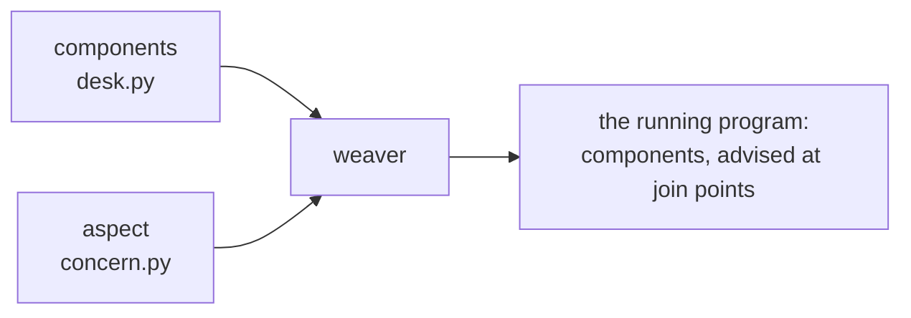

# Aspect-oriented programming

> **Aspect-oriented programming** · `doi:10.1007/BFb0053381` · 1997 ·
> ECOOP'97 — Object-Oriented Programming, Lecture Notes in Computer Science ·
> <https://doi.org/10.1007/BFb0053381>

## One-line answer

Some concerns cannot be put in a module of their own no matter how you decompose a program, because
they **cut across** the decomposition — and the paper's proposal was to write each such concern once,
separately, and have a mechanism apply it at named points in the code it affects.

---

## The story

A small workshop that repairs washing machines takes on a second and then a third technician, and the
owner decides every job must be written down: who took it, what was wrong, what was replaced.

Nobody argues with the rule. The trouble is where it lives. Each technician writes the note at the end
of their own job, in their own way, in the middle of their own work. So the note about the drain pump
sits inside the drain-pump job, the note about the door seal sits inside the door-seal job, and the
notes are in three handwritings and four formats.

Two things then go wrong, and neither is anyone's fault.

**The rule is everywhere.** Change what a note must contain — add the customer's phone number — and
somebody has to visit every job sheet in the workshop. The change is one idea and thirty edits.

**The rule is nowhere.** Ask *"what is our record-keeping policy?"* and there is no page to point at.
It exists only as the sum of thirty jobs, and the only way to find out whether a job follows it is to
read that job.

The owner cannot fix this by organising the jobs better. Sorting jobs by machine, by technician or by
date does not help, because record-keeping is not a property of any of those groupings — it is a
property of *every job*, and the filing cabinet only has one axis.

---

## The idea in plain language

That is the situation the paper named.

Programs are decomposed — into functions, objects, modules. That decomposition captures most of what a
program does, and the paper's word for what it captures is the **components**: the parts that can be
cleanly encapsulated, given a name, and called.

Then there are concerns that will not sit inside that decomposition, whatever decomposition you chose.
Logging. Timing. Error handling. Auditing. Access control. Synchronisation. Each of them affects many
components, and none of them belongs to any component. The paper calls these **aspects**, and defines
them by that property: an aspect is a concern that **cannot be cleanly encapsulated in a generalised
procedure**, because it cuts across the units the program is built from.

Two words for what happens when you have no way to express one, and they are the workshop's two
problems:

**Tangling** — one module's code contains several concerns mixed together. The job sheet has repair
steps and record-keeping interleaved.

**Scattering** — one concern's code is spread across many modules. The record-keeping policy exists in
thirty places.

The paper's proposal has three pieces:

**Write the aspect separately**, in its own module, in terms of where it applies rather than being
copied into each place. The record-keeping policy becomes one page.

**Name the points where it applies.** These are **join points** — well-defined places in the program's
execution where an aspect may act: a method being called, an exception being thrown, a field being
read.

**Have something combine the two.** The paper calls this the **weaver**: it takes the components and
the aspects and produces the running program, so the components never mention the aspects and the
aspects are written once.

The claim is not that this makes programs shorter. It is that it makes them **decomposable along more
than one axis at a time** — you can read the drain-pump repair without the record-keeping, and read
the record-keeping policy without the repairs, and both are complete.

---

## Why Sutra needs it

**Because ADK's plugin layer is this design, thirty years on.** Map the vocabulary directly:

| The paper | ADK 2.7.1 |
| --- | --- |
| component | an `LlmAgent` and its tools |
| aspect | a `BasePlugin` subclass |
| join point | one of the fourteen hooks |
| pointcut (which join points) | which hooks you override, plus your own branching on `agent_name` |
| advice (what to do there) | the body of the hook |
| weaver | `PluginManager`, at run time |

[1.1](../parts/01-where-a-plugin-lives/1.1-the-rule-nobody-has-to-remember.md) argued for plugins
using a tailor's shop and a rule painted on a wall. This is the same argument, made in 1997, with
names for its parts — and having the names is what lets you say precisely what
[7.3](../parts/07-in-production/7.3-which-layer-does-this-rule-belong-to.md) is choosing between.

**Because the paper also predicted this day's failure lab.** The best-known criticism of the approach
— that a reader of a component cannot tell what will actually run, because the aspects are elsewhere —
is exactly
[6.1](../parts/06-failure-lab/6.1-the-rule-that-broke-an-agent-nobody-was-looking-at.md): the FAQ
agent's file is correct and complete and does not mention the thing breaking it. That is not an ADK
quirk. It is the known, thirty-year-old cost of the technique, and knowing that changes it from a
surprise into a trade-off you are making on purpose.

---

## The mechanism

The paper's mechanism, in the smallest form that is still recognisable.

An aspect needs three things: **advice** (what to do), **join points** (where), and a **weaver** (that
attaches one to the other without the target knowing).



The distinction that makes it more than a decorator is **where the choice of join points lives**. A
decorator is written *at* the function it decorates — the target still names the concern. In the
paper's model the aspect names the targets, so the target files are untouched and unaware. That is the
property ADK's plugin layer has: your agent has no line of code referring to any plugin.

Two vocabulary notes, because the terms get used loosely:

- A **pointcut** is the *specification* of a set of join points — "every public method on this class",
  or in ADK, "every tool call of every agent".
- **Advice** is what runs there, and it comes in kinds: *before*, *after*, and *around* (which can
  replace the call entirely). ADK's hooks are named `before_*` and `after_*`, and the return-value
  rule from [3.1](../parts/03-the-rule-at-this-layer/3.1-is-not-none-and-this-time-it-means-it.md) —
  return something and the underlying thing does not happen — is *around* advice with a simpler
  spelling.

---

## The paper in one demo

The paper's contribution and nothing else: a concern written once, applied to functions that do not
mention it, with a switch to turn the weaving off.

No ADK, no model, no network. Two files.

```text
lab/papers/aspect-oriented-programming/
├── concern.py   # the aspect: the advice, and the weaver
└── desk.py      # the components: three functions with no auditing in them
```

**`concern.py`** — the aspect. This is the whole idea.

```python
"""The aspect: one cross-cutting concern, written once, in a file the desk never imports.

`audit` is the *advice* - what to do at a join point. `weave` is the *weaver* -
it applies the advice to named join points without those functions being edited
or even knowing they were changed.
"""

from __future__ import annotations

import functools
from collections.abc import Callable
from types import ModuleType

LOG: list[str] = []


def audit(name: str, args: tuple[object, ...]) -> None:
    """The advice: the concern itself, in one place instead of scattered."""
    shown = ", ".join(repr(a) for a in args)
    LOG.append(f"audit: {name}({shown})")


def weave(module: ModuleType, join_points: list[str]) -> None:
    """Apply `audit` at each named join point by rebinding the module's own name."""
    for name in join_points:
        original: Callable[..., object] = getattr(module, name)

        @functools.wraps(original)
        def advised(*args: object, _f: Callable[..., object] = original, **kw: object) -> object:
            audit(_f.__name__, args)
            return _f(*args, **kw)

        setattr(module, name, advised)
```

**Line by line:**

- `LOG` at module level — the aspect owns its own state. Nothing in `desk.py` knows this list exists,
  which is the separation the paper is claiming.
- `audit(name, args)` is the **advice**, and it is four lines in one place. The whole point is that
  changing what an audit record contains is an edit here and nowhere else — the workshop's "add the
  phone number" change.
- `weave(module, join_points)` takes the **module** and a list of **names**. Those names are the
  pointcut: the specification of where the advice applies, written in the aspect's vocabulary rather
  than in the components'.
- `getattr(module, name)` then `setattr(module, name, advised)` — the weaver, and it is two lines.
  It rebinds the module's own attribute, so every later lookup of `desk.open_ticket` finds the advised
  version. This is weaving at run time; the paper's own implementation wove at compile time, and
  *In production* below is about which of those survived.
- `@functools.wraps(original)` — carries `__name__`, `__doc__` and the signature metadata across, so
  the advised function is still introspectable. Without it `_f.__name__` inside the advice would work
  but everything else about the function would look like `advised`.
- `_f: Callable[..., object] = original` as a **default argument** — the closure fix. Without it all
  three advised functions would capture the same `original` variable, which after the loop holds the
  last one, and every call would run `refund`. This is the classic late-binding trap and it is why the
  parameter exists.
- `audit(...)` **before** `return _f(...)` — this is *before* advice. Moving the call after the return
  value is computed would make it *after* advice, and wrapping the call in `try`/`finally` would give
  the *around* form.

**`desk.py`** — the components. Read it and note what is absent.

```python
"""The business code. Three functions, and not one line about auditing.

Run it both ways:

    WEAVE=1 python desk.py
    WEAVE=0 python desk.py
"""

from __future__ import annotations

import os
import sys


def open_ticket(customer: str) -> str:
    return f"ticket for {customer}"


def close_ticket(ticket_id: str) -> str:
    return f"closed {ticket_id}"


def refund(ticket_id: str, amount: int) -> str:
    return f"refunded {amount} on {ticket_id}"


if __name__ == "__main__":
    import concern

    woven = os.environ.get("WEAVE", "1") == "1"
    if woven:
        concern.weave(sys.modules[__name__], ["open_ticket", "close_ticket", "refund"])

    print(f"WEAVE={'1' if woven else '0'}")
    print(" ", open_ticket("acme"))
    print(" ", close_ticket("T-1"))
    print(" ", refund("T-1", 40))
    print(f"  audit records: {len(concern.LOG)}")
    for line in concern.LOG:
        print("   ", line)
```

**Line by line:**

- The three functions have **no audit code, no logging, no import of `concern`** at the top of the
  file. That absence is the paper's claim made visible; if any of them mentioned auditing, the demo
  would be showing a decorator instead.
- `import concern` inside the `__main__` block, not at the top — so the *module* `desk` does not depend
  on the aspect at all. Only the script that assembles and runs the program does, which is the
  weaver's job and not a component's.
- `os.environ.get("WEAVE", "1") == "1"` — the **ablation switch**. One environment variable turns the
  paper's contribution off, and everything else stays identical.
- `sys.modules[__name__]` — the module object for the file currently running, which is what `weave`
  rebinds names on. Passing the module rather than the functions is what lets the aspect name its
  targets by string.
- The three `print` calls invoke the functions **by their module-level names**, so they resolve to
  whatever is bound at call time — the advised versions after weaving, the originals without it. Had
  they been called through a saved local reference, weaving would have had no effect on them.
- `len(concern.LOG)` printed before the records — the number is the measurement, and the two runs
  differ only in it.

**Run it both ways:**

```bash
cd days/day-14-plugins-one-layer-up/lab/papers/aspect-oriented-programming
WEAVE=1 uv run python desk.py
WEAVE=0 uv run python desk.py
```

```text
WEAVE=1
  ticket for acme
  closed T-1
  refunded 40 on T-1
  audit records: 3
    audit: open_ticket('acme')
    audit: close_ticket('T-1')
    audit: refund('T-1', 40)

WEAVE=0
  ticket for acme
  closed T-1
  refunded 40 on T-1
  audit records: 0
```

**The three business lines are byte-identical in both runs.** The components behaved the same way and
were not edited between them. What differs is that in the first run every one of them was audited, and
in the second none was — and `desk.py` contains no auditing code in either case.

That is the paper's claim, isolated: a concern that affects three functions, living in neither of them,
switchable from outside. Turn the switch off and you have proved the audit records came from the
aspect rather than from anything in the components.

Verified by running both commands on 2026-08-29.

---

## When it breaks

The paper's proposal is thirty years old and the field has argued with it the whole time. Four limits,
and the first is the one this day walked into.

**Action at a distance.** A reader of `desk.py` cannot tell that anything is audited. There is no
reference to follow, no import, no name. This is the *feature* — obliviousness, in the literature's
term — and it is simultaneously the cost, because debugging starts from the component and the cause is
not there. [6.1](../parts/06-failure-lab/6.1-the-rule-that-broke-an-agent-nobody-was-looking-at.md) is
a working example: the FAQ agent's file is complete, correct, and silent about the thing breaking it.

**The fragile pointcut problem.** A pointcut written as *"every method whose name starts with `set`"*
silently changes meaning when somebody renames a method or adds one. The aspect keeps working and
starts applying to a different set of things, with no error. In ADK's flavour this appears as
`FORBIDDEN` matching a substring somebody legitimately uses
([6.1](../parts/06-failure-lab/6.1-the-rule-that-broke-an-agent-nobody-was-looking-at.md) again) — a
pointcut specified by pattern rather than by enumeration.

**Reasoning and tooling get harder.** You cannot determine what a program does by reading it, so every
tool that reads code — a debugger, a static analyser, a reviewer — needs to understand the weaving too.
This is the practical reason the general form never became the default way to write software.

**It was measured on the researchers' own examples.** The paper is a proposal with worked examples,
not a controlled study. The claims about comprehensibility and maintainability were argued from those
examples, and the empirical work testing whether aspects actually reduce maintenance effort came later
and returned mixed results — some concerns benefit clearly, others are harder to modify precisely
because the code is no longer where the reader expects it.

---

## In production

**What survived, and it survived completely.** The three-part structure — a concern written
separately, named points where it applies, and a mechanism that combines them — is now so ordinary
that most people using it do not know it has a name. It is in every stack you will touch:

| Where | The aspect | The join points |
| --- | --- | --- |
| ADK | `BasePlugin` | the fourteen hooks |
| web frameworks | middleware | the request/response cycle |
| Spring | `@Transactional`, `@Cacheable` | annotated method calls |
| service meshes | a sidecar proxy | every network call in and out |
| OpenTelemetry | auto-instrumentation | library entry points |

That last row is worth pausing on. `AutoTracingPlugin`
([7.1](../parts/07-in-production/7.1-the-plugins-adk-already-ships.md), ADK-74) auto-instruments
functions with OpenTelemetry spans, and auto-instrumentation is weaving under a different name: the
tracer names the join points, the traced library is untouched and unaware. Day 84 turns on a 1997
proposal with one line.

**What did not survive: the general-purpose aspect language.** The paper's own systems, and AspectJ
after them, offered a full language for specifying pointcuts — pattern-match across the whole program,
across class hierarchies, on field access, at arbitrary depth. That power is what made the technique
famous and it is what the field dropped. It made programs genuinely hard to reason about, and the
fragile-pointcut problem meant an aspect could silently change what it applied to.

What replaced it is **narrow, explicit, framework-defined join points**. ADK does not let you write a
pointcut. It gives you fourteen named places, documented, in a fixed order you can measure
([2.4](../parts/02-the-fourteen-doors/2.4-fifteen-firings-one-run.md)). You can branch inside a hook —
`if tool_context.agent_name in EXEMPT` — but you cannot pattern-match across the application. That is
a deliberate trade of expressive power for comprehensibility, and every surviving descendant of this
paper made the same trade. Middleware acts on requests. A sidecar acts on connections. Spring acts on
annotated methods, and the annotation is *in the target file*, which gives back some of the
obliviousness the paper was arguing for.

**The other thing that moved: weaving happens at run time now.** The paper's implementations wove at
compile time, producing a transformed program. Every mechanism in the table above composes at run time
instead, which costs a little performance and buys the ability to change what is woven by editing
configuration — one `plugins=[...]` list — instead of rebuilding.

**The honest summary for an interview:** the diagnosis was right and permanent, the vocabulary is
still the clearest way to discuss it, and the specific technology — a general aspect language with
compile-time weaving — is not what shipped. What shipped is this paper's idea with the sharp edges
filed off, everywhere, under other names.

---

## Check yourself

```bash
cd days/day-14-plugins-one-layer-up/lab/papers/aspect-oriented-programming
WEAVE=1 uv run python desk.py && WEAVE=0 uv run python desk.py
```

Then add a fourth function to `desk.py`, leave it out of the `join_points` list, and confirm it is
unaudited — that list is a pointcut, and this is what specifying one by enumeration buys you.

**Answer out loud:**

> What did this paper actually claim, and what do we do differently now? — and then name the ADK
> object that plays the part of the weaver.

---

**Next:** [back to the hub](../LESSON.md).
