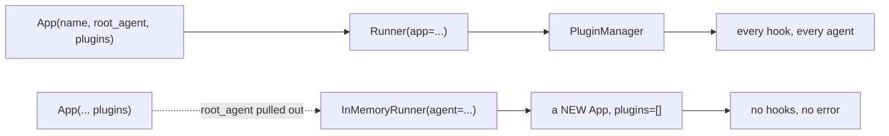

# 1.2 — The `App` is what plugins belong to

## One-line answer

Plugins are declared on an **`App`** — the object that names the whole application and holds its root
agent — and passing them to `Runner` instead still works, is deprecated, and is the one way to
install a plugin that silently installs nothing.

---

## The story

A cousin borrows your car for a week and you write the rules on a card: no smoking, back by ten,
petrol topped up.

There are two places to put that card. You can hand it to your cousin. Or you can tape it inside the
glovebox.

Handed to the cousin, the card belongs to a person. It works for exactly as long as that person is
driving. The week after, your brother takes the car and there is no card, because the card left with
the cousin.

Taped inside the glovebox, the card belongs to the car. Whoever opens the door finds it.

Neither place is wrong. But if you meant "these are the rules for this car" and you handed the card to
a person, you have written the right rule in the wrong place, and you will not find out until the
second driver.

---

## The idea in plain language

ADK has two objects that sound like they might be the application, and only one of them is.

An **`App`** is the application. It carries a `name`, a `root_agent`, and a `plugins` list. It is a
description of a system — what it is called, where it starts, what rules apply throughout. It runs
nothing by itself.

A **`Runner`** is the thing that executes one request against an `App`. It holds the services a run
needs — the session service that remembers conversations
([Day 8](../../../day-08-sessions-and-services/LESSON.md)), the artifact service, the memory service
— and its `run_async` is the method you have been calling since Day 5.

The relationship is: *an `App` is what your system is; a `Runner` is one act of running it.* Plugins
describe the system, so they live on the `App`.

There is a third name you already use. **`InMemoryRunner`** is a convenience: you hand it an agent, it
builds an `App` around that agent for you, and it wires up in-memory services so you do not have to.
It is what every script since Day 5 has used, and it is genuinely the right tool when you have an
agent and no application-level anything.

The trap is that `InMemoryRunner` builds **its own** `App`. So if you construct an `App` with plugins
and then pass the *agent* to `InMemoryRunner`, your `App` is discarded, a different one is created
without your plugins, and the run proceeds perfectly. There is no error. There is no warning. Your
plugin simply never fires.

Two forms of the wiring exist in code you will read on the internet, and only one is current:

| Form | Status in 2.7.1 |
| --- | --- |
| `App(name=..., root_agent=..., plugins=[...])` then `Runner(app=app, ...)` | current |
| `Runner(app_name=..., agent=..., plugins=[...])` | works, **deprecated** |

The second form is what `adk.dev/plugins/` still shows and what every tutorial written before 2.7
uses. It has not stopped working. It emits a `DeprecationWarning`, which by default Python does not
display, so most people never see it.

---

## Why Sutra needs it

**Because today's build has nowhere to live otherwise.** `sutra/plugins.py` is a module of plugins,
and a plugin with no `App` to sit on is an unused class. Section 4 creates `sutra/desk/app.py` for
exactly this reason: the desk stops being a bare agent and becomes an application.

**Because `App` is where four more things arrive later.** Events compaction, the context cache config,
and the resumability config are all `App` fields. Day 60's durable execution turns on resumability
there, and Day 51's caching turns on the context cache there. Learning the object today means those
days add a field rather than introducing an object.

**Because Phase 13 deploys the `App`, not the agent.** When Day 86 puts Sutra in a container, the
thing the server holds is an application with a name — and that name keys the session store, which is
why [Day 8](../../../day-08-sessions-and-services/LESSON.md) made you care about `app_name` in the
first place.

---

## The mechanism

The same plugin, three wirings. Two fire and one does not.

```python
# lab/where_it_lives.py - the App is the thing plugins belong to. Zero model calls.
import asyncio
import warnings

from google.adk.agents import LlmAgent
from google.adk.apps import App
from google.adk.plugins import BasePlugin
from google.adk.runners import InMemoryRunner, Runner
from google.adk.sessions import InMemorySessionService
from google.genai import types
from scripted import ScriptedModel, text


class Announce(BasePlugin):
    """Prints one line if it is ever actually installed."""

    def __init__(self) -> None:
        super().__init__(name="announce")

    async def before_model_callback(self, *, callback_context, llm_request):
        print("      >> the plugin fired")


def make_agent() -> LlmAgent:
    return LlmAgent(
        name="desk",
        model=ScriptedModel(model="scripted", replies=[[text("done")]]),
        instruction="x",
    )


async def drive(label: str, runner: Runner, app_name: str) -> None:
    print(f"  {label}")
    session = await runner.session_service.create_session(app_name=app_name, user_id="u")
    async for _ in runner.run_async(
        user_id="u",
        session_id=session.id,
        new_message=types.Content(role="user", parts=[types.Part(text="hi")]),
    ):
        pass
    print("      (run finished)")


async def main() -> None:
    # a. the current form: plugins on the App, App on the Runner.
    app = App(name="sutra", root_agent=make_agent(), plugins=[Announce()])
    await drive(
        "a. App(plugins=[...]) -> Runner(app=...)",
        Runner(app=app, session_service=InMemorySessionService()),
        app.name,
    )

    # b. the deprecated form: plugins straight onto the Runner.
    with warnings.catch_warnings(record=True) as caught:
        warnings.simplefilter("always")
        legacy = Runner(
            app_name="sutra",
            agent=make_agent(),
            session_service=InMemorySessionService(),
            plugins=[Announce()],
        )
        for warning in caught:
            print(f"      {warning.category.__name__}: {warning.message}")
    await drive("b. Runner(plugins=[...])", legacy, "sutra")

    # c. the mistake: an App is built, and then ignored.
    ignored = App(name="sutra", root_agent=make_agent(), plugins=[Announce()])
    await drive(
        "c. App built, InMemoryRunner given the agent",
        InMemoryRunner(agent=ignored.root_agent, app_name="sutra"),
        "sutra",
    )


asyncio.run(main())
```

**Line by line:**

- `App(name="sutra", root_agent=make_agent(), plugins=[Announce()])` — the three fields that matter
  today. `name` is validated: it must start with a letter and contain only letters, digits,
  underscores and hyphens, and it may not be `"user"`.
- `Runner(app=app, session_service=InMemorySessionService())` — when you pass `app`, you must also
  pass the services yourself. `InMemoryRunner` is what was supplying them before, and giving it up is
  the price of controlling the `App`.
- `warnings.catch_warnings(record=True)` with `simplefilter("always")` — a `DeprecationWarning` is
  **hidden by default** in Python. This block exists only so you can see the one thing case **b**
  is here to show you. Without it the line would not appear and you would conclude the form is fine.
- `Runner(app_name="sutra", agent=make_agent(), ..., plugins=[Announce()])` — the deprecated form.
  Note it takes `app_name` and `agent` **instead of** `app`; passing `app` and `plugins` together
  raises `ValueError`, because it would be two answers to one question.
- `InMemoryRunner(agent=ignored.root_agent, app_name="sutra")` — case **c**, and the whole point of
  the script. An `App` was constructed with a plugin on it. Then the **agent** was pulled out of it
  and handed to `InMemoryRunner`, which built a *different* `App` around that agent. The variable is
  called `ignored` because that is what happens to it.
- `drive()` takes `app_name` separately rather than reading it off the runner, because in case **c**
  the app whose name you want is not the app you built.

The output:

```text
  a. App(plugins=[...]) -> Runner(app=...)
      >> the plugin fired
      (run finished)
      DeprecationWarning: The `plugins` argument is deprecated. Please use the `app` argument to provide plugins instead.
  b. Runner(plugins=[...])
      >> the plugin fired
      (run finished)
  c. App built, InMemoryRunner given the agent
      (run finished)
```

Case **c** is the one to sit with. The run succeeded. The agent answered. No exception, no warning,
no log line. `>> the plugin fired` is simply **absent**, and nothing in the program is going to tell
you that your audit, your quota meter or your credential filter was never installed.



Verified against the installed `google-adk` 2.7.1 — `Runner._resolve_app` raises on `app` plus
`plugins` together and calls `warnings.warn(..., DeprecationWarning)` otherwise — and against
`adk.dev/plugins/`, which still documents the deprecated `InMemoryRunner(agent=..., plugins=[...])`
form, on 2026-08-29.

---

## When it breaks

**💥 You passed both `app` and `plugins`.**

```text
ValueError: When app is provided, plugins should not be provided and should be provided in the app
instead.
```

This one is good news: it is the only wiring mistake in this part that fails loudly. ADK refuses to
guess which list you meant.

**💥 You passed `app` and forgot the session service.**

```text
TypeError: Runner.__init__() missing 1 required keyword-only argument: 'session_service'
```

`InMemoryRunner` was providing it. Once you construct the `Runner` yourself you own the services.

**💥 The silent one, again, because it is the one that matters.** Case **c** produces no error text at
all. There is nothing to search for. The only way to catch it is to assert that the plugin ran —
which is [7.2](../07-in-production/7.2-testing-a-plugin-without-a-model.md)'s first test, and the
reason that test exists.

---

## In production

**What a professional writes instead of the teaching version** is one function that builds the `App`,
exported from one module, used by every entry point:

```python
def build_app() -> App:
    """The only place the application is assembled."""
    return App(name="sutra", root_agent=root_agent, plugins=[RunLedger()])
```

**Line by line:**

- The return type is `App`, not `Runner` — the application is a description, and each caller decides
  how to run it. A web server, a test and a CLI need three different runners and the same `App`.
- Constructing a **new** `App` per call rather than a module-level constant matters because the
  plugin instances inside it hold state. Two callers sharing one `App` share one plugin object, which
  is [4.3](../04-the-meter/4.3-one-instance-every-run.md)'s subject.
- It takes no arguments, so there is exactly one answer to "what is the application?" — the failure
  this prevents is two entry points with two different plugin lists, which is how half your traffic
  ends up unmetered.

**What degrades at scale** is `app_name` drift. The name on the `App` keys the session store, so a
service that builds its `App` in two places with two spellings loses every conversation on whichever
path is not the one that wrote them. It surfaces as "the bot forgot me" reports from a fraction of
users that matches your load-balancer split.

**The failure that only shows with real traffic** is the test suite that uses `InMemoryRunner`
everywhere and the server that uses `Runner(app=...)`. Every test passes with no plugins installed at
all, because the tests are exercising case **c**, and the plugin's first real execution is in
production.

**The review comment a senior engineer leaves:** *"Tests build the runner a different way from the
server, so the plugin path is untested. Have both call `build_app()`."*

**The interview question:** *"What is the difference between `App` and `Runner` in ADK?"* — "The `App`
is the application: its name, its root agent, and the application-wide things like plugins, context
caching and resumability. The `Runner` executes one request against an `App` and holds the services —
sessions, artifacts, memory. So the `App` is what the system *is* and the runner is one *act* of
running it, which is why plugins go on the `App`. The practical trap is `InMemoryRunner`: it builds
its own `App` from the agent you give it, so if you build an `App` with plugins and then hand the
agent to `InMemoryRunner`, the plugins are silently not installed and nothing errors. In 2.7 passing
`plugins` to `Runner` directly still works but is deprecated."

---

## Check yourself

```bash
cd days/day-14-plugins-one-layer-up/lab && uv run python where_it_lives.py
```

Then run it with `uv run python -W always::DeprecationWarning where_it_lives.py` and confirm you did
not need the `catch_warnings` block to see the warning.

**Answer out loud, without scrolling up:**

> Say what `InMemoryRunner` does with the agent you hand it, and why that makes a plugin disappear
> without an error.

---

**Next:** [1.3 — A name, and only one of it](1.3-a-name-and-only-one-of-it.md)
