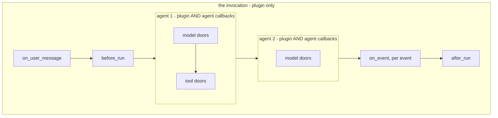

# 2.2 — The four doors an agent cannot have

## One-line answer

Four hooks — `on_user_message_callback`, `before_run_callback`, `on_event_callback` and
`after_run_callback` — wrap the whole request rather than one agent's turn, and they exist only at the
plugin layer because no agent is in a position to answer a question about the request as a whole.

---

## The story

A school trip to the museum. Sixty children, four teachers, fifteen children each.

Each teacher knows their own fifteen. They count them onto the coach, count them at the gate, count
them at lunch. Every teacher can tell you, with total confidence, that all of their children are
present. Four teachers, four correct answers.

And not one of them can tell you whether sixty children came back.

It is not carelessness. Each of them has a complete and accurate picture of a part, and the question
"did we lose anyone?" is not a question about any part. Somebody has to be counting at the coach door
— not as a fifth group, but as the person whose whole job is the trip rather than a group within it.

That person is not a better teacher. They are standing somewhere different.

---

## The idea in plain language

An agent's callbacks are attached to an agent. Everything they can see is scoped to that agent's own
work: the request it is about to send, the reply it got back, the tool it is about to call.

A **request** — ADK calls it an **invocation** — is bigger than that. One user message may cause one
agent to call a model three times and a tool twice, then hand off to a second agent that does the same
again. The invocation is the whole of that, from the message arriving to the last event leaving.

Four questions are about the invocation, and no agent can answer any of them:

**"What did the user actually ask?"** — `on_user_message_callback`. Fires once, on the incoming
message, before any agent starts. Returning a `types.Content` **replaces** the user's message, so this
is where an application-wide rewrite lives: stripping a signature block, normalising a ticket
reference, redacting a card number before it reaches a session store.

**"Is this request allowed to start at all?"** — `before_run_callback`. Fires once, at the start.
Returning a `types.Content` is documented to halt the run and answer with that content. Read
[5.1](../05-where-the-layer-bites/5.1-the-door-documented-to-stop-the-run.md) before you rely on that
sentence, because on the most common root agent shape it does not happen.

**"What is about to be shown to the caller?"** — `on_event_callback`. Fires on **every event**, after
the agent produced it and before ADK saves it to the session and hands it to you. Returning an event
replaces it. This is the last point at which anything can be changed.

**"What did the whole thing cost?"** — `after_run_callback`. Fires once at the end, returns nothing
useful, and exists purely so a plugin can report or clean up. It is where section 4's bill is printed.
It fires only when the run **succeeded**, which is [5.2](../05-where-the-layer-bites/5.2-the-bill-that-never-prints.md).

Two of those four have no agent-level equivalent even in spirit. `before_agent_callback` looks like it
might be `before_run_callback`'s twin, and it is not: it fires once **per agent**, so a request through
three agents fires it three times, and the first firing is not the start of the request — it is the
start of the first agent.

Here is the containment, which is the whole idea in one picture:



---

## Why Sutra needs it

**Because the meter is a run-level question.** "How many model calls did this request cost?" is the
school-trip question exactly: each agent knows its own, and the answer is not any agent's. Section 4
builds it at `before_model_callback` and reports it at `after_run_callback`, and the reporting half is
only possible here.

**Because Day 70's quota router reads the meter.** Addendum 02 §6 replaces dollars with RPM and RPD per
provider. A router that picks the provider with headroom needs the count to be per-request and
accurate, and a per-agent counter in a multi-agent graph would undercount by exactly the agents you
forgot to instrument.

**Because Day 66's safety work happens at `on_user_message_callback`.** Phase 10's prompt-injection
lessons need one place where every incoming message can be inspected before it reaches any agent or
any session store. There is exactly one such place, and this is it.

**Because Day 84's tracing needs the request boundary.** A trace tree has a root span, and the root
span opens at `before_run_callback` and closes at `after_run_callback`. Without run-level doors,
`AutoTracingPlugin` would have a forest instead of a tree.

---

## The mechanism

First, one small file that every script from here to the end of the day imports.

Day 13's `ScriptedModel` reads its replies off a list and counts how far through it is. That is
perfect for a single run and wrong for everything in sections 4 and 5, which run the same agent
several times and sometimes at the same time — a shared counter would scramble the script. So today
adds a second test double that decides what to say by **looking at the request** instead of by
counting:

```python
# lab/stateless.py - a scripted model that decides from the request, not from a counter.
from __future__ import annotations

from collections.abc import AsyncGenerator

from google.adk.models import BaseLlm, LlmRequest, LlmResponse
from google.genai import types
from scripted import call, text


class ReactiveModel(BaseLlm):
    """Asks for each tool in `chain` once, then answers. Holds no state."""

    chain: list[str] = ["lookup_ticket"]

    async def generate_content_async(
        self, llm_request: LlmRequest, stream: bool = False
    ) -> AsyncGenerator[LlmResponse, None]:
        done = {
            part.function_response.name
            for content in llm_request.contents
            for part in (content.parts or [])
            if part.function_response
        }
        pending = [name for name in self.chain if name not in done]
        if not pending:
            yield LlmResponse(content=text("KB-104: duplicate charge, refund issued."))
            return
        asked = next(
            (
                part.text
                for content in llm_request.contents
                if content.role == "user"
                for part in (content.parts or [])
                if part.text
            ),
            "charged twice",
        )
        yield LlmResponse(content=call(pending[0], ticket_id="4521", query=asked))
```

**Line by line:**

- `chain: list[str] = ["lookup_ticket"]` — a Pydantic field, declared on the class the same way
  `replies` and `calls` are on Day 13's `ScriptedModel`, because `BaseLlm` is a Pydantic model and an
  undeclared attribute is rejected. The default is one tool, which is the shape sections 2 and 3 want;
  [4.1](../04-the-meter/4.1-counting-what-a-run-costs.md) passes two.
- The `done` set comprehension walks `llm_request.contents` for `function_response` parts and collects
  the **names of tools that have already answered**. That is the whole trick: the conversation so far
  *is* the state, so the model does not need any of its own.
- `pending = [name for name in self.chain if name not in done]` — what is left to do, recomputed on
  every call from scratch. Two runs at the same time each see their own `contents`, so they cannot
  interfere.
- `if not pending: ... return` — the finished case first, as a guard clause, so the tool-calling path
  below is not nested inside an `else`. The bare `return` ends an async generator; it does not return
  a value, and writing `return LlmResponse(...)` here would be a `SyntaxError`.
- `asked = next((...), "charged twice")` — the **user's own words**, pulled out of the first
  `role="user"` content that has text, with a fallback for a request that has none. A real model
  searches using what the person actually asked, and
  [6.1](../06-failure-lab/6.1-the-rule-that-broke-an-agent-nobody-was-looking-at.md) needs that to be
  true: a guard that inspects tool arguments can only be demonstrated on arguments that vary with the
  question.
- `ticket_id="4521", query=asked` — both arguments are sent on every call, and each tool takes only
  the one it declares. Passing a superset keeps the double to one line instead of a per-tool argument
  table; ADK matches arguments to the tool's own signature.
- `yield` rather than `return <value>`, as ever — 1.x → 2.x **trap #3** (plan §5.1). A model is an
  async generator, and a double that returned a list would not fit the runtime.

Now the run-level doors themselves: the message rewritten on the way in, and every event seen on the
way out.

```python
# lab/run_level.py - the doors that wrap the whole request. Zero model calls.
import asyncio

from google.adk.agents import LlmAgent
from google.adk.apps import App
from google.adk.plugins import BasePlugin
from google.adk.runners import Runner
from google.adk.sessions import InMemorySessionService
from google.genai import types
from stateless import ReactiveModel


def lookup_ticket(ticket_id: str) -> dict:
    """Look up a support ticket by its id."""
    return {"status": "ok", "ticket_id": ticket_id}


class Intake(BasePlugin):
    """Stamps the ticket reference onto the question, once, before any agent runs."""

    def __init__(self) -> None:
        super().__init__(name="intake")

    async def on_user_message_callback(self, *, invocation_context, user_message):
        asked = "".join(part.text or "" for part in user_message.parts or [])
        print(f"      on_user_message saw: {asked!r}")
        return types.Content(role="user", parts=[types.Part(text=f"[ticket 4521] {asked}")])

    async def on_event_callback(self, *, invocation_context, event):
        kinds = [
            "text" if part.text else "call" if part.function_call else "result"
            for part in (event.content.parts if event.content else []) or []
        ]
        print(f"      on_event: author={event.author} parts={kinds}")


class Witness(BasePlugin):
    """Prints what the model was actually asked, to prove the rewrite landed."""

    def __init__(self) -> None:
        super().__init__(name="witness")

    async def before_model_callback(self, *, callback_context, llm_request):
        first = llm_request.contents[0]
        asked = "".join(part.text or "" for part in first.parts or [])
        print(f"      the model was asked: {asked!r}")


async def main() -> None:
    agent = LlmAgent(
        name="desk",
        model=ReactiveModel(model="scripted"),
        instruction="x",
        tools=[lookup_ticket],
    )
    app = App(name="sutra", root_agent=agent, plugins=[Intake(), Witness()])
    runner = Runner(app=app, session_service=InMemorySessionService())
    session = await runner.session_service.create_session(app_name=app.name, user_id="u")
    async for _ in runner.run_async(
        user_id="u",
        session_id=session.id,
        new_message=types.Content(role="user", parts=[types.Part(text="what is wrong?")]),
    ):
        pass


asyncio.run(main())
```

**Line by line:**

- `from stateless import ReactiveModel` — the file above. It is used from here on because it needs no
  reset between runs; Day 13's counter-based `ScriptedModel` still works for single-run scripts, and
  `stateless.py` imports `call` and `text` from it rather than redefining them.
- `return types.Content(...)` from `on_user_message_callback` — the **replacement**. Returning `None`
  here would leave the message alone; returning a `Content` swaps it, and everything downstream sees
  only the new one.
- `f"[ticket 4521] {asked}"` — a deliberately visible prefix. The point of the script is to prove the
  rewrite reached the model, and a subtle change would not prove it.
- `Witness.before_model_callback` reading `llm_request.contents[0]` — a **second plugin**, whose only
  job is to observe what the first one did. Two plugins are used rather than one method because the
  claim being tested is that the rewrite survives the trip from the runner into the agent's request,
  and observing that from inside the plugin that made the change would prove nothing.
- The order `plugins=[Intake(), Witness()]` matters: plugins run in registration order at every door,
  so `Intake` gets `on_user_message_callback` first. They do not compete here — they override
  different hooks — but the habit of reading the list as an order is the one to build now, because
  [3.1](../03-the-rule-at-this-layer/3.1-is-not-none-and-this-time-it-means-it.md) is where order
  decides the outcome.
- `event.author` in `on_event_callback` — which agent produced this event. In a single-agent run it is
  always `desk`; in Phase 8's graph it is how you tell a researcher's event from a critic's.
- The list comprehension classifying parts as `text` / `call` / `result` rather than printing them —
  `on_event_callback` sees the raw event, and a full dump would bury the shape. The shape is what the
  part is teaching: text out, a tool call, a tool result, text out.

The output:

```text
      on_user_message saw: 'what is wrong?'
      the model was asked: '[ticket 4521] what is wrong?'
      on_event: author=desk parts=['call']
      on_event: author=desk parts=['result']
      the model was asked: '[ticket 4521] what is wrong?'
      on_event: author=desk parts=['text']
```

Read the order. The message was rewritten **once**, before anything ran. The model saw the rewritten
version on **both** of its calls, because the rewrite went into the session and the session is what
gets resent. And `on_event` fired three times for one question — a tool call, a tool result, and the
final text.

Verified against the installed `google-adk` 2.7.1 — `Runner._run_node_async` calls
`run_on_user_message_callback` and assigns its result to `new_message` when it is not `None`, and
`_consume_event_queue` calls `run_on_event_callback` before appending the event to the session — and
against `adk.dev/plugins/`, on 2026-08-29.

---

## When it breaks

**💥 You returned a string from `on_user_message_callback`.**

```text
RuntimeError: Error in plugin 'intake' during 'on_user_message_callback' callback: 'str' object has
no attribute 'parts'
```

The hook trades in `types.Content`, not text. The message that reaches you is a `Content` and the
replacement has to be one too. This is the same class of mistake as the model doors trading in
`LlmResponse` yesterday: the layer has a currency, and it is not `str`.

**💥 You rewrote the message and the session recorded the rewrite.** No error, and it is working as
designed — but it means the transcript now shows `[ticket 4521] what is wrong?` as *what the user
said*, and the user did not say that. For a normalisation that is fine. For anything a human will
later read as evidence, it is a quiet falsification, and the honest version keeps the original
somewhere before replacing it.

**💥 Your `on_event_callback` returned a modified event and the modification half-landed.** ADK does
not use your returned event wholesale. It copies the fields you set onto the original, skipping `id`,
`invocation_id` and `timestamp`. So an event you built fresh, rather than copied from the original,
loses everything you did not explicitly set — and the loss is silent. Build the replacement with
`event.model_copy(update={...})`, never from scratch.

---

## In production

**What a professional writes instead of the teaching version** does the smallest possible work in
`on_event_callback` and gets out. The shape is a guard clause first:

```python
async def on_event_callback(self, *, invocation_context, event):
    if event.partial or not event.content:
        return None
    ...
```

**Line by line:**

- `if event.partial` — under streaming, most events are partial fragments of one reply. A plugin that
  does not skip them does its work once per chunk. This single line is the difference between a plugin
  that costs nothing and one that shows up in a latency graph.
- `or not event.content` — some events carry no content at all, and every attribute access after
  `event.content.parts` on one of those is an `AttributeError` in a hook that runs on every event of
  every agent.
- `return None` explicitly rather than falling off the end — at this door a non-`None` return replaces
  the event, so being deliberate about the carry-on path is not style. Yesterday's
  [13/5.1](../../../day-13-callbacks-four-doors/parts/05-failure-lab/5.1-the-note-that-became-the-result.md)
  is the whole cost of getting a return statement wrong at a door.

**What degrades at scale** is `on_user_message_callback` doing I/O. It fires once per request, which
sounds cheap, and it fires **before anything else** — so a database lookup there adds its latency to
every single request, including the ones that were going to be answered from a cache in
`before_model_callback` and cost nothing.

**The failure that only shows with real traffic** is the run-level hook that assumes one agent. A
plugin that stores something at `before_run_callback` under `self.current` and reads it at
`after_run_callback` works perfectly until two requests overlap, at which point the second overwrites
the first. That is [4.3](../04-the-meter/4.3-one-instance-every-run.md), measured.

**The review comment a senior engineer leaves:** *"`on_event_callback` with no `partial` guard. Under
streaming this runs per chunk — add the guard or move the logic to the model door."*

**The interview question:** *"Where would you enforce a rule that applies to every request, regardless
of which agent handles it?"* — "At the run-level plugin hooks. `on_user_message_callback` for anything
about the incoming message, because it runs before any agent and can replace the message outright.
`before_run_callback` for admission control. `on_event_callback` for anything about what leaves,
because it is the last point before the event is persisted and yielded. Agents cannot do this: a
request can cross several agents, so a per-agent rule is enforced N times with N chances to miss one,
and none of the agents can see the request as a whole anyway."

---

## Check yourself

```bash
cd days/day-14-plugins-one-layer-up/lab && uv run python run_level.py
```

Then change `Intake.on_user_message_callback` to `return None` and confirm the model is asked the
original question both times.

**Answer out loud, without scrolling up:**

> Say why `before_agent_callback` is not the same door as `before_run_callback`, and give one thing
> each is right for.

---

**Next:** [2.3 — The names moved](2.3-the-names-moved.md)
