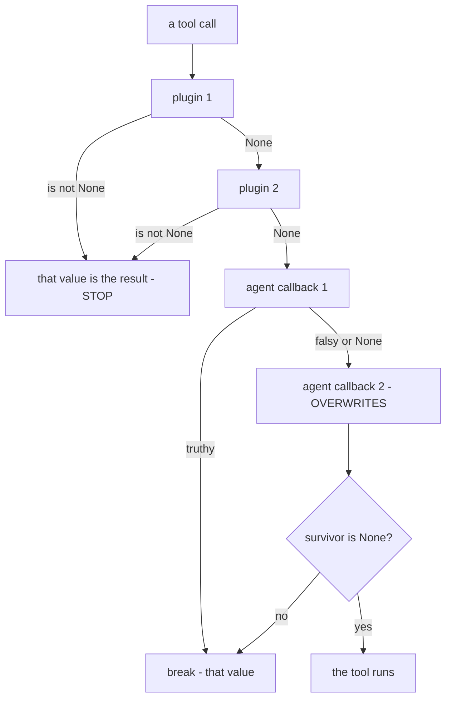

# 3.1 — `is not None`, and this time it means it

## One-line answer

The plugin chain stops at the **first** hook returning anything that is not `None` — which is the rule
as documented, and the opposite of the agent-callback chain you measured yesterday, where an empty
dict does not stop the chain but the **last** value assigned still replaces the tool.

---

## The story

You need a specific washer for a leaking tap, and you have three hardware shops' numbers.

You call the first. "Do you have it?" — "No." You call the second. "Yes, we do." You put the phone
down.

You do not call the third shop. Not because the third shop is unimportant, and not because you decided
against it — you simply have your answer, and the question is closed. If somebody asked you afterwards
what the third shop said, the honest reply is that you have no idea, because you never asked.

That is the whole rule. Ask in order, stop at the first real answer, and understand that everything
after the first real answer was never consulted.

The part that catches people is what counts as a real answer. If the second shop had said "we have a
box here but I cannot tell what is in it" — is that a yes? You would probably stop and go look. The
framework has to decide that question in advance, and the two layers of ADK decided it differently.

---

## The idea in plain language

Yesterday you learned one rule for six doors: **return `None` and the thing behind the door happens;
return anything else and your value replaces it.** Then
[13/4.1](../../../day-13-callbacks-four-doors/parts/04-where-the-rule-bites/4.1-truthy-is-not-the-same-as-not-none.md)
showed that the agent-callback loop does not quite implement it. Its code is:

1. Call each callback in list order, assigning its result **unconditionally** to a variable.
2. `break` out of the loop if that result is **truthy**.
3. After the loop, run the tool only if the variable `is None`.

So an empty dict fails step 2 — it is falsy, so the loop does not break and the next callback runs and
overwrites it — but passes step 3, so whatever value survived skips the tool. Falsy-but-not-`None`
falls between two different tests, and with two callbacks the **last** one wins.

The plugin layer does it differently, and it does it right:

1. Call each plugin's hook in registration order.
2. If the result `is not None`, **return it immediately**. Stop. Run no more plugins.
3. Only if every plugin returned `None` does the agent's own callback chain run at all.

One test, applied once, to every hook. `{}` stops the chain here. `0` stops the chain here. `False`
stops the chain here. And the **first** non-`None` wins, because there is no unconditional assignment
to overwrite it.

Stated as a table, because this is a difference you will be asked about:

| | agent callbacks (Day 13) | plugin hooks (today) |
| --- | --- | --- |
| test that stops the chain | truthy | `is not None` |
| test that skips the tool | `is not None` | `is not None` |
| `{}` returned by the first of two | chain continues, second overwrites | chain stops, `{}` is the result |
| which value wins with two returning | the **last** | the **first** |
| the two tests agree | no | yes |

**This is not a difference you should have to know, and that is exactly why you should.** Two chains,
at the same doors, in the same framework, with the same documented rule, behaving oppositely. The
plugin layer is the one that matches the documentation. The agent layer is the one that does not.

---

## Why Sutra needs it

**Because today's build moves a guard between the two layers.** If you decide Day 13's
`block_forbidden_queries` belongs in a plugin, its behaviour changes even if its body does not — a
branch that returns `{}` was a partial no-op at the agent layer and is a hard stop here.

**Because a plugin can silence a callback you rely on.** A plugin returning `{}` from
`before_tool_callback` skips every agent callback at that door, including Day 13's audit. Your audit
trail acquires a hole shaped exactly like the plugin's short-circuit, and there is nothing in your
audit code to find.

**Because Day 51's caching plugin is this rule, on purpose.** A cache is a `before_model_callback` that
returns an `LlmResponse` on a hit and `None` on a miss. Its entire correctness is "does the framework
stop when I return something", and now you know it does, at this layer, without the truthiness caveat.

---

## The mechanism

The same two return values, at the same door, one layer apart.

```python
# lab/two_layers.py - the same pair of returns, at both layers. Zero model calls.
import asyncio

from google.adk.agents import LlmAgent
from google.adk.apps import App
from google.adk.plugins import BasePlugin
from google.adk.runners import Runner
from google.adk.sessions import InMemorySessionService
from google.genai import types
from stateless import ReactiveModel


def lookup_ticket(ticket_id: str) -> dict:
    """Look up a support ticket by its id."""
    print("      >> the tool ran")
    return {"status": "ok", "ticket_id": ticket_id}


class Returns(BasePlugin):
    """A plugin whose whole job is to return one fixed value at the tool door."""

    def __init__(self, name: str, value: dict | None) -> None:
        super().__init__(name=name)
        self.value = value

    async def before_tool_callback(self, *, tool, tool_args, tool_context):
        print(f"      plugin {self.name} -> {self.value!r}")
        return self.value


def returns(label: str, value: dict | None):
    """The agent-callback equivalent: a plain function returning one fixed value."""

    def callback(tool, args, tool_context):
        print(f"      agent {label} -> {value!r}")
        return value

    return callback


async def drive(label: str, plugins: list[BasePlugin], agent_callbacks) -> None:
    print(f"  {label}")
    agent = LlmAgent(
        name="desk",
        model=ReactiveModel(model="scripted"),
        instruction="x",
        tools=[lookup_ticket],
        before_tool_callback=agent_callbacks,
    )
    app = App(name="sutra", root_agent=agent, plugins=plugins)
    runner = Runner(app=app, session_service=InMemorySessionService())
    session = await runner.session_service.create_session(app_name=app.name, user_id="u")
    async for event in runner.run_async(
        user_id="u",
        session_id=session.id,
        new_message=types.Content(role="user", parts=[types.Part(text="hi")]),
    ):
        for part in (event.content.parts if event.content else []) or []:
            if part.function_response:
                print("      the model was told:", part.function_response.response)


async def main() -> None:
    print("PLUGIN LAYER")
    await drive(
        "a. [{} , {'from': 'second'}]",
        [Returns("p1", {}), Returns("p2", {"from": "second"})],
        None,
    )
    print("AGENT LAYER")
    await drive(
        "b. [{} , {'from': 'second'}]",
        [],
        [returns("c1", {}), returns("c2", {"from": "second"})],
    )


asyncio.run(main())
```

**Line by line:**

- `Returns` takes its value in `__init__` rather than hard-coding one, so the same class covers every
  case and the only thing differing between **a** and **b** is which layer the values are attached to.
- `returns()` is a **closure factory** — it returns a function with `value` captured. The agent layer
  wants plain functions, not objects, so this is how you get two callbacks with different values
  without writing two functions.
- `before_tool_callback=agent_callbacks` with `agent_callbacks=None` in case **a** — passing `None`
  means the agent has no callbacks at all, so **a** is measuring the plugin chain alone.
- `plugins=[]` in case **b** — the mirror image. Neither case has both, because the question is what
  each chain does on its own.
- Each hook prints **before** returning, so the output shows which were reached. That is the entire
  measurement: a hook that never printed was never called.
- `part.function_response.response` — what the model was ultimately told the tool produced. It is the
  only thing downstream actually consumes, so it is the right thing to print rather than the return
  value of any particular hook.

The output:

```text
PLUGIN LAYER
  a. [{} , {'from': 'second'}]
      plugin p1 -> {}
      the model was told: {}
AGENT LAYER
  b. [{} , {'from': 'second'}]
      agent c1 -> {}
      agent c2 -> {'from': 'second'}
      the model was told: {'from': 'second'}
```

Read those two blocks against each other. **The code is the same shape and the results are opposite.**

In **a**, `plugin p2 -> ...` never printed. The second plugin was not called. The `{}` from the first
was the answer, and the model was told `{}`.

In **b**, `agent c2` **did** print. The first callback's `{}` was falsy, so the loop kept going, the
second overwrote it, and the model was told `{'from': 'second'}`.

In neither case did `>> the tool ran` appear — both layers skip the tool on a non-`None` value. That
is the one thing they agree on.



Verified against the installed `google-adk` 2.7.1 — `PluginManager._run_callbacks` returns on
`if result is not None`, while `functions.py` step 2 assigns `function_response = callback_result`
unconditionally and breaks on `if function_response:` — on 2026-08-29.

---

## When it breaks

**💥 The observer that returned something.** Same failure as yesterday, and worse here, because the
blast radius is every agent:

```text
(no error - the tool simply never runs, for every agent in the application)
```

A logging plugin whose hook ends with `return self.count` returns an `int`. `1` is not `None`, so
every tool call in the application is skipped and the model is handed the count. Yesterday this broke
one agent. Today it breaks all of them. The rule is unchanged and it is worth repeating in the
imperative: **an observer plugin's hooks end with no `return` statement and are annotated `-> None`.**

**💥 The guard that returns `{}` on the carry-on path.**

```text
(no error - the model is told the tool returned {})
```

At the agent layer with two callbacks this was survivable by accident, because the next callback
overwrote it. Here nothing overwrites it. `{}` is a complete, final, empty answer, and the model will
write a customer-facing sentence based on it.

**💥 Your plugin ran and your agent's callback did not.** No error text, and the diagnosis is the
ordering: something earlier in the chain returned non-`None`. `print` in both and look for the missing
line — which is exactly what case **a** above is doing.

---

## In production

**What a professional writes instead of the teaching version** makes the two paths impossible to
confuse by giving them different shapes:

```python
async def before_tool_callback(self, *, tool, tool_args, tool_context) -> dict | None:
    if not self._is_forbidden(tool.name, tool_args):
        return None
    return blocked(reason="policy", next_step="ask a human to run this")
```

**Line by line:**

- The return annotation `-> dict | None` is the documentation that matters, because it forces the
  writer to think about the two cases the framework distinguishes. A hook annotated `-> None` that
  contains any `return <expr>` is caught by a type checker; without the annotation nothing catches it.
- The **guard clause returns `None` first**, so the carry-on path is one line at the top with nothing
  after it to accidentally fall through into. Structuring it the other way round — compute a result,
  return it at the bottom — is how `{}` gets returned by a branch nobody thought about.
- `blocked(...)` is Day 13's shared refusal shape
  ([13/3.2](../../../day-13-callbacks-four-doors/parts/03-the-tool-doors/3.2-refusing-a-tool-call-honestly.md)),
  reused rather than re-invented. A refusal carries a status, a reason and a next step, because a
  refusal the model cannot act on becomes a retry loop.
- There is no `else`. Two returns, two paths, nothing in between — which is the only structure in
  which "can this branch return a falsy non-`None`?" is answerable by reading.

**What degrades at scale** is plugin ordering becoming load-bearing without being written down. With
one plugin the chain is trivial. With four — a cache, a quota meter, a credential filter, a tracer —
the registration order in `build_app()` decides which of them ever sees a cache hit, and nothing in
any of those four files mentions the other three.

**The failure that only shows with real traffic** is the cache plugin registered before the meter. The
cache returns a response on a hit, the chain stops, and the meter's `before_model_callback` is never
called — so your quota meter under-counts by exactly your cache hit rate, and it under-counts
*silently*, in the direction that makes the dashboard look good.

**The review comment a senior engineer leaves:** *"The meter is registered after the cache. On a cache
hit the chain short-circuits before it, so the meter will read low. Meters and tracers go first."*

**The interview question:** *"If two plugins both handle `before_tool_callback` and the first returns a
value, what happens to the second?"* — "It is not called. The plugin manager returns the first
non-`None` result immediately, and that also skips the agent's own callbacks at that door. Which means
plugin registration order is a real design decision — observers like meters and tracers go first,
because anything that can short-circuit will hide traffic from whatever is behind it. The subtlety
worth knowing is that the agent-callback chain in the same framework uses a different test: it breaks
on a *truthy* value but skips the tool on *not-`None`*, so an empty dict behaves differently at the
two layers. The plugin layer is the one that matches the docs."

---

## Check yourself

```bash
cd days/day-14-plugins-one-layer-up/lab && uv run python two_layers.py
```

Then swap the two values in case **a** to `[Returns("p1", None), Returns("p2", {"from": "second"})]`
and confirm `p2` now runs and its value wins.

**Answer out loud, without scrolling up:**

> With two plugins returning values at the same door, say which one's value the model sees. Then say
> which one's value it would see if they were agent callbacks instead.

---

**Next:** [3.2 — The two hooks that cannot stop anything](3.2-the-two-hooks-that-cannot-stop-anything.md)
