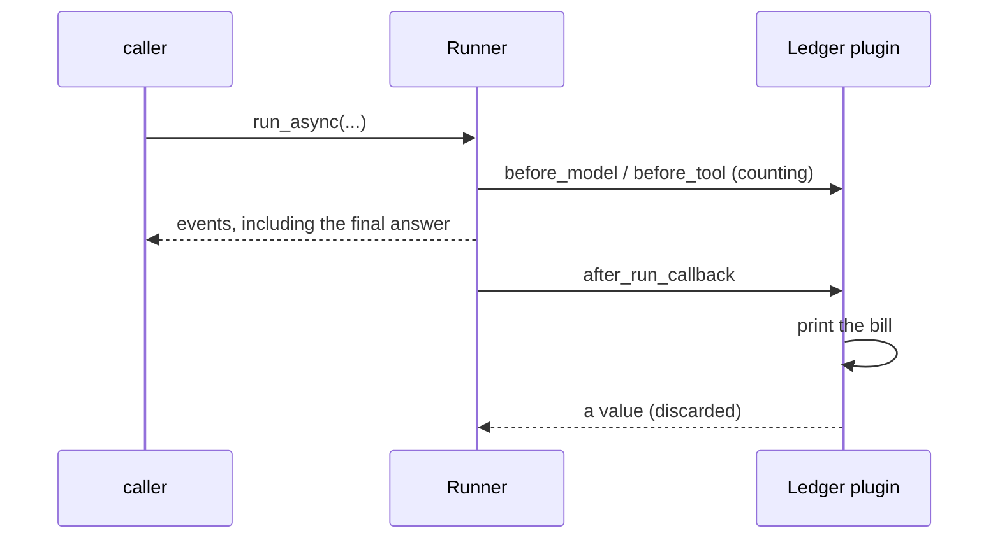

# 4.2 — The bill at the exit door

## One-line answer

`after_run_callback` is the one hook that knows the request is over, so it is where the bill is
printed — and it fires **after the caller already has the answer**, its return value is discarded, and
it cannot change anything.

---

## The story

A shared auto-rickshaw on a fixed route, four passengers.

Nobody settles up when they get in. Nobody settles up at the traffic light where the second passenger
joins. Everyone rides, people get on and off, and the money happens at the end — at your stop, when
the trip is over and there is a total to divide.

There is a reason it works that way, and it is not laziness. Halfway through the trip, *there is no
total*. Asking "what does this cost?" at the second traffic light is asking a question that does not
have an answer yet, because the answer depends on things that have not happened.

And once you have paid and stepped out, that is it. You cannot change the route from the kerb. The
settling-up is the last thing that happens, and it is purely a settling-up.

---

## The idea in plain language

You have a counter from [4.1](4.1-counting-what-a-run-costs.md). It increments during the run. The
question this part answers is *when do you read it out*, and the answer has to be a moment that only
exists at this layer.

`after_run_callback` fires once, at the end of an invocation, after the last event. It is the last of
the fifteen firings you measured in
[2.4](../02-the-fourteen-doors/2.4-fifteen-firings-one-run.md), and there is nothing after it.

Three properties define what it is good for, and all three are restrictions.

**It returns nothing useful.** `PluginManager.run_after_run_callback` awaits your hook and does not
look at the result. You may return a `types.Content`; it goes nowhere. This is the one hook of the
twelve non-notification hooks where the "return a value to replace something" rule does not apply,
because there is nothing left to replace.

**It fires after the caller has the answer.** The events were yielded to whoever is iterating
`run_async` before this hook runs. So a report printed here appears *after* the reply in your terminal
— which looks odd the first time and is correct. It also means this hook cannot influence the
response, at all, ever.

**It fires only when the run succeeded.** This is the big one, it is not documented on the page, and
it is [5.2](../05-where-the-layer-bites/5.2-the-bill-that-never-prints.md)'s entire subject. For now:
the bill you are about to build does not print for the runs that failed.

What it gets in exchange for all that is the one thing nothing else has: **`invocation_context`**, the
whole request. The id, the user, the app name, the session, the root agent. That is the shape of a
ledger row, and no agent-level hook can produce one.

---

## Why Sutra needs it

**Because a ledger row needs an identity.** "Three model calls" is not a record. "Invocation
`e-6ac7…`, user `nisha`, app `sutra`, agent `desk`, three model calls" is. Everything except the count
comes from `invocation_context`, and `invocation_context` only exists at the run-level doors.

**Because Day 84's root span closes here.** A trace tree needs the request boundary at both ends, and
this is the closing end.

**Because Day 24's context budget is measured per request.** Phase 3 puts a ceiling on what one
request may consume, and a ceiling needs a per-request total — which is a number that only exists
after the last model call has happened.

---

## The mechanism

```python
# lab/exit_door.py - the report at the exit door, and what it can see. Zero model calls.
import asyncio
from collections import Counter

from google.adk.agents import LlmAgent
from google.adk.apps import App
from google.adk.plugins import BasePlugin
from google.adk.runners import Runner
from google.adk.sessions import InMemorySessionService
from google.genai import types
from stateless import ReactiveModel


def lookup_ticket(ticket_id: str) -> dict:
    """Look up a support ticket by its id."""
    return {"status": "ok", "ticket_id": ticket_id}


def search_kb(query: str) -> dict:
    """Search the knowledge base."""
    return {"status": "ok", "hits": ["KB-104"]}


class Ledger(BasePlugin):
    """Counts at the spending doors, reports at the exit door."""

    def __init__(self) -> None:
        super().__init__(name="ledger")
        self.counts: Counter[str] = Counter()

    async def before_model_callback(self, *, callback_context, llm_request):
        self.counts[f"model:{llm_request.model}"] += 1

    async def before_tool_callback(self, *, tool, tool_args, tool_context):
        self.counts[f"tool:{tool.name}"] += 1

    async def after_run_callback(self, *, invocation_context):
        print(f"      RUN {invocation_context.invocation_id}")
        print(f"        user      {invocation_context.user_id}")
        print(f"        app       {invocation_context.app_name}")
        print(f"        agent     {invocation_context.agent.name}")
        for key in sorted(self.counts):
            print(f"        {key:32} {self.counts[key]}")
        return types.Content(role="model", parts=[types.Part(text="THIS NEVER APPEARS")])


async def main() -> None:
    agent = LlmAgent(
        name="desk",
        model=ReactiveModel(model="scripted", chain=["lookup_ticket", "search_kb"]),
        instruction="x",
        tools=[lookup_ticket, search_kb],
    )
    app = App(name="sutra", root_agent=agent, plugins=[Ledger()])
    runner = Runner(app=app, session_service=InMemorySessionService())
    session = await runner.session_service.create_session(app_name=app.name, user_id="nisha")
    async for event in runner.run_async(
        user_id="nisha",
        session_id=session.id,
        new_message=types.Content(role="user", parts=[types.Part(text="ticket 4521")]),
    ):
        for part in (event.content.parts if event.content else []) or []:
            if part.text:
                print(f"      caller saw: {part.text!r}")


asyncio.run(main())
```

**Line by line:**

- `self.counts[f"model:{llm_request.model}"] += 1` — [4.1](4.1-counting-what-a-run-costs.md)'s
  production note, adopted straight away: keyed by the resolved model string so the row means
  something once Sutra has more than one provider. Here it reads `model:scripted`, which is exactly
  what was called.
- `invocation_context.invocation_id` — the identity of this request, generated by the runner. It is
  the join key: [3.2](../03-the-rule-at-this-layer/3.2-the-two-hooks-that-cannot-stop-anything.md)'s
  error record and [4.3](4.3-one-instance-every-run.md)'s per-run counters use the same string.
- `invocation_context.user_id`, `.app_name`, `.agent.name` — the rest of the row. Note `.agent` is the
  agent **object**, so its name needs `.name`; the other two are already strings.
- `return types.Content(...)` saying `THIS NEVER APPEARS` — deliberately returning something loud, so
  the output either contains it or proves it was discarded. A comment claiming the return is ignored
  would be a claim; this is a test.
- The caller's loop prints `caller saw:` for every text part, so the ordering between the answer and
  the report is visible rather than asserted.
- `user_id="nisha"` rather than `"u"` — a real-looking value, because the point of the row is that it
  identifies somebody.

The output:

```text
      caller saw: 'KB-104: duplicate charge, refund issued.'
      RUN e-ee55580d-ec68-4c2e-96b0-25d225e6672e
        user      nisha
        app       sutra
        agent     desk
        model:scripted                   3
        tool:lookup_ticket               1
        tool:search_kb                   1
```

Two things are proved by that output and neither is stated anywhere in it.

**`THIS NEVER APPEARS` never appeared.** The hook returned a `types.Content` and the caller's loop —
which prints every text part it receives — never saw it. The return value was discarded.

**`caller saw:` is the first line.** The answer reached the caller *before* the bill was printed. The
run was, from the caller's point of view, already over.

Your invocation id will differ. It is a `uuid4` with an `e-` prefix, generated per request.



Verified against the installed `google-adk` 2.7.1 — `PluginManager.run_after_run_callback` awaits
`_run_callbacks` without returning its result, and `Runner._run_node_async` calls it in the `finally`
block after the event loop has drained — on 2026-08-29.

---

## When it breaks

**💥 You expected the report before the answer.** No error. If your terminal shows the reply and then
the bill, that is the correct order — see the sequence diagram. If you need the numbers *before* the
answer goes out, `after_run_callback` is the wrong hook and there is no right one, because the total
does not exist until the run is over.

**💥 You returned a `Content` expecting to append a footer to the reply.** No error, and nothing
happens. This is a genuinely reasonable thing to want — "add the cost to the bottom of the answer" —
and this hook cannot do it. The door that can is `on_event_callback`, which sees each event before it
reaches the caller ([2.2](../02-the-fourteen-doors/2.2-the-four-doors-an-agent-cannot-have.md)).

**💥 `AttributeError` on the agent.**

```text
RuntimeError: Error in plugin 'ledger' during 'after_run_callback' callback: 'str' object has no
attribute 'name'
```

You wrote `invocation_context.agent.name` in one place and `invocation_context.app_name.name` in
another by copy-paste. `app_name` and `user_id` are strings; `agent` is an object. The wrapper is
[3.3](../03-the-rule-at-this-layer/3.3-a-plugin-that-raises-takes-the-run-with-it.md)'s, and note
that this one raises **after** the user already got a correct answer — so the request both succeeded
and failed.

---

## In production

**What a professional writes instead of the teaching version** emits one structured record rather than
several lines of print:

```python
async def after_run_callback(self, *, invocation_context) -> None:
    logger.info(
        "run_complete",
        extra={
            "invocation_id": invocation_context.invocation_id,
            "app": invocation_context.app_name,
            "counts": dict(self.counts),
        },
    )
```

**Line by line:**

- `logger.info` rather than `print` — `CLAUDE.md`'s house rule for library code, and the practical
  reason is that a `print` in a plugin goes to stdout on every request of every agent with no way to
  turn it down.
- `"run_complete"` as a fixed event name with the variable data in `extra` — one greppable string per
  event type, so a log search is `event=run_complete` rather than a regex over a sentence. This is the
  difference between logs you can aggregate and logs you can only read.
- `dict(self.counts)` rather than the `Counter` itself — a `Counter` is a `dict` subclass and most
  JSON formatters handle it, but converting explicitly means the record's shape does not depend on
  which formatter is installed.
- `-> None` and no `return` — the return is discarded anyway, and the annotation says so to a reader
  who has not read this part.

**What degrades at scale** is doing the reporting work synchronously. This hook is on the tail of
every request; a synchronous HTTP post to a metrics service here adds its full latency to every
request's completion, and when that service is slow, your application is slow for a reason that does
not appear in any agent's trace. Buffer in the hook, flush in `close`.

**The failure that only shows with real traffic** is the report that never runs. Under load, some
fraction of requests fail — a 429, a timeout, a malformed tool argument — and on every one of them
this hook does not fire. Your ledger silently covers only the successes, and the quota you are trying
to measure was spent by both. That is the next part.

**The review comment a senior engineer leaves:** *"The bill only prints on the success path. Add
`on_run_error_callback` with the same body, or the meter under-reports exactly when we are in
trouble."*

**The interview question:** *"Where do you report a per-request metric in ADK, and what are the
constraints?"* — "`after_run_callback` on a plugin. It is the only hook that knows the invocation is
over, and it gets the `invocation_context`, so it has the id, the user and the app name for the
record. Three constraints. Its return value is discarded, so it cannot decorate the response — that
would be `on_event_callback`. It fires after the caller already has the answer, so it cannot influence
anything. And it only fires on success, which is the one that bites: a naive implementation silently
excludes every failed run, and failed runs still spent quota. So the meter needs
`on_run_error_callback` as well."

---

## Check yourself

```bash
cd days/day-14-plugins-one-layer-up/lab && uv run python exit_door.py
```

Then run it twice in the same process by calling `main()` a second time, and look hard at the second
run's numbers before reading the next part.

**Answer out loud, without scrolling up:**

> Say what happens to the value `after_run_callback` returns, and name the hook you would use to add
> a footer to the answer instead.

---

**Next:** [4.3 — One instance, every run](4.3-one-instance-every-run.md)
